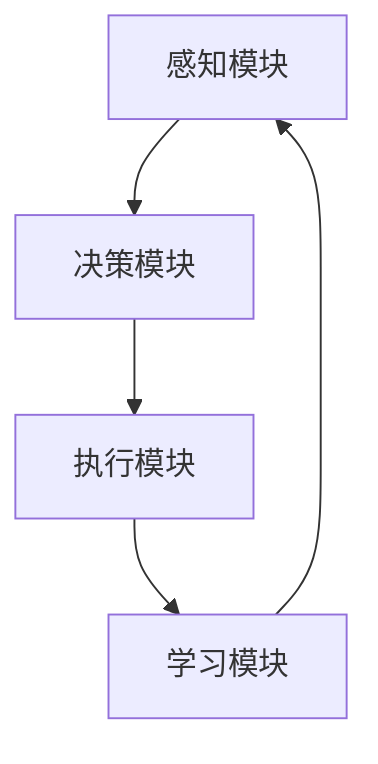
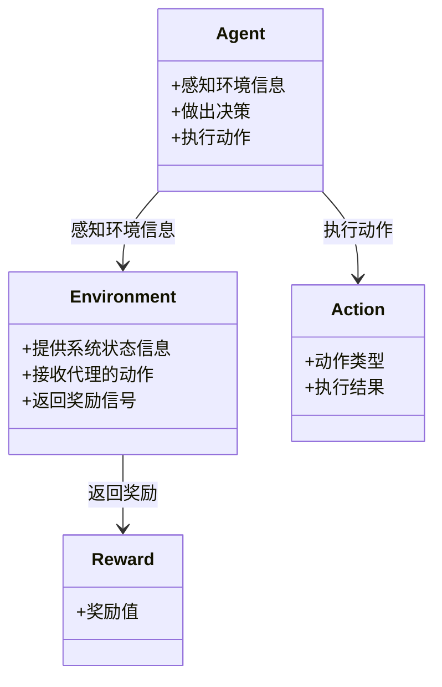
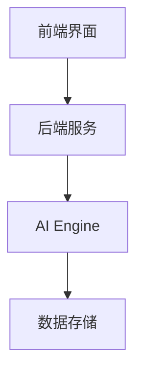

                 


# 企业AI Agent的DevOps实践

## 关键词：
- 企业AI Agent
- DevOps
- 自动化运维
- 强化学习
- 系统架构设计

## 摘要：
本文深入探讨了企业AI Agent在DevOps实践中的应用，详细介绍了AI Agent的核心概念、算法原理、系统架构设计以及实际项目案例。通过分析AI Agent与DevOps的结合，展示了如何利用强化学习和自然语言处理等技术提升企业的运维效率和决策能力。文章还提供了具体的系统架构图和代码实现，帮助读者理解和实施AI Agent驱动的DevOps实践。

---

# 第一部分: 企业AI Agent的DevOps背景与概念

## 第1章: 企业AI Agent与DevOps概述

### 1.1 AI Agent的定义与核心概念
AI Agent（人工智能代理）是一种能够感知环境、执行任务并做出决策的智能系统。其核心概念包括：
- **自主性**：无需外部干预，自主完成任务。
- **反应性**：能够实时感知环境变化并做出响应。
- **目标导向**：基于目标和优先级进行决策。
- **可扩展性**：能够适应不同规模和复杂度的任务。

AI Agent与传统自动化工具的区别如下：

| 属性                | AI Agent                              | 传统自动化工具                     |
|---------------------|---------------------------------------|------------------------------------|
| 决策能力            | 强化学习驱动，具备决策能力           | 程序化规则，无决策能力             |
| 环境感知能力        | 能够感知环境并做出反应               | 无法感知环境变化                   |
| 任务处理能力        | 可处理复杂任务，具备灵活性           | 仅处理预定义的简单任务             |

### 1.2 DevOps的核心理念与实践
DevOps是一种强调开发、运维和质量保障团队协作的实践方法，核心理念包括：
- **持续集成**：频繁合并代码，减少集成风险。
- **持续交付**：自动化构建、测试和部署流程。
- **Infrastructure as Code**：将基础设施视为代码，便于管理和复用。

DevOps的主要实践方法包括：
- 使用容器化技术（如Docker）进行部署。
- 采用CI/CD工具链（如Jenkins、GitHub Actions）实现自动化流水线。
- 实施监控和日志管理（如Prometheus、ELK Stack）保障系统稳定。

### 1.3 AI Agent与DevOps的结合
AI Agent在DevOps中的应用主要体现在以下几个方面：
- **智能监控与异常检测**：通过机器学习模型实时监控系统状态，快速识别异常。
- **自动化运维**：利用AI Agent执行复杂任务，如自动故障修复和容量规划。
- **智能决策支持**：基于历史数据和实时信息，提供最优的运维建议。

企业级AI Agent DevOps的现状与趋势：
- 当前，AI Agent在DevOps中的应用仍处于初级阶段，主要集中在简单的自动化任务上。
- 未来，随着AI技术的成熟，AI Agent将更多地应用于复杂场景，如智能排障和自适应部署。

---

# 第二部分: 企业AI Agent的系统架构与设计

## 第2章: 企业AI Agent的核心概念与原理

### 2.1 AI Agent的系统架构
AI Agent的系统架构包括以下几个模块：
- **感知模块**：负责收集环境信息，如系统日志和性能指标。
- **决策模块**：基于感知信息，利用强化学习算法做出决策。
- **执行模块**：将决策转化为具体操作，如调用API或执行命令。
- **学习模块**：通过反馈不断优化模型参数，提升决策准确性。

AI Agent的模块关系如下：


### 2.2 AI Agent的算法原理
#### 2.2.1 强化学习在AI Agent中的应用
强化学习是一种通过试错机制来优化决策的算法。其核心公式为：
$$ V(s) = \max_{a} [ r(s,a) + \gamma V(s') ] $$

其中：
- \( V(s) \) 表示状态 \( s \) 的价值函数。
- \( r(s,a) \) 表示在状态 \( s \) 下执行动作 \( a \) 的奖励。
- \( \gamma \) 表示折扣因子，用于平衡当前奖励和未来奖励的重要性。

#### 2.2.2 自然语言处理在AI Agent中的应用
自然语言处理用于理解用户输入的自然语言指令，并生成相应的操作。其数学模型为：
$$ P(y|x) = \frac{P(x,y)}{P(x)} $$

其中：
- \( P(y|x) \) 表示在输入 \( x \) 下输出 \( y \) 的概率。
- \( P(x,y) \) 表示输入 \( x \) 和输出 \( y \) 的联合概率。
- \( P(x) \) 表示输入 \( x \) 的边缘概率。

### 2.3 AI Agent的数学模型与公式
#### 2.3.1 强化学习的数学模型
强化学习的核心公式为：
$$ Q(s, a) = r(s, a) + \gamma \max_{a'} Q(s', a') $$

其中：
- \( Q(s, a) \) 表示在状态 \( s \) 下执行动作 \( a \) 的期望奖励。
- \( \gamma \) 表示折扣因子。

#### 2.3.2 自然语言处理的数学模型
自然语言处理的数学模型为：
$$ P(y|x) = \frac{P(x,y)}{P(x)} $$

---

## 第3章: 企业AI Agent的系统架构设计

### 3.1 系统功能设计
#### 3.1.1 领域模型设计
AI Agent的领域模型包括以下几个核心类：
- **Environment**：环境类，负责提供系统状态信息。
- **Agent**：代理类，负责感知、决策和执行。
- **Action**：动作类，表示代理可以执行的具体操作。
- **Reward**：奖励类，表示代理执行动作后的反馈。

领域模型类图如下：


### 3.2 系统架构设计
系统架构设计包括以下几个部分：
- **前端界面**：供用户与AI Agent交互的界面。
- **后端服务**：负责处理用户请求并调用AI Agent。
- **AI Engine**：AI Agent的核心引擎，负责感知、决策和执行。
- **数据存储**：存储系统状态、历史数据和模型参数。

系统架构图如下：


### 3.3 系统接口设计
#### 3.3.1 API接口定义
API接口定义如下：
- `POST /api/v1/agent/action`：接收用户的请求并调用AI Agent。
- `GET /api/v1/agent/status`：获取AI Agent的当前状态。
- `POST /api/v1/agent/train`：训练AI Agent的模型。

#### 3.3.2 接口的调用流程
1. 用户通过前端界面发送请求。
2. 后端服务接收请求并调用AI Agent。
3. AI Agent感知环境、做出决策并执行动作。
4. 后端服务返回结果给用户。

#### 3.3.3 接口的安全性与可靠性
- **安全性**：通过身份验证和权限控制保障API的安全性。
- **可靠性**：采用断路器和限流机制防止系统崩溃。

---

# 第三部分: 企业AI Agent的项目实战

## 第4章: 企业AI Agent的项目实战

### 4.1 智能运维AI Agent的实现

#### 4.1.1 环境配置
```bash
# 安装必要的依赖
pip install numpy
pip install tensorflow
pip install scikit-learn
```

#### 4.1.2 核心代码实现
```python
class AIAgent:
    def __init__(self):
        self.model = self.build_model()

    def build_model(self):
        # 构建强化学习模型
        pass

    def perceive(self, state):
        # 感知环境状态
        pass

    def decide(self, state):
        # 基于感知状态做出决策
        pass

    def execute(self, action):
        # 执行具体动作
        pass
```

#### 4.1.3 案例分析
以智能排障为例，AI Agent可以通过分析系统日志和性能指标，快速定位问题并提出解决方案。

### 4.2 小结
通过实际项目案例，展示了AI Agent在智能运维中的应用价值和实现方法。

---

# 第四部分: 企业AI Agent的DevOps最佳实践

## 第5章: 企业AI Agent的DevOps最佳实践

### 5.1 最佳实践
- **模型迭代**：定期更新AI Agent的模型，确保其决策能力不断提升。
- **监控与日志**：实时监控系统状态，记录日志以便于问题排查。
- **团队协作**：DevOps团队与AI团队紧密合作，确保AI Agent与运维流程无缝对接。

### 5.2 小结
本文总结了企业AI Agent在DevOps中的应用价值，并提出了相关的注意事项和建议。

---

# 作者：AI天才研究院 & 禅与计算机程序设计艺术

---

通过以上内容，您可以看到《企业AI Agent的DevOps实践》这篇文章的完整结构和详细内容。如果需要进一步调整或补充，请随时告诉我。

