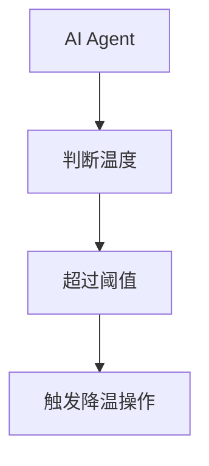
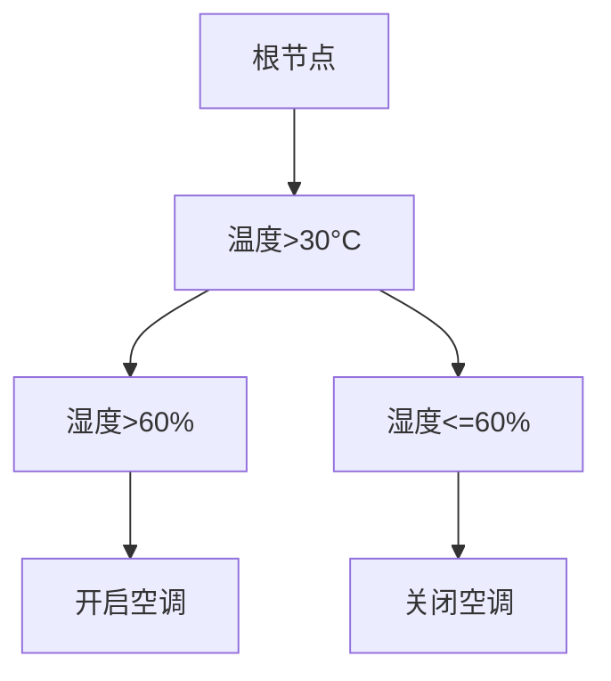
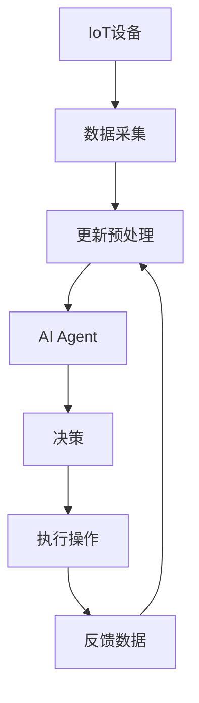
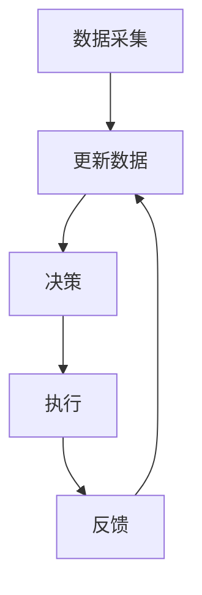
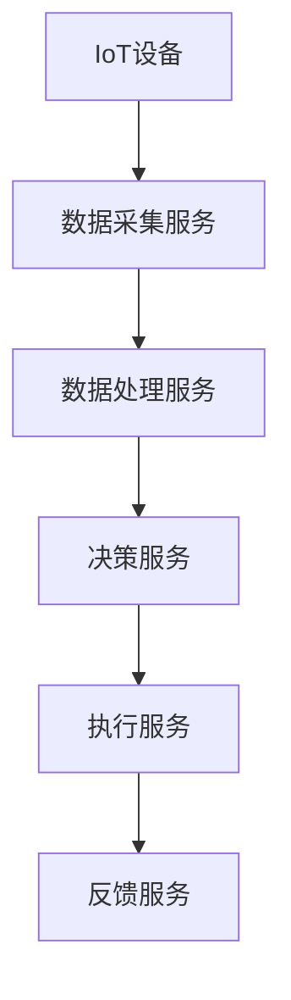
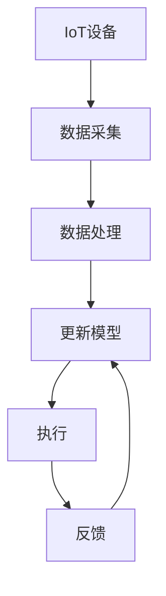

                 


# 第3章: 企业AI Agent的IoT集成算法原理

## 3.1 AI Agent的决策算法

### 3.1.1 基于规则的决策算法
基于规则的决策算法是一种简单且易于实现的AI Agent决策方法。它通过预定义的规则来判断和执行操作。例如，当温度超过某个阈值时，AI Agent会触发空调降温的操作。



#### 3.1.1.1 规则定义
规则可以是简单的条件语句，也可以是复杂的逻辑组合。例如：
- 如果温度 > 30°C 且湿度 > 60%，则开启风扇。
- 如果设备状态为“故障”，则发送警报通知。

#### 3.1.1.2 优点
- 实现简单，易于维护。
- 适用于规则明确且变化不大的场景。

#### 3.1.1.3 缺点
- 难以处理复杂或动态变化的场景。
- 需要频繁更新规则以适应变化。

### 3.1.2 基于机器学习的决策算法
基于机器学习的决策算法通过训练模型来预测和选择最佳动作。常用的算法包括决策树、随机森林和神经网络等。

#### 3.1.2.1 决策树
决策树是一种树状结构，每个节点代表一个决策点，叶子节点代表最终决策。例如，使用ID3算法构建决策树来判断是否需要开启空调。



#### 3.1.2.2 机器学习模型训练
使用历史数据训练模型，例如：
- 输入特征：温度、湿度、时间等。
- 输出标签：动作（开启/关闭空调）。

训练过程如下：
1. 数据预处理：清洗和归一化数据。
2. 模型训练：使用训练数据拟合模型。
3. 模型评估：使用测试数据验证模型性能。
4. 模型优化：调整参数以提高准确率。

#### 3.1.2.3 优点
- 能够处理复杂场景，自动学习规律。
- 适应动态变化，无需频繁更新规则。

#### 3.1.2.4 缺点
- 实现复杂，需要大量数据和计算资源。
- 需要定期重新训练模型以保持准确性。

### 3.1.3 基于知识图谱的决策算法
知识图谱是一种结构化的知识表示方法，能够帮助AI Agent理解和推理复杂关系。例如，当设备故障时，AI Agent可以根据知识图谱中的相关信息推荐维修方案。

#### 3.1.3.1 知识图谱构建
- 实体识别：设备、状态、操作等。
- 关系建立：设备故障 -> 维修操作 -> 解决方案。

#### 3.1.3.2 决策过程
1. 分析当前状态。
2. 查询知识图谱，找到相关操作。
3. 执行推荐操作。

#### 3.1.3.3 优点
- 能够处理复杂关系，提供智能决策。
- 知识更新方便，可以随时添加新知识。

#### 3.1.3.4 缺点
- 知识图谱构建和维护需要时间和资源。
- 决策过程依赖于知识的完整性，可能遗漏某些情况。

## 3.2 IoT数据处理算法

### 3.2.1 数据清洗算法
IoT设备采集的数据可能存在噪声和异常值，需要进行清洗。

#### 3.2.1.1 去除噪声
- 使用中位数滤波器：将数据窗口内的中位数作为清洗后的数据。
- 使用均值滤波器：将数据窗口内的平均值作为清洗后的数据。

#### 3.2.1.2 处理异常值
- 使用3σ法：删除距离均值超过3个标准差的异常值。
- 使用Isolation Forest算法：识别并隔离异常值。

### 3.2.2 数据融合算法
来自多个IoT设备的数据可能有不同的格式和时间戳，需要进行融合。

#### 3.2.2.1 时间同步
- 根据设备的时间戳进行对齐。
- 使用插值方法填补缺失值。

#### 3.2.2.2 数据融合
- 使用加权平均：根据设备的可靠性赋予不同权重。
- 使用传感器融合算法：结合多种传感器的数据进行综合判断。

### 3.2.3 数据预测算法
通过历史数据预测未来状态，例如预测设备的能耗。

#### 3.2.3.1 时间序列预测
- 使用ARIMA模型：适合线性趋势的数据。
- 使用LSTM模型：适合非线性变化的数据。

#### 3.2.3.2 实例
使用LSTM预测明天的设备能耗：

```python
import numpy as np
from keras.models import Sequential
from keras.layers import LSTM, Dense

# 数据预处理
data = ...  # 时间序列数据

# 划分训练集和测试集
train_data = data[:700]
test_data = data[700:]

# 构建模型
model = Sequential()
model.add(LSTM(128, input_shape=(None, 1)))
model.add(Dense(1))
model.compile(loss='mean_squared_error', optimizer='adam')

# 训练模型
model.fit(train_data, epochs=10, batch_size=32)

# 预测测试数据
predicted = model.predict(test_data)
```

## 3.3 AI Agent与IoT集成的算法流程

### 3.3.1 数据采集与预处理
1. 采集IoT设备的数据。
2. 清洗和融合数据。

### 3.3.2 模型训练与部署
1. 使用预处理后的数据训练AI Agent的决策模型。
2. 部署模型到生产环境。

### 3.3.3 实时交互与反馈
1. IoT设备发送实时数据到AI Agent。
2. AI Agent根据模型做出决策并执行操作。
3. 收集反馈数据，更新模型。

### 3.3.4 实时交互流程图


## 3.4 算法实现代码示例

### 3.4.1 数据预处理代码
```python
import pandas as pd
import numpy as np

# 读取数据
data = pd.read_csv('iot_data.csv')

# 删除异常值
data['value'] = data['value'].apply(lambda x: np.median(data['value']) if x < 0 else x)

# 填充缺失值
data['value'].fillna(data['value'].mean(), inplace=True)
```

### 3.4.2 训练AI Agent决策模型
```python
from sklearn.tree import DecisionTreeClassifier
from sklearn.model_selection import train_test_split

# 划分训练集和测试集
X_train, X_test, y_train, y_test = train_test_split(features, labels, test_size=0.2)

# 训练决策树模型
model = DecisionTreeClassifier()
model.fit(X_train, y_train)

# 预测测试数据
y_pred = model.predict(X_test)
```

### 3.4.3 实时决策代码
```python
import time

# 实时采集数据
while True:
    data = read_from_iot()
    # 数据预处理
    processed_data = preprocess(data)
    # 调用决策模型
    action = model.predict(processed_data)
    # 执行操作
    execute_action(action)
    time.sleep(1)
```

## 3.5 本章小结

通过本章的讲解，我们详细探讨了企业AI Agent与IoT集成的核心算法，包括AI Agent的决策算法和IoT数据处理算法。基于规则的决策算法适用于规则明确的场景，而基于机器学习的决策算法则能够处理更复杂的场景。同时，我们还介绍了数据清洗、融合和预测算法，确保IoT数据的准确性和可用性。最后，我们通过代码示例展示了如何实现这些算法，为后续的系统设计和项目实战打下了基础。

---

# 第四部分: 企业AI Agent的IoT集成系统设计

# 第4章: 系统分析与架构设计

## 4.1 系统功能设计

### 4.1.1 功能模块划分
1. 数据采集模块：负责从IoT设备采集数据。
2. 数据处理模块：对数据进行清洗、融合和预测。
3. 决策模块：基于模型做出决策。
4. 执行模块：根据决策执行操作。
5. 反馈模块：收集执行结果并更新模型。

### 4.1.2 功能流程图


## 4.2 系统架构设计

### 4.2.1 分层架构
- 数据层：存储原始数据和处理后的数据。
- 业务逻辑层：处理数据和执行决策。
- 表现层：展示系统状态和操作结果。

### 4.2.2 组件交互流程


## 4.3 接口设计

### 4.3.1 数据采集接口
- 输入：设备ID，数据值。
- 输出：确认采集成功。

### 4.3.2 决策接口
- 输入：传感器数据。
- 输出：决策动作。

## 4.4 交互设计

### 4.4.1 实时交互流程
1. IoT设备发送数据到数据采集模块。
2. 数据处理模块清洗和融合数据。
3. 决策模块调用模型做出决策。
4. 执行模块执行操作并反馈结果。
5. 反馈模块更新模型。

### 4.4.2 交互流程图


## 4.5 本章小结

本章详细分析了企业AI Agent与IoT集成系统的功能设计和架构设计。通过分层架构和模块化设计，确保系统的可扩展性和可维护性。同时，通过接口和交互流程的设计，明确了各组件之间的协作关系，为后续的项目实现奠定了基础。

---

# 第五部分: 企业AI Agent的IoT集成项目实战

# 第5章: 项目实战

## 5.1 环境安装与配置

### 5.1.1 系统要求
- 操作系统：Linux/Windows/MacOS。
- Python版本：3.6以上。
- 额外依赖：TensorFlow, Scikit-learn, Pandas, Mermaid等。

### 5.1.2 安装依赖
```bash
pip install tensorflow scikit-learn pandas mermaid
```

## 5.2 核心系统实现

### 5.2.1 数据采集模块
```python
import serial

# 读取来自串口的数据
ser = serial.Serial('COM3', 9600)
while True:
    data = ser.readline().decode('utf-8')
    print(data)
```

### 5.2.2 数据处理模块
```python
import pandas as pd

# 清洗数据
def preprocess(data):
    data = pd.DataFrame(data)
    data = data.dropna()
    data = data[data['value'] > 0]
    return data

# 融合数据
def merge_data(data1, data2):
    merged = pd.merge(data1, data2, on='timestamp')
    return merged
```

### 5.2.3 决策模块
```python
from sklearn.tree import DecisionTreeClassifier

# 训练决策树模型
def train_model(X_train, y_train):
    model = DecisionTreeClassifier()
    model.fit(X_train, y_train)
    return model

# 预测
def predict(model, X_test):
    y_pred = model.predict(X_test)
    return y_pred
```

### 5.2.4 执行模块
```python
def execute_action(action):
    if action == 'open':
        print("打开设备")
    elif action == 'close':
        print("关闭设备")
```

## 5.3 系统实现代码

### 5.3.1 整体实现
```python
import serial
import pandas as pd
from sklearn.tree import DecisionTreeClassifier

# 数据采集模块
ser = serial.Serial('COM3', 9600)

# 数据处理模块
def preprocess(data):
    data = pd.DataFrame(data)
    data = data.dropna()
    data = data[data['value'] > 0]
    return data

# 决策模块
def train_model(X_train, y_train):
    model = DecisionTreeClassifier()
    model.fit(X_train, y_train)
    return model

# 执行模块
def execute_action(action):
    if action == 'open':
        print("打开设备")
    elif action == 'close':
        print("关闭设备")

# 实时运行
while True:
    data = ser.readline().decode('utf-8')
    processed_data = preprocess(data)
    action = train_model.predict(processed_data)
    execute_action(action)
```

## 5.4 项目小结

通过本章的项目实战，我们详细展示了如何在企业AI Agent与IoT集成中实现数据采集、处理、决策和执行。通过代码实现，读者可以更好地理解理论知识，并能够将其应用到实际项目中。接下来，我们将总结整个系统的最佳实践，为读者提供更多的参考。

---

# 第六部分: 企业AI Agent的IoT集成优化与展望

# 第6章: 最佳实践与展望

## 6.1 最佳实践

### 6.1.1 系统设计
- 采用模块化设计，便于扩展和维护。
- 使用异步处理，提高系统的响应速度。
- 定期更新模型，保持决策的准确性。

### 6.1.2 数据管理
- 建立完善的数据备份机制，防止数据丢失。
- 定期清理旧数据，减少存储压力。
- 使用分布式存储，提高数据访问效率。

### 6.1.3 安全管理
- 加强身份验证，防止未授权访问。
- 使用加密技术，保护数据安全。
- 定期进行安全审计，发现潜在风险。

## 6.2 优化方向

### 6.2.1 算法优化
- 引入强化学习，提升决策的智能性。
- 使用深度学习，处理更复杂的场景。
- 优化模型训练，提高训练效率。

### 6.2.2 系统优化
- 采用边缘计算，降低延迟。
- 使用容器化技术，提高系统的可移植性。
- 建立监控系统，实时掌握系统状态。

## 6.3 未来展望

随着AI和IoT技术的不断发展，企业AI Agent与IoT的集成将更加智能化和自动化。未来的优化方向可能包括：
1. 结合5G技术，实现更快的数据传输。
2. 利用区块链技术，确保数据的安全性和可信度。
3. 引入人机协作，提高系统的灵活性和适应性。

## 6.4 本章小结

通过本章的总结，我们提出了企业AI Agent与IoT集成的多个最佳实践，并展望了未来的发展方向。这些内容将为读者在实际应用中提供宝贵的参考。

---

# 作者

作者：AI天才研究院/AI Genius Institute & 禅与计算机程序设计艺术 /Zen And The Art of Computer Programming

---

以上是关于《企业AI Agent的IoT集成策略》的完整目录和部分内容，涵盖了从基础概念到系统设计再到项目实战的各个方面，希望对您有所帮助！

