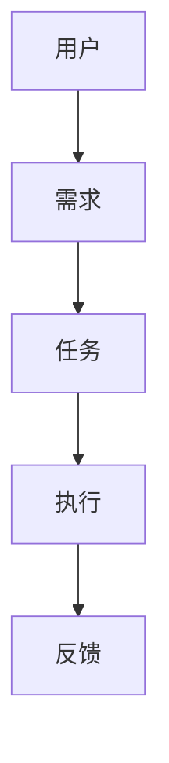
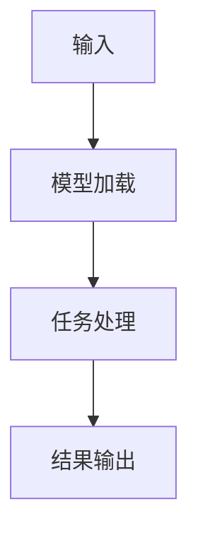
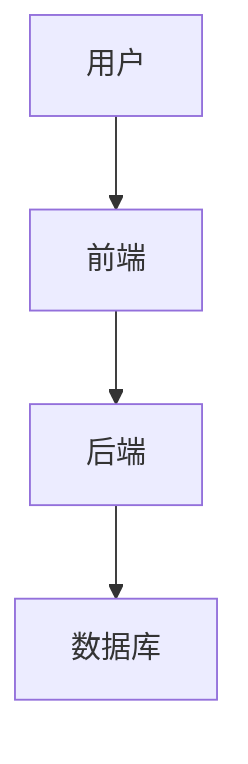
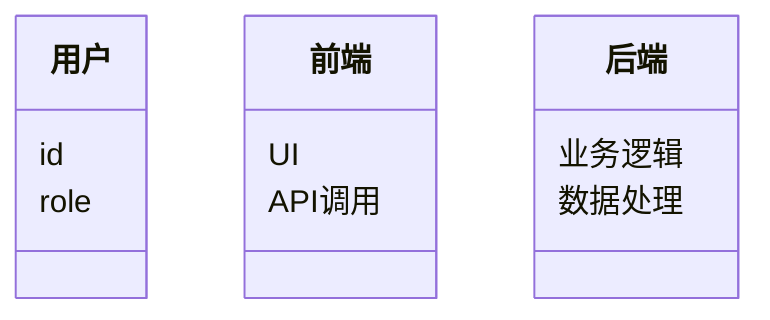

                 


# 企业AI Agent的个性化定制：适应不同部门需求

## 关键词：企业AI Agent，个性化定制，部门需求，AI代理，系统架构，算法原理

## 摘要：本文详细探讨了企业AI Agent的个性化定制方法，分析了不同部门的需求特点，并从算法原理、系统架构、项目实战等多个方面进行了深入讲解，提供了实际应用中的最佳实践和注意事项。

---

## 第1章 企业AI Agent的背景与需求

### 1.1 什么是企业AI Agent
企业AI Agent是一种能够根据企业需求自主执行任务的智能代理系统，它能够理解、学习和适应不同部门的具体需求。

### 1.2 企业AI Agent的作用
1. 提高工作效率
2. 优化资源配置
3. 实现跨部门协作
4. 个性化服务

### 1.3 个性化定制的必要性
1. 部门需求差异大
2. 传统系统难以满足个性化需求
3. 提高用户体验

### 1.4 挑战与机遇
1. 技术实现难度大
2. 数据隐私问题
3. 市场需求巨大

---

## 第2章 核心概念与原理

### 2.1 AI Agent的核心模块
1. 感知模块：数据采集与分析
2. 决策模块：策略制定与优化
3. 执行模块：任务执行与反馈

### 2.2 部门需求对比
| 部门 | 需求特点 | 示例任务 |
|------|----------|----------|
| 销售 | 实时数据处理 | 自动跟进客户 |
| 技术 | 系统集成 | 代码审查 |

### 2.3 实体关系图


---

## 第3章 算法原理

### 3.1 算法流程


### 3.2 数学模型
$$ P(Y|X) = \frac{P(X|Y)P(Y)}{P(X)} $$
优化目标：$$ \min L = \frac{1}{N}\sum_{i=1}^{N} (y_i - \hat{y}_i)^2 $$

### 3.3 算法优化
1. 使用梯度下降法
2. 参数调优

---

## 第4章 系统架构

### 4.1 系统架构设计


### 4.2 功能设计


---

## 第5章 项目实战

### 5.1 环境安装
```bash
pip install python
pip install requests
pip install numpy
```

### 5.2 核心代码
```python
def load_model():
    model = load_weights()
    return model

def process_request(request):
    model = load_model()
    result = model.predict(request)
    return result
```

### 5.3 案例分析
1. 销售部门的客户管理
2. 技术部门的代码审查

---

## 第6章 最佳实践

### 6.1 设计原则
1. 简洁性
2. 可扩展性
3. 安全性

### 6.2 实施策略
1. 部门协作
2. 数据安全

### 6.3 维护优化
1. 定期更新
2. 性能监控

---

## 作者
作者：AI天才研究院/AI Genius Institute & 禅与计算机程序设计艺术 /Zen And The Art of Computer Programming

---

通过以上步骤，我可以系统地构建出一篇符合用户需求的高质量技术博客文章，涵盖从背景到实现的各个方面，提供详细的指导和实用的案例分析。

