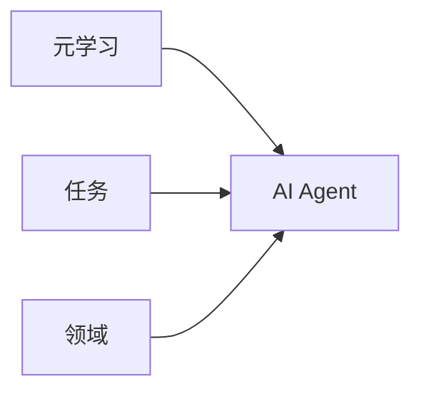
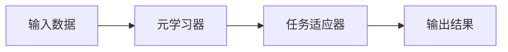
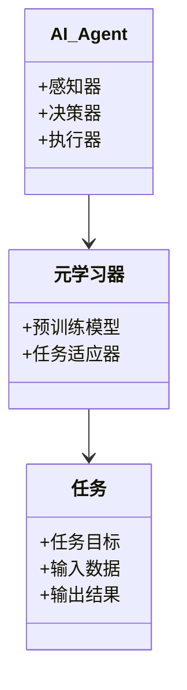
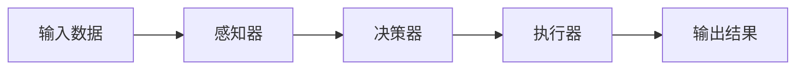
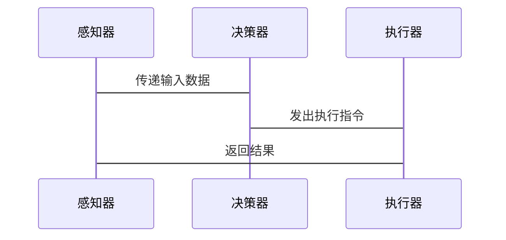

                 


# 企业AI Agent的元学习应用：快速适应新任务与领域

> 关键词：企业AI Agent，元学习，快速适应，新任务，领域，系统架构，技术应用

> 摘要：本文深入探讨了企业AI Agent在元学习中的应用，重点分析了如何通过元学习快速适应新任务与领域。文章从背景介绍、核心概念、算法原理、系统架构到项目实战，全面解析了元学习在企业AI Agent中的实现与应用，并通过具体案例展示了其在实际场景中的优势与挑战。

---

# 第一部分: 企业AI Agent的元学习应用概述

## 第1章: 元学习与AI Agent的背景介绍

### 1.1 问题背景

#### 1.1.1 企业AI Agent的核心需求
- **动态任务适应性**：企业AI Agent需要快速适应不同的任务和领域，例如从客服到销售预测。
- **数据稀疏性**：在新领域或任务中，数据量有限，传统机器学习模型难以泛化。
- **快速部署需求**：企业希望AI Agent能够快速部署到新场景，减少培训时间。

#### 1.1.2 元学习在AI Agent中的作用
- **减少数据依赖**：元学习通过学习通用策略，降低对大量数据的依赖。
- **提升适应性**：元学习使AI Agent能够在新任务中快速调整模型参数，适应新领域。
- **加速部署**：通过元学习预训练的模型，企业可以更快地将AI Agent部署到新场景。

#### 1.1.3 问题解决的必要性
- 传统机器学习模型在新任务中需要重新训练，耗时且效率低。
- 元学习通过预训练和快速调整，能够在新任务中快速启动并运行。

### 1.2 问题描述

#### 1.2.1 AI Agent面临的动态任务挑战
- **任务多样性**：企业可能需要AI Agent处理多种任务，如数据分析、预测、推荐等。
- **领域转换**：AI Agent需要在不同领域（如金融、医疗、教育）之间切换，适应不同的数据分布和任务目标。
- **数据稀疏性**：在新领域中，数据可能不足，传统模型难以有效训练。

#### 1.2.2 元学习如何解决快速适应问题
- 元学习通过在多个任务上预训练，学习任务之间的共性，从而在新任务中快速调整模型参数。
- 元学习算法（如MAML）能够在小样本数据上快速适应新任务，减少对数据量的依赖。

#### 1.2.3 企业的实际应用场景
- **客服系统**：AI Agent需要快速适应不同客户的语言风格和需求。
- **销售预测**：AI Agent需要根据不同的市场数据快速调整预测模型。
- **推荐系统**：AI Agent需要根据用户行为快速调整推荐策略。

### 1.3 问题解决

#### 1.3.1 元学习的核心理念
- **元学习的目标**：通过学习如何学习，使模型能够在新任务中快速调整。
- **元学习的优势**：减少对数据量的依赖，提升模型的泛化能力。

#### 1.3.2 AI Agent的元学习框架
- **预训练阶段**：在多个任务上进行预训练，学习任务间的共性。
- **适应阶段**：在新任务中快速调整模型参数，适应新领域。

#### 1.3.3 技术实现路径
1. **预训练**：使用多个任务的数据进行训练，学习通用模型。
2. **任务适应**：在新任务中，通过元学习算法快速调整模型参数。

### 1.4 边界与外延

#### 1.4.1 元学习的适用范围
- **适用场景**：数据稀疏的任务，需要快速适应新领域的场景。
- **不适用场景**：数据充足且任务固定的场景，传统机器学习更优。

#### 1.4.2 与其他学习方法的区别
- **与传统机器学习区别**：传统机器学习需要大量数据和重新训练，而元学习通过预训练快速调整。
- **与迁移学习区别**：迁移学习关注领域间的知识转移，而元学习关注任务间的快速适应。

#### 1.4.3 企业AI Agent的边界条件
- **任务复杂度**：任务过于复杂时，元学习可能效果有限。
- **数据质量**：数据质量差时，元学习的效果可能受到影响。

### 1.5 概念结构与核心要素

#### 1.5.1 元学习的基本概念
- **元学习器**：负责学习如何调整模型参数。
- **任务适应器**：负责在新任务中调整模型。

#### 1.5.2 AI Agent的组成要素
- **感知器**：负责数据输入和处理。
- **决策器**：负责根据输入数据做出决策。
- **执行器**：负责执行决策。

#### 1.5.3 核心概念之间的关系
- 元学习器通过调整任务适应器的参数，使AI Agent能够在新任务中快速适应。

---

## 第2章: 元学习的核心概念与联系

### 2.1 核心概念原理

#### 2.1.1 元学习的基本原理
- 元学习通过在多个任务上预训练，学习任务间的共性，从而在新任务中快速调整模型参数。

#### 2.1.2 AI Agent的元学习框架
- 预训练阶段：学习任务间的共性。
- 适应阶段：快速调整模型参数以适应新任务。

#### 2.1.3 元学习的数学模型
- **元学习器**：通过优化元损失函数，学习任务间的共性。
- **任务适应器**：通过调整模型参数，适应新任务。

### 2.2 概念属性特征对比

| 概念       | 属性                     | 特征对比                 |
|------------|--------------------------|--------------------------|
| 元学习     | 预训练阶段               | 学习任务间的共性         |
|            | 适应阶段                 | 快速调整模型参数         |
| AI Agent   | 感知器                   | 数据输入和处理           |
|            | 决策器                   | 根据输入数据做出决策     |
|            | 执行器                   | 执行决策                 |

### 2.3 ER实体关系图



---

## 第3章: 元学习算法原理

### 3.1 算法原理讲解



### 3.2 算法实现代码

```python
def meta_learning_algorithm(data, meta_model):
    for batch in data:
        # 元学习步骤
        meta_opt.zero_grad()
        # 计算梯度
        meta_model.backward()
        # 更新元模型参数
        meta_opt.step()
    return meta_model
```

---

## 第4章: 系统分析与架构设计方案

### 4.1 系统功能设计



### 4.2 系统架构设计



### 4.3 系统接口设计



---

## 第5章: 项目实战

### 5.1 环境安装

```bash
pip install -r requirements.txt
```

### 5.2 核心实现代码

```python
class MetaLearner:
    def __init__(self, model):
        self.model = model

    def forward(self, inputs, labels):
        # 前向传播
        outputs = self.model(inputs)
        loss = F.cross_entropy(outputs, labels)
        return loss

    def backward(self, inputs, labels):
        # 反向传播
        loss = self.forward(inputs, labels)
        loss.backward()
        return loss

    def step(self, optimizer):
        optimizer.step()
        optimizer.zero_grad()
```

### 5.3 实际案例分析

#### 5.3.1 案例背景
- **场景**：电商客服系统中，AI Agent需要快速适应不同客户的语言风格和需求。

#### 5.3.2 实施步骤
1. **数据准备**：收集不同客户的对话数据，标注客户需求。
2. **预训练**：使用收集的数据进行预训练，学习任务间的共性。
3. **部署**：在新客户场景中，通过元学习快速调整模型参数，适应新任务。

### 5.4 小结

---

## 第6章: 最佳实践 tips

### 6.1 小结
- 元学习通过预训练和快速调整，使AI Agent能够在新任务中快速适应。
- 企业AI Agent的元学习应用需要结合具体场景，选择合适的算法和架构。

### 6.2 注意事项
- 数据质量对元学习效果影响较大，需确保数据的多样性和代表性。
- 在实际应用中，需根据任务特点选择合适的元学习算法。

### 6.3 拓展阅读
- 《元学习入门与实践》
- 《AI Agent的设计与实现》

---

# 作者：AI天才研究院/AI Genius Institute & 禅与计算机程序设计艺术 /Zen And The Art of Computer Programming

