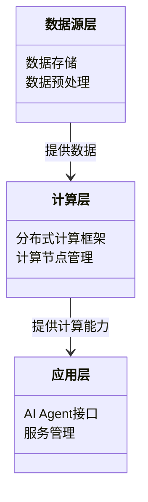
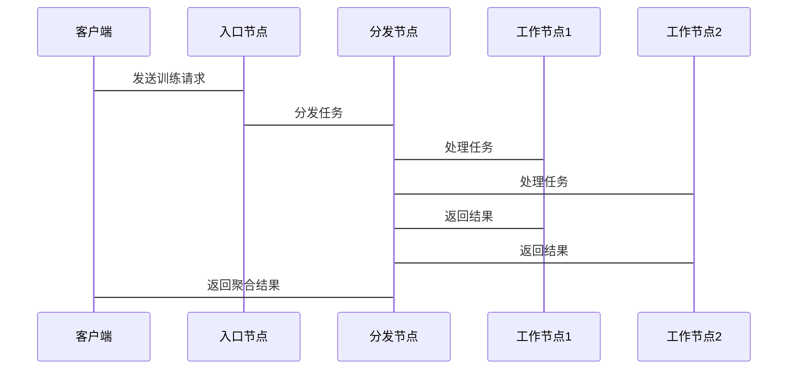

                 


# 企业AI Agent的分布式学习平台设计

## 关键词：企业AI Agent，分布式学习，平台设计，算法原理，系统架构

## 摘要

企业AI Agent的分布式学习平台设计旨在解决大规模数据环境下AI模型的高效训练与推理问题。通过分布式计算技术，优化模型训练效率，提升系统扩展性。本文详细探讨了分布式学习平台的架构设计、核心算法、数学模型，并通过实际案例展示系统实现。

---

## 目录大纲

### 第1章：企业AI Agent的背景与概述

#### 1.1 AI Agent的基本概念
- 1.1.1 AI Agent的定义与特点
  - AI Agent是一个能够感知环境并采取行动以实现目标的智能实体。
  - 具备自主性、反应性、社会性、学习性等特征。

- 1.1.2 企业AI Agent的应用场景
  - 客户服务自动化
  - 供应链优化
  - 金融风险监控

- 1.1.3 分布式学习平台的必要性
  - 单机计算的局限性
  - 大规模数据处理的需求

#### 1.2 分布式学习平台的背景
- 1.2.1 分布式计算的基本概念
  - 分布式系统将任务分解到多个节点并行处理。

- 1.2.2 分布式学习平台的兴起
  - 大数据时代的驱动
  - AI模型训练的高计算需求

- 1.2.3 企业级AI Agent的需求分析
  - 高可用性
  - 高扩展性
  - 高实时性

### 第2章：分布式学习平台的核心概念

#### 2.1 分布式学习平台的架构
- 2.1.1 分布式系统的定义
  - 由多个计算节点组成的松耦合系统。

- 2.1.2 分布式学习平台的组成部分
  - 数据源层：数据存储与预处理
  - 计算层：分布式计算框架
  - 应用层：AI Agent应用接口

- 2.1.3 各组件之间的关系
  - 数据源层提供训练数据
  - 计算层处理并行计算
  - 应用层提供服务接口

#### 2.2 实体关系图
- 2.2.1 ER图的定义
  - 描述数据结构和关系的概念图。

- 2.2.2 分布式学习平台的ER图
  ```mermaid
  erDiagram
    actor 用户角色 {
      <属性> 用户ID
      <属性> 用户名
      <属性> 用户角色
    }
    actor 数据源 {
      <属性> 数据集ID
      <属性> 数据集名称
      <属性> 数据集类型
    }
    actor 模型训练 {
      <属性> 模型ID
      <属性> 模型名称
      <属性> 训练时间
    }
    用户角色 --> 数据源 : 提供数据
    数据源 --> 模型训练 : 用于训练
  ```

- 2.2.3 ER图的分析与优化
  - 数据源层与模型训练层的依赖关系
  - 用户角色的权限管理

### 第3章：分布式学习算法原理

#### 3.1 分布式训练算法
- 3.1.1 参数服务器模式
  ```mermaid
  graph TD
    A[Parameter Server] --> B[Worker 1]
    A --> C[Worker 2]
    B --> A[发送梯度]
    C --> A[发送梯度]
  ```

- 3.1.2 分布式训练的流程
  - 数据分片
  - 并行训练
  - 参数同步

- 3.1.3 算法的优缺点分析
  - 优点：提高训练速度
  - 缺点：通信开销大

#### 3.2 分布式推理算法
- 3.2.1 分布式推理的基本原理
  - 分散推理请求到多个节点

- 3.2.2 分布式推理的实现方式
  - 模型分割
  - 结果汇总

- 3.2.3 算法的性能优化
  - 网络延迟优化
  - 负载均衡

### 第4章：数学模型与公式

#### 4.1 并行计算模型
- 4.1.1 并行计算的基本概念
  - 并行计算通过分解任务提高计算效率。

- 4.1.2 并行计算的数学模型
  - $T_{\text{total}} = \frac{T_{\text{serial}}}{n}$，其中$n$为并行数。

- 4.1.3 并行计算的公式推导
  - 线性加速：$T_{\text{parallel}} = T_{\text{serial}} / n$

#### 4.2 分布式通信模型
- 4.2.1 分布式通信的基本原理
  - 数据通过网络节点进行传输。

- 4.2.2 分布式通信的数学模型
  - $C_{\text{total}} = C_{\text{node}} \times N$，其中$N$为节点数。

- 4.2.3 通信的效率分析
  - 通信时间与网络带宽相关。

### 第5章：系统架构设计

#### 5.1 问题场景介绍
- 分布式系统设计目标
- 系统面临的主要挑战

#### 5.2 项目介绍
- 项目目标
- 项目范围
- 项目约束

#### 5.3 系统功能设计（领域模型Mermaid类图）


#### 5.4 系统架构设计（Mermaid架构图）
```mermaid
archi
    客户端 --> 入口节点 : 发送请求
    入口节点 --> 分发节点 : 分发任务
    分发节点 --> 工作节点1 : 处理任务
    分发节点 --> 工作节点2 : 处理任务
    工作节点1 --> 分发节点 : 返回结果
    工作节点2 --> 分发节点 : 返回结果
    分发节点 --> 客户端 : 返回聚合结果
```

#### 5.5 系统接口设计
- 接口定义：RESTful API
- 接口描述：训练接口、推理接口

#### 5.6 系统交互（Mermaid序列图）


### 第6章：项目实战

#### 6.1 环境安装
- 安装Python、TensorFlow、Flask等库
  ```bash
  pip install python-tensorflow flask
  ```

#### 6.2 系统核心实现源代码
- 训练接口实现
  ```python
  from flask import Flask
  import tensorflow as tf

  app = Flask(__name__)

  @app.route('/train', methods=['POST'])
  def train():
      # 模型训练逻辑
      return "Model trained successfully"
  ```

- 推理接口实现
  ```python
  @app.route('/infer', methods=['POST'])
  def infer():
      # 模型推理逻辑
      return "Inference completed"
  ```

#### 6.3 代码应用解读与分析
- 代码结构分析
- 接口功能解读

#### 6.4 实际案例分析和详细讲解剖析
- 案例背景：客户 churn 预测
- 数据处理：数据清洗、特征工程
- 模型训练：分布式训练过程
- 模型推理：实时预测

#### 6.5 项目小结
- 项目实现的关键点
- 遇到的问题及解决方案
- 经验总结

### 第7章：总结与展望

#### 7.1 全文总结
- 分布式学习平台的设计目标
- 实现的关键技术和成果

#### 7.2 未来发展方向
- 更高效的通信协议
- 更智能的负载均衡算法

#### 7.3 实用建议与注意事项
- 网络性能的重要性
- 数据同步的频率

---

# 作者：AI天才研究院 & 禅与计算机程序设计艺术

