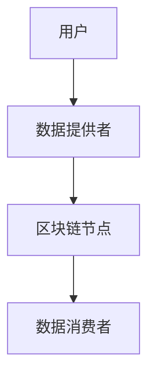
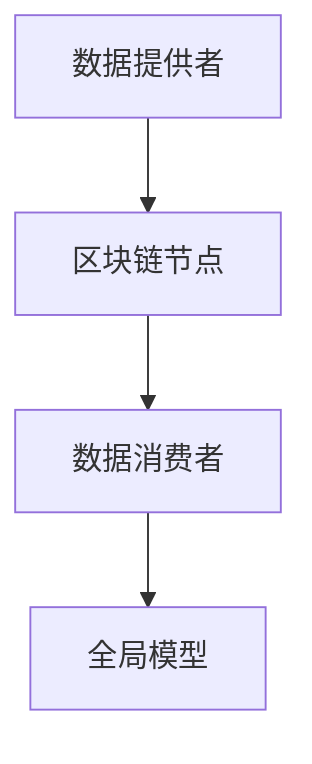
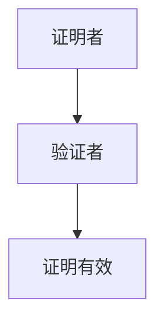
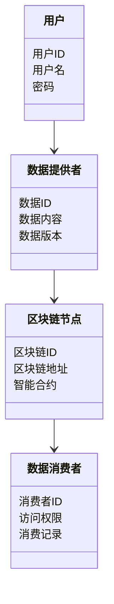
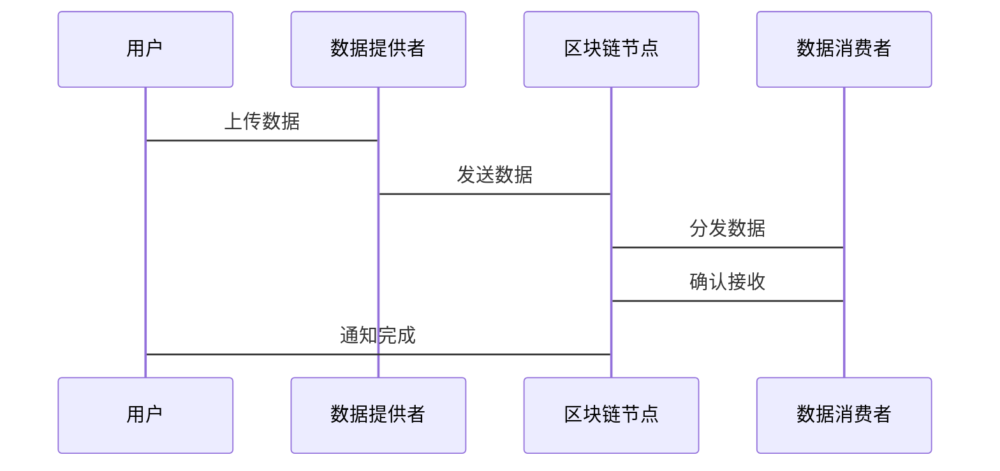

                 

<think>
嗯，我现在需要根据用户的要求，详细撰写一篇关于《企业AI Agent的区块链数据共享与隐私保护》的技术博客文章。首先，我需要理解用户的需求，用户希望我以技术专家的身份，逐步分析并撰写一篇结构清晰、内容详实的技术博客。文章需要包含标题、关键词、摘要，以及详细的目录结构，每个部分都要有深入的分析和具体的例子。

首先，我需要明确文章的核心主题：企业AI Agent如何利用区块链技术进行数据共享，并确保隐私保护。这个主题涉及到AI Agent、区块链、数据共享和隐私保护等多个方面。我需要从背景介绍开始，逐步展开，解释每个概念，并展示它们之间的联系。

接下来，我会思考如何组织文章结构。用户已经提供了一个详细的目录大纲，我需要按照这个大纲来逐步撰写每个部分。每个章节都需要有详细的子章节，确保内容全面且易于理解。

现在，我开始撰写文章：

# 企业AI Agent的区块链数据共享与隐私保护

## 关键词：
- 企业AI Agent
- 区块链数据共享
- 隐私保护
- 联邦学习
- 零知识证明

## 摘要：
随着人工智能和区块链技术的快速发展，企业AI Agent在数据共享中的应用越来越广泛。然而，数据共享过程中面临的隐私保护和安全问题也日益突出。本文深入探讨了企业AI Agent如何利用区块链技术实现数据共享，并通过联邦学习和零知识证明等技术手段确保隐私保护。文章从理论分析到实际应用，详细讲解了相关技术和实现方案，为企业在数据共享与隐私保护方面提供了有价值的参考。

---

## 第一部分: 企业AI Agent的区块链数据共享与隐私保护概述

### 第1章: 企业AI Agent与区块链数据共享的背景

#### 1.1 AI Agent的基本概念
- AI Agent的定义：AI Agent是一种能够感知环境、执行任务并做出决策的智能体。它可以在企业中自动化处理数据、执行任务、与用户交互等。
- AI Agent的核心功能与特点：
  - 自主性：能够独立决策。
  - 反应性：能够感知环境变化并做出响应。
  - 持续性：能够持续执行任务。
  - 学习能力：能够通过数据学习和优化。
- 企业级AI Agent的应用场景：客户支持、供应链管理、数据分析、智能推荐等。

#### 1.2 区块链技术与数据共享的基础
- 区块链技术的基本原理：区块链是一种分布式账本技术，具有去中心化、不可篡改、可追溯等特点。
- 区块链在数据共享中的优势：
  - 去中心化：避免单点故障，提高数据安全性。
  - 可追溯：数据共享过程可追踪，确保透明性。
  - 数据完整性：通过加密技术确保数据未被篡改。
- 区块链与隐私保护的关系：区块链通过加密和访问控制机制保护数据隐私，同时确保数据共享的透明性和安全性。

#### 1.3 企业AI Agent与区块链结合的必要性
- 数据共享面临的挑战：数据孤岛、隐私泄露、数据篡改等问题。
- 区块链如何解决数据共享问题：通过去中心化和加密技术确保数据安全和隐私。
- AI Agent在区块链数据共享中的角色：作为数据的处理者和共享的执行者，AI Agent能够自动化处理数据，并确保数据共享的合规性和安全性。

---

### 第2章: 区块链数据共享的核心概念与联系

#### 2.1 区块链数据共享的实体关系分析
- 实体关系图（ER图）分析：
  - 实体包括：用户、数据提供者、数据消费者、区块链节点等。
  - 关系：数据提供者将数据上传到区块链，数据消费者通过区块链查询数据，区块链节点负责数据的存储和验证。
- Mermaid流程图展示：


#### 2.2 联邦学习与区块链的结合
- 联邦学习的基本原理：联邦学习是一种分布式机器学习技术，允许多个参与方在不共享原始数据的情况下进行模型训练。
- 区块链在联邦学习中的作用：
  - 确保数据的合法性和真实性。
  - 通过智能合约实现数据访问控制。
- 联邦学习与区块链的对比分析：
  - 联邦学习关注数据的使用，区块链关注数据的存储和传输。

#### 2.3 零知识证明在隐私保护中的应用
- 零知识证明的基本原理：零知识证明是一种加密技术，允许一方证明自己拥有某种信息，而无需透露该信息本身。
- 零知识证明在区块链中的实现：通过零知识验证确保数据的隐私性，同时验证数据的正确性。
- 零知识证明与隐私保护的关系：零知识证明可以有效保护数据隐私，同时确保数据的可用性和完整性。

---

### 第3章: 区块链数据共享的算法原理

#### 3.1 联邦学习算法的实现
- 联邦学习的流程：
  1. 数据提供者将数据加密后上传到区块链。
  2. 区块链节点通过智能合约分配数据片段。
  3. 数据消费者在本地进行模型训练，并将模型参数上传到区块链。
  4. 区块链节点汇总模型参数并更新全局模型。
- Mermaid流程图展示：

- Python源代码实现：
```python
import hashlib

def compute_hash(data):
    return hashlib.sha256(data.encode()).hexdigest()

# 示例：数据提供者上传数据
data_provider = "Alice"
data = "sensitive_data"
hash_value = compute_hash(data)
print(f"{data_provider} uploaded data with hash: {hash_value}")
```

#### 3.2 零知识证明的实现
- 零知识证明的数学模型：
  - 生成随机数：$r$
  - 计算哈希值：$h = H(m)$，其中$H$是哈希函数，$m$是明文。
  - 计算证明：$p = prove(r, h)$
- Mermaid流程图展示：

- Python源代码实现：
```python
def zero_knowledge_proof(prover, verifier):
    # 示例：简单的零知识证明
    r = prover.compute_randomness()
    h = prover.compute_hash(r)
    verifier.receive_hash(h)
    if verifier.verify(h):
        return True
    else:
        return False

print(zero_knowledge_proof(Prover(), Verifier()))
```

---

### 第4章: 区块链数据共享的数学模型与公式

#### 4.1 联邦学习的数学模型
- 联邦学习的公式推导：
  - 数据提供者$i$的本地模型参数：$\theta_i$
  - 全局模型参数：$\theta = \sum_i \theta_i / N$
- 联邦学习的数学表达式：
  $$ \theta_{new} = \frac{1}{N} \sum_{i=1}^{N} \theta_i $$
  其中，$N$是数据提供者的数量。

#### 4.2 零知识证明的数学公式
- 零知识证明的公式推导：
  - 输入：$m$（明文）、$r$（随机数）
  - 输出：$h = H(m)$（哈希值）
  - 验证：$prove(r, h)$
- 零知识证明的数学表达式：
  $$ prove(r, h) = (r, h) $$

---

### 第5章: 系统分析与架构设计方案

#### 5.1 问题场景介绍
- 综合场景分析：
  - 企业AI Agent需要从多个数据源获取数据，进行分析和处理。
  - 数据共享过程中需要确保数据的隐私性和安全性。

#### 5.2 系统功能设计
- 领域模型Mermaid类图：

- 系统架构设计Mermaid架构图：


#### 5.3 系统接口设计
- 用户接口：
  - 数据上传接口：REST API，用于用户上传数据。
  - 数据查询接口：REST API，用于用户查询数据。
- 区块链接口：
  - 智能合约调用接口：用于数据的验证和授权。

#### 5.4 系统交互Mermaid序列图


---

### 第6章: 项目实战

#### 6.1 环境安装与配置
- 开发环境的选择：推荐使用Python 3.8及以上版本，安装必要的库如flask、web3、solidity等。
- 区块链框架的安装：使用Ethereum或Hyperledger Fabric等框架。
- 安装命令示例：
  ```bash
  pip install flask web3
  npm install solc
  ```

#### 6.2 系统核心实现源代码
- 示例代码：
  ```python
  from web3 import Web3

  # 连接到本地区块链节点
  w3 = Web3(Web3.HTTPProvider("http://localhost:8545"))

  # 定义智能合约地址和ABI
  contract_address = "0x..."
  contract_abi = [...]  # 替换为实际的ABI

  # 创建智能合约实例
  contract = w3.eth.contract(address=contract_address, abi=contract_abi)

  # 调用智能合约方法
  tx_hash = contract.functions.addData(data).transact()
  w3.eth.waitForTransactionReceipt(tx_hash)
  ```

#### 6.3 代码应用解读与分析
- 代码功能分析：
  - 连接到区块链节点。
  - 定义智能合约地址和ABI。
  - 调用智能合约方法，上传数据。
  - 等待交易确认。

#### 6.4 实际案例分析和详细讲解剖析
- 案例分析：
  - 某企业使用AI Agent和区块链技术，实现了客户数据的安全共享。
  - 通过联邦学习进行数据分析，保护客户隐私。
  - 使用零知识证明验证数据的完整性。

#### 6.5 项目小结
- 通过实际项目，展示了企业AI Agent与区块链技术结合的应用潜力。
- 强调了数据共享与隐私保护的重要性，以及实现中的技术挑战。

---

## 第七章: 最佳实践与总结

### 7.1 最佳实践 tips
- 数据共享前，确保数据的匿名化处理。
- 使用权威的区块链框架和智能合约开发工具。
- 定期进行安全审计和漏洞修复。

### 7.2 小结
- 企业AI Agent与区块链技术的结合，为企业数据共享提供了新的解决方案。
- 通过联邦学习和零知识证明等技术，确保了数据共享的隐私性和安全性。
- 未来，随着技术的不断发展，企业AI Agent在区块链数据共享中的应用将更加广泛和深入。

### 7.3 注意事项
- 数据共享需遵守相关法律法规，确保合规性。
- 保护用户隐私，防止数据泄露。
- 定期更新技术方案，应对新的安全威胁。

### 7.4 拓展阅读
- 推荐阅读《区块链技术及应用》和《联邦学习：原理与实践》。
- 关注学术论文，了解最新的研究成果。

---

## 作者：AI天才研究院/AI Genius Institute & 禅与计算机程序设计艺术 /Zen And The Art of Computer Programming
```

