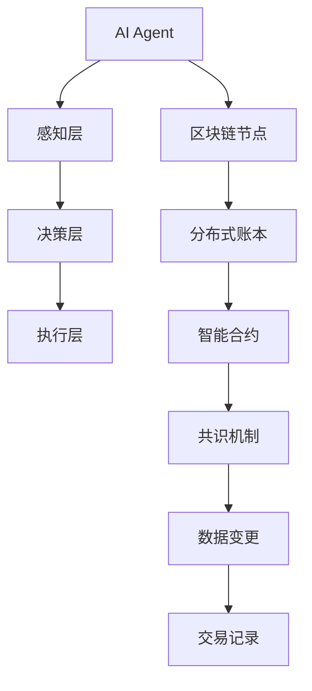

                 

# 《企业AI Agent的区块链集成策略》

> 关键词：企业AI Agent, 区块链, 智能合约, 分布式系统, 去中心化, 人工智能, 区块链技术

> 摘要：  
> 本文深入探讨了企业AI Agent与区块链技术的集成策略，分析了两者结合的技术原理、应用场景及实现方案。通过详细阐述AI Agent与区块链的核心概念、算法原理、数学模型以及系统架构，本文提出了一个基于区块链的AI Agent集成框架，并通过实际案例分析验证了该框架的可行性和优势。本文旨在为企业技术决策者和开发者提供理论依据和实践指导，助力企业在智能化与去中心化转型中抢占先机。

---

# 第1章: 企业AI Agent与区块链的背景介绍

## 1.1 问题背景与概念定义

### 1.1.1 企业AI Agent的定义与特点
企业AI Agent是一种能够感知环境、自主决策并执行任务的智能体。其特点包括：
- **自主性**：无需外部干预，自主完成任务。
- **反应性**：能够实时感知环境变化并做出反应。
- **学习能力**：通过数据和经验不断优化决策能力。
- **可扩展性**：能够适应企业规模的变化。

### 1.1.2 区块链技术的核心概念
区块链是一种分布式账本技术，具有以下核心特性：
- **去中心化**：数据由多个节点共同维护，无单点故障。
- **不可篡改性**：通过链式结构和加密算法确保数据的安全性。
- **智能合约**：基于区块链的自动化执行逻辑，能够实现信任的自动传递。

### 1.1.3 两者的结合与应用场景
企业AI Agent与区块链的结合能够实现智能化决策与去中心化信任的完美融合。应用场景包括：
- **供应链管理**：通过区块链确保数据透明性，AI Agent优化物流路径。
- **智能合约执行**：AI Agent作为智能合约的执行者，自动触发业务流程。
- **数据安全共享**：区块链确保数据隐私，AI Agent在数据孤岛中进行智能分析。

## 1.2 问题描述与解决方案

### 1.2.1 企业AI Agent的痛点分析
- 数据孤岛问题：企业内部数据分散，难以高效共享和利用。
- 信任缺失问题：跨部门或跨企业协作中存在信任障碍。
- 安全性问题：数据在传输和存储过程中可能被篡改或泄露。

### 1.2.2 区块链技术如何解决这些问题
- 数据共享：区块链提供分布式账本，实现数据的安全共享。
- 信任机制：智能合约确保业务流程的自动化执行和信任传递。
- 安全性保障：区块链的去中心化特性确保数据不可篡改。

### 1.2.3 综合解决方案的框架设计
- 架构设计：基于区块链的分布式系统，AI Agent作为智能节点。
- 数据流设计：数据在区块链上进行加密存储和传输，AI Agent负责数据的智能分析与决策。
- 交互流程：AI Agent通过智能合约触发业务流程，区块链记录操作日志。

## 1.3 问题的边界与外延

### 1.3.1 企业AI Agent的边界
- 硬件边界：AI Agent运行的计算资源。
- 软件边界：AI Agent的算法模型和决策逻辑。
- 数据边界：AI Agent处理的数据范围。

### 1.3.2 区块链技术的适用范围
- 适用于需要去中心化信任的场景。
- 适用于需要数据不可篡改的场景。
- 适用于需要智能合约自动执行的场景。

### 1.3.3 两者结合的边界与限制
- 技术限制：区块链的性能瓶颈可能限制AI Agent的实时性。
- 数据隐私：区块链的透明性与AI Agent的数据隐私保护存在矛盾。
- 法律合规：区块链和AI技术的结合需要符合相关法律法规。

## 1.4 核心概念结构与要素

### 1.4.1 企业AI Agent的核心要素
- **感知层**：通过传感器或API获取环境数据。
- **决策层**：基于数据进行分析和决策。
- **执行层**：根据决策结果执行操作。

### 1.4.2 区块链技术的核心要素
- **分布式账本**：记录所有交易和数据变更。
- **共识机制**：确保所有节点达成一致。
- **智能合约**：自动化执行业务逻辑。

### 1.4.3 两者结合的概念结构图

---

## 1.5 本章小结
本章从背景介绍、问题分析、解决方案等方面，阐述了企业AI Agent与区块链集成的必要性与可行性。通过对比分析两者的概念与特点，提出了一个初步的框架设计，为后续章节的深入分析奠定了基础。

---

接下来的章节将围绕算法原理、数学模型、系统架构等展开详细分析，具体内容请参考后续章节。

---

**作者：AI天才研究院/AI Genius Institute & 禅与计算机程序设计艺术 /Zen And The Art of Computer Programming**

