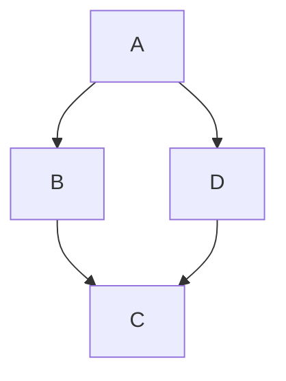

                 


# 企业AI Agent的因果推理在A/B测试结果分析中的应用

## 关键词：企业AI Agent，因果推理，A/B测试，因果图，因果效应，结构方程模型

## 摘要：  
本文探讨了企业AI Agent如何利用因果推理技术分析A/B测试结果，详细介绍了因果推理的基本概念、算法原理、系统架构设计以及实际应用案例。通过结合企业场景，本文展示了如何通过因果推理来解决A/B测试中的因果效应识别问题，为企业决策提供更可靠的依据。文章还提供了具体的代码实现和案例分析，帮助读者更好地理解和应用相关技术。

---

# 第1章：企业AI Agent与因果推理概述

## 1.1 企业AI Agent的定义与特点
### 1.1.1 企业AI Agent的基本概念  
企业AI Agent是一种能够感知企业环境、执行任务并优化决策的智能实体。它结合了机器学习、自然语言处理和知识图谱等技术，能够自主完成数据分析、决策支持和优化任务。  

### 1.1.2 企业AI Agent的核心特点  
1. **自主性**：能够独立感知环境并做出决策。  
2. **反应性**：能够实时响应环境变化。  
3. **学习能力**：通过数据学习优化决策策略。  
4. **可解释性**：能够提供决策的逻辑和依据。  

### 1.1.3 企业AI Agent的应用场景  
- 数据分析与决策支持  
- 自动化任务执行  
- 业务流程优化  

## 1.2 因果推理的基本概念
### 1.2.1 因果关系的定义  
因果关系是指一个事件（原因）导致另一个事件（结果）发生的关系。与相关性不同，因果关系强调“原因导致结果”的内在联系。  

### 1.2.2 因果推理与相关性的区别  
| 特性         | 相关性               | 因果关系             |
|--------------|----------------------|----------------------|
| 定义         | 变量之间的统计关联   | 变量之间的因果联系   |
| 方向性       | 非方向性             | 具有方向性           |
| 干扰因素     | 不考虑外部因素       | 考虑外部因素         |

### 1.2.3 因果推理在企业分析中的重要性  
- 帮助企业识别因果效应，避免虚假相关性的干扰。  
- 提供更可靠的决策依据。  

## 1.3 A/B测试的基本原理
### 1.3.1 A/B测试的定义  
A/B测试是一种通过将用户随机分配到不同的实验组，比较不同策略或设计对用户行为的影响，从而找到最优方案的方法。  

### 1.3.2 A/B测试的核心步骤  
1. **实验设计**：定义实验目标、变量和分组。  
2. **数据收集**：收集各组用户的行为数据。  
3. **数据分析**：比较各组的转化率、点击率等指标。  
4. **结果解读**：确定最优策略并推广。  

### 1.3.3 A/B测试在企业中的应用  
- 产品功能优化  
- 营销策略测试  
- 界面设计优化  

## 1.4 本章小结  
本章介绍了企业AI Agent的基本概念和特点，探讨了因果推理与相关性的区别，以及A/B测试的基本原理和应用场景。这些内容为后续章节的因果推理在A/B测试中的应用奠定了基础。

---

# 第2章：企业AI Agent因果推理的核心概念

## 2.1 因果图模型
### 2.1.1 因果图的基本结构  
因果图（Directed Acyclic Graph，DAG）是一种有向无环图，用于表示变量之间的因果关系。  

**Mermaid图示：**  


### 2.1.2 节点与边的关系  
- **节点**：代表变量（如用户点击率、购买率）。  
- **边**：代表因果关系（如广告投放影响点击率）。  

### 2.1.3 调度图的定义与作用  
调度图（Causal Diagram）是因果图的一种扩展，用于更复杂的因果关系分析。  

---

## 2.2 D-separation与独立性
### 2.2.1 D-separation的定义  
D-separation是一种用于判断变量之间是否独立的方法，基于因果图的结构进行判断。  

### 2.2.2 独立性检验的步骤  
1. 构建因果图。  
2. 确定目标变量和条件变量。  
3. 判断是否存在D-separation路径。  

### 2.2.3 独立性在因果推理中的应用  
- 帮助识别因果关系中的无关变量。  
- 提高因果效应估计的准确性。  

## 2.3 调度图与因果关系
### 2.3.1 调度图的构建  
调度图通过分析变量之间的因果关系，构建一个更复杂的因果网络。  

### 2.3.2 调度图的分解  
将复杂因果网络分解为多个独立的子网络，便于分析和计算。  

### 2.3.3 调度图的验证  
通过数据验证调度图的准确性，调整模型以提高预测效果。  

## 2.4 本章小结  
本章详细介绍了因果图模型、D-separation与独立性，以及调度图与因果关系的核心概念。这些内容为后续的算法实现提供了理论基础。

---

# 第3章：企业AI Agent因果推理的算法原理

## 3.1 潜在结果框架
### 3.1.1 潜在结果的定义  
潜在结果（Potential Outcome）是指在不同处理情况下，变量可能的取值。  

### 3.1.2 潜在结果的估计方法  
1. **平均处理效应（ATE）**：所有样本的平均处理效应。  
2. **条件处理效应（CATE）**：不同子群体的处理效应。  

### 3.1.3 潜在结果与因果效应的关系  
因果效应是潜在结果的差异，反映了处理变量对结果变量的影响。  

## 3.2 结构方程模型
### 3.2.1 结构方程模型的定义  
结构方程模型（SEM）是一种用于估计变量之间因果关系的统计方法。  

### 3.2.2 结构方程模型的构建步骤  
1. 构建因果图模型。  
2. 确定变量之间的关系。  
3. 估计模型参数。  

### 3.2.3 结构方程模型的求解方法  
- **极大似然估计**：基于概率分布模型求解参数。  
- **两阶段最小二乘法**：先估计工具变量，再估计处理效应。  

## 3.3 调度图因果推断算法
### 3.3.1 调度图的因果推断算法  
调度图因果推断算法通过分析因果图的结构，识别因果效应的路径。  

### 3.3.2 算法的数学模型  
因果效应可以通过以下公式计算：  
$$ \text{效应} = \sum_{i=1}^{n} \text{潜在结果}_i \times \text{处理概率}_i $$  

### 3.3.3 算法的实现步骤  
1. 构建因果图模型。  
2. 识别因果效应的路径。  
3. 计算因果效应的权重。  

## 3.4 本章小结  
本章详细介绍了潜在结果框架、结构方程模型和调度图因果推断算法的原理和实现步骤，为后续的系统设计提供了算法基础。

---

# 第4章：企业AI Agent因果推理的系统分析与架构设计

## 4.1 系统功能设计
### 4.1.1 系统功能模块划分  
- 数据采集模块：收集实验数据。  
- 数据处理模块：清洗和预处理数据。  
- 因果分析模块：构建因果图并进行因果推理。  
- 结果展示模块：可视化分析结果。  

### 4.1.2 系统功能流程  
1. 数据采集：收集用户行为数据。  
2. 数据处理：清洗和预处理数据。  
3. 因果分析：构建因果图，识别因果效应。  
4. 结果展示：生成可视化报告。  

---

## 4.2 系统架构设计
### 4.2.1 系统架构图  


### 4.2.2 系统接口设计  
- 数据接口：与数据源对接。  
- 计算接口：与因果分析算法对接。  
- 展示接口：与前端展示模块对接。  

### 4.2.3 系统交互流程  
1. 用户提交实验请求。  
2. 系统采集数据并进行预处理。  
3. 因果分析模块生成分析结果。  
4. 结果展示模块生成可视化报告。  

## 4.3 本章小结  
本章通过系统功能设计和架构设计，展示了企业AI Agent因果推理系统的整体架构和交互流程，为后续的实现提供了指导。

---

# 第5章：企业AI Agent因果推理的项目实战

## 5.1 环境安装与配置
### 5.1.1 环境要求  
- Python 3.8及以上版本。  
- 安装必要的库：`pandas`, `numpy`, `scipy`, `graphviz`。  

### 5.1.2 安装步骤  
```bash
pip install pandas numpy scipy graphviz
```

---

## 5.2 核心代码实现
### 5.2.1 数据处理代码  
```python
import pandas as pd

# 数据加载
data = pd.read_csv('experiment.csv')

# 数据清洗
data = data.dropna()
```

### 5.2.2 因果分析代码  
```python
from causalgraphicalmodel import CausalGraphicalModel

# 构建因果图
cgmodel = CausalGraphicalModel(
    nodes=['Treatment', 'Click', 'Revenue'],
    edges=[('Treatment', 'Click'), ('Treatment', 'Revenue'), ('Click', 'Revenue')]
)

# 可视化因果图
cgmodel.render()
```

### 5.2.3 结果分析代码  
```python
from scipy.stats import ttest_ind

# 比较对照组和实验组的点击率
tstat, pvalue = ttest_ind(control_clicks, experiment_clicks)
print(f"t统计量：{tstat}, p值：{pvalue}")
```

---

## 5.3 实际案例分析
### 5.3.1 案例背景  
假设某企业希望通过A/B测试优化广告投放策略。  

### 5.3.2 数据分析  
- 对照组（Control）：用户未看到广告。  
- 实验组（Treatment）：用户看到广告。  

### 5.3.3 结果解读  
通过因果推理分析，广告投放对用户点击率的影响显著，因此应选择实验组的广告策略。  

---

## 5.4 本章小结  
本章通过一个实际案例，展示了企业AI Agent因果推理系统的环境安装、核心代码实现和结果分析过程，帮助读者理解如何将理论应用于实践。

---

# 第6章：总结与展望

## 6.1 本章总结  
本文详细探讨了企业AI Agent在因果推理中的应用，介绍了因果图模型、结构方程模型和调度图因果推断算法的原理和实现步骤。通过实际案例分析，展示了如何将这些方法应用于A/B测试结果分析中。

## 6.2 未来展望  
未来的研究方向包括：  
1. 更高效的因果推理算法。  
2. 多维度因果效应分析。  
3. 因果推理在更多企业场景中的应用。  

---

# 作者：AI天才研究院/AI Genius Institute & 禅与计算机程序设计艺术 /Zen And The Art of Computer Programming

---

以上是完整的文章目录和正文内容，您可以根据需要进一步补充细节或调整结构。

