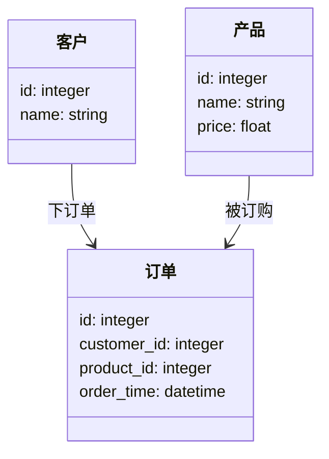

                 


# 企业AI Agent的因果推理在产品定价策略优化中的应用

> 关键词：AI Agent，因果推理，产品定价策略，定价优化，因果图

> 摘要：本文详细探讨了企业AI Agent在产品定价策略优化中的因果推理应用。通过分析传统定价策略的局限性，引入因果推理的基本原理，并结合实际案例，展示了如何利用AI Agent进行定价优化。文章从理论到实践，系统地阐述了因果推理在定价策略优化中的实现过程，为企业的定价决策提供了新的思路和方法。

---

# 企业AI Agent的因果推理在产品定价策略优化中的应用

## 第1章: 问题背景与核心概念

### 1.1 企业定价策略的现状与挑战

#### 1.1.1 传统定价策略的局限性

传统定价策略主要依赖于历史数据和经验判断，存在以下问题：
- 数据的片面性：仅基于历史销售数据，无法全面考虑市场变化、竞争对手策略等因素。
- 模型的静态性：传统定价模型假设市场环境稳定，无法应对动态变化。
- 缺乏因果关系：相关关系分析无法揭示变量间的因果关系，导致定价决策不够精准。

#### 1.1.2 数据驱动定价的崛起

随着大数据技术的发展，企业开始利用数据驱动的方法进行定价策略优化。数据驱动定价的优势包括：
- 数据全面性：整合多维度数据（如用户行为、市场趋势、产品特征等）。
- 模型动态性：能够实时更新模型，适应市场变化。
- 精准性提升：通过数据分析挖掘潜在规律，提高定价的科学性。

#### 1.1.3 企业定价策略优化的必要性

在竞争激烈的市场环境中，优化定价策略对企业至关重要：
- 提高利润率：通过精准定价减少损失，提升收益。
- 增强市场竞争力：灵活调整价格策略，应对竞争对手。
- 优化资源配置：合理分配资源，提高运营效率。

### 1.2 AI Agent与因果推理的引入

#### 1.2.1 AI Agent的基本概念

AI Agent（人工智能代理）是一种智能体，能够感知环境、自主决策并执行任务。在定价策略优化中，AI Agent可以：
- 收集市场数据：实时获取价格、销量、用户反馈等信息。
- 分析数据：利用机器学习算法预测价格敏感性和需求弹性。
- 制定策略：基于分析结果生成定价方案，并动态调整。

#### 1.2.2 因果推理在AI Agent中的作用

因果推理是理解变量间因果关系的方法，其在AI Agent中的作用包括：
- 解释性增强：因果推理能够揭示变量间的因果关系，使定价策略更具可解释性。
- 稳定性提升：因果推理模型在干预下的稳定性优于相关性分析。
- 决策优化：通过因果推理，AI Agent能够更准确地预测价格调整后的效果，优化定价策略。

#### 1.2.3 企业定价策略优化中的因果推理应用

在企业定价策略优化中，因果推理的应用场景包括：
- 价格弹性分析：确定价格变动对销量的具体影响。
- 竞争对手分析：理解竞争对手定价策略对自身定价的影响。
- 用户行为预测：基于因果推理预测用户对价格变化的反应。

### 1.3 问题描述与目标

#### 1.3.1 产品定价策略优化的核心问题

定价策略优化的核心问题包括：
- 如何准确估计价格对销量的影响。
- 如何在动态市场中实时调整定价策略。
- 如何平衡短期收益与长期品牌价值。

#### 1.3.2 问题解决的边界与外延

问题解决的边界包括：
- 数据范围：明确数据来源和数据质量要求。
- 时间范围：确定定价策略优化的时间窗口。
- 业务范围：明确优化的业务场景和目标市场。

问题的外延包括：
- 全球化定价策略：考虑不同地区的市场差异。
- 多产品定价：在多产品线的情况下，如何制定协同定价策略。
- 动态定价：在实时变化的市场环境中，如何快速响应。

#### 1.3.3 核心概念与组成要素

定价策略优化的组成要素包括：
- 数据输入：市场数据、用户数据、产品数据。
- 模型构建：因果推理模型、定价优化模型。
- 决策输出：价格建议、策略调整建议。
- 反馈机制：根据实际效果调整模型参数。

---

## 第2章: 因果推理的核心概念与联系

### 2.1 因果推理的基本原理

因果推理是通过分析变量间的因果关系，推断出因果关系网络的方法。其基本原理包括：
- 马尔可夫假设：假设因果关系网络中的每个变量仅与其父节点相关。
- 干预分析：通过干预变量，观察其对其他变量的影响，确定因果关系。

### 2.2 核心概念对比与ER实体关系图

因果关系与相关关系的对比：

| 特性               | 因果关系         | 相关关系         |
|--------------------|------------------|------------------|
| 定义               | 变量间的影响关系 | 变量间的统计关联 |
| 方向               | 具有方向性       | 无方向性         |
| 干预               | 可通过干预改变   | 干预无法改变      |

ER实体关系图：

```mermaid
erDiagram
    customer[客户] {
        <属性>
        id : integer
        name : string
        }
    product[产品] {
        <属性>
        id : integer
        name : string
        price : float
        }
    order[订单] {
        <属性>
        id : integer
        customer_id : integer
        product_id : integer
        order_time : datetime
        }
    )
    customer -- order : 下订单
    product -- order : 被订购
```

---

## 第3章: 因果推理算法原理

### 3.1 潜在结果框架与倾向评分

#### 3.1.1 潜在结果的定义与计算

潜在结果（Potential Outcome）是指在某个干预下，个体可能的结果。计算潜在结果需要：
- 定义干预变量：如价格调整。
- 计算每个个体在不同干预下的潜在结果。

#### 3.1.2 倾向评分的计算方法

倾向评分（Propensity Score）是通过机器学习模型预测个体接受干预的概率。常用算法包括：
- logistic回归：用于估计倾向评分。
- 随机森林：用于处理高维数据。

#### 3.1.3 倾向评分在定价策略中的应用

倾向评分的应用包括：
- 评估价格调整的效果：通过比较接受干预和未接受干预的情况，估计价格调整对销量的影响。
- 确定目标客户：识别对价格敏感的客户群体，制定差异化定价策略。

#### 3.1.4 倾向评分的实现代码

```python
import pandas as pd
import numpy as np
from sklearn.linear_model import LogisticRegression

# 数据准备
data = pd.DataFrame({
    'price': [10, 20, 30, 40, 50],
    'sales': [50, 30, 20, 10, 5],
    'customer_id': [1, 2, 3, 4, 5]
})

# 建立倾向评分模型
model = LogisticRegression()
model.fit(data[['price']], data['sales'])

# 计算倾向评分
treatment = model.predict_proba(data[['price']])[:, 1]
```

### 3.2 高维数据因果推断的实现

#### 3.2.1 高维数据的处理方法

高维数据的处理方法包括：
- 特征选择：通过统计方法或机器学习模型选择重要特征。
- 维度降低：使用主成分分析（PCA）等方法降低数据维度。

#### 3.2.2 因果森林算法的原理

因果森林（Causal Forest）是一种基于随机森林的因果推断方法，适用于高维数据。其原理包括：
- 树的构建：通过随机分割数据，构建多个决策树。
- 干预效果的估计：通过遍历树结构，估计干预效果。

#### 3.2.3 算法实现的步骤与流程

因果森林算法的实现步骤包括：
1. 数据预处理：清洗数据，处理缺失值。
2. 模型训练：使用随机森林算法训练因果森林模型。
3. 干预效果计算：通过遍历树结构，计算干预效果。

#### 3.2.4 因果森林算法的代码实现

```python
import numpy as np
from sklearn.ensemble import RandomForestRegressor

# 数据准备
data = pd.DataFrame({
    'price': [10, 20, 30, 40, 50],
    'sales': [50, 30, 20, 10, 5],
    'customer_id': [1, 2, 3, 4, 5]
})

# 建立因果森林模型
model = RandomForestRegressor()
model.fit(data[['price', 'customer_id']], data['sales'])

# 预测干预效果
treatment_effect = model.predict(data[['price', 'customer_id']]) - model.predict(data[['price', 'customer_id']])
```

### 3.3 算法的数学模型与公式

因果推理的数学模型包括：
- 平均处理效应（ATE）：公式为：
  $$ATE = E[Y^{1} - Y^{0}]$$
- 平均处理效应于子群体（ATT）：公式为：
  $$ATT = E[Y^{1} - Y^{0} | T=1]$$

---

## 第4章: 系统分析与架构设计

### 4.1 系统功能设计

#### 4.1.1 领域模型的构建

领域模型（Domain Model）是系统功能设计的核心。领域模型的构建包括：
- 实体识别：识别定价策略优化中的关键实体，如客户、产品、订单等。
- 关系建模：描述实体间的关系，如客户下单、产品定价等。

领域模型的Mermaid图：



#### 4.1.2 系统功能模块划分

系统功能模块的划分包括：
- 数据采集模块：负责数据的收集和预处理。
- 模型构建模块：负责因果推理模型的训练和部署。
- 策略优化模块：负责定价策略的生成和调整。

### 4.2 系统架构设计

#### 4.2.1 系统架构的分层设计

系统架构的分层设计包括：
- 数据层：负责数据的存储和管理。
- 服务层：负责数据的处理和模型的调用。
- 展示层：负责结果的展示和用户交互。

#### 4.2.2 系统组件的交互关系

系统组件的交互关系包括：
- 数据采集模块与数据层的交互：数据采集模块向数据层写入数据。
- 模型构建模块与服务层的交互：模型构建模块调用服务层的模型训练接口。
- 策略优化模块与展示层的交互：策略优化模块将定价策略传递给展示层。

系统架构的Mermaid图：


---

## 第5章: 项目实战与案例分析

### 5.1 项目实战

#### 5.1.1 环境安装

项目实战的环境安装包括：
- 安装Python环境：使用Anaconda或虚拟环境。
- 安装依赖库：如pandas、numpy、scikit-learn、mermaid等。

#### 5.1.2 系统核心实现源代码

系统核心实现的源代码包括：
```python
import pandas as pd
from sklearn.ensemble import RandomForestRegressor

# 数据准备
data = pd.DataFrame({
    'price': [10, 20, 30, 40, 50],
    'sales': [50, 30, 20, 10, 5],
    'customer_id': [1, 2, 3, 4, 5]
})

# 建立因果森林模型
model = RandomForestRegressor()
model.fit(data[['price', 'customer_id']], data['sales'])

# 预测干预效果
treatment_effect = model.predict(data[['price', 'customer_id']]) - model.predict(data[['price', 'customer_id']])
```

#### 5.1.3 代码应用解读与分析

代码的应用解读包括：
- 数据准备：将价格、销量、客户ID等数据整合到一个DataFrame中。
- 模型训练：使用随机森林回归模型训练因果森林模型。
- 干预效果计算：通过模型预测，计算价格调整对销量的影响。

#### 5.1.4 案例分析与详细讲解剖析

案例分析包括：
- 数据分析：通过数据可视化工具（如Matplotlib）分析价格与销量的关系。
- 模型评估：通过交叉验证评估模型的准确性。
- 结果解读：根据模型输出结果，解读价格调整对销量的具体影响。

---

## 第6章: 总结与展望

### 6.1 总结

本文详细探讨了企业AI Agent在产品定价策略优化中的因果推理应用。通过分析传统定价策略的局限性，引入因果推理的基本原理，并结合实际案例，展示了如何利用AI Agent进行定价优化。

### 6.2 展望

未来的研究方向包括：
- 更复杂的因果关系网络：研究多变量间的复杂因果关系。
- 实时定价策略优化：开发实时调整定价策略的技术。
- 更高的模型可解释性：提升因果推理模型的可解释性，便于企业决策者理解。

---

# 作者：AI天才研究院/AI Genius Institute & 禅与计算机程序设计艺术 /Zen And The Art of Computer Programming

