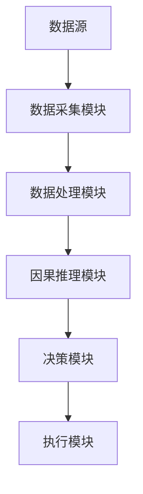
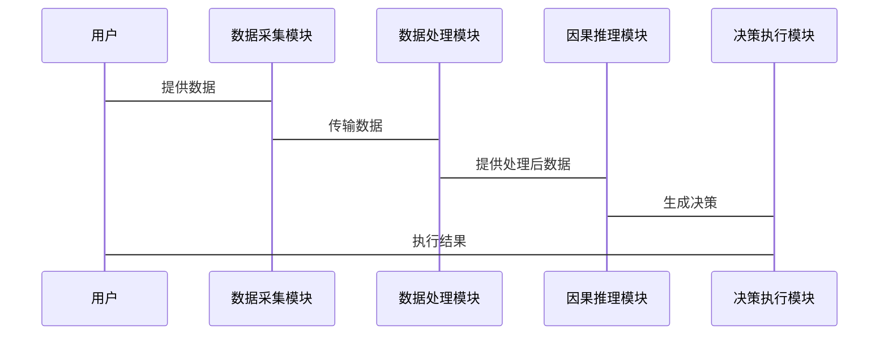

                 


# 企业AI Agent的因果推理在产品开发中的应用

> 关键词：企业AI Agent，因果推理，产品开发，系统架构，算法原理

> 摘要：本文详细探讨了企业AI Agent在产品开发中的因果推理应用，从基本概念到算法原理，从系统架构到项目实战，系统地分析了因果推理在企业AI Agent中的核心作用，并通过实际案例展示了其在产品开发中的具体应用。本文还结合数学公式和图表，深入剖析了因果推理的数学模型和算法实现，为读者提供了一套完整的理论与实践相结合的解决方案。

---

# 第一部分: 企业AI Agent的背景与核心概念

## 第1章: 企业AI Agent的基本概念

### 1.1 什么是企业AI Agent
#### 1.1.1 AI Agent的定义
AI Agent（人工智能代理）是指能够感知环境、自主决策并执行任务的智能实体。企业AI Agent是专为企业场景设计的AI Agent，用于辅助或替代人类完成复杂任务。

#### 1.1.2 企业AI Agent的特点
- **智能化**：基于AI技术，能够自主学习和优化。
- **自主性**：无需人工干预，能够独立完成任务。
- **适应性**：能够根据环境变化动态调整行为。
- **协作性**：能够与其他系统或人类协作完成任务。

#### 1.1.3 企业AI Agent的分类
- **决策型AI Agent**：用于决策支持，如产品开发中的需求预测和决策优化。
- **执行型AI Agent**：用于具体任务的执行，如自动化测试和部署。
- **监控型AI Agent**：用于实时监控系统运行状态，如异常检测和预警。

### 1.2 企业AI Agent的应用场景
#### 1.2.1 产品开发中的AI Agent
- 需求分析：基于用户反馈和市场数据，预测产品需求。
- 开发阶段：辅助代码生成、测试用例设计和缺陷预测。
- 优化阶段：优化产品性能和用户体验。

#### 1.2.2 其他领域中的AI Agent应用
- **运维管理**：自动化运维、故障排查和资源优化。
- **客户服务**：智能客服、用户行为分析和个性化推荐。
- **战略决策**：市场分析、风险评估和战略规划。

#### 1.2.3 企业AI Agent的边界与外延
企业AI Agent的应用范围和边界取决于企业的具体需求和技术能力。其外延包括与外部系统的集成、多Agent协作以及与其他AI技术的结合。

---

## 第2章: 因果推理的基本概念

### 2.1 因果推理的定义
因果推理是研究因果关系的推理过程，旨在理解变量之间的因果关系，而非仅仅是相关关系。

### 2.2 因果推理的核心原理
因果推理基于因果关系模型，通过分析变量之间的因果关系，推断出干预或变化后的结果。

### 2.3 因果推理与相关概念的区别
| 概念       | 描述                                                                 |
|------------|----------------------------------------------------------------------|
| 相关关系   | 变量之间的统计关联性，不考虑因果方向。                                  |
| 因果关系   | 变量之间的因果联系，关注干预后的结果变化。                              |
| 预测模型   | 基于数据的预测，不考虑变量之间的因果关系。                              |
| 因果模型   | 基于因果关系构建的模型，用于推断干预后的结果。                            |

### 2.4 因果推理的核心要素
- **干预**：对系统进行干预，观察结果的变化。
- **反事实推理**：推断在某些条件下可能发生的结果。
- **因果网络**：用图表示变量之间的因果关系。

---

# 第二部分: 企业AI Agent的因果推理原理

## 第3章: 因果推理的数学模型

### 3.1 潜在结果框架
潜在结果框架是因果推理的基础，假设每个单位在不同处理下的潜在结果。

$$Y_i = \beta_0 + \beta_1X_i + \epsilon_i$$

其中：
- $Y_i$ 是第i个单位的潜在结果。
- $X_i$ 是第i个单位的处理变量。
- $\beta_0$ 是截距项。
- $\beta_1$ 是处理变量的系数，表示处理对结果的影响。
- $\epsilon_i$ 是误差项。

### 3.2 因果图模型
因果图模型用图表示变量之间的因果关系，常用DAG（有向无环图）表示。

$$Y = \beta X + \gamma X' + \epsilon$$

其中：
- $Y$ 是结果变量。
- $X$ 是直接前驱变量。
- $X'$ 是间接前驱变量。
- $\beta$ 是直接效应系数。
- $\gamma$ 是间接效应系数。
- $\epsilon$ 是误差项。

### 3.3 随机化实验与因果估计
随机化实验是因果推理的重要方法，通过随机分配处理，减少偏倚。

$$\text{ATE} = E[Y_{t=1}] - E[Y_{t=0}]}$$

其中：
- ATE是平均处理效应。
- $Y_{t=1}$ 和 $Y_{t=0}$ 分别表示处理和不处理时的结果。

---

## 第4章: 企业AI Agent中的因果推理应用

### 4.1 产品开发中的因果推理
#### 4.1.1 产品需求预测
基于因果推理，分析用户需求的变化对产品开发的影响。

#### 4.1.2 产品性能评估
通过因果推理，评估产品性能的改进对用户行为的影响。

#### 4.1.3 产品优化策略
根据因果推理结果，制定最优的产品优化策略。

### 4.2 因果推理在AI Agent决策中的作用
#### 4.2.1 决策树模型
基于因果推理构建决策树，用于AI Agent的决策过程。

#### 4.2.2 隐马尔可夫模型
用隐马尔可夫模型捕捉动态系统中的因果关系。

#### 4.2.3 因果网络的构建与分析
通过因果网络分析，优化AI Agent的决策流程。

---

# 第三部分: 企业AI Agent的系统架构与实现

## 第5章: 企业AI Agent的系统架构设计

### 5.1 系统功能设计
#### 5.1.1 数据采集模块
从企业系统中采集相关数据，如用户行为数据、产品数据等。

#### 5.1.2 数据处理模块
对采集的数据进行清洗、转换和特征提取。

#### 5.1.3 因果推理模块
基于因果图模型，分析变量之间的因果关系。

#### 5.1.4 决策执行模块
根据因果推理结果，生成决策并执行。

### 5.2 系统架构图


---

## 第6章: 系统接口与交互设计

### 6.1 系统接口设计
- **数据接口**：定义数据格式和接口规范。
- **推理接口**：定义因果推理的输入和输出。
- **执行接口**：定义决策执行的接口规范。

### 6.2 系统交互设计


---

# 第四部分: 项目实战与优化

## 第7章: 项目实战

### 7.1 环境安装
- **Python**：安装Python 3.8+
- **库依赖**：安装numpy、pandas、scikit-learn、pygraphviz

### 7.2 核心实现
```python
import numpy as np
from sklearn.tree import DecisionTreeClassifier
from causalgraphicalmodel import CausalGraphicalModel

# 数据准备
X = np.array([[1, 2], [3, 4], [5, 6]])
y = np.array([0, 1, 0])

# 构建因果图
cg = CausalGraphicalModel()
cg.add_node('X')
cg.add_node('Y')
cg.add_edge('X', 'Y')

# 训练决策树模型
model = DecisionTreeClassifier()
model.fit(X, y)

# 进行因果推理
 intervened_X = np.array([[2, 3]])
 prediction = model.predict(intervened_X)
```

### 7.3 案例分析
以某企业的产品开发为例，分析因果推理在产品需求预测中的应用。

---

## 第8章: 总结与展望

### 8.1 最佳实践
- **数据质量**：确保数据的准确性和完整性。
- **模型选择**：根据具体场景选择合适的因果推理模型。
- **结果解释**：对因果推理结果进行合理的解释和验证。

### 8.2 小结
本文系统地介绍了企业AI Agent的因果推理在产品开发中的应用，从理论到实践，详细阐述了因果推理的数学模型、算法实现和系统架构设计。

### 8.3 注意事项
- 因果推理需要充分的领域知识支持。
- 模型的可解释性需要重点关注。
- 实际应用中需要考虑数据的偏倚和外部有效性。

### 8.4 拓展阅读
- 参考文献：Pearl, J. (2009). Causal Relationships.

---

作者：AI天才研究院/AI Genius Institute & 禅与计算机程序设计艺术 /Zen And The Art of Computer Programming

