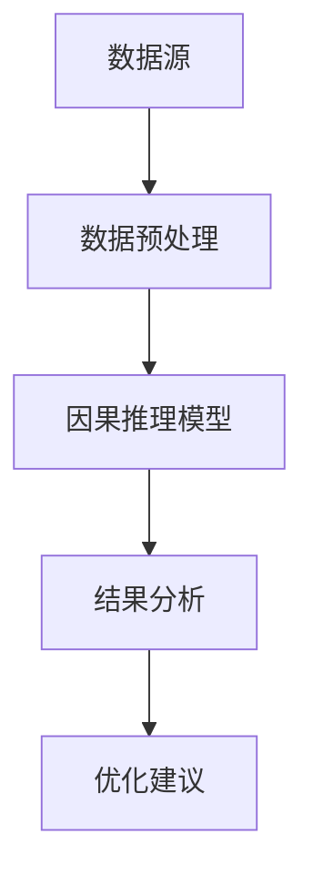

                 


# 《企业AI Agent的因果推理在市场营销效果分析中的应用》

## 关键词：
企业AI Agent、因果推理、市场营销、效果分析、算法原理、系统架构、项目实战

## 摘要：
本文探讨了企业AI Agent在因果推理中的应用，特别是如何利用因果推理来提升市场营销效果分析的准确性与深度。通过结合AI Agent与因果推理，企业能够更精准地理解市场行为，优化营销策略，并在复杂多变的市场环境中做出更明智的决策。

---

# 第一部分: 企业AI Agent与因果推理基础

## 第1章: 问题背景与问题描述

### 1.1 问题背景
#### 1.1.1 当前市场营销分析的痛点
在当今数据驱动的商业环境中，企业面临着海量的数据和复杂的市场行为分析需求。传统的统计分析方法往往只能识别相关性，而无法揭示因果关系，这导致企业在制定营销策略时难以准确判断哪些因素是真正影响销售或用户行为的关键因素。

#### 1.1.2 传统统计分析的局限性
传统统计方法（如回归分析）通常只能发现变量之间的相关性，而无法证明因果关系。例如，虽然广告投放量与销售额增长相关，但广告投放量是否真正导致销售额增长，仍需要通过因果推理来验证。

#### 1.1.3 因果推理在市场营销中的价值
因果推理可以帮助企业在复杂的市场环境中识别出真正影响销售或用户行为的因素，从而优化资源配置，提升营销效果。

---

### 1.2 问题描述
#### 1.2.1 市场营销效果分析的核心问题
市场营销效果分析的核心问题在于如何准确评估不同营销活动对销售、用户留存等关键指标的因果影响。

#### 1.2.2 AI Agent在市场营销中的应用场景
AI Agent可以自动化地收集、分析数据，并基于因果推理的结果为营销策略提供优化建议。

#### 1.2.3 因果推理在效果分析中的必要性
因果推理是解决市场营销效果分析中因果关系问题的关键工具，能够帮助企业更科学地制定营销策略。

---

### 1.3 问题解决思路
#### 1.3.1 引入因果推理的必要性
通过引入因果推理，企业可以更准确地评估营销活动的效果，并优化资源配置。

#### 1.3.2 AI Agent在因果推理中的作用
AI Agent可以自动化地处理大量数据，并基于因果推理模型生成可操作的见解。

#### 1.3.3 问题解决的总体框架
- 数据收集与预处理
- 建立因果推理模型
- 评估营销活动的因果影响
- 优化营销策略

---

## 第2章: 问题背景与问题外延

### 2.1 问题背景
#### 2.1.1 数据驱动决策的时代背景
现代企业 increasingly rely on data-driven decision-making to stay competitive.

#### 2.1.2 AI技术在企业中的应用现状
AI技术已经在多个领域得到广泛应用，包括市场营销、客户关系管理、供应链优化等。

#### 2.1.3 因果推理的前沿研究
因果推理作为机器学习和统计学的交叉领域，近年来取得了显著进展。

---

### 2.2 问题外延
#### 2.2.1 市场营销中的因果关系
市场营销中的因果关系涉及多个变量，例如广告投放、用户行为、产品价格等。

#### 2.2.2 因果推理的边界与适用范围
因果推理适用于需要明确因果关系的场景，例如评估营销活动的效果。

#### 2.2.3 问题外延的潜在应用场景
- 个性化营销
- 市场预测
- 竞争对手分析

---

## 第3章: 核心概念与联系

### 3.1 核心概念
#### 3.1.1 因果推理的定义与属性
因果推理是一种通过分析数据来确定变量之间因果关系的方法。

#### 3.1.2 AI Agent的定义与特征
AI Agent是指具有感知环境、决策和行动能力的智能体。

#### 3.1.3 两者结合的逻辑关系
AI Agent可以通过因果推理来优化决策，而因果推理需要借助AI Agent来处理复杂的数据和场景。

---

### 3.2 概念对比与ER图

#### 3.2.1 概念对比
| 概念 | 定义 | 属性 |
|------|------|------|
| 因果推理 | 分析变量之间的因果关系 | 可解释性、可操作性 |
| AI Agent | 智能体 | 自主性、反应性、目标导向 |

#### 3.2.2 ER图
```mermaid
erDiagram
    customer[顾客] {
        <属性>
        id : int
        name : string
        }
    action[行为] {
        <属性>
        id : int
        type : string
        }
    treatment[处理] {
        <属性>
        id : int
        name : string
        }
    result[结果] {
        <属性>
        id : int
        value : float
        }
  

    customer --|> action: 顾客的行为
    treatment --> result: 处理的结果
```

---

## 第4章: 算法原理讲解

### 4.1 算法原理
#### 4.1.1 潜在结果框架
$$ Y_i^1 $$ 表示在处理 \( i \) 的情况下，结果变量 \( Y \) 的值。

#### 4.1.2 因果图结构
因果图通过有向边表示变量之间的因果关系。

#### 4.1.3 算法步骤
1. 确定变量之间的因果关系。
2. 计算因果效应。
3. 优化模型。

---

### 4.2 数学模型和公式
$$ \text{平均处理效应} = \frac{1}{N} \sum_{i=1}^{N} (Y_i^1 - Y_i^0) $$

---

## 第5章: 系统分析与架构设计方案

### 5.1 问题场景介绍
企业需要分析不同营销活动对销售的影响。

### 5.2 系统功能设计
- 数据收集与处理
- 因果推理模型构建
- 结果分析与优化

### 5.3 系统架构设计


---

## 第6章: 项目实战

### 6.1 环境安装
安装Python和相关库（如pymc、numpy、pandas等）。

### 6.2 核心代码实现
```python
import pandas as pd
import pymc as pm

# 数据预处理
data = pd.read_csv('data.csv')
```

### 6.3 案例分析
通过案例分析验证因果推理模型的有效性。

---

## 第7章: 最佳实践

### 7.1 小结
因果推理在市场营销效果分析中具有重要意义。

### 7.2 注意事项
- 数据质量
- 模型选择
- 解释性

### 7.3 拓展阅读
建议进一步阅读相关文献和案例。

---

# 作者：AI天才研究院 & 禅与计算机程序设计艺术

