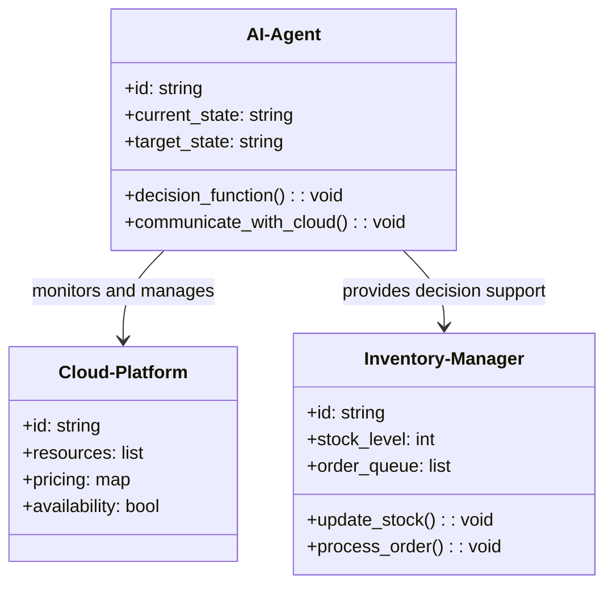
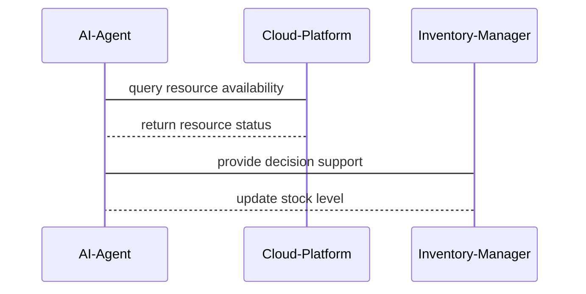

                 


# 企业AI Agent的多云部署策略：灵活性与可靠性

## 关键词
企业AI Agent，多云部署，灵活性，可靠性，云计算，人工智能

## 摘要
随着云计算技术的飞速发展和人工智能的广泛应用，企业AI Agent在多云环境下的部署策略成为了一个关键议题。本文将深入探讨企业AI Agent的多云部署策略，分析其灵活性与可靠性，结合实际案例，为企业提供可操作的解决方案。文章内容涵盖AI Agent的基本概念、多云部署的背景、核心设计原则、系统架构设计、项目实战以及最佳实践，旨在为企业技术决策者和开发者提供全面的指导。

---

## 第1章: 企业AI Agent与多云部署背景

### 1.1 AI Agent的基本概念

#### 1.1.1 AI Agent的定义与特点
AI Agent（人工智能代理）是指一种能够感知环境、自主决策并执行任务的智能实体。它能够通过传感器或API接口获取外部信息，并基于预设的目标和规则，采取相应的行动。AI Agent的特点包括：
- **自主性**：能够在没有人工干预的情况下独立运作。
- **反应性**：能够实时感知环境变化并做出反应。
- **目标导向**：所有行为均以实现特定目标为导向。
- **学习能力**：通过机器学习算法不断优化自身的决策能力。

#### 1.1.2 AI Agent的核心功能与应用场景
AI Agent的核心功能包括信息处理、决策制定、任务执行和状态监控。其应用场景广泛，例如智能客服、自动驾驶、智能供应链管理和智能金融投资等。

#### 1.1.3 企业级AI Agent的挑战与机遇
企业在部署AI Agent时面临的主要挑战包括数据隐私、计算资源限制、多云环境的复杂性等。同时，AI Agent也为企业带来了智能化转型、效率提升和成本优化等机遇。

---

### 1.2 多云部署的背景与趋势

#### 1.2.1 多云环境的定义与优势
多云部署是指将企业业务分布在多个云服务提供商（如AWS、Azure、Google Cloud等）上的策略。其优势包括：
- **避免供应商锁定**：企业可以避免依赖单一云提供商。
- **资源优化**：可以根据不同业务需求选择最优的云服务。
- **高可用性**：通过多云部署可以提高系统的容灾能力。

#### 1.2.2 企业采用多云部署的驱动力
企业选择多云部署的主要驱动力包括：
- **成本优化**：通过选择不同云服务提供商的价格优势，降低整体成本。
- **业务灵活性**：根据不同业务需求动态分配资源。
- **安全性**：通过分散数据存储位置，降低数据丢失风险。

#### 1.2.3 多云环境的复杂性与挑战
多云环境的复杂性主要体现在：
- **跨云通信**：不同云平台之间的通信可能存在延迟或带宽限制。
- **资源管理**：需要协调多个云平台的资源分配。
- **安全性与合规性**：需要确保数据在不同云平台之间传输的安全性。

---

### 1.3 企业AI Agent与多云部署的结合

#### 1.3.1 多云环境下AI Agent的需求
在多云环境下，AI Agent需要具备以下能力：
- **跨云协作**：能够协调多个云平台上的资源。
- **动态适应性**：能够根据云环境的变化实时调整策略。
- **高可用性**：在某个云平台出现故障时，能够快速切换到其他平台。

#### 1.3.2 企业AI Agent的灵活性与可靠性要求
- **灵活性**：AI Agent需要能够快速适应不同的云环境和业务需求。
- **可靠性**：AI Agent需要在多云环境下稳定运行，确保关键业务的连续性。

#### 1.3.3 多云部署对AI Agent性能的影响
多云部署可能会带来额外的网络延迟和资源管理复杂性，但通过合理的资源分配和优化算法，可以有效降低这些负面影响。

---

## 第2章: 多云部署的核心概念与挑战

### 2.1 多云环境的架构特点

#### 2.1.1 多云环境的层次结构
多云环境通常由以下几个层次组成：
1. **应用层**：包括企业的核心业务应用。
2. **网络层**：负责不同云平台之间的通信。
3. **数据层**：存储企业的数据。
4. **资源层**：包括计算资源、存储资源和网络资源。

#### 2.1.2 多云环境中的资源分配与管理
资源分配与管理是多云部署的核心问题。需要考虑的因素包括资源成本、性能需求和可用性要求。

#### 2.1.3 多云环境中的服务发现与通信
服务发现是指在多云环境中，AI Agent能够快速定位并连接到所需的服务。通信方面，需要解决不同云平台之间的API兼容性问题。

### 2.2 AI Agent在多云环境中的角色

#### 2.2.1 AI Agent作为服务代理的功能
AI Agent可以作为服务代理，负责协调多个云平台之间的资源分配和任务执行。

#### 2.2.2 AI Agent在多云环境中的智能决策能力
AI Agent能够基于实时数据和历史信息，做出最优的决策，例如选择最优的云平台进行资源分配。

#### 2.2.3 AI Agent的跨云协作机制
AI Agent需要具备跨云协作能力，能够与其他云平台上的AI Agent或服务进行协同工作。

### 2.3 多云部署中的主要挑战

#### 2.3.1 跨云通信与数据同步问题
跨云通信可能会导致延迟增加，数据同步则需要考虑数据一致性问题。

#### 2.3.2 多云环境中的服务可靠性与容错性
多云环境中的服务可靠性需要通过冗余部署和故障切换机制来保障。

#### 2.3.3 多云部署中的安全与权限管理
多云环境中的安全与权限管理需要考虑数据隐私和访问控制问题。

---

## 第3章: 多云部署策略的设计原则

### 3.1 灵活性与可靠性的平衡

#### 3.1.1 灵活性在多云部署中的体现
灵活性主要体现在资源的动态分配和任务的动态调整上。

#### 3.1.2 可靠性在多云部署中的体现
可靠性主要体现在系统的高可用性和故障恢复能力上。

#### 3.1.3 灵活性与可靠性之间的权衡
在实际部署中，需要在灵活性和可靠性之间找到平衡点，避免过度追求某一方面而导致另一方面的问题。

### 3.2 多云部署的分层策略

#### 3.2.1 应用层的多云策略
应用层的多云策略包括应用的分布式部署和负载均衡。

#### 3.2.2 网络层的多云策略
网络层的多云策略包括跨云通信的优化和网络流量的管理。

#### 3.2.3 数据层的多云策略
数据层的多云策略包括数据的分布式存储和数据同步机制。

### 3.3 基于AI Agent的智能多云部署

#### 3.3.1 AI Agent在多云部署中的智能决策
AI Agent可以通过强化学习算法，动态调整资源分配策略。

#### 3.3.2 基于AI的动态资源分配策略
动态资源分配策略可以根据实时负载和资源价格，选择最优的云平台进行资源分配。

#### 3.3.3 基于AI的故障恢复机制
AI Agent可以通过预测系统故障，提前进行资源迁移和任务切换。

---

## 第4章: 多云部署的系统架构设计

### 4.1 系统架构概述

#### 4.1.1 多云环境下的系统架构层次
多云环境下的系统架构通常包括应用层、网络层、数据层和资源层。

#### 4.1.2 AI Agent在系统架构中的位置
AI Agent通常位于应用层，负责协调多云环境下的资源分配和任务执行。

#### 4.1.3 系统架构的可扩展性与可维护性
系统架构需要具备良好的可扩展性和可维护性，以应对业务需求的变化。

### 4.2 基于AI Agent的多云部署架构

#### 4.2.1 AI Agent的多云监控与管理模块
AI Agent需要具备多云环境下的实时监控和资源管理能力。

#### 4.2.2 多云环境下的资源调度模块
资源调度模块负责根据实时负载和资源价格，动态调整资源分配策略。

#### 4.2.3 跨云通信与数据同步模块
跨云通信与数据同步模块需要解决不同云平台之间的通信和数据一致性问题。

---

## 第5章: 多云部署的项目实战

### 5.1 项目介绍

#### 5.1.1 项目背景
假设我们正在为一家电商企业设计一个多云部署的AI Agent系统，用于优化库存管理和订单处理。

#### 5.1.2 项目目标
通过多云部署，实现库存管理的高可用性和成本优化。

### 5.2 系统功能设计

#### 5.2.1 领域模型设计
使用Mermaid绘制领域模型类图，展示系统中各个实体及其关系。



#### 5.2.2 系统架构设计
使用Mermaid绘制系统架构图，展示系统的主要组件及其交互关系。


#### 5.2.3 系统接口设计
系统接口设计需要考虑不同云平台之间的API兼容性问题。

#### 5.2.4 系统交互设计
使用Mermaid绘制系统交互序列图，展示AI Agent与各组件之间的交互流程。



### 5.3 算法实现

#### 5.3.1 算法原理
基于强化学习的动态资源分配算法，通过不断试错，找到最优的资源分配策略。

#### 5.3.2 算法数学模型
强化学习的数学模型可以用以下公式表示：
$$
Q(s, a) = Q(s, a) + \alpha \left(r + \gamma \max_{a'} Q(s', a') - Q(s, a)\right)
$$
其中，$s$是当前状态，$a$是当前动作，$r$是奖励，$\gamma$是折扣因子，$\alpha$是学习率。

#### 5.3.3 算法实现代码
以下是一个简单的强化学习算法实现示例：

```python
class AI-Agent:
    def __init__(self):
        self.Q = {}  # Q值表
        self.learning_rate = 0.1
        self.discount_factor = 0.9

    def get_action(self, state):
        # 获取所有可能的动作
        actions = self.get_possible_actions(state)
        # 如果动作未在Q表中，初始化为0
        if actions not in self.Q.get(state, {}):
            for action in actions:
                if action not in self.Q.get(state, {}).keys():
                    self.Q[state][action] = 0
        # 选择Q值最大的动作
        max_q = max(self.Q[state].values())
        actions_with_max_q = [action for action in actions if self.Q[state][action] == max_q]
        return random.choice(actions_with_max_q)

    def update_Q(self, state, action, reward, next_state):
        # 更新Q值
        current_Q = self.Q[state][action]
        next_max_Q = max(self.Q.get(next_state, {}).values()) if self.Q.get(next_state) else 0
        new_Q = current_Q + self.learning_rate * (reward + self.discount_factor * next_max_Q - current_Q)
        self.Q[state][action] = new_Q
```

### 5.4 项目小结

#### 5.4.1 项目成果
通过多云部署，实现了库存管理的高可用性和成本优化。

#### 5.4.2 经验总结
- **资源分配**：动态资源分配算法能够有效降低资源浪费。
- **系统可靠性**：通过冗余部署和故障切换机制，提高了系统的可靠性。
- **安全性**：通过加密通信和访问控制，确保了数据的安全性。

---

## 第6章: 总结与展望

### 6.1 总结
企业AI Agent的多云部署策略需要综合考虑灵活性和可靠性，通过合理的资源分配和优化算法，可以在多云环境下实现高效的业务运作。

### 6.2 展望
未来，随着云计算和人工智能技术的进一步发展，多云部署的策略将更加智能化和自动化。AI Agent将在多云环境中发挥越来越重要的作用。

---

## 作者

作者：AI天才研究院/AI Genius Institute & 禅与计算机程序设计艺术 /Zen And The Art of Computer Programming

---

以上是《企业AI Agent的多云部署策略：灵活性与可靠性》的技术博客文章内容，希望对您有所帮助！

