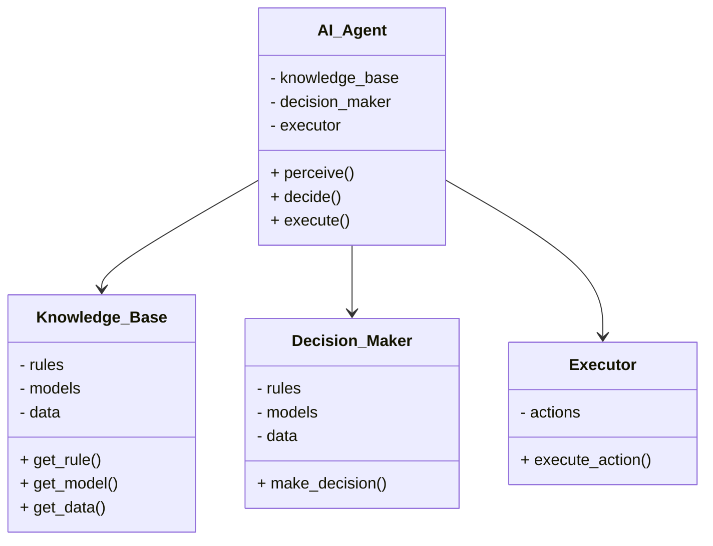
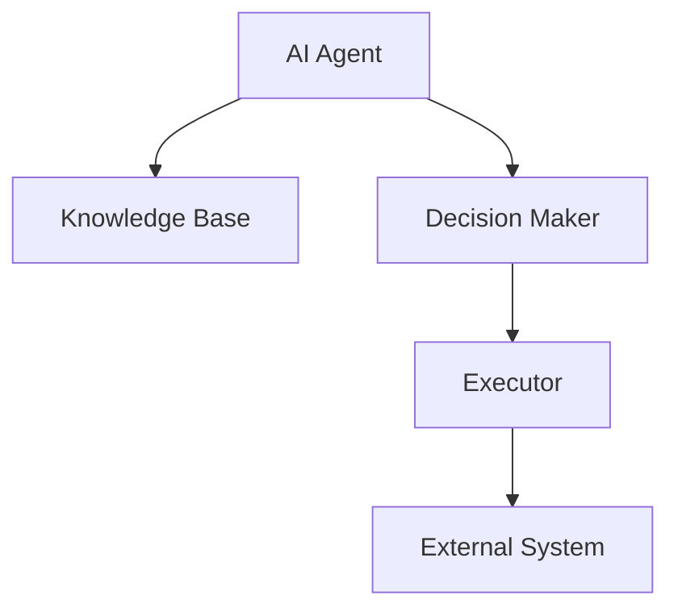

                 


# 企业AI Agent的多场景测试策略：模拟真实业务环境

> 关键词：企业AI Agent、多场景测试、业务环境模拟、测试策略、AI系统测试、智能体测试

> 摘要：本文深入探讨了企业AI Agent在多场景下的测试策略，重点分析了如何在真实业务环境中模拟和验证AI Agent的行为。通过系统化的测试策略，结合实际案例和详细的技术分析，本文为读者提供了从理论到实践的全面指导，帮助企业在复杂多变的业务环境中确保AI Agent的高效、稳定和安全运行。

---

# 第一部分: 企业AI Agent的多场景测试概述

## 第1章: 企业AI Agent的核心概念与背景

### 1.1 AI Agent的基本概念

#### 1.1.1 什么是AI Agent
AI Agent（人工智能代理）是指能够感知环境、自主决策并执行任务的智能系统。它通过接收输入信息，结合内部知识库和推理机制，生成相应的输出或行动。AI Agent可以是软件程序、机器人或其他智能设备。

#### 1.1.2 AI Agent的类型与特点
AI Agent可以分为以下几种类型：
1. **基于规则的AI Agent**：通过预定义的规则进行决策。
2. **基于模型的AI Agent**：使用数学模型进行推理和决策。
3. **基于学习的AI Agent**：通过机器学习算法不断优化行为。
4. **混合型AI Agent**：结合多种方法实现更复杂的决策逻辑。

#### 1.1.3 企业AI Agent的应用场景
在企业环境中，AI Agent可以应用于以下场景：
- **客户支持**：通过自然语言处理为客户提供智能客服。
- **供应链管理**：优化库存、订单处理和物流调度。
- **风险管理**：实时监控并应对潜在的业务风险。
- **智能决策支持**：为企业提供数据驱动的决策建议。

### 1.2 企业AI Agent的背景与发展趋势

#### 1.2.1 AI技术在企业中的应用现状
随着AI技术的快速发展，企业正在将AI Agent应用于各个业务领域，以提高效率、降低成本并提升客户体验。

#### 1.2.2 企业AI Agent的市场需求
企业对AI Agent的需求主要集中在以下几个方面：
- 提高业务流程的自动化水平。
- 实现跨部门的高效协作。
- 提供实时的决策支持。
- 应对复杂多变的市场环境。

#### 1.2.3 未来发展趋势与挑战
未来，AI Agent将朝着以下方向发展：
- 更强的自主决策能力。
- 更高的智能化水平。
- 更广泛的应用场景。

然而，AI Agent的应用也面临一些挑战，例如数据隐私、算法偏见和系统安全性等问题。

---

## 第2章: 企业AI Agent的核心原理与技术

### 2.1 AI Agent的决策机制

#### 2.1.1 知识表示与推理
知识表示是AI Agent进行推理的基础。常用的知识表示方法包括：
- **逻辑表示**：使用逻辑规则表示知识。
- **语义网络**：通过节点和边表示概念及其关系。
- **概率表示**：使用概率模型表示不确定性知识。

#### 2.1.2 逻辑推理与问题求解
逻辑推理是AI Agent的核心能力之一。常见的推理方法包括：
- **演绎推理**：从一般知识推导出具体结论。
- **归纳推理**：从具体实例推导出一般知识。
- ** abduction推理**：基于现有证据推导出最可能的解释。

#### 2.1.3 决策树与规则引擎
决策树是一种常见的决策模型，通过树状结构表示决策过程。规则引擎则通过预定义的规则进行快速决策。

### 2.2 AI Agent的通信与协作

#### 2.2.1 多智能体系统概述
多智能体系统是指多个AI Agent协同工作的系统。这些智能体可以通过通信和协作完成复杂的任务。

#### 2.2.2 通信协议与信息交换
AI Agent之间的通信需要遵循特定的协议。常见的通信协议包括：
- **HTTP/HTTPS**：用于基于Web的通信。
- **WebSocket**：用于实时双向通信。
- **Message Queue**：用于异步通信。

#### 2.2.3 协作与冲突解决
在多智能体系统中，协作和冲突解决是关键问题。常用的方法包括：
- **协商机制**：通过协商分配任务。
- **冲突解决算法**：通过算法解决资源分配冲突。

### 2.3 AI Agent的感知与学习

#### 2.3.1 感知层的实现
感知层是AI Agent获取信息的来源。常用的技术包括：
- **自然语言处理**：用于处理文本信息。
- **计算机视觉**：用于处理图像信息。
- **传感器数据**：用于获取物理环境信息。

#### 2.3.2 机器学习在AI Agent中的应用
机器学习是AI Agent的重要技术之一。通过训练模型，AI Agent可以不断优化自身的决策能力。

#### 2.3.3 深度学习与强化学习的结合
深度学习和强化学习的结合可以提升AI Agent的学习能力和决策能力。例如，强化学习可以通过奖励机制优化AI Agent的行为。

---

## 第3章: 企业AI Agent的架构模式

### 3.1 基于规则的AI Agent架构

#### 3.1.1 规则引擎的实现
基于规则的AI Agent通过规则引擎进行决策。规则引擎是一种用于执行和管理规则的软件组件。

#### 3.1.2 规则的动态更新与优化
规则引擎支持动态更新和优化，以适应不断变化的业务需求。

#### 3.1.3 基于规则的决策优缺点分析
- **优点**：规则清晰、易于理解。
- **缺点**：规则数量多，维护复杂。

### 3.2 基于模型的AI Agent架构

#### 3.2.1 模型驱动的决策机制
基于模型的AI Agent通过数学模型进行决策。例如，使用线性回归模型预测销售量。

#### 3.2.2 模型训练与优化
通过训练数据优化模型参数，提升模型的预测精度。

#### 3.2.3 基于模型的决策优缺点分析
- **优点**：模型具有较高的预测精度。
- **缺点**：模型复杂，训练数据需求大。

### 3.3 基于数据驱动的AI Agent架构

#### 3.3.1 数据驱动的决策机制
基于数据驱动的AI Agent通过实时数据分析进行决策。

#### 3.3.2 数据采集与处理
数据采集和处理是数据驱动AI Agent的关键步骤。常用的数据处理技术包括：
- **数据清洗**：去除噪声数据。
- **数据转换**：将数据转换为适合模型输入的形式。
- **数据存储**：将数据存储在数据库或数据仓库中。

#### 3.3.3 基于数据驱动的决策优缺点分析
- **优点**：能够快速响应变化。
- **缺点**：依赖于实时数据，数据延迟可能影响决策。

### 3.4 不同架构模式的对比分析

#### 3.4.1 各种架构模式的优缺点对比
| 架构模式 | 优点 | 缺点 |
|----------|------|------|
| 基于规则 | 易于理解 | 规则数量多，维护复杂 |
| 基于模型 | 预测精度高 | 模型复杂，训练数据需求大 |
| 数据驱动 | 快速响应 | 数据延迟可能影响决策 |

#### 3.4.2 场景适用性分析
- **规则驱动**：适用于规则明确、变化缓慢的场景。
- **模型驱动**：适用于数据充足、预测精度要求高的场景。
- **数据驱动**：适用于实时性要求高、数据变化快的场景。

---

## 第4章: AI Agent的核心技术与实现

### 4.1 AI Agent的算法原理

#### 4.1.1 决策树算法
决策树是一种常用的分类和回归算法。通过训练数据构建决策树模型，AI Agent可以进行分类和预测。

#### 4.1.2 强化学习算法
强化学习是一种通过试错机制优化决策的算法。AI Agent通过与环境交互，不断优化自身的决策策略。

#### 4.1.3 集成学习算法
集成学习通过将多个模型的结果进行融合，提升模型的泛化能力。

---

### 4.2 AI Agent的系统架构设计

#### 4.2.1 系统功能设计
AI Agent的系统功能设计包括：
- **感知模块**：负责信息采集和处理。
- **推理模块**：负责逻辑推理和决策。
- **执行模块**：负责输出结果或执行动作。

#### 4.2.2 系统架构设计
系统架构设计可以采用分层架构，包括：
- **数据层**：负责数据的存储和管理。
- **逻辑层**：负责逻辑推理和决策。
- **接口层**：负责与其他系统的交互。

---

## 第5章: 企业AI Agent的多场景测试策略

### 5.1 测试环境的搭建

#### 5.1.1 测试场景的选择
在企业AI Agent的多场景测试中，需要选择典型的业务场景进行测试。

#### 5.1.2 测试数据的准备
测试数据需要涵盖各种可能的输入情况，确保测试的全面性。

---

### 5.2 测试用例的设计

#### 5.2.1 业务场景分析
通过对业务场景的分析，设计相应的测试用例。

#### 5.2.2 测试用例的编写
测试用例需要包括输入、预期输出和执行步骤。

---

### 5.3 测试结果的分析

#### 5.3.1 测试覆盖率分析
通过测试覆盖率分析，确保测试的全面性。

#### 5.3.2 测试结果的可视化
将测试结果可视化，便于分析和优化。

---

## 第6章: 项目实战与案例分析

### 6.1 环境安装与配置

#### 6.1.1 安装Python开发环境
安装Python和必要的开发工具。

#### 6.1.2 安装AI框架
安装TensorFlow或PyTorch等AI框架。

---

### 6.2 核心代码实现

#### 6.2.1 AI Agent的实现
实现一个简单的AI Agent，例如基于决策树的分类器。

#### 6.2.2 测试用例的编写
编写测试用例，验证AI Agent的行为。

---

### 6.3 案例分析与优化

#### 6.3.1 测试结果分析
分析测试结果，找出问题和优化方向。

#### 6.3.2 系统优化
根据测试结果优化AI Agent的性能和准确性。

---

## 第7章: 最佳实践与注意事项

### 7.1 最佳实践

#### 7.1.1 测试环境的配置
确保测试环境与实际业务环境一致。

#### 7.1.2 测试数据的管理
合理管理测试数据，确保数据安全和隐私保护。

#### 7.1.3 测试用例的维护
定期更新和维护测试用例，确保其覆盖最新的业务需求。

---

### 7.2 注意事项

#### 7.2.1 数据隐私与安全
在测试过程中，需要注意数据隐私和安全问题。

#### 7.2.2 系统稳定性
确保测试过程中系统的稳定性，避免因测试环境问题导致测试失败。

---

## 第8章: 拓展阅读与深入思考

### 8.1 拓展阅读

#### 8.1.1 AI Agent的伦理与社会影响
探讨AI Agent在社会中的伦理和法律问题。

#### 8.1.2 AI Agent与人类协作的未来
展望AI Agent与人类协作的未来发展方向。

---

## 附录

### 附录A: 代码示例

```python
# 决策树算法示例
from sklearn.tree import DecisionTreeClassifier
from sklearn.datasets import make_classification
import numpy as np

# 生成数据
X, y = make_classification(n_samples=100, n_features=2, n_classes=2, random_state=42)

# 训练模型
model = DecisionTreeClassifier()
model.fit(X, y)

# 预测结果
new_X = np.array([[0, 0], [1, 1]])
print(model.predict(new_X))
```

### 附录B: mermaid图表

#### 领域模型类图


#### 系统架构图


---

## 作者：AI天才研究院/AI Genius Institute & 禅与计算机程序设计艺术 /Zen And The Art of Computer Programming

---

### 总结
本文从企业AI Agent的核心概念出发，详细探讨了其多场景测试策略，并通过实际案例和详细的技术分析，为读者提供了从理论到实践的全面指导。通过本文的学习，读者可以深入了解企业AI Agent的实现原理和测试方法，并能够在实际业务环境中应用这些策略，确保AI Agent的高效、稳定和安全运行。

