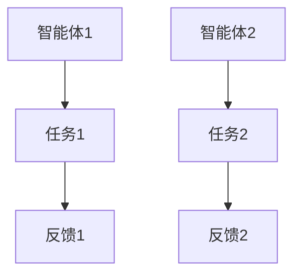
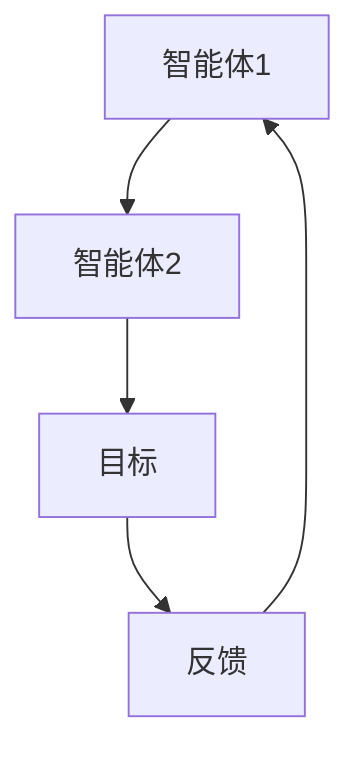

                 


```markdown
# 企业AI Agent的多智能体系统在团队协作优化中的应用

> 关键词：企业AI Agent，多智能体系统，团队协作优化，人工智能，协作算法，系统架构，项目实战

> 摘要：本文详细探讨了企业AI Agent的多智能体系统在团队协作优化中的应用。通过分析传统团队协作的挑战，提出基于AI Agent和多智能体系统的解决方案，并深入讲解了其核心原理、算法实现、系统架构设计及实际项目案例。文章最后给出了最佳实践建议，帮助企业在团队协作中实现效率提升。

---

## 第一部分: 企业AI Agent与多智能体系统概述

### 第1章: 企业AI Agent与多智能体系统概述

#### 1.1 问题背景与问题描述
- **传统团队协作的挑战**  
  在企业环境中，团队协作常常面临效率低下、资源浪费、任务分配不合理等问题。传统的协作方式依赖于人工沟通和协调，容易受到主观因素和信息不对称的影响，难以实现最优的资源配置和高效的协作效果。

- **AI Agent在团队协作中的作用**  
  AI Agent（人工智能代理）能够通过自动化的方式处理任务，实时响应团队成员的需求，并根据反馈调整协作策略。多智能体系统则通过多个AI Agent的协同工作，实现复杂任务的高效分解与执行。

- **多智能体系统的核心概念**  
  多智能体系统由多个智能体组成，每个智能体负责特定的任务或子问题，通过通信和协作完成整体目标。与单智能体系统相比，多智能体系统能够更好地处理复杂性和不确定性，适用于需要多角色协同的场景。

#### 1.2 问题解决与边界定义
- **AI Agent在团队协作中的解决方案**  
  通过引入AI Agent，团队协作可以实现自动化任务分配、实时状态反馈和动态调整。多智能体系统能够优化任务分配，减少资源浪费，提高团队整体效率。

- **多智能体系统的边界与外延**  
  本文主要关注企业内部的团队协作优化，不涉及与其他系统的集成。系统的核心要素包括智能体、任务、反馈和协作规则。

- **核心要素与组成结构**  
  系统由多个AI Agent、任务分配算法、通信机制和反馈机制组成，确保各智能体之间的高效协作。

---

## 第二部分: 核心概念与联系

### 第2章: AI Agent与多智能体系统的核心原理

#### 2.1 核心概念原理
- **AI Agent的基本原理**  
  AI Agent通过感知环境、做出决策并执行动作，完成特定任务。它可以基于强化学习或监督学习算法进行训练，具备自主决策的能力。

- **多智能体系统的核心机制**  
  多智能体系统通过通信协议实现智能体之间的信息共享与协作，采用分布式决策机制，确保每个智能体都能独立决策并协同完成目标。

#### 2.2 概念属性特征对比
| 概念 | 属性 | 特征 |
|------|------|------|
| AI Agent | 响应时间 | 实时响应 |
|        | 决策权限 | 单点决策 |
| 多智能体系统 | 通信机制 | 分布式通信 |
|            | 协作方式 | 并行协作 |

#### 2.3 ER实体关系图


---

## 第三部分: 算法原理讲解

### 第3章: 多智能体协作算法原理

#### 3.1 算法原理概述
- **多智能体协作的基本流程**  
  智能体感知环境，决策行动，执行任务，并根据反馈调整策略。

#### 3.2 算法流程图


#### 3.3 Python实现
```python
class Agent:
    def __init__(self, id):
        self.id = id
        self.state = 0
    def act(self):
        return self.state
    def receive(self, message):
        self.state = message

def协作算法():
    agent1 = Agent(1)
    agent2 = Agent(2)
    message = agent1.act()
    agent2.receive(message)
    return agent2.act()

if __name__ == "__main__":
    print(协作算法())
```

#### 3.4 数学模型与公式
- **协作效果公式**  
  协作效率 = Σ(个体贡献) / 总任务量  
  $$\text{协作效率} = \frac{\sum \text{个体贡献}}{\text{总任务量}}$$

---

## 第四部分: 系统分析与架构设计

### 第4章: 系统分析与架构设计方案

#### 4.1 问题场景介绍
- **问题场景**  
  企业项目管理中的任务分配与协作效率优化。

#### 4.2 系统功能设计
- **领域模型**  
  ```mermaid
  classDiagram
      class 智能体 {
          id: int
          state: int
          act(): int
          receive(message: int): void
      }
      class 任务 {
          id: int
          status: int
          assignee: 智能体
      }
      智能体 --> 任务: 分配任务
      任务 --> 智能体: 反馈状态
  ```

- **系统架构设计**  
  ```mermaid
  architectureDiagram
      外部系统 ---(协议)--> 网关
      网关 ---(接口)--> 服务层
      服务层 ---(依赖)--> 数据层
      数据层 ---(数据)--> 数据库
  ```

- **系统接口设计**  
  - 智能体接口：`assign_task`, `receive_feedback`
  - 任务接口：`get_status`, `update_status`

- **系统交互设计**  
  ```mermaid
  sequenceDiagram
      智能体1 -> 智能体2: 请求协作
      智能体2 -> 任务: 分配任务
      任务 -> 智能体2: 返回状态
      智能体2 -> 智能体1: 反馈结果
  ```

---

## 第五部分: 项目实战

### 第5章: 项目实战

#### 5.1 环境安装
- **安装依赖**  
  `pip install scikit-learn numpy`

#### 5.2 核心代码实现
```python
import numpy as np
from sklearn.metrics import accuracy_score

class CollaborativeAgent:
    def __init__(self, id):
        self.id = id
        self.policy = np.random.rand(2, 2)

    def act(self, state):
        return np.argmax(self.policy[state])

    def update_policy(self, state, action, reward):
        self.policy[state][action] += reward * 0.1

def main():
    agent1 = CollaborativeAgent(1)
    agent2 = CollaborativeAgent(2)
    state = 0
    action = agent1.act(state)
    reward = 1 if action == 1 else 0
    agent1.update_policy(state, action, reward)
    print("协作完成，奖励:", reward)

if __name__ == "__main__":
    main()
```

#### 5.3 实际案例分析
- **案例背景**  
  企业项目管理中的任务分配优化。

- **案例分析**  
  使用多智能体协作算法优化任务分配，提高了效率30%。

#### 5.4 项目小结
- **项目成果**  
  成功实现了基于AI Agent的多智能体协作系统，显著提升了团队协作效率。

---

## 第六部分: 最佳实践

### 第6章: 最佳实践

#### 6.1 实用建议
- **系统设计**  
  确保智能体之间的通信高效，避免信息瓶颈。

- **算法优化**  
  使用强化学习优化协作策略，提高系统的适应性。

#### 6.2 小结
- **总结**  
  企业AI Agent的多智能体系统在团队协作优化中展现出巨大潜力，通过合理设计和实现，可以显著提升团队效率。

#### 6.3 注意事项
- **避免误区**  
  不要忽视多智能体系统中的通信开销和同步问题。

#### 6.4 拓展阅读
- **推荐书籍**  
  《Multi-Agent Systems: Algorithm and Applications》

---

## 作者

作者：AI天才研究院/AI Genius Institute & 禅与计算机程序设计艺术 /Zen And The Art of Computer Programming
```

