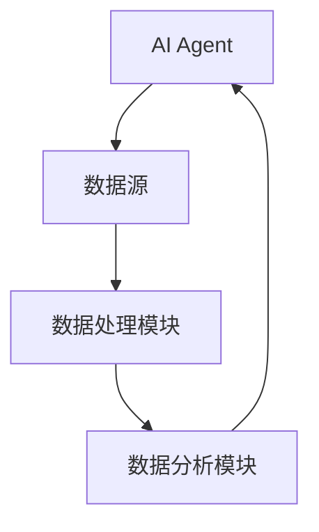
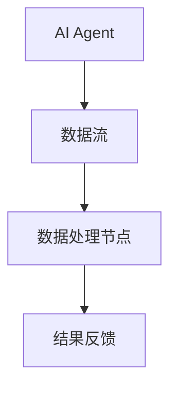
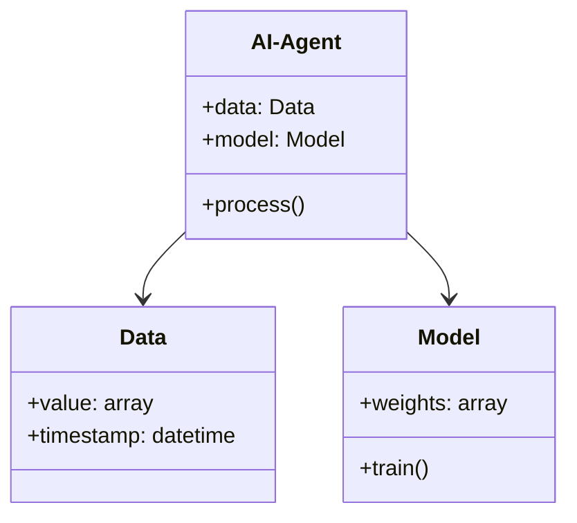
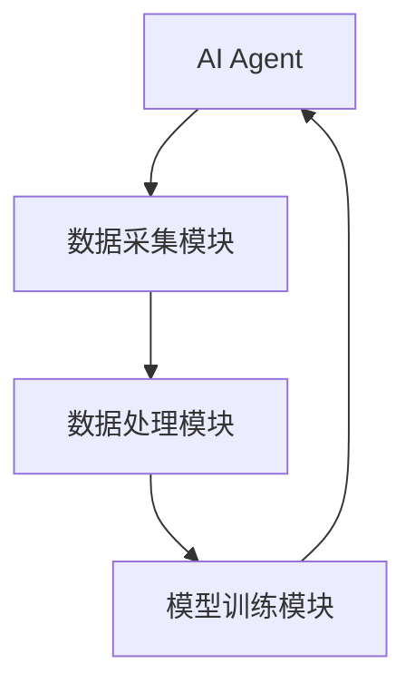
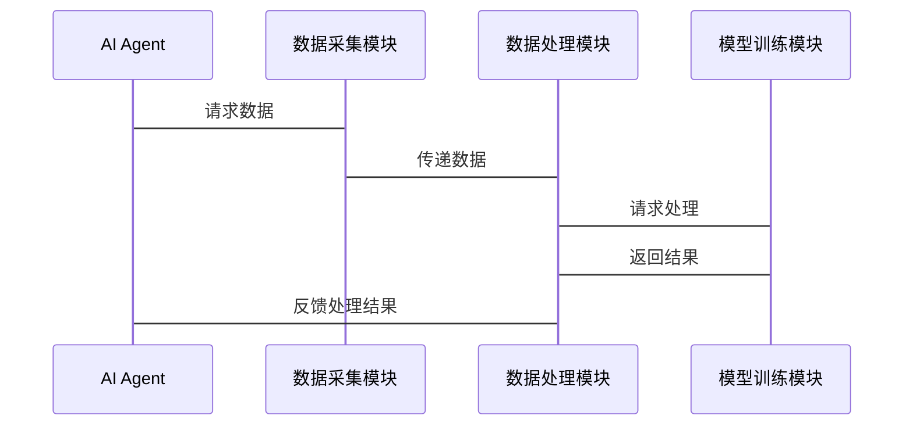

                 


# 《企业AI Agent的大数据处理框架》

---

## 关键词：
AI Agent, 大数据处理, 企业级系统, 数据流, 系统架构, 实时处理

---

## 摘要：
企业AI Agent和大数据处理是现代企业智能化转型的核心技术。本文详细探讨了企业AI Agent在大数据处理中的应用框架，涵盖技术背景、核心概念、算法原理、系统架构设计和项目实战。通过分析AI Agent的决策机制与大数据处理流程的结合，展示了如何利用AI Agent提升企业数据处理效率和决策能力。本文最后总结了最佳实践和未来发展方向，为企业构建智能化大数据处理系统提供了理论和实践指导。

---

# 第一部分: 企业AI Agent与大数据处理框架的背景介绍

## 第1章: 企业AI Agent的背景与问题背景

### 1.1 企业AI Agent的概念与背景
#### 1.1.1 什么是企业AI Agent
企业AI Agent是一种具备自主决策能力的智能系统，能够感知环境、理解任务需求并执行复杂操作。它结合了人工智能、大数据分析和自动化技术，广泛应用于企业资源管理、客户服务、生产优化等领域。

#### 1.1.2 AI Agent的基本特征
- **自主性**：AI Agent能够独立完成任务，无需人工干预。
- **反应性**：实时感知环境变化并做出响应。
- **学习能力**：通过数据学习和优化决策模型。
- **协作性**：与其他系统或人员协同工作。

#### 1.1.3 企业AI Agent的应用场景
- **智能客服**：通过自然语言处理提供个性化服务。
- **供应链管理**：优化库存和物流流程。
- **数据分析与决策支持**：实时分析数据，提供决策建议。

### 1.2 大数据处理的背景与挑战
#### 1.2.1 大数据的定义与特征
大数据指数据量大、类型多样、处理速度快，通常用“4V”（Volume、Variety、Velocity、Value）来描述。

#### 1.2.2 大数据处理的主要挑战
- **数据量大**：难以用传统方法处理。
- **数据多样性**：结构化和非结构化数据混杂。
- **处理复杂性**：需要实时处理和分析。

#### 1.2.3 企业级大数据处理的需求
- **实时性**：需要快速响应。
- **准确性**：确保数据处理的正确性。
- **可扩展性**：支持数据量的增长。

### 1.3 企业AI Agent与大数据处理的结合
#### 1.3.1 问题背景与问题描述
企业需要在实时、大规模数据流中快速提取有价值的信息，并做出决策。

#### 1.3.2 问题解决的思路与方法
利用AI Agent的自主性和学习能力，结合大数据处理技术，构建高效的数据处理框架。

#### 1.3.3 问题的边界与外延
- **边界**：聚焦于企业内部数据处理。
- **外延**：扩展到数据源的选择和数据安全。

### 1.4 核心概念与联系
#### 1.4.1 核心概念原理
AI Agent通过感知数据流，分析数据，做出决策并执行操作。

#### 1.4.2 核心概念属性特征对比表格
| 特性       | AI Agent                   | 大数据处理                 |
|------------|-----------------------------|-----------------------------|
| 自主性      | 高                          | 低                          |
| 反应性      | 高                          | 低                          |
| 学习能力    | 高                          | 无                          |
| 处理能力    | 适应性强                   | 高                          |

#### 1.4.3 ER实体关系图架构（Mermaid流程图）


---

## 第2章: 企业AI Agent大数据处理的核心概念与联系

### 2.1 核心概念原理
#### 2.1.1 AI Agent的决策机制
AI Agent通过感知环境、推理和执行来处理数据。例如，在供应链管理中，AI Agent可以实时监控库存变化并优化补货策略。

#### 2.1.2 大数据处理的流程
数据采集、清洗、分析、存储和可视化。

#### 2.1.3 两者结合的逻辑关系
AI Agent作为核心驱动力，推动大数据处理流程，确保数据处理的实时性和准确性。

### 2.2 核心概念属性特征对比表格
| 特性       | AI Agent                   | 大数据处理                 |
|------------|-----------------------------|-----------------------------|
| 数据流方向  | 双向（输入和输出）          | 单向（输入处理输出）        |
| 处理方式    | 主动驱动                    | 被动处理                    |

### 2.3 ER实体关系图架构（Mermaid流程图）


---

## 第3章: 企业AI Agent大数据处理的算法原理

### 3.1 数据预处理算法
#### 3.1.1 数据清洗
使用Python的Pandas库进行数据清洗，如处理缺失值和异常值。

```python
import pandas as pd

# 示例数据
data = {'id': [1, 2, 3, 4], 'value': [None, 5, 6, 7]}
df = pd.DataFrame(data)

# 删除缺失值
df.dropna(inplace=True)
```

#### 3.1.2 数据转换
标准化数据，如归一化处理。

```python
from sklearn.preprocessing import StandardScaler

scaler = StandardScaler()
scaled_data = scaler.fit_transform(df[['value']])
```

### 3.2 特征工程
#### 3.2.1 特征选择
使用特征重要性分析选择关键特征。

```python
from sklearn.ensemble import RandomForestRegressor
importances = model.feature_importances_
```

#### 3.2.2 特征提取
使用主成分分析（PCA）提取主成分。

```python
from sklearn.decomposition import PCA

pca = PCA(n_components=2)
principal_components = pca.fit_transform(df)
```

### 3.3 模型训练
#### 3.3.1 算法选择
选择适合任务的算法，如随机森林或梯度提升。

#### 3.3.2 模型训练
使用训练数据训练模型。

```python
from sklearn.ensemble import RandomForestClassifier

model = RandomForestClassifier(n_estimators=100)
model.fit(X_train, y_train)
```

#### 3.3.3 模型评估
计算准确率、召回率等指标。

```python
from sklearn.metrics import accuracy_score

y_pred = model.predict(X_test)
print(accuracy_score(y_test, y_pred))
```

---

## 第4章: 系统架构设计

### 4.1 问题场景介绍
构建一个实时处理企业数据流的系统，确保快速响应和高效处理。

### 4.2 项目介绍
设计一个企业级AI Agent大数据处理框架，支持实时数据分析和决策。

### 4.3 系统功能设计（领域模型Mermaid类图）


### 4.4 系统架构设计（Mermaid架构图）


### 4.5 系统接口设计
定义API接口，如数据获取接口和结果反馈接口。

### 4.6 系统交互（Mermaid序列图）


---

## 第5章: 项目实战

### 5.1 环境安装
安装必要的工具和库，如Python、Pandas、Scikit-learn、Flask。

### 5.2 系统核心实现源代码
#### 5.2.1 数据处理代码
```python
import pandas as pd
import numpy as np

# 数据加载
df = pd.read_csv('data.csv')

# 数据清洗
df.dropna(inplace=True)
```

#### 5.2.2 模型训练代码
```python
from sklearn.ensemble import RandomForestClassifier
from sklearn.metrics import accuracy_score

# 数据分割
X_train, X_test, y_train, y_test = train_test_split(df.drop('target', axis=1), df['target'])

# 模型训练
model = RandomForestClassifier(n_estimators=100)
model.fit(X_train, y_train)

# 模型评估
y_pred = model.predict(X_test)
print(accuracy_score(y_test, y_pred))
```

### 5.3 案例分析与详细讲解
分析一个实际案例，如实时监控企业销售数据，利用AI Agent预测销售趋势。

### 5.4 项目小结
总结项目实现的关键点，如数据预处理和模型选择的重要性。

---

## 第6章: 最佳实践与小结

### 6.1 最佳实践
- **工具选择**：选择适合的机器学习库和大数据处理工具。
- **数据质量**：确保数据清洗和预处理到位。
- **系统扩展性**：设计可扩展的系统架构。

### 6.2 小结
企业AI Agent与大数据处理的结合为企业提供了智能化数据处理的新思路，未来的发展方向包括边缘计算和区块链技术的结合。

---

## 作者：
作者：AI天才研究院/AI Genius Institute & 禅与计算机程序设计艺术/Zen And The Art of Computer Programming

---

