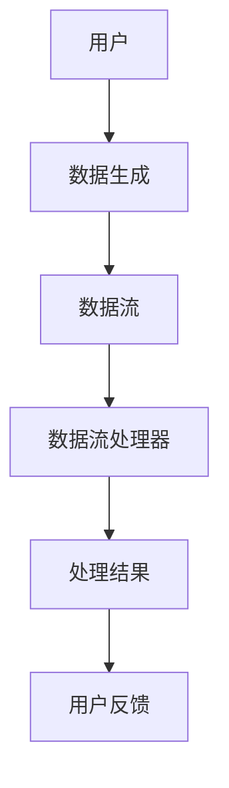
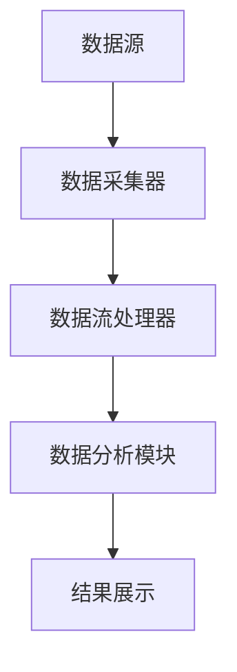
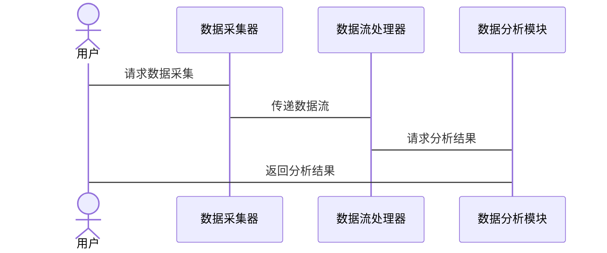

                 


# 企业AI Agent的实时数据流处理与分析架构

> 关键词：企业AI Agent，实时数据流处理，流处理算法，系统架构设计，数学模型，项目实战

> 摘要：本文详细探讨了企业AI Agent在实时数据流处理与分析中的架构设计。从AI Agent的基本概念到实时数据流处理的核心原理，从流处理算法的数学模型到系统架构的设计与实现，结合实际案例分析，为企业AI Agent的实时数据流处理提供全面的技术指导。

---

## 第1章：企业AI Agent与实时数据流处理概述

### 1.1 企业AI Agent的基本概念
- **1.1.1 什么是企业AI Agent**
  - 定义：企业AI Agent是一种能够感知环境、自主决策并执行任务的智能体。
  - 核心特征：智能性、自主性、反应性、社交能力。
  - 应用场景：企业资源管理、智能客服、自动化运维等。

- **1.1.2 AI Agent的核心特征**
  - 智能性：基于数据和模型进行推理和决策。
  - 自主性：无需人工干预，自主执行任务。
  - 反应性：实时感知环境变化并做出反应。
  - 社交能力：与人和其他系统进行有效交互。

- **1.1.3 企业AI Agent的应用场景**
  - 企业资源管理：优化资源配置，提高效率。
  - 智能客服：自动化处理客户咨询，提升服务质量。
  - 自动化运维：监控系统状态，自动修复问题。

### 1.2 实时数据流处理的背景与意义
- **1.2.1 数据流处理的基本概念**
  - 数据流：连续不断地数据序列，通常来自多个来源。
  - 实时处理：在数据生成的同时进行处理和分析。

- **1.2.2 实时数据流处理的挑战**
  - 高速处理：数据量大，处理速度要求高。
  - 数据一致性：确保数据处理的准确性。
  - 系统稳定性：处理过程中的容错能力。

- **1.2.3 企业级实时数据流处理的需求**
  - 快速响应：企业需要实时决策支持。
  - 数据准确性：确保分析结果的可靠性。
  - 系统扩展性：支持大规模数据处理。

### 1.3 本章小结
本章介绍了企业AI Agent的基本概念及其在实时数据流处理中的重要性，分析了实时数据流处理的挑战和需求，为后续章节奠定了基础。

---

## 第2章：企业AI Agent实时数据流处理的核心概念与联系

### 2.1 数据流处理的关键原理
- **2.1.1 数据流的生命周期**
  - 数据生成：来源可能是传感器、日志文件或用户输入。
  - 数据传输：通过网络或文件系统传输到处理系统。
  - 数据处理：对数据进行清洗、转换和分析。
  - 数据存储：将处理后的数据存储到数据库或数据仓库。

- **2.1.2 数据流处理的模式对比**
  - 批处理：一次性处理大量数据，适合离线分析。
  - 流处理：实时处理数据流，适合在线分析。
  - 事件处理：基于事件触发的处理方式。

- **2.1.3 数据流处理的核心要素**
  - 时间戳：记录数据生成的时间，确保处理顺序正确。
  - 窗口机制：定义数据处理的时间范围，如滑动窗口。
  - 并行处理：利用多线程或分布式计算提高处理效率。

### 2.2 数据流处理的ER实体关系图
```mermaid
er
actor: 用户
agent: AI Agent
stream: 数据流
processor: 处理器
```

- **实体关系说明**
  - 用户：数据流的来源或消费者。
  - AI Agent：处理数据流的核心智能体。
  - 数据流：需要处理的实时数据。
  - 处理器：数据流处理的具体模块。

### 2.3 数据流处理的流程图


- **流程图说明**
  - 数据从用户或系统生成，经过数据流处理器，最终生成处理结果并反馈给用户。

### 2.4 本章小结
本章详细讲解了数据流处理的关键原理，通过ER图和流程图展示了数据流处理的核心概念和联系。

---

## 第3章：企业AI Agent实时数据流处理的算法原理

### 3.1 流处理算法概述
- **3.1.1 流处理算法的基本概念**
  - 定义：实时处理数据流的算法，通常用于在线分析和决策。
  - 分类：基于窗口的流处理、基于时间戳的流处理。

- **3.1.2 流处理算法的分类**
  - 滑动窗口算法：处理固定时间窗口内的数据。
  - 基于时间戳的处理：根据数据的时间戳进行处理。

### 3.2 流处理算法的数学模型
- **滑动窗口算法**
  $$ window\_size = n $$

- **基于时间戳的处理**
  $$ timestamp = t $$

- **算法实现**
  ```python
  def stream_processor(data_stream):
      for data in data_stream:
          process(data)
  ```

### 3.3 流处理算法的Python实现
- **代码解释**
  - `data_stream`：输入的数据流。
  - `process(data)`：对每个数据项进行处理。

### 3.4 本章小结
本章详细讲解了流处理算法的原理和实现，通过Python代码展示了算法的具体应用。

---

## 第4章：企业AI Agent实时数据流处理的系统架构设计

### 4.1 系统功能设计
- **4.1.1 数据流采集模块**
  - 功能：从多种数据源采集实时数据流。
  - 实现：使用Kafka或Flume等工具进行数据采集。

- **4.1.2 数据流处理模块**
  - 功能：对数据流进行清洗、转换和分析。
  - 实现：使用Flink或Storm等流处理框架。

- **4.1.3 数据流分析模块**
  - 功能：对处理后的数据进行深度分析，生成决策结果。
  - 实现：结合机器学习模型进行预测和分析。

### 4.2 系统架构图


- **架构说明**
  - 数据源：提供实时数据流。
  - 数据采集器：负责数据的采集和预处理。
  - 数据流处理器：对数据进行实时处理。
  - 数据分析模块：对处理后的数据进行分析和决策。
  - 结果展示：将分析结果展示给用户。

### 4.3 系统接口设计
- **数据采集接口**
  - 接口名称：`采集数据`
  - 参数：数据源类型、数据格式。
  - 返回：数据流。

- **数据处理接口**
  - 接口名称：`处理数据`
  - 参数：数据流、处理规则。
  - 返回：处理结果。

### 4.4 系统交互序列图


### 4.5 本章小结
本章详细设计了系统的功能模块和架构，展示了各模块之间的交互关系。

---

## 第5章：企业AI Agent实时数据流处理的数学模型与公式推导

### 5.1 流处理算法的数学模型
- **滑动窗口算法**
  $$ window\_size = n $$

- **基于时间戳的处理**
  $$ timestamp = t $$

### 5.2 公式推导
- **滑动窗口的处理逻辑**
  - 窗口内数据的和：$$ sum = \sum_{i=t-n}^{t} data[i] $$
  - 窗口内数据的平均值：$$ average = \frac{sum}{n} $$

### 5.3 公式解释
- **滑动窗口的和**
  - 适用于需要计算特定时间窗口内数据总和的场景，如流量监控。

- **基于时间戳的处理**
  - 适用于需要根据数据生成时间进行处理的场景，如实时聊天记录分析。

### 5.4 本章小结
本章通过数学模型和公式推导，详细讲解了流处理算法的实现原理。

---

## 第6章：企业AI Agent实时数据流处理的项目实战

### 6.1 项目背景与目标
- **项目背景**
  - 某企业需要实时监控生产线上的设备状态，及时发现异常情况。

- **项目目标**
  - 实时采集设备状态数据，分析设备运行状态，预测可能出现的故障。

### 6.2 系统核心实现
- **环境安装**
  - 操作系统：Linux
  - 数据流处理框架：Apache Flink
  - 机器学习库：Scikit-learn

- **核心代码实现**
  ```python
  from pyflink.datastream import StreamExecutionEnvironment
  from pyflink.table import *
  
  env = StreamExecutionEnvironment.get_execution_environment()
  table_env = TableEnvironment.get_default_env()
  
  # 读取数据流
  input_path = "inputDataStream"
  input_table = table_env.scan(input_path)
  
  # 数据流处理
  processed_table = input_table.select("timestamp, value")
  
  # 输出结果
  processed_table.to_csv("outputDataStream")
  ```

- **代码解释**
  - 使用Flink进行数据流处理，读取输入数据流，进行处理后输出结果。

### 6.3 案例分析与结果展示
- **案例分析**
  - 数据流中的设备状态数据被实时处理，生成设备运行状态报告。

- **结果展示**
  - 图表展示设备状态的实时变化，预测可能出现的故障。

### 6.4 本章小结
本章通过实际项目案例，展示了企业AI Agent实时数据流处理的实现过程和结果。

---

## 第7章：企业AI Agent实时数据流处理的总结与展望

### 7.1 全文总结
- 本文详细探讨了企业AI Agent在实时数据流处理与分析中的架构设计，从核心概念到算法实现，再到系统架构，为企业提供了全面的技术指导。

### 7.2 技术局限性
- **数据处理延迟**：实时处理需要高速计算能力，目前在大规模数据下仍存在延迟。
- **系统扩展性**：分布式系统的扩展性和一致性仍需进一步优化。

### 7.3 未来展望
- **智能化处理**：结合更多AI技术，提高数据处理的智能性。
- **分布式计算**：优化分布式系统架构，提高处理效率。
- **边缘计算**：将数据处理能力下沉到边缘设备，减少数据传输延迟。

### 7.4 本章小结
本文总结了企业AI Agent实时数据流处理的核心内容，并展望了未来的发展方向。

---

## 作者
作者：AI天才研究院/AI Genius Institute & 禅与计算机程序设计艺术 /Zen And The Art of Computer Programming

