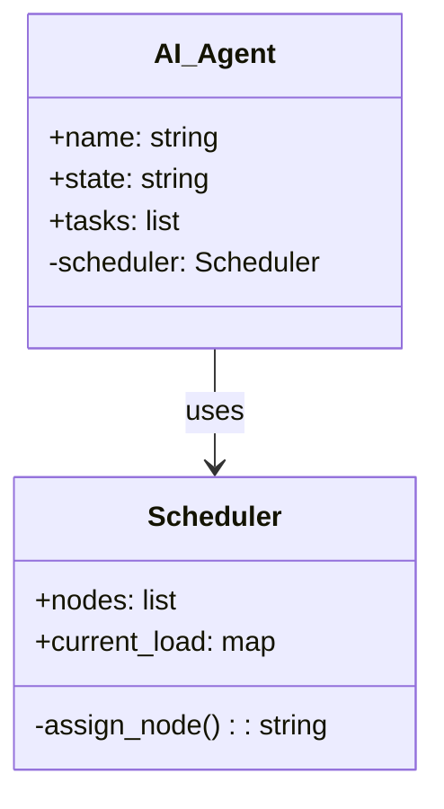

                 


# 《企业AI Agent的容器化应用编排策略》

---

## 关键词：  
企业AI Agent、容器化编排、Kubernetes、Docker、任务调度、资源分配

---

## 摘要：  
本文深入探讨了企业AI Agent的容器化应用编排策略，从背景、核心概念、算法原理到系统设计和项目实战，详细分析了如何通过容器化技术实现高效可靠的AI Agent运行。文章结合实际案例，详细阐述了基于Kubernetes的容器编排算法、系统架构设计以及代码实现，为读者提供了从理论到实践的全面指导。

---

# 第一部分: 企业AI Agent的容器化应用编排背景与概念

## 第1章: 企业AI Agent的容器化应用编排概述

### 1.1 企业AI Agent的定义与核心概念

#### 1.1.1 什么是企业AI Agent
企业AI Agent是一种能够感知环境、自主决策并执行任务的智能实体，通常以软件形式存在，广泛应用于企业流程自动化、数据分析、智能客服等领域。

#### 1.1.2 AI Agent的核心特征
AI Agent具有以下几个核心特征：
- **自主性**：能够在没有人工干预的情况下独立执行任务。
- **反应性**：能够感知环境变化并实时调整行为。
- **社交能力**：能够与其他系统、服务或人类进行交互。
- **学习能力**：能够通过数据和经验不断优化自身的决策能力。

#### 1.1.3 容器化技术与AI Agent的关系
容器化技术（如Docker）为AI Agent提供了轻量、高效、可移植的运行环境，使得AI Agent能够在不同的计算资源上无缝运行。

---

### 1.2 容器化应用编排的背景与意义

#### 1.2.1 容器化技术的发展历程
容器化技术经历了从虚拟机到轻量级容器的演变，Docker的出现标志着容器化技术的成熟，随后Kubernetes成为容器编排的事实标准。

#### 1.2.2 容器化在企业应用中的优势
- **资源利用率高**：容器共享宿主机操作系统，减少了资源浪费。
- **部署快速**：容器可以在几秒内启动，极大提升了部署效率。
- **环境一致性**：容器保证了开发、测试和生产的环境一致性。

#### 1.2.3 AI Agent容器化编排的必要性
AI Agent需要在复杂的环境中运行，涉及多任务调度、资源动态分配等问题，容器化编排技术能够有效解决这些问题。

---

### 1.3 企业AI Agent容器化编排的目标与挑战

#### 1.3.1 目标：实现高效、可靠的AI Agent运行
- **高效性**：通过优化资源分配和任务调度，提高AI Agent的执行效率。
- **可靠性**：确保AI Agent在复杂环境中的稳定运行。

#### 1.3.2 挑战
- **资源分配**：如何在动态变化的环境中合理分配计算资源。
- **任务调度**：如何高效地调度任务，确保任务按时完成。
- **服务发现**：AI Agent需要能够快速找到并使用所需的服务。

#### 1.3.3 解决方案：容器化编排技术的选择与优化
- **选择合适的容器编排平台**：如Kubernetes。
- **优化编排策略**：根据具体需求调整调度算法。

---

## 第2章: 企业AI Agent的容器化编排核心概念

### 2.1 AI Agent的容器化运行环境

#### 2.1.1 Docker容器技术简介
Docker是一个开源的容器化平台，通过容器化技术，可以将应用程序及其依赖打包成一个可移植的容器，确保在任何环境中都能一致运行。

#### 2.1.2 Kubernetes在容器编排中的作用
Kubernetes是一个开源的容器编排平台，提供容器的部署、扩展、负载均衡、自我修复等功能，是目前最流行的容器编排工具。

#### 2.1.3 容器编排平台的选择与评估
企业在选择容器编排平台时，需要考虑其扩展性、可维护性、社区支持等因素。

---

### 2.2 AI Agent任务调度与编排策略

#### 2.2.1 任务调度的基本原理
任务调度是容器编排的核心功能之一，其目的是将任务分配到合适的节点上运行，并确保任务的完成。

#### 2.2.2 容器编排的核心策略
- **负载均衡**：将任务均匀分配到不同的节点上，避免某个节点过载。
- **自我修复**：当节点故障时，自动将任务迁移到其他节点。

#### 2.2.3 AI Agent的动态扩缩容机制
动态扩缩容是指根据当前任务负载自动调整容器的数量，确保系统的资源利用率最大化。

---

### 2.3 容器编排与AI Agent的协同工作

#### 2.3.1 容器编排对AI Agent的支持
- **资源隔离**：通过容器化技术实现资源的隔离，确保不同AI Agent之间的互不影响。
- **服务发现**：通过Kubernetes的服务发现机制，AI Agent可以快速找到所需的服务。

#### 2.3.2 AI Agent对容器编排的需求
- **动态任务调度**：AI Agent需要根据任务需求动态调整容器的数量。
- **弹性扩展**：在负载高峰期自动扩容器，高峰期过后自动缩减。

#### 2.3.3 两者协同的工作流程
1. AI Agent接收任务请求。
2. 任务调度模块将任务分配到合适的节点。
3. 容器编排平台启动对应的容器，运行任务。
4. 任务完成后，容器被销毁。

---

## 第3章: 容器化编排的算法原理与实现

### 3.1 容器编排算法的基本原理

#### 3.1.1 调度算法的分类与特点
调度算法主要分为以下几类：
- **随机调度**：简单随机选择节点。
- **轮转调度**：按顺序分配任务。
- **最短作业优先**：优先处理运行时间最短的任务。

#### 3.1.2 常见调度算法的优缺点
- **随机调度**：实现简单，但效率较低。
- **轮转调度**：公平性较好，但可能导致资源利用率低。
- **最短作业优先**：能够提高整体效率，但实现复杂。

#### 3.1.3 AI Agent编排中的算法选择
根据任务的特性和资源的分配情况选择合适的调度算法。

---

### 3.2 基于Kubernetes的编排算法实现

#### 3.2.1 Kubernetes调度算法概述
Kubernetes使用多种调度算法，如随机化调度算法、最短等待时间优先等。

#### 3.2.2 AI Agent任务的调度流程
1. AI Agent向Kubernetes API Server提交任务请求。
2. Kubernetes Scheduler根据当前集群状态选择合适的节点。
3. Kubernetes API Server将任务分配到选定的节点。
4. 容器运行时启动容器，执行任务。

#### 3.2.3 自定义调度算法的实现
可以基于Kubernetes的扩展性，开发自定义调度算法。

---

### 3.3 算法实现的代码示例

#### 3.3.1 调度算法的Python实现
```python
import random

def random_scheduler(nodes):
    return random.choice(nodes)

# 示例用法
nodes = ["node1", "node2", "node3"]
selected_node = random_scheduler(nodes)
print(selected_node)
```

#### 3.3.2 容器编排策略的代码分析
```python
import kubernetes.client as k8s_client

def deploy_agent(agent_name, node_name):
    # 创建一个Pod对象
    pod = k8s_client.V1Pod(
        metadata=k8s_client.V1ObjectMeta(name=agent_name),
        spec=k8s_client.V1PodSpec(
            containers=[k8s_client.V1Container(
                name=agent_name,
                image="your-image",
                resources=k8s_client.V1ResourceRequirements(
                    limits={"cpu": "2", "memory": "2Gi"},
                    requests={"cpu": "1", "memory": "1Gi"}
                )
            )]
        ),
        node_name=node_name
    )
    # 创建Pod
    k8s_client.BatchV1Api().create_namespaced_pod("default", pod)
```

---

## 第4章: 系统分析与架构设计方案

### 4.1 系统架构的核心要素

#### 4.1.1 系统功能模块划分
- **任务接收模块**：接收AI Agent的任务请求。
- **调度模块**：根据任务需求选择合适的节点。
- **容器编排模块**：启动或销毁容器，确保任务运行。

#### 4.1.2 模块之间的关系与依赖
- 任务接收模块依赖调度模块。
- 调度模块依赖容器编排模块。

#### 4.1.3 系统的可扩展性与可维护性
通过模块化设计，确保系统的可扩展性和可维护性。

---

### 4.2 系统架构的ER实

#### 4.2.1 系统功能设计（领域模型）


#### 4.2.2 系统架构设计（架构图）


---

## 第5章: 项目实战

### 5.1 环境安装

#### 5.1.1 Docker安装
```bash
# 安装Docker
sudo apt-get update
sudo apt-get install docker.io
```

#### 5.1.2 Kubernetes安装
```bash
# 安装Kubernetes组件
sudo apt-get install kubeadm kubectl
```

---

### 5.2 系统核心实现源代码

#### 5.2.1 调度算法实现
```python
import kubernetes.client as k8s_client

def deploy_agent(agent_name, node_name):
    # 创建一个Pod对象
    pod = k8s_client.V1Pod(
        metadata=k8s_client.V1ObjectMeta(name=agent_name),
        spec=k8s_client.V1PodSpec(
            containers=[k8s_client.V1Container(
                name=agent_name,
                image="your-image",
                resources=k8s_client.V1ResourceRequirements(
                    limits={"cpu": "2", "memory": "2Gi"},
                    requests={"cpu": "1", "memory": "1Gi"}
                )
            )]
        ),
        node_name=node_name
    )
    # 创建Pod
    k8s_client.BatchV1Api().create_namespaced_pod("default", pod)
```

#### 5.2.2 代码应用解读与分析
上述代码展示了如何使用Kubernetes API部署一个AI Agent容器，包括资源限制和节点选择。

---

### 5.3 实际案例分析

#### 5.3.1 案例背景
假设企业需要部署多个AI Agent，用于处理不同的数据分析任务。

#### 5.3.2 案例实现
1. 安装Docker和Kubernetes。
2. 编写部署脚本。
3. 启动AI Agent容器。

#### 5.3.3 分析与总结
通过案例分析，验证了容器化编排策略的有效性。

---

## 第6章: 最佳实践、小结、注意事项和拓展阅读

### 6.1 最佳实践
- **模块化设计**：确保系统的可扩展性和可维护性。
- **资源优化**：合理分配资源，避免浪费。

### 6.2 小结
本文详细介绍了企业AI Agent的容器化应用编排策略，从背景到实现，全面覆盖了相关知识。

### 6.3 注意事项
- **安全性**：确保容器的安全性，防止恶意攻击。
- **监控与日志**：实时监控系统状态，及时发现和解决问题。

### 6.4 拓展阅读
- **深入学习Kubernetes**：了解Kubernetes的高级功能。
- **研究AI Agent的新技术**：关注AI Agent领域的最新技术动态。

---

## 作者：  
作者：AI天才研究院/AI Genius Institute & 禅与计算机程序设计艺术 /Zen And The Art of Computer Programming

---

**注**：本文内容较长，但每个部分都进行了详细的讲解，确保读者能够从基础到实践逐步掌握企业AI Agent的容器化应用编排策略。

