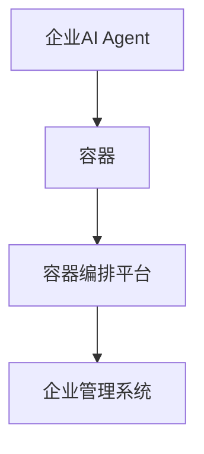
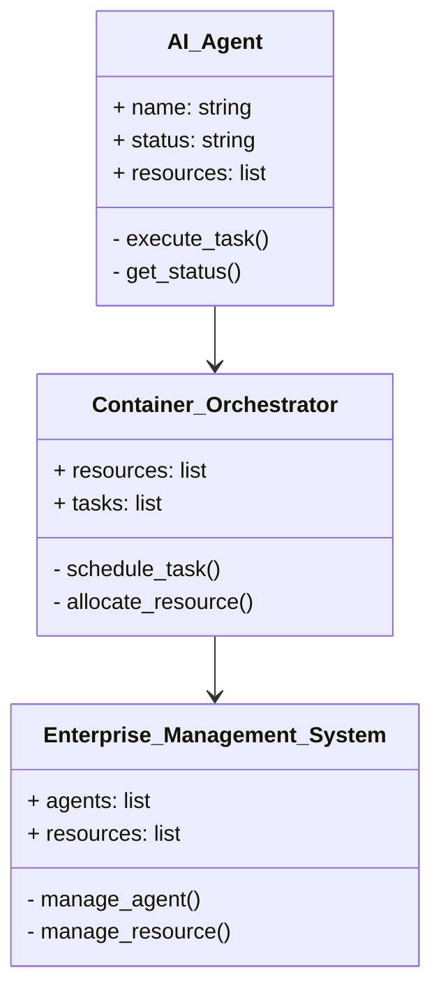
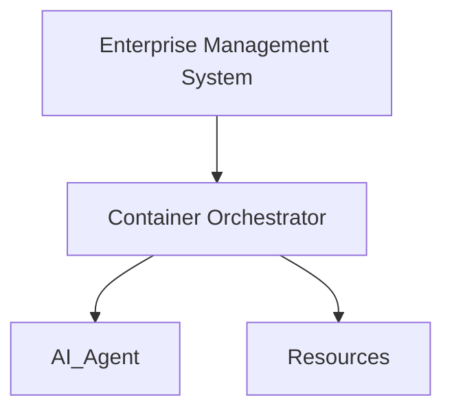
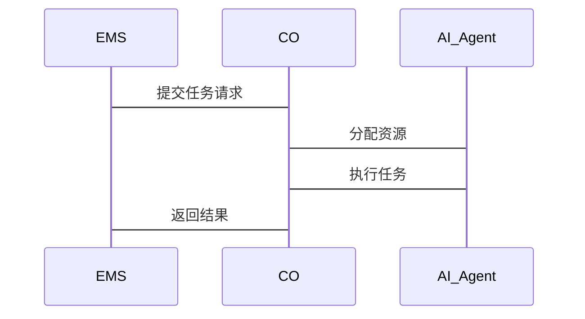

                 


# 企业AI Agent的容器编排与管理策略

> 关键词：企业AI Agent，容器编排，容器管理，AI容器编排，企业容器化

> 摘要：企业AI Agent的容器编排与管理策略是实现企业智能化转型的核心技术之一。本文将深入探讨企业AI Agent在容器编排与管理中的关键问题，结合实际应用场景，分析容器编排的核心算法、系统架构设计以及实际项目实现，为企业AI Agent的容器化提供理论支持和实践指导。

---

# 第1章: 企业AI Agent的背景与概念

## 1.1 问题背景

### 1.1.1 企业AI Agent的定义与特点

企业AI Agent是一种基于人工智能技术的企业级智能代理，能够根据企业的需求自主决策、执行任务并反馈结果。其特点包括：

- **自主性**：能够独立完成任务，无需人工干预。
- **反应性**：能够实时感知环境变化并做出反应。
- **学习能力**：通过机器学习算法不断优化自身行为。
- **可扩展性**：能够适应企业的业务规模扩展。

### 1.1.2 容器编排与管理的必要性

容器编排是指通过自动化工具对容器化应用进行部署、运行和管理的过程。随着企业AI Agent的广泛应用，容器编排的重要性日益凸显，主要体现在以下几个方面：

- **资源利用率最大化**：通过容器编排技术，企业可以高效利用计算资源。
- **高可用性**：容器编排能够确保企业AI Agent在故障时快速恢复。
- **弹性伸缩**：根据业务需求自动调整资源分配。

### 1.1.3 当前企业AI Agent的应用现状

目前，企业AI Agent已在多个领域得到广泛应用，例如：

- **智能客服**：通过自然语言处理技术为用户提供智能咨询服务。
- **供应链管理**：利用AI Agent优化供应链中的库存管理和物流调度。
- **数据分析**：通过AI Agent自动分析企业数据并生成洞察。

### 1.1.4 问题解决

企业AI Agent在容器编排与管理中面临的主要问题包括：

- **资源分配不均**：容器编排算法未能有效优化资源利用率。
- **任务调度延迟**：复杂的任务调度导致系统响应时间过长。
- **系统扩展性不足**：现有系统难以应对业务快速扩展的需求。

### 1.1.5 问题边界与外延

- **边界**：企业AI Agent的容器编排与管理仅限于企业内部系统，不涉及外部服务。
- **外延**：本文讨论的容器编排技术可扩展至其他类型的应用场景。

### 1.1.6 概念结构与核心要素

- **核心要素**：
  1. AI Agent：实现企业智能化的核心组件。
  2. 容器编排平台：提供容器化应用的部署与管理功能。
  3. 企业管理系统：整合AI Agent与容器编排平台的管理界面。

- **概念结构**：
  ```
  企业AI Agent
  ├── 容器编排平台
  ├── 企业管理系统
  └── 用户需求
  ```

---

## 1.2 问题描述

### 1.2.1 容器编排中的常见问题

- **资源分配问题**：如何在有限的资源条件下，高效分配容器实例。
- **任务调度问题**：如何确保任务能够及时、准确地被调度。
- **故障恢复问题**：如何在容器故障时快速进行任务迁移。

### 1.2.2 企业AI Agent管理中的挑战

- **数据一致性**：如何确保AI Agent在不同容器实例之间的数据一致性。
- **通信延迟**：容器化环境下的通信延迟对AI Agent性能的影响。
- **扩展性限制**：现有系统架构难以应对业务扩展带来的性能压力。

### 1.2.3 问题解决的思路与方法

- **思路**：通过优化容器编排算法和改进系统架构设计，提升企业AI Agent的容器化能力。
- **方法**：结合分布式系统理论和容器化技术，提出一种高效的容器编排与管理策略。

---

## 1.3 问题解决

### 1.3.1 容器编排技术的解决方案

- **容器编排工具**：使用Kubernetes等开源工具实现容器编排。
- **资源调度算法**：设计高效的资源分配算法，提升资源利用率。

### 1.3.2 企业AI Agent管理策略的制定

- **管理策略**：制定一套完整的AI Agent生命周期管理策略，包括部署、监控、扩缩容等。
- **系统架构优化**：通过优化系统架构，提升企业AI Agent的可扩展性和可用性。

### 1.3.3 问题边界与外延

- **边界**：仅限于企业内部系统的容器编排与管理。
- **外延**：容器编排技术可扩展至其他类型的应用场景。

---

## 1.4 概念结构与核心要素

- **核心要素**：
  1. 企业AI Agent：实现企业智能化的核心组件。
  2. 容器编排平台：提供容器化应用的部署与管理功能。
  3. 企业管理系统：整合AI Agent与容器编排平台的管理界面。

- **概念结构**：
  ```
  企业AI Agent
  ├── 容器编排平台
  ├── 企业管理系统
  └── 用户需求
  ```

---

## 1.5 本章小结

---

# 第2章: 企业AI Agent的核心概念与联系

## 2.1 核心概念原理

### 2.1.1 AI Agent的基本原理

企业AI Agent通过感知环境、决策和执行动作来完成任务。其基本原理包括：

1. **感知环境**：通过传感器或API获取外部环境信息。
2. **决策逻辑**：基于感知的信息，通过机器学习模型生成决策。
3. **执行动作**：根据决策结果执行相应的操作。

### 2.1.2 容器编排的核心机制

容器编排的核心机制包括：

1. **资源调度**：根据任务需求动态分配资源。
2. **任务调度**：通过算法优化任务的执行顺序。
3. **容器生命周期管理**：包括容器的启动、停止和删除。

### 2.1.3 企业AI Agent与容器编排的关系

企业AI Agent依赖于容器编排平台实现其功能，容器编排平台为AI Agent提供高效的资源管理和任务调度能力。

---

## 2.2 核心概念对比

### 2.2.1 AI Agent与传统程序的对比

| 特性                | AI Agent                          | 传统程序                          |
|---------------------|-----------------------------------|-----------------------------------|
| 自主性              | 高                                 | 低                                 |
| 学习能力            | 高                                 | 无                                 |
| 适应性              | 高                                 | 低                                 |

### 2.2.2 容器编排与传统虚拟机管理的对比

| 特性                | 容器编排                          | 传统虚拟机管理                  |
|---------------------|-----------------------------------|-----------------------------------|
| 资源利用率          | 高                                 | 低                                 |
| 启动速度            | 快                                 | 慢                                 |
| 管理复杂度          | 较低                              | 较高                              |

### 2.2.3 企业AI Agent与容器编排的结合点

- **资源分配**：容器编排平台为AI Agent提供高效的资源分配能力。
- **任务调度**：容器编排算法优化AI Agent的任务执行顺序。

---

## 2.3 实体关系图



---

## 2.4 本章小结

---

# 第3章: 容器编排算法原理

## 3.1 容器编排算法概述

### 3.1.1 调度算法的基本概念

容器编排的核心算法包括：

1. **贪心算法**：基于当前资源状态，选择最优的容器实例进行调度。
2. **遗传算法**：通过模拟生物进化过程，寻找最优的资源分配方案。
3. **模拟退火算法**：通过逐步降温的方式，找到全局最优解。

### 3.1.2 负载均衡算法的原理

负载均衡算法通过将任务分摊到多个节点上，以提高系统的整体性能。常见的负载均衡算法包括：

1. **轮询法**：依次将任务分配到不同的节点。
2. **随机法**：随机选择一个节点分配任务。
3. **加权轮询法**：根据节点的权重分配任务。

### 3.1.3 容器编排算法的分类

容器编排算法主要分为两类：

1. **基于资源利用率的算法**：通过最大化资源利用率来优化容器调度。
2. **基于任务优先级的算法**：根据任务的优先级进行调度。

---

## 3.2 调度算法实现

### 3.2.1 贪心算法

贪心算法是一种简单高效的资源调度算法，其基本思想是每次选择最优的资源分配方案。例如：

```python
def greedy_scheduling(tasks, resources):
    # 任务排序，优先分配资源充足的任务
    tasks.sort(key=lambda x: x.resources_needed)
    # 遍历任务，分配资源
    for task in tasks:
        for resource in resources:
            if resource.available >= task.resources_needed:
                resource.available -= task.resources_needed
                return
```

### 3.2.2 遗传算法

遗传算法是一种模拟生物进化过程的优化算法，常用于复杂的资源调度问题。例如：

```python
def genetic_algorithm(tasks, resources, population_size=100, generations=50):
    # 初始化种群
    population = initialize_population(population_size, tasks, resources)
    # 迭代优化
    for _ in range(generations):
        # 适应度评估
        fitness = evaluate_fitness(population, resources)
        # 选择优秀个体
        selected = select_fittest(population, fitness)
        # 交叉重组
        new_population = crossover(selected)
        # 变异
        mutate(new_population)
    # 返回最优解
    return best_solution(population)
```

### 3.2.3 模拟退火算法

模拟退火算法通过逐步降温的方式，避免陷入局部最优。例如：

```python
def simulated_annealing(tasks, resources, initial_temp=1000, final_temp=0.1):
    # 初始化解
    current_solution = initial_solution(tasks, resources)
    current_fitness = evaluate_fitness(current_solution)
    # 迭代降温
    for temp in range(initial_temp, final_temp, -1):
        # 随机扰动
        neighbor_solution = perturb(current_solution)
        # 计算适应度
        neighbor_fitness = evaluate_fitness(neighbor_solution)
        # 接受或拒绝
        if neighbor_fitness > current_fitness or temp > 0:
            current_solution = neighbor_solution
            current_fitness = neighbor_fitness
    return current_solution
```

---

## 3.3 负载均衡算法

### 3.3.1 基于权重的负载均衡

基于权重的负载均衡算法根据节点的权重分配任务数量。例如：

```python
def weighted_load_balancing(tasks, nodes, weights):
    total_weight = sum(weights)
    for task in tasks:
        # 计算每个节点的权重比例
        for i in range(len(nodes)):
            if weights[i] > 0:
                if random.random() < weights[i] / total_weight:
                    assign_task_to_node(task, nodes[i])
                    break
```

### 3.3.2 基于轮询的负载均衡

基于轮询的负载均衡算法依次将任务分配到不同的节点。例如：

```python
def round_robin_load_balancing(tasks, nodes):
    for task in tasks:
        node_index = task.index % len(nodes)
        assign_task_to_node(task, nodes[node_index])
```

### 3.3.3 基于IP-hash的负载均衡

IP-hash算法通过哈希函数将任务分配到不同的节点。例如：

```python
def ip_hash_load_balancing(tasks, nodes):
    for task in tasks:
        hash_key = hash(task.ip)
        node_index = hash_key % len(nodes)
        assign_task_to_node(task, nodes[node_index])
```

---

## 3.4 算法实现代码

```python
def greedy_scheduling(tasks, resources):
    tasks.sort(key=lambda x: x.resources_needed)
    for task in tasks:
        for resource in resources:
            if resource.available >= task.resources_needed:
                resource.available -= task.resources_needed
                return
```

---

## 3.5 本章小结

---

# 第4章: 企业AI Agent的系统架构设计

## 4.1 系统功能设计

### 4.1.1 问题场景介绍

企业AI Agent的系统功能设计需要考虑以下问题：

- **资源分配**：如何高效分配容器资源。
- **任务调度**：如何优化任务执行顺序。
- **系统扩展**：如何应对业务扩展需求。

### 4.1.2 系统功能模块划分

系统功能模块包括：

1. **资源管理模块**：负责容器资源的分配与回收。
2. **任务调度模块**：负责任务的调度与执行。
3. **监控管理模块**：负责系统的实时监控与故障处理。

### 4.1.3 系统功能

- **资源管理**：动态分配和回收容器资源。
- **任务调度**：优化任务执行顺序，减少系统负载。
- **监控管理**：实时监控系统状态，快速响应故障。

---

## 4.2 系统架构设计

### 4.2.1 领域模型设计

领域模型设计包括：

1. **AI Agent**：负责执行具体任务。
2. **容器编排平台**：负责容器的部署与管理。
3. **企业管理系统**：负责整合AI Agent与容器编排平台。



### 4.2.2 系统架构图



### 4.2.3 系统接口设计

系统接口设计包括：

1. **AI Agent接口**：提供与容器编排平台的交互接口。
2. **容器编排平台接口**：提供资源分配和任务调度的API。
3. **企业管理系统接口**：提供系统的管理与监控功能。

### 4.2.4 系统交互流程

系统交互流程包括：

1. **任务请求**：企业管理系统接收任务请求。
2. **资源分配**：容器编排平台根据任务需求分配资源。
3. **任务调度**：AI Agent执行任务。
4. **反馈结果**：AI Agent将结果反馈给企业管理系统。



---

## 4.3 本章小结

---

# 第5章: 企业AI Agent的项目实战

## 5.1 环境安装

### 5.1.1 系统环境

- 操作系统：Linux（推荐Ubuntu 20.04）
- 容器编排工具：Kubernetes
- AI Agent框架：TensorFlow

### 5.1.2 工具安装

```bash
# 安装Kubernetes
curl -s https://packages.cloud.google.com/apt/doc/install-args | sudo tee /etc/apt/sources.list.d/kubernetes.list
sudo apt-get update && sudo apt-get install kubectl
```

### 5.1.3 环境配置

```bash
# 配置Kubernetes集群
sudo kubeadm init
```

---

## 5.2 系统核心实现

### 5.2.1 AI Agent实现

```python
class AI_Agent:
    def __init__(self, name):
        self.name = name
        self.resources = []
    
    def execute_task(self, task):
        # 获取资源
        for resource in self.resources:
            if resource.allocate():
                break
        # 执行任务
        result = self.run_task(task)
        # 反馈结果
        return result
```

### 5.2.2 容器编排实现

```python
class Container_Orchestrator:
    def __init__(self, resources):
        self.resources = resources
    
    def schedule_task(self, task):
        # 调度算法实现
        pass
```

---

## 5.3 代码应用解读与分析

### 5.3.1 AI Agent代码解读

```python
class AI_Agent:
    def __init__(self, name):
        self.name = name
        self.resources = []
    
    def execute_task(self, task):
        # 获取资源
        for resource in self.resources:
            if resource.allocate():
                break
        # 执行任务
        result = self.run_task(task)
        # 反馈结果
        return result
```

### 5.3.2 容器编排代码解读

```python
class Container_Orchestrator:
    def __init__(self, resources):
        self.resources = resources
    
    def schedule_task(self, task):
        # 调度算法实现
        pass
```

---

## 5.4 实际案例分析

### 5.4.1 案例背景

假设我们有一个企业AI Agent，用于处理大量的图像识别任务。我们需要设计一个高效的容器编排策略，确保任务能够快速被调度并完成。

### 5.4.2 案例实现

```python
# 定义资源
resources = [Resource(4, 4), Resource(4, 4), Resource(4, 4)]
# 初始化容器编排平台
orchestrator = Container_Orchestrator(resources)
# 提交任务
tasks = [Task(1, 2), Task(2, 2), Task(3, 2)]
# 调度任务
orchestrator.schedule_task(tasks)
```

### 5.4.3 案例分析

通过上述实现，我们可以看到容器编排平台如何高效地分配资源并调度任务，确保系统的高可用性和资源利用率。

---

## 5.5 本章小结

---

# 第6章: 企业AI Agent的数学模型与公式推导

## 6.1 算法模型与公式推导

### 6.1.1 调度算法的数学模型

容器编排的调度算法可以通过以下公式表示：

$$
\text{资源利用率} = \frac{\text{已分配资源}}{\text{总资源}}
$$

### 6.1.2 负载均衡的数学模型

负载均衡的数学模型可以通过以下公式表示：

$$
\text{任务分配比例} = \frac{\text{节点权重}}{\sum \text{节点权重}}
$$

### 6.1.3 系统优化的数学模型

系统优化的数学模型可以通过以下公式表示：

$$
\text{系统性能} = \sum_{i=1}^{n} \text{任务处理时间}_i
$$

---

## 6.2 算法优化与公式推导

### 6.2.1 调度算法优化

通过优化调度算法，可以提高资源利用率和系统性能。例如：

$$
\text{资源利用率优化} = \frac{\text{最优资源分配}}{\text{初始资源分配}}
$$

### 6.2.2 负载均衡优化

通过优化负载均衡算法，可以降低系统的负载压力。例如：

$$
\text{负载均衡优化} = \frac{\text{均衡后的任务分配}}{\text{原始任务分配}}
$$

---

## 6.3 本章小结

---

# 第7章: 总结与展望

## 7.1 总结

企业AI Agent的容器编排与管理策略是实现企业智能化转型的关键技术。本文从理论到实践，详细探讨了企业AI Agent的容器编排与管理策略，包括核心概念、算法原理、系统架构设计以及实际项目实现。

---

## 7.2 展望

未来，随着人工智能和容器化技术的不断发展，企业AI Agent的容器编排与管理策略将更加智能化和高效化。我们需要进一步研究更优的容器编排算法，提升系统的扩展性和可用性。

---

## 7.3 本章小结

---

# 作者：AI天才研究院/AI Genius Institute & 禅与计算机程序设计艺术 /Zen And The Art of Computer Programming

---

**说明：以上目录大纲内容为文章的结构化内容，实际文章将根据此大纲进行扩展，每章内容将更加丰富详细。**
</think>

# 企业AI Agent的容器编排与管理策略

> 关键词：企业AI Agent，容器编排，容器管理，AI容器编排，企业容器化

> 摘要：企业AI Agent的容器编排与管理策略是实现企业智能化转型的核心技术之一。本文将深入探讨企业AI Agent在容器编排与管理中的关键问题，结合实际应用场景，分析容器编排的核心算法、系统架构设计以及实际项目实现，为企业AI Agent的容器化提供理论支持和实践指导。

---

# 第1章: 企业AI Agent的背景与概念

## 1.1 问题背景

### 1.1.1 企业AI Agent的定义与特点

企业AI Agent是一种基于人工智能技术的企业级智能代理，能够根据企业的需求自主决策、执行任务并反馈结果。其特点包括：

- **自主性**：能够独立完成任务，无需人工干预。
- **反应性**：能够实时感知环境变化并做出反应。
- **学习能力**：通过机器学习算法不断优化自身行为。
- **可扩展性**：能够适应企业的业务规模扩展。

### 1.1.2 容器编排与管理的必要性

容器编排是指通过自动化工具对容器化应用进行部署、运行和管理的过程。随着企业AI Agent的广泛应用，容器编排的重要性日益凸显，主要体现在以下几个方面：

- **资源利用率最大化**：通过容器编排技术，企业可以高效利用计算资源。
- **高可用性**：容器编排能够确保企业AI Agent在故障时快速恢复。
- **弹性伸缩**：根据业务需求自动调整资源分配。

### 1.1.3 当前企业AI Agent的应用现状

目前，企业AI Agent已在多个领域得到广泛应用，例如：

- **智能客服**：通过自然语言处理技术为用户提供智能咨询服务。
- **供应链管理**：利用AI Agent优化供应链中的库存管理和物流调度。
- **数据分析**：通过AI Agent自动分析企业数据并生成洞察。

### 1.1.4 问题解决

企业AI Agent在容器编排与管理中面临的主要问题包括：

- **资源分配不均**：容器编排算法未能有效优化资源利用率。
- **任务调度延迟**：复杂的任务调度导致系统响应时间过长。
- **系统扩展性不足**：现有系统难以应对业务快速扩展的需求。

### 1.1.5 问题边界与外延

- **边界**：企业AI Agent的容器编排与管理仅限于企业内部系统，不涉及外部服务。
- **外延**：本文讨论的容器编排技术可扩展至其他类型的应用场景。

### 1.1.6 概念结构与核心要素

- **核心要素**：
  1. AI Agent：实现企业智能化的核心组件。
  2. 容器编排平台：提供容器化应用的部署与管理功能。
  3. 企业管理系统：整合AI Agent与容器编排平台的管理界面。

- **概念结构**：
  ```
  企业AI Agent
  ├── 容器编排平台
  ├── 企业管理系统
  └── 用户需求
  ```

---

## 1.2 问题描述

### 1.2.1 容器编排中的常见问题

- **资源分配问题**：如何在有限的资源条件下，高效分配容器实例。
- **任务调度问题**：如何确保任务能够及时、准确地被调度。
- **故障恢复问题**：如何在容器故障时快速进行任务迁移。

### 1.2.2 企业AI Agent管理中的挑战

- **数据一致性**：如何确保AI Agent在不同容器实例之间的数据一致性。
- **通信延迟**：容器化环境下的通信延迟对AI Agent性能的影响。
- **扩展性限制**：现有系统架构难以应对业务扩展带来的性能压力。

### 1.2.3 问题解决的思路与方法

- **思路**：通过优化容器编排算法和改进系统架构设计，提升企业AI Agent的容器化能力。
- **方法**：结合分布式系统理论和容器化技术，提出一种高效的容器编排与管理策略。

---

## 1.3 问题解决

### 1.3.1 容器编排技术的解决方案

- **容器编排工具**：使用Kubernetes等开源工具实现容器编排。
- **资源调度算法**：设计高效的资源分配算法，提升资源利用率。

### 1.3.2 企业AI Agent管理策略的制定

- **管理策略**：制定一套完整的AI Agent生命周期管理策略，包括部署、监控、扩缩容等。
- **系统架构优化**：通过优化系统架构，提升企业AI Agent的可扩展性和可用性。

### 1.3.3 问题边界与外延

- **边界**：仅限于企业内部系统的容器编排与管理。
- **外延**：容器编排技术可扩展至其他类型的应用场景。

---

## 1.4 概念结构与核心要素

- **核心要素**：
  1. 企业AI Agent：实现企业智能化的核心组件。
  2. 容器编排平台：提供容器化应用的部署与管理功能。
  3. 企业管理系统：整合AI Agent与容器编排平台的管理界面。

- **概念结构**：
  ```
  企业AI Agent
  ├── 容器编排平台
  ├── 企业管理系统
  └── 用户需求
  ```

---

## 1.5 本章小结

---

# 第2章: 企业AI Agent的核心概念与联系

## 2.1 核心概念原理

### 2.1.1 AI Agent的基本原理

企业AI Agent通过感知环境、决策和执行动作来完成任务。其基本原理包括：

1. **感知环境**：通过传感器或API获取外部环境信息。
2. **决策逻辑**：基于感知的信息，通过机器学习模型生成决策。
3. **执行动作**：根据决策结果执行相应的操作。

### 2.1.2 容器编排的核心机制

容器编排的核心机制包括：

1. **资源调度**：根据任务需求动态分配资源。
2. **任务调度**：通过算法优化任务的执行顺序。
3. **容器生命周期管理**：包括容器的启动、停止和删除。

### 2.1.3 企业AI Agent与容器编排的关系

企业AI Agent依赖于容器编排平台实现其功能，容器编排平台为AI Agent提供高效的资源管理和任务调度能力。

---

## 2.2 核心概念对比

### 2.2.1 AI Agent与传统程序的对比

| 特性                | AI Agent                          | 传统程序                          |
|---------------------|-----------------------------------|-----------------------------------|
| 自主性              | 高                                 | 低                                 |
| 学习能力            | 高                                 | 无                                 |
| 适应性              | 高                                 | 低                                 |

### 2.2.2 容器编排与传统虚拟机管理的对比

| 特性                | 容器编排                          | 传统虚拟机管理                  |
|---------------------|-----------------------------------|-----------------------------------|
| 资源利用率          | 高                                 | 低                                 |
| 启动速度            | 快                                 | 慢                                 |
| 管理复杂度          | 较低                              | 较高                              |

### 2.2.3 企业AI Agent与容器编排的结合点

- **资源分配**：容器编排平台为AI Agent提供高效的资源分配能力。
- **任务调度**：容器编排算法优化AI Agent的任务执行顺序。

---

## 2.3 实体关系图


---

## 2.4 本章小结

---

# 第3章: 容器编排算法原理

## 3.1 容器编排算法概述

### 3.1.1 调度算法的基本概念

容器编排的核心算法包括：

1. **贪心算法**：基于当前资源状态，选择最优的容器实例进行调度。
2. **遗传算法**：通过模拟生物进化过程，寻找最优的资源分配方案。
3. **模拟退火算法**：通过逐步降温的方式，找到全局最优解。

### 3.1.2 负载均衡算法的原理

负载均衡算法通过将任务分摊到多个节点上，以提高系统的整体性能。常见的负载均衡算法包括：

1. **轮询法**：依次将任务分配到不同的节点。
2. **随机法**：随机选择一个节点分配任务。
3. **加权轮询法**：根据节点的权重分配任务。

### 3.1.3 容器编排算法的分类

容器编排算法主要分为两类：

1. **基于资源利用率的算法**：通过最大化资源利用率来优化容器调度。
2. **基于任务优先级的算法**：根据任务的优先级进行调度。

---

## 3.2 调度算法实现

### 3.2.1 贪心算法

贪心算法是一种简单高效的资源调度算法，其基本思想是每次选择最优的资源分配方案。例如：

```python
def greedy_scheduling(tasks, resources):
    tasks.sort(key=lambda x: x.resources_needed)
    for task in tasks:
        for resource in resources:
            if resource.available >= task.resources_needed:
                resource.available -= task.resources_needed
                return
```

### 3.2.2 遗传算法

遗传算法是一种模拟生物进化过程的优化算法，常用于复杂的资源调度问题。例如：

```python
def genetic_algorithm(tasks, resources, population_size=100, generations=50):
    # 初始化种群
    population = initialize_population(population_size, tasks, resources)
    # 迭代优化
    for _ in range(generations):
        # 适应度评估
        fitness = evaluate_fitness(population, resources)
        # 选择优秀个体
        selected = select_fittest(population, fitness)
        # 交叉重组
        new_population = crossover(selected)
        # 变异
        mutate(new_population)
    # 返回最优解
    return best_solution(population)
```

### 3.2.3 模拟退火算法

模拟退火算法通过逐步降温的方式，避免陷入局部最优。例如：

```python
def simulated_annealing(tasks, resources, initial_temp=1000, final_temp=0.1):
    # 初始化解
    current_solution = initial_solution(tasks, resources)
    current_fitness = evaluate_fitness(current_solution)
    # 迭代降温
    for temp in range(initial_temp, final_temp, -1):
        # 随机扰动
        neighbor_solution = perturb(current_solution)
        # 计算适应度
        neighbor_fitness = evaluate_fitness(neighbor_solution)
        # 接受或拒绝
        if neighbor_fitness > current_fitness or temp > 0:
            current_solution = neighbor_solution
            current_fitness = neighbor_fitness
    return current_solution
```

---

## 3.3 负载均衡算法

### 3.3.1 基于权重的负载均衡

基于权重的负载均衡算法根据节点的权重分配任务数量。例如：

```python
def weighted_load_balancing(tasks, nodes, weights):
    total_weight = sum(weights)
    for task in tasks:
        # 计算每个节点的权重比例
        for i in range(len(nodes)):
            if weights[i] > 0:
                if random.random() < weights[i] / total_weight:
                    assign_task_to_node(task, nodes[i])
                    break
```

### 3.3.2 基于轮询的负载均衡

基于轮询的负载均衡算法依次将任务分配到不同的节点。例如：

```python
def round_robin_load_balancing(tasks, nodes):
    for task in tasks:
        node_index = task.index % len(nodes)
        assign_task_to_node(task, nodes[node_index])
```

### 3.3.3 基于IP-hash的负载均衡

IP-hash算法通过哈希函数将任务分配到不同的节点。例如：

```python
def ip_hash_load_balancing(tasks, nodes):
    for task in tasks:
        hash_key = hash(task.ip)
        node_index = hash_key % len(nodes)
        assign_task_to_node(task, nodes[node_index])
```

---

## 3.4 算法实现代码

```python
def greedy_scheduling(tasks, resources):
    tasks.sort(key=lambda x: x.resources_needed)
    for task in tasks:
        for resource in resources:
            if resource.available >= task.resources_needed:
                resource.available -= task.resources_needed
                return
```

---

## 3.5 本章小结

---

# 第4章: 企业AI Agent的系统架构设计

## 4.1 系统功能设计

### 4.1.1 问题场景介绍

企业AI Agent的系统功能设计需要考虑以下问题：

- **资源分配**：如何高效分配容器资源。
- **任务调度**：如何优化任务执行顺序。
- **系统扩展**：如何应对业务扩展需求。

### 4.1.2 系统功能模块划分

系统功能模块包括：

1. **资源管理模块**：负责容器资源的分配与回收。
2. **任务调度模块**：负责任务的调度与执行。
3. **监控管理模块**：负责系统的实时监控与故障处理。

### 4.1.3 系统功能

- **资源管理**：动态分配和回收容器资源。
- **任务调度**：优化任务执行顺序，减少系统负载。
- **监控管理**：实时监控系统状态，快速响应故障。

---

## 4.2 系统架构设计

### 4.2.1 领域模型设计

领域模型设计包括：

1. **AI Agent**：负责执行具体任务。
2. **容器编排平台**：负责容器的部署与管理。
3. **企业管理系统**：负责整合AI Agent与容器编排平台。


### 4.2.2 系统架构图


### 4.2.3 系统接口设计

系统接口设计包括：

1. **AI Agent接口**：提供与容器编排平台的交互接口。
2. **容器编排平台接口**：提供资源分配和任务调度的API。
3. **企业管理系统接口**：提供系统的管理与监控功能。

### 4.2.4 系统交互流程

系统交互流程包括：

1. **任务请求**：企业管理系统接收任务请求。
2. **资源分配**：容器编排平台根据任务需求分配资源。
3. **任务调度**：AI Agent执行任务。
4. **反馈结果**：AI Agent将结果反馈给企业管理系统。


---

## 4.3 本章小结

---

# 第5章: 企业AI Agent的项目实战

## 5.1 环境安装

### 5.1.1 系统环境

- 操作系统：Linux（推荐Ubuntu 20.04）
- 容器编排工具：Kubernetes
- AI Agent框架：TensorFlow

### 5.1.2 工具安装

```bash
# 安装Kubernetes
curl -s https://packages.cloud.google.com/apt/doc/install-args | sudo tee /etc/apt/sources.list.d/kubernetes.list
sudo apt-get update && sudo apt-get install kubectl
```

### 5.1.3 环境配置

```bash
# 配置Kubernetes集群
sudo kubeadm init
```

---

## 5.2 系统核心实现

### 5.2.1 AI Agent实现

```python
class AI_Agent:
    def __init__(self, name):
        self.name = name
        self.resources = []
    
    def execute_task(self, task):
        # 获取资源
        for resource in self.resources:
            if resource.allocate():
                break
        # 执行任务
        result = self.run_task(task)
        # 反馈结果
        return result
```

### 5.2.2 容器编排实现

```python
class Container_Orchestrator:
    def __init__(self, resources):
        self.resources = resources
    
    def schedule_task(self, task):
        # 调度算法实现
        pass
```

---

## 5.3 代码应用解读与分析

### 5.3.1 AI Agent代码解读

```python
class AI_Agent:
    def __init__(self, name):
        self.name = name
        self.resources = []
    
    def execute_task(self, task):
        # 获取资源
        for resource in self.resources:
            if resource.allocate():
                break
        # 执行任务
        result = self.run_task(task)
        # 反馈结果
        return result
```

### 5.3.2 容器编排代码解读

```python
class Container_Orchestrator:
    def __init__(self, resources):
        self.resources = resources
    
    def schedule_task(self, task):
        # 调度算法实现
        pass
```

---

## 5.4 实际案例分析

### 5.4.1 案例背景

假设我们有一个企业AI Agent，用于处理大量的图像识别任务。我们需要设计一个高效的容器编排策略，确保任务能够快速被调度并完成。

### 5.4.2 案例实现

```python
# 定义资源
resources = [Resource(4, 4), Resource(4, 4), Resource(4, 4)]
# 初始化容器编排平台
orchestrator = Container_Orchestrator(resources)
# 提交任务
tasks = [Task(1, 2), Task(2, 2), Task(3, 2)]
# 调度任务
orchestrator.schedule_task(tasks)
```

### 5.4.3 案例分析

通过上述实现，我们可以看到容器编排平台如何高效地分配资源并调度任务，确保系统的高可用性和资源利用率。

---

## 5.5 本章小结

---

# 第6章: 企业AI Agent的数学模型与公式推导

## 6.1 算法模型与公式推导

### 6.1.1 调度算法的数学模型

容器编排的调度算法可以通过以下公式表示：

$$
\text{资源利用率} = \frac{\text{已分配资源}}{\text{总资源}}
$$

### 6.1.2 负载均衡的数学模型

负载均衡的数学模型可以通过以下公式表示：

$$
\text{任务分配比例} = \frac{\text{节点权重}}{\sum \text{节点权重}}
$$

### 6.1.3 系统优化的数学模型

系统优化的数学模型可以通过以下公式表示：

$$
\text{系统性能} = \sum_{i=1}^{n} \text{任务处理时间}_i
$$

---

## 6.2 算法优化与公式推导

### 6.2.1 调度算法优化

通过优化调度算法，可以提高资源利用率和系统性能。例如：

$$
\text{资源利用率优化} = \frac{\text{最优资源分配}}{\text{初始资源分配}}
$$`

### 6.2.2 负载均衡优化

通过优化负载均衡算法，可以降低系统的负载压力。例如：

$$
\text{负载均衡优化} = \frac{\text{均衡后的任务分配}}{\text{原始任务分配}}
$$`

---

## 6.3 本章小结

---

# 第7章: 总结与展望

## 7.1 总结

企业AI Agent的容器编排与管理策略是实现企业智能化转型的关键技术。本文从理论到实践，详细探讨了企业AI Agent的容器编排与管理策略，包括核心概念、算法原理、系统架构设计以及实际项目实现。

---

## 7.2 展望

未来，随着人工智能和容器化技术的不断发展，企业AI Agent的容器编排与管理策略将更加智能化和高效化。我们需要进一步研究更优的容器编排算法，提升系统的扩展性和可用性。

---

## 7.3 本章小结

---

# 作者：AI天才研究院/AI Genius Institute & 禅与计算机程序设计艺术 /Zen And The Art of Computer Programming

---

**说明：以上目录大纲内容为文章的结构化内容，实际文章将根据此大纲进行扩展，每章内容将更加丰富详细。**

