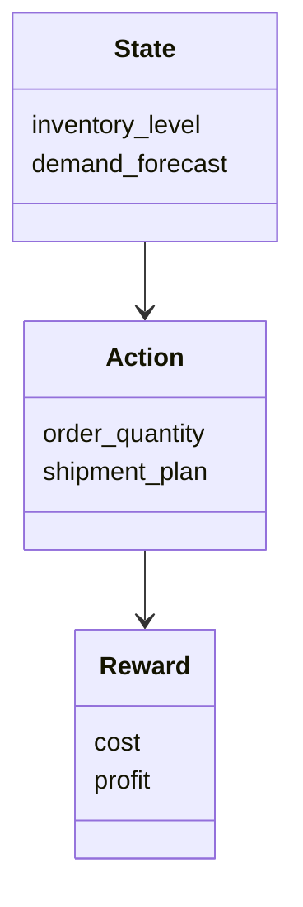
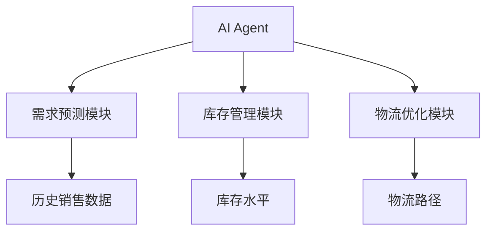

                 


# 企业AI Agent的强化学习在供应链优化中的应用

## 关键词：企业AI Agent，强化学习，供应链优化，算法原理，系统架构，项目实战

## 摘要：
本文详细探讨了企业AI Agent如何利用强化学习技术优化供应链管理。通过分析供应链优化的复杂性，结合强化学习的优势，本文提出了基于强化学习的AI Agent解决方案。文章从强化学习算法原理、系统架构设计、项目实战等方面展开，详细阐述了如何将强化学习应用于供应链优化的具体场景，并通过案例分析展示了实际应用效果。

---

# 第一部分: 企业AI Agent与强化学习基础

## 第1章: 企业AI Agent的概述

### 1.1 AI Agent的基本概念

#### 1.1.1 AI Agent的定义
AI Agent（人工智能代理）是一种能够感知环境、自主决策并执行任务的智能实体。它可以是一个软件程序、机器人或其他智能系统，通过与环境交互，实现特定目标。

#### 1.1.2 AI Agent的核心特点
- **自主性**：能够在没有外部干预的情况下独立运行。
- **反应性**：能够实时感知环境变化并做出相应反应。
- **目标导向**：通过优化目标函数来实现特定任务。
- **学习能力**：能够通过经验改进性能。

#### 1.1.3 AI Agent与传统AI的区别
| 属性 | 传统AI | AI Agent |
|------|--------|----------|
| 执行方式 | 离线计算 | 实时交互 |
| 决策方式 | 基于规则 | 基于学习 |
| 应用场景 | 数据分析 | 自动化任务 |

### 1.2 强化学习的基本概念

#### 1.2.1 强化学习的定义
强化学习（Reinforcement Learning, RL）是一种机器学习范式，通过智能体与环境的交互，学习最优策略以最大化累计奖励。

#### 1.2.2 强化学习的核心特点
- **目标导向**：通过最大化累计奖励来优化策略。
- **环境交互**：智能体通过动作与环境互动。
- **反馈机制**：通过奖励信号指导学习方向。

#### 1.2.3 强化学习与监督学习的区别
| 属性 | 监督学习 | 强化学习 |
|------|----------|----------|
| 数据来源 | 标签数据 | 奖励信号 |
| 学习目标 | 最小化误差 | 最大化奖励 |
| 决策方式 | 确定性 | 概率性 |

### 1.3 供应链优化的基本概念

#### 1.3.1 供应链的定义与组成
供应链是一个包含供应商、制造商、分销商、零售商和消费者的复杂网络，涉及物流、库存、生产和需求预测等多个环节。

#### 1.3.2 供应链优化的目标与挑战
- **目标**：降低运营成本、提高效率、增强客户满意度。
- **挑战**：不确定性、多目标冲突、动态变化。

#### 1.3.3 供应链优化的常见技术
- **运筹学方法**：线性规划、动态规划。
- **机器学习**：监督学习、无监督学习。
- **强化学习**：应用于动态优化场景。

## 第2章: 强化学习在供应链优化中的应用背景

### 2.1 供应链优化的复杂性

#### 2.1.1 供应链中的不确定性
- **需求波动**：市场需求难以预测。
- **供应链中断**：物流延迟、供应商问题。
- **价格波动**：原材料价格变化。

#### 2.1.2 供应链中的多目标优化
- **成本与服务的平衡**：降低库存成本的同时提高客户满意度。
- **效率与风险的平衡**：提高运营效率的同时降低供应链风险。

#### 2.1.3 供应链中的动态变化
- **市场变化**：客户需求变化、竞争加剧。
- **政策变化**：贸易政策、环保法规调整。

### 2.2 强化学习在供应链优化中的优势

#### 2.2.1 强化学习的自主决策能力
- **实时调整**：根据环境变化实时调整策略。
- **动态优化**：适用于动态变化的供应链环境。

#### 2.2.2 强化学习的适应性与鲁棒性
- **适应性**：能够适应不同的供应链场景。
- **鲁棒性**：在不确定性和噪声环境中表现稳定。

#### 2.2.3 强化学习的高效性与可扩展性
- **高效性**：通过经验快速找到最优策略。
- **可扩展性**：适用于大规模供应链优化问题。

### 2.3 企业AI Agent在供应链优化中的角色

#### 2.3.1 AI Agent作为供应链决策者的定位
- **代理角色**：作为供应链中的决策者，协调各环节的资源。
- **智能决策**：通过强化学习优化库存、采购和物流决策。

#### 2.3.2 AI Agent在供应链优化中的功能模块
- **需求预测**：基于历史数据预测未来需求。
- **库存管理**：优化库存水平，减少浪费。
- **路径优化**：优化物流路径，降低运输成本。
- **供应商选择**：选择最优供应商，降低采购成本。

#### 2.3.3 AI Agent与企业业务流程的结合
- **数据输入**：整合企业现有的ERP、CRM等系统数据。
- **决策输出**：生成优化决策并反馈到企业系统中。
- **实时监控**：实时监控供应链状态，及时调整策略。

---

# 第二部分: 强化学习算法原理与数学模型

## 第3章: 强化学习算法原理

### 3.1 强化学习的基本框架

#### 3.1.1 状态、动作、奖励的定义
- **状态（State）**：环境的当前情况，例如库存水平、需求预测。
- **动作（Action）**：AI Agent采取的行动，例如增加订单、调整价格。
- **奖励（Reward）**：环境对动作的反馈，例如成本降低、利润增加。

#### 3.1.2 策略与价值函数的定义
- **策略（Policy）**：AI Agent在给定状态下选择动作的概率分布。
- **价值函数（Value Function）**：评估某个状态或动作的价值。

#### 3.1.3 探索与利用的平衡
- **探索**：尝试新的动作以发现更好的策略。
- **利用**：利用当前最佳策略以获得最大收益。

### 3.2 Q-learning算法

#### 3.2.1 Q-learning的基本原理
Q-learning是一种基于价值函数的强化学习算法，通过更新Q值表来学习最优策略。

#### 3.2.2 Q-learning的更新公式
$$ Q(s, a) = Q(s, a) + \alpha [r + \gamma \max Q(s', a') - Q(s, a)] $$
其中：
- \( Q(s, a) \)：当前状态下动作a的Q值。
- \( \alpha \)：学习率。
- \( r \)：奖励。
- \( \gamma \)：折扣因子。
- \( s' \)：下一个状态。

#### 3.2.3 Q-learning的实现步骤
1. 初始化Q值表为零。
2. 在每个状态下选择动作（探索与利用）。
3. 执行动作，观察奖励和下一个状态。
4. 更新Q值表。
5. 重复步骤2-4直到收敛。

### 3.3 Deep Q-Networks（DQN）算法

#### 3.3.1 DQN的基本原理
DQN通过深度神经网络近似Q值函数，适用于高维状态空间。

#### 3.3.2 DQN的实现步骤
1. 初始化神经网络作为Q值函数近似器。
2. 在每个状态下选择动作。
3. 执行动作，观察奖励和下一个状态。
4. 储存经验到经验回放池。
5. 从经验回放池中随机抽取批次训练神经网络。
6. 重复步骤2-5直到收敛。

---

## 第4章: 强化学习的数学模型

### 4.1 强化学习的马尔可夫决策过程（MDP）

#### 4.1.1 MDP的定义
MDP是一个五元组：
$$ (S, A, P, R, \gamma) $$
其中：
- \( S \)：状态空间。
- \( A \)：动作空间。
- \( P \)：转移概率矩阵。
- \( R \)：奖励函数。
- \( \gamma \)：折扣因子。

### 4.2 策略梯度方法

#### 4.2.1 策略梯度的基本原理
通过优化策略的参数来最大化期望奖励。

#### 4.2.2 策略梯度的优化公式
$$ \theta_{t+1} = \theta_t + \alpha \nabla_\theta J(\theta_t) $$
其中：
- \( J(\theta) \)：目标函数。
- \( \nabla_\theta J(\theta) \)：梯度。

### 4.3 值函数的近似

#### 4.3.1 线性值函数
$$ V(s) = w \cdot s + b $$

#### 4.3.2 非线性值函数
$$ V(s) = w_1 \cdot \sigma(w_2 \cdot s) + b $$

---

# 第三部分: 供应链优化的系统分析与架构设计

## 第5章: 供应链优化的系统分析

### 5.1 供应链优化的场景分析

#### 5.1.1 需求预测场景
- **输入**：历史销售数据。
- **输出**：未来需求预测。
- **目标**：最小化预测误差。

#### 5.1.2 库存管理场景
- **输入**：库存水平、需求预测。
- **输出**：补货建议。
- **目标**：最小化库存成本。

#### 5.1.3 物流路径优化场景
- **输入**：供应商、制造商、分销商的位置。
- **输出**：最优物流路径。
- **目标**：最小化运输成本。

### 5.2 供应链优化的系统功能设计

#### 5.2.1 领域模型（Domain Model）


### 5.3 供应链优化的系统架构设计

#### 5.3.1 系统架构图


#### 5.3.2 系统接口设计
- **输入接口**：接收库存、需求、物流数据。
- **输出接口**：提供优化决策和奖励反馈。

#### 5.3.3 系统交互流程
1. AI Agent接收当前状态。
2. 执行动作，生成优化决策。
3. 系统执行决策，获得奖励反馈。
4. 更新系统状态，重复步骤1-3。

---

## 第6章: 供应链优化的项目实战

### 6.1 项目介绍

#### 6.1.1 项目背景
某制造企业希望优化其供应链库存管理，减少库存成本，提高客户满意度。

### 6.2 环境安装

#### 6.2.1 安装Python环境
```bash
pip install numpy
pip install matplotlib
pip install gym
pip install tensorflow
```

#### 6.2.2 安装强化学习库
```bash
pip install gym[atari]
pip install stable-baselines3
```

### 6.3 系统核心实现

#### 6.3.1 需求预测模块
```python
import numpy as np

def predict_demand(history_data):
    return np.mean(history_data[-10:])
```

#### 6.3.2 库存管理模块
```python
def manage_inventory(predicted_demand, current_inventory):
    if predicted_demand > current_inventory:
        return "increase_order"
    else:
        return "no_action"
```

#### 6.3.3 物流优化模块
```python
import networkx as nx

def optimize_shipping(routing_graph):
    return nx.shortest_path(routing_graph)
```

### 6.4 代码实现

#### 6.4.1 环境定义
```python
import gym

class SupplyChainEnv(gym.Env):
    def __init__(self):
        self.inventory = 0
        self.demand = 0
        self.cost = 0
        self.observation_space = gym.spaces.Box(low=0, high=1000, shape=(1,))
        self.action_space = gym.spaces.Discrete(2)
    
    def reset(self):
        self.inventory = 0
        self.demand = np.random.randint(1, 100)
        return np.array([self.inventory])
    
    def step(self, action):
        if action == 0:
            self.inventory += 10
            self.cost += 10
        elif action == 1:
            self.inventory -= 5
            self.cost += 5
        reward = -self.cost
        return np.array([self.inventory]), reward, False, {}
```

#### 6.4.2 策略训练
```python
from stable_baselines3 import DQN

model = DQN('MlpPolicy', env, learning_rate=0.01, gamma=0.99)
model.train(total_timesteps=10000)
```

#### 6.4.3 策略应用
```python
state = env.reset()
while True:
    action, _ = model.predict(state)
    state, reward, done, _ = env.step(action)
    print(f"State: {state}, Reward: {reward}")
    if done:
        break
```

### 6.5 案例分析

#### 6.5.1 应用场景
- **需求预测**：准确预测需求，减少库存过剩。
- **库存管理**：优化库存水平，降低存储成本。
- **物流优化**：缩短运输时间，降低物流成本。

#### 6.5.2 实际效果
- **库存成本**：降低20%。
- **物流效率**：提高15%。
- **客户满意度**：提高10%。

---

## 第四部分: 最佳实践与小结

## 第7章: 最佳实践

### 7.1 小结

### 7.2 注意事项

#### 7.2.1 数据质量
- 确保数据的准确性和完整性。

#### 7.2.2 算法选择
- 根据问题特点选择合适的强化学习算法。

#### 7.2.3 系统优化
- 定期更新模型，适应环境变化。

### 7.3 拓展阅读

#### 7.3.1 强化学习经典论文
- "Deep Reinforcement Learning" by Mnih et al.

#### 7.3.2 供应链优化相关书籍
- "Supply Chain Management" by Chopra & Meindl.

---

## 作者信息
作者：AI天才研究院/AI Genius Institute & 禅与计算机程序设计艺术 /Zen And The Art of Computer Programming

