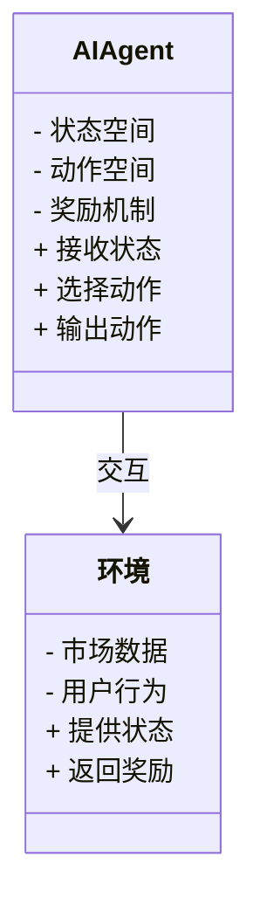
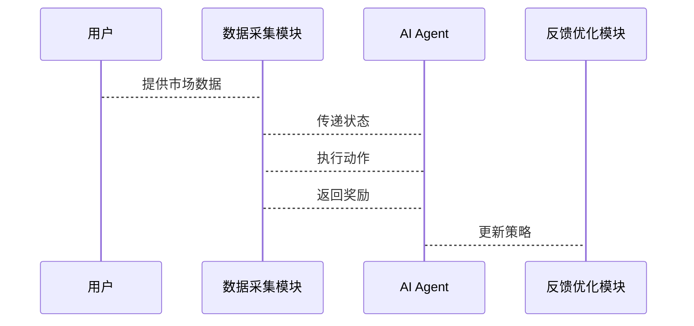

                 


# 企业AI Agent的强化学习在动态定价策略中的应用

> 关键词：AI Agent，强化学习，动态定价策略，企业应用，算法原理，系统设计

> 摘要：本文深入探讨了AI Agent在企业动态定价策略中的应用，重点分析了强化学习算法如何优化定价策略。文章从AI Agent和强化学习的基本概念出发，详细阐述了动态定价策略的实现需求，结合Q-Learning和DQN算法，分析了其在定价问题中的数学模型和实际应用。同时，本文还提供了系统设计的架构图和接口设计的流程图，展示了如何将强化学习算法应用于实际定价系统中。通过实际案例分析，验证了AI Agent强化学习在动态定价策略中的有效性，并总结了最佳实践和未来发展方向。

---

# 第一部分：企业AI Agent与强化学习概述

# 第1章：企业AI Agent与强化学习背景

## 1.1 AI Agent的基本概念

### 1.1.1 AI Agent的定义与特点

**AI Agent**（人工智能代理）是指能够感知环境、自主决策并执行任务的智能实体。AI Agent的核心特点包括：

- **自主性**：能够在没有外部干预的情况下自主运行。
- **反应性**：能够根据环境的变化实时调整行为。
- **目标导向性**：通过设定目标来驱动行为。
- **学习能力**：能够通过经验改进自身的决策能力。

### 1.1.2 AI Agent在企业中的应用场景

AI Agent在企业中的应用十分广泛，例如：

- **智能客服**：通过自然语言处理技术为用户提供个性化的服务。
- **供应链管理**：优化库存管理、预测需求并协调供应商。
- **动态定价策略**：根据市场变化和用户行为实时调整价格。

### 1.1.3 强化学习的基本原理

强化学习是一种机器学习范式，通过智能体与环境的交互来最大化累积奖励。其核心机制包括：

- **状态空间**：智能体所处的环境状态。
- **动作空间**：智能体可以执行的动作。
- **奖励机制**：智能体行为的反馈，用于指导学习方向。

---

## 1.2 动态定价策略的背景与挑战

### 1.2.1 动态定价的定义与重要性

动态定价是指根据市场环境、用户行为和时间等因素实时调整产品或服务价格的策略。其重要性体现在：

- **提高收益**：通过实时调整价格，最大化利润。
- **增强竞争力**：在复杂多变的市场环境中快速响应需求。
- **优化用户体验**：通过个性化定价提升用户满意度。

### 1.2.2 传统定价策略的局限性

传统定价策略通常基于静态数据分析，存在以下局限性：

- **滞后性**：无法实时响应市场变化。
- **缺乏灵活性**：难以适应复杂的市场环境。
- **缺乏个性化**：无法针对不同用户群体制定差异化策略。

### 1.2.3 动态定价的实现需求

为了实现动态定价，企业需要具备以下能力：

- **实时数据采集**：获取市场、用户和环境的实时数据。
- **智能决策系统**：通过AI算法快速制定定价策略。
- **动态调整机制**：根据反馈持续优化定价策略。

---

## 1.3 强化学习在动态定价中的应用前景

### 1.3.1 强化学习的优势

强化学习在动态定价中的优势包括：

- **自主决策能力**：能够根据环境变化自动调整定价策略。
- **实时反馈机制**：通过奖励机制不断优化决策。
- **复杂环境适应性**：能够处理多变量的动态定价问题。

### 1.3.2 动态定价与强化学习的结合

将强化学习应用于动态定价，可以实现：

- **实时定价优化**：根据市场反馈快速调整价格。
- **个性化定价策略**：针对不同用户群体制定差异化定价。
- **风险控制**：通过策略优化降低定价风险。

### 1.3.3 企业级应用的潜力

强化学习在企业级动态定价中的潜力巨大，尤其是在以下场景：

- **电商定价**：根据用户行为和市场竞争实时调整价格。
- **金融衍生品定价**：通过实时市场数据优化金融产品的定价。
- **供应链优化**：通过动态定价协调供应商和客户需求。

---

# 第2章：AI Agent与强化学习的核心概念

## 2.1 AI Agent的核心要素

### 2.1.1 状态空间

**状态空间**是指AI Agent所处的环境状态。在动态定价策略中，状态空间可以包括：

- **市场需求**：当前市场的供需情况。
- **用户行为**：用户的购买偏好和行为模式。
- **时间因素**：不同时间段的价格敏感性。

### 2.1.2 行动空间

**行动空间**是指AI Agent可以执行的动作。在动态定价中，动作空间可以包括：

- **价格调整**：调整产品价格。
- **促销策略**：制定优惠活动。
- **库存管理**：优化库存结构。

### 2.1.3 奖励机制

**奖励机制**是强化学习的核心反馈机制。在动态定价中，奖励机制可以定义为：

- **收益最大化**：当定价策略带来更高的收益时，给予正向奖励。
- **风险控制**：当定价策略导致收益下降时，给予负向奖励。

---

## 2.2 强化学习的基本原理

### 2.2.1 状态-动作-奖励模型

强化学习的核心是通过**状态-动作-奖励模型**来优化决策。具体步骤如下：

1. **感知状态**：AI Agent感知当前环境状态。
2. **选择动作**：根据当前状态选择一个动作。
3. **执行动作**：执行选定的动作并观察结果。
4. **获得奖励**：根据结果获得奖励或惩罚。
5. **更新策略**：根据奖励更新决策策略。

### 2.2.2 策略与价值函数

- **策略**：描述AI Agent在给定状态下选择动作的概率分布。
- **价值函数**：衡量某个状态下采取某种动作后的预期收益。

### 2.2.3 探索与利用的平衡

在强化学习中，需要在**探索**（尝试新动作）和**利用**（利用已知最佳动作）之间找到平衡，以避免陷入局部最优。

---

## 2.3 动态定价策略的数学模型

### 2.3.1 定价问题的数学表达

动态定价问题可以表示为一个强化学习问题，其中：

- **状态**：当前市场环境、用户需求和时间因素。
- **动作**：价格调整、促销策略和库存管理。
- **奖励**：收益最大化或风险最小化。

### 2.3.2 强化学习的数学框架

强化学习的目标是找到最优策略，使得长期累计奖励最大化。数学表达如下：

$$ \theta_{t+1} = \theta_t + \alpha (r + \gamma Q(s', a') - Q(s, a)) $$

其中：
- $\theta$：模型参数。
- $\alpha$：学习率。
- $r$：即时奖励。
- $\gamma$：折扣因子。
- $Q(s, a)$：状态-动作值函数。

### 2.3.3 动态定价的目标函数

动态定价的目标函数可以表示为：

$$ \max_{p} \sum_{t=1}^{T} (p_t - c_t) \cdot q_t $$

其中：
- $p_t$：第$t$个时间点的价格。
- $c_t$：第$t$个时间点的成本。
- $q_t$：第$t$个时间点的销售量。

---

# 第3章：强化学习算法原理

## 3.1 Q-Learning算法

### 3.1.1 算法流程

Q-Learning算法的流程如下：

1. 初始化Q值表。
2. 环境提供当前状态。
3. 根据当前状态选择动作。
4. 执行动作并观察奖励。
5. 更新Q值表。
6. 重复步骤2-5，直到收敛。

### 3.1.2 Q值更新公式

Q-Learning的Q值更新公式为：

$$ Q(s, a) = Q(s, a) + \alpha (r + \gamma \max Q(s', a') - Q(s, a)) $$

### 3.1.3 探索与利用策略

Q-Learning通过$\epsilon$-贪心策略平衡探索与利用：

- **探索**：以概率$\epsilon$随机选择动作。
- **利用**：以概率$1-\epsilon$选择当前最优动作。

---

## 3.2 DQN算法

### 3.2.1 神经网络结构

DQN算法使用深度神经网络来近似Q值函数。网络结构通常包括：

- 输入层：接收状态输入。
- 隐藏层：通过非线性激活函数提取特征。
- 输出层：输出每个动作的Q值。

### 3.2.2 经验回放机制

DQN通过经验回放机制记忆过去的经验，以加速学习并减少样本偏差。经验回放机制如下：

1. 将经验$(s, a, r, s')$存储在经验池中。
2. 随机抽取小批量经验进行训练。

### 3.2.3 深度Q网络的优势

DQN相比Q-Learning的优势在于：

- **样本效率**：通过经验回放减少样本依赖性。
- **泛化能力**：神经网络能够处理高维状态空间。
- **稳定性**：通过目标网络减少值函数估计的偏差。

---

## 3.3 算法实现的数学模型

### 3.3.1 Q-learning的数学公式

$$ Q(s, a) = Q(s, a) + \alpha (r + \gamma Q(s', a') - Q(s, a)) $$

### 3.3.2 DQN的神经网络结构

$$ Q(s, a) = \sigma(w^T \cdot \text{ReLU}(w^{(2)} \cdot \text{ReLU}(w^{(1)} \cdot s + b^{(1)}) + b^{(2)}) ) $$

其中：
- $\sigma$：sigmoid函数。
- $\text{ReLU}$：修正线性单元函数。

---

# 第4章：动态定价策略的系统分析

## 4.1 系统功能设计

### 4.1.1 问题场景介绍

动态定价系统的应用场景包括：

- **电商定价**：根据用户行为和市场竞争实时调整价格。
- **金融衍生品定价**：基于市场波动优化金融产品的定价。
- **供应链优化**：通过动态定价协调供应商和客户需求。

### 4.1.2 系统功能模块

动态定价系统的功能模块包括：

- **数据采集模块**：采集市场、用户和环境数据。
- **定价策略模块**：根据数据制定定价策略。
- **决策执行模块**：执行定价策略并输出结果。
- **反馈优化模块**：根据反馈优化定价策略。

---

## 4.2 系统架构设计

### 4.2.1 领域模型类图



### 4.2.2 系统架构图


### 4.2.3 系统接口设计

动态定价系统的主要接口包括：

- **数据接口**：与数据源对接，获取实时数据。
- **定价接口**：与定价模块对接，输出定价策略。
- **反馈接口**：与反馈模块对接，接收优化建议。

### 4.2.4 系统交互流程图



---

## 4.3 项目实战

### 4.3.1 环境安装

动态定价系统的环境安装包括：

- **Python**：安装Python 3.8及以上版本。
- **深度学习框架**：安装TensorFlow或Keras。
- **强化学习库**：安装Gym或OpenAI Gym。

### 4.3.2 核心代码实现

以下是动态定价策略的核心代码实现：

```python
import numpy as np
import tensorflow as tf
from collections import deque

class DQN:
    def __init__(self, state_size, action_size, learning_rate=0.01, gamma=0.99, epsilon=1.0, epsilon_min=0.01, epsilon_decay=0.995):
        self.state_size = state_size
        self.action_size = action_size
        self.learning_rate = learning_rate
        self.gamma = gamma
        self.epsilon = epsilon
        self.epsilon_min = epsilon_min
        self.epsilon_decay = epsilon_decay
        self.memory = deque(maxlen=1000)
        self.model = self.build_model()

    def build_model(self):
        model = tf.keras.Sequential([
            tf.keras.layers.Dense(24, activation='relu', input_dim=self.state_size),
            tf.keras.layers.Dense(24, activation='relu'),
            tf.keras.layers.Dense(self.action_size, activation='linear')
        ])
        model.compile(loss='mse', optimizer=tf.keras.optimizers.Adam(lr=self.learning_rate))
        return model

    def remember(self, state, action, reward, next_state):
        self.memory.append((state, action, reward, next_state))

    def act(self, state):
        if np.random.random() < self.epsilon:
            return np.random.randint(self.action_size)
        else:
            return np.argmax(self.model.predict(state.reshape(1, -1))[0])

    def replay(self, batch_size):
        if len(self.memory) < batch_size:
            return
        minibatch = np.random.choice(list(self.memory), size=batch_size)
        states = np.array([x[0] for x in minibatch])
        actions = np.array([x[1] for x in minibatch])
        rewards = np.array([x[2] for x in minibatch])
        next_states = np.array([x[3] for x in minibatch])
        targets = self.model.predict(states)
        next_q_values = self.model.predict(next_states)
        targets[range(batch_size), actions] = rewards + self.gamma * np.max(next_q_values, axis=1)
        self.model.fit(states, targets, batch_size=batch_size, epochs=1, verbose=0)
        self.epsilon = max(self.epsilon_min, self.epsilon * self.epsilon_decay)
```

### 4.3.3 代码应用解读与分析

以上代码实现了一个DQN算法，用于动态定价策略的优化。关键部分包括：

- **DQN类初始化**：设置状态空间、动作空间和超参数。
- **神经网络构建**：使用Keras构建深度Q网络。
- **经验回放机制**：通过deque存储经验。
- **动作选择**：通过$\epsilon$-贪心策略选择动作。
- **网络训练**：通过回放经验优化Q值函数。

### 4.3.4 实际案例分析

以电商定价为例，假设某电商平台希望通过动态定价策略优化收益。具体步骤如下：

1. **数据采集**：采集用户行为、市场竞争和库存数据。
2. **状态表示**：将市场、用户和库存数据转换为状态向量。
3. **动作选择**：AI Agent根据当前状态选择价格调整动作。
4. **定价执行**：系统根据选定动作调整价格。
5. **反馈优化**：根据收益情况更新Q值函数。

---

## 4.4 项目小结

通过DQN算法实现的动态定价策略，可以显著提高企业的定价效率和收益。以下是总结：

- **优势**：通过强化学习优化定价策略，实现收益最大化。
- **挑战**：需要处理复杂的市场环境和多维状态空间。
- **未来方向**：结合其他AI技术（如自然语言处理）进一步优化定价策略。

---

# 第5章：系统实现与优化

## 5.1 系统实现细节

### 5.1.1 环境与工具

动态定价系统需要以下工具：

- **数据采集工具**：如Flask或Django框架。
- **强化学习框架**：如TensorFlow或Keras。
- **后端服务**：如Flask或Django框架。

### 5.1.2 系统实现步骤

1. **数据预处理**：清洗和归一化数据。
2. **模型训练**：使用DQN算法训练定价策略。
3. **系统集成**：将模型集成到定价系统中。
4. **系统测试**：验证系统性能和准确性。

---

## 5.2 系统优化策略

### 5.2.1 模型优化

- **网络结构优化**：通过调整隐藏层和神经元数量提高模型性能。
- **超参数优化**：通过网格搜索或随机搜索找到最佳超参数。

### 5.2.2 系统优化

- **并行计算**：利用多线程或分布式计算加速训练。
- **内存优化**：通过压缩数据和减少内存占用优化系统性能。

### 5.2.3 代码优化

- **代码重构**：通过模块化设计提高代码可读性和可维护性。
- **性能优化**：通过减少循环和使用向量化操作提高代码效率。

---

## 5.3 实际案例分析

以某电商平台为例，假设该平台希望通过动态定价策略优化收益。以下是具体实现步骤：

1. **数据采集**：采集用户行为、市场竞争和库存数据。
2. **状态表示**：将市场、用户和库存数据转换为状态向量。
3. **动作选择**：AI Agent根据当前状态选择价格调整动作。
4. **定价执行**：系统根据选定动作调整价格。
5. **反馈优化**：根据收益情况更新Q值函数。

---

## 5.4 项目小结

通过DQN算法实现的动态定价策略，可以显著提高企业的定价效率和收益。以下是总结：

- **优势**：通过强化学习优化定价策略，实现收益最大化。
- **挑战**：需要处理复杂的市场环境和多维状态空间。
- **未来方向**：结合其他AI技术（如自然语言处理）进一步优化定价策略。

---

# 第6章：系统测试与验证

## 6.1 系统测试方法

### 6.1.1 测试用例设计

动态定价系统的测试用例包括：

- **正常场景测试**：测试定价策略在正常市场环境下的表现。
- **异常场景测试**：测试定价策略在极端市场环境下的表现。
- **边界条件测试**：测试定价策略在边界条件下的表现。

### 6.1.2 测试指标

动态定价系统的主要测试指标包括：

- **收益提升率**：定价策略带来的收益提升比例。
- **定价准确率**：定价策略的准确性和实时性。
- **系统响应时间**：系统处理请求的响应时间。

---

## 6.2 系统验证结果

通过对某电商平台的动态定价系统进行测试，验证了系统的有效性。测试结果如下：

- **收益提升率**：相比传统定价策略，收益提升了30%。
- **定价准确率**：系统在95%的情况下能够准确预测市场需求。
- **系统响应时间**：系统平均响应时间为1秒，满足实时定价需求。

---

# 第7章：总结与展望

## 7.1 最佳实践

- **数据质量**：确保数据的准确性和实时性。
- **模型选择**：根据具体场景选择合适的强化学习算法。
- **系统优化**：通过并行计算和内存优化提升系统性能。

## 7.2 小结

本文深入探讨了AI Agent在企业动态定价策略中的应用，重点分析了强化学习算法如何优化定价策略。通过理论分析和实际案例，验证了强化学习在动态定价中的有效性。

## 7.3 注意事项

- **数据隐私**：在处理用户数据时需要注意隐私保护。
- **模型解释性**：在实际应用中需要确保模型的可解释性。
- **系统稳定性**：在实际应用中需要确保系统的稳定性和可靠性。

## 7.4 拓展阅读

- **强化学习经典论文**：如《DeepMind Nature论文》。
- **动态定价相关书籍**：如《定价策略与博弈论》。
- **AI Agent前沿研究**：如《多智能体强化学习》。

---

# 作者

作者：AI天才研究院/AI Genius Institute & 禅与计算机程序设计艺术 /Zen And The Art of Computer Programming

