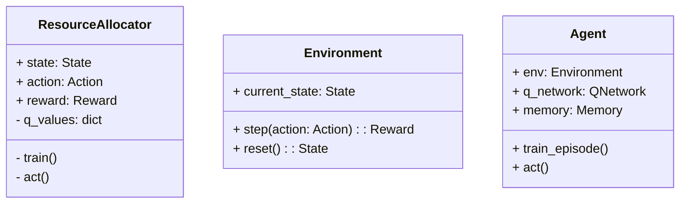
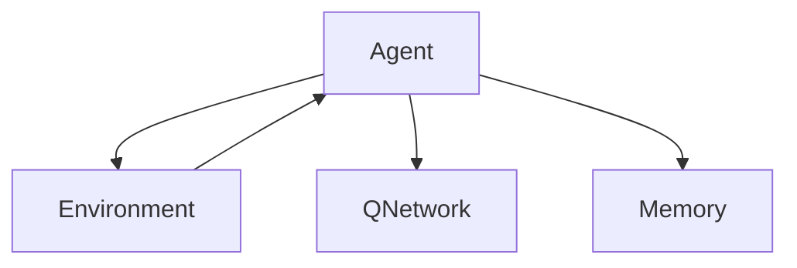
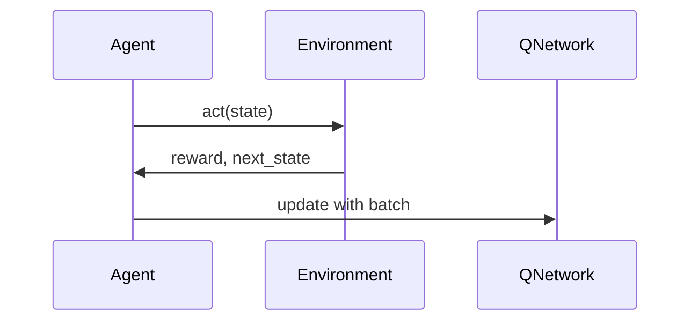

                 


# 企业AI Agent的强化学习在动态资源分配中的实时优化

> 关键词：AI Agent, 强化学习, 动态资源分配, 实时优化, 系统架构设计

> 摘要：本文详细探讨了AI Agent在企业动态资源分配中的应用，结合强化学习的实时优化策略，分析了从算法原理到系统架构设计的全过程。通过实际案例和代码实现，展示了如何利用强化学习实现动态资源分配的高效优化。

---

# 第一部分: 企业AI Agent的强化学习基础

## 第1章: 问题背景与核心概念

### 1.1 动态资源分配的挑战

#### 1.1.1 传统资源分配方法的局限性
传统的资源分配方法通常基于静态模型，难以应对动态变化的环境。例如，企业中的计算资源、存储资源和网络资源在实际运行中会受到负载波动、任务优先级变化等多种因素的影响，传统的静态分配策略往往导致资源利用率低下或任务延迟。

#### 1.1.2 动态环境下的资源分配难点
在动态环境中，资源分配需要实时响应变化，例如：
- **负载波动**：任务数量和类型的变化会影响资源需求。
- **延迟约束**：某些任务需要在限定时间内完成。
- **资源异构性**：不同资源的性能和成本不同，需权衡使用。

#### 1.1.3 企业资源分配的优化目标
资源分配的优化目标通常包括：
- **最大化资源利用率**：充分利用现有资源，减少浪费。
- **最小化任务延迟**：确保任务在规定时间内完成。
- **最小化成本**：在满足性能需求的前提下，降低资源使用成本。

### 1.2 AI Agent与强化学习的结合

#### 1.2.1 AI Agent的基本概念
AI Agent是一种智能体，能够感知环境并采取行动以实现目标。AI Agent在资源分配中的角色是通过感知当前资源状态和任务需求，做出最优决策。

#### 1.2.2 强化学习在AI Agent中的应用
强化学习（Reinforcement Learning）是一种通过试错机制优化决策的算法。AI Agent通过与环境互动，学习最优策略。

#### 1.2.3 动态资源分配中的实时优化需求
在动态环境中，资源分配需要实时优化，强化学习能够通过在线学习快速适应环境变化。

### 1.3 本章小结
本章介绍了动态资源分配的挑战、AI Agent的概念以及强化学习在实时优化中的应用。

---

## 第2章: 强化学习核心概念与数学模型

### 2.1 强化学习的基本原理

#### 2.1.1 状态空间与动作空间
- **状态空间**：环境中的所有可能状态。
- **动作空间**：智能体在每个状态下可以执行的所有动作。

#### 2.1.2 奖励函数与价值函数
- **奖励函数**：智能体采取某个动作后获得的奖励。
- **价值函数**：评估某个状态下采取某个动作的长期收益。

#### 2.1.3 策略与值函数的关系
策略是智能体选择动作的概率分布，值函数是对策略的评估。

### 2.2 Q-learning算法的数学模型

#### 2.2.1 Q-learning的基本公式
$$ Q(s,a) = Q(s,a) + \alpha (r + \gamma \max Q(s',a') - Q(s,a)) $$
其中：
- $Q(s,a)$：当前状态下采取动作的Q值。
- $\alpha$：学习率。
- $r$：奖励。
- $\gamma$：折扣因子。

#### 2.2.2 Q-learning的收敛性分析
Q-learning在离线和在线环境中都能收敛，但需要满足探索与利用的平衡。

### 2.3 Deep Q-Networks (DQN)的原理

#### 2.3.1 DQN的网络结构
- 输入层：接收当前状态。
- 隐藏层：提取特征。
- 输出层：输出所有动作的Q值。

#### 2.3.2 经验回放机制
通过存储历史经验，避免重复学习，加速收敛。

#### 2.3.3 网络更新策略
使用两个网络，一个用于评估（target network），一个用于执行（policy network），定期同步。

---

## 第3章: 强化学习在动态资源分配中的应用

### 3.1 动态资源分配的强化学习建模

#### 3.1.1 状态表示
将资源使用情况、任务队列等信息作为状态输入。

#### 3.1.2 动作空间设计
包括分配资源、调整资源使用优先级等动作。

#### 3.1.3 奖励函数设计
定义合理的奖励函数，例如任务完成时间越短，奖励越高。

### 3.2 基于强化学习的实时优化策略

#### 3.2.1 离线训练与在线更新
- 离线训练：在模拟环境中训练模型。
- 在线更新：实时调整策略以适应动态环境。

#### 3.2.2 多智能体协作
通过多智能体协作，实现资源的全局优化。

#### 3.2.3 动态环境下的策略调整
根据环境变化，动态调整策略参数。

---

## 第4章: 算法实现与数学模型

### 4.1 强化学习算法的实现步骤

#### 4.1.1 环境接口定义
定义状态、动作和奖励函数的接口。

#### 4.1.2 策略网络实现
使用深度神经网络实现策略。

#### 4.1.3 训练过程
通过反复与环境交互，更新策略网络。

### 4.2 数学模型与公式推导

#### 4.2.1 状态转移概率
$$ P(s'|s,a) $$
表示在状态$s$下采取动作$a$后转移到状态$s'$的概率。

#### 4.2.2 价值函数的贝尔曼方程
$$ V(s) = \max_a Q(s,a) $$

### 4.3 代码实现与解读

#### 4.3.1 环境类定义
```python
class ResourceEnv:
    def __init__(self):
        # 初始化环境状态
        self.state = initial_state
```

#### 4.3.2 策略网络实现
```python
class QNetwork(nn.Module):
    def __init__(self, state_dim, action_dim):
        super(QNetwork, self).__init__()
        self.fc1 = nn.Linear(state_dim, 64)
        self.fc2 = nn.Linear(64, action_dim)
```

#### 4.3.3 训练循环
```python
for episode in range(num_episodes):
    state = env.reset()
    while not done:
        action = policy_net.act(state)
        next_state, reward, done = env.step(action)
        memory.push((state, action, reward, next_state))
        # 从记忆中采样批量进行训练
        batch = memory.sample(batch_size)
        # 更新Q网络
        optimizer.zero_grad()
        loss = compute_loss(batch)
        loss.backward()
        optimizer.step()
```

---

## 第5章: 系统分析与架构设计

### 5.1 问题场景介绍
动态资源分配问题，例如云计算中的虚拟机调度。

### 5.2 系统功能设计

#### 5.2.1 领域模型类图


### 5.3 系统架构设计

#### 5.3.1 系统架构图


### 5.4 系统接口设计
定义接口规范，例如：
- `act(state)`：返回动作。
- `train(batch)`：更新模型。

### 5.5 系统交互序列图


---

## 第6章: 项目实战

### 6.1 环境安装
安装必要的库，例如：
```bash
pip install numpy torch gym
```

### 6.2 核心实现

#### 6.2.1 环境实现
```python
class ResourceEnv(gym.Env):
    def __init__(self):
        super().__init__()
        # 定义状态空间和动作空间
        self.observation_space = Box(low=0, high=1, shape=(state_dim,))
        self.action_space = Discrete(action_dim)
```

#### 6.2.2 策略网络实现
```python
class QNetwork(nn.Module):
    def __init__(self, state_dim, action_dim):
        super(QNetwork, self).__init__()
        self.fc1 = nn.Linear(state_dim, 64)
        self.fc2 = nn.Linear(64, action_dim)
```

#### 6.2.3 训练循环
```python
def train(agent, env, num_episodes=1000):
    for episode in range(num_episodes):
        state = env.reset()
        done = False
        while not done:
            action = agent.act(state)
            next_state, reward, done, _ = env.step(action)
            agent.memory.push((state, action, reward, next_state))
            batch = agent.memory.sample(BATCH_SIZE)
            loss = agent.train(batch)
            state = next_state
```

### 6.3 实际案例分析
通过一个简单的动态资源分配案例，展示强化学习的优化效果。

---

## 第7章: 最佳实践与小结

### 7.1 小结
本文详细介绍了强化学习在动态资源分配中的应用，从算法原理到系统架构设计，再到实际实现，全面阐述了相关知识。

### 7.2 注意事项
- 确保环境和算法的稳定性。
- 避免过拟合，保持策略的泛化能力。
- 实时优化需要高效的计算能力。

### 7.3 拓展阅读
推荐相关书籍和论文，例如：
- 《Deep Reinforcement Learning》
- 《Multi-Agent Systems》

---

# 作者
作者：AI天才研究院  
联系邮箱：[contact@aicourse.com](mailto:contact@aicourse.com)  
GitHub地址：[https://github.com/aicourse](https://github.com/aicourse)

