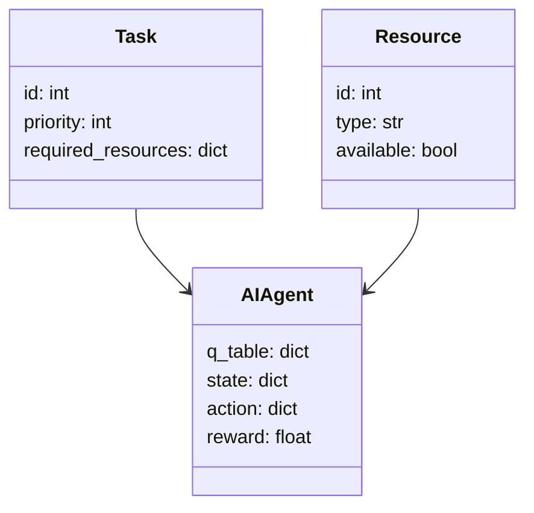

                 


# 企业AI Agent的强化学习在动态资源分配中的应用

## 关键词：企业AI Agent，强化学习，动态资源分配，算法原理，系统架构，项目实战

## 摘要：本文探讨了企业AI Agent如何利用强化学习技术进行动态资源分配。通过背景介绍、核心概念分析、算法原理讲解、系统架构设计、项目实战等部分，详细阐述了强化学习在动态环境下的应用及其在资源分配中的优化作用。文章结合理论与实践，提供了丰富的案例分析和代码实现，为读者理解和应用该技术提供了全面指导。

---

## 第一部分：背景介绍

### 第1章：企业AI Agent与强化学习概述

#### 1.1 问题背景

- **资源分配的挑战**  
  企业在动态环境中面临资源分配的复杂问题，如计算资源、人力资源、设备分配等。资源分配的效率和公平性直接影响企业的运营成本和生产效率。

- **动态环境下的不确定性**  
  市场需求变化、设备故障、任务优先级调整等因素导致资源分配环境的动态变化，增加了优化的难度。

- **强化学习的应用潜力**  
  强化学习通过与环境交互学习策略，适用于动态和不确定性环境下的决策问题，是解决资源分配问题的有效工具。

#### 1.2 问题描述

- **资源分配的核心问题**  
  确定在特定时间点如何分配资源以最大化企业效益，通常涉及多目标优化。

- **动态环境下的不确定性**  
  资源需求和可用性随时间变化，传统静态分配方法难以应对动态变化。

- **强化学习的适用性分析**  
  强化学习通过试错和奖励机制，逐步优化决策策略，适用于动态环境下的资源分配问题。

#### 1.3 问题解决

- **强化学习的基本思路**  
  通过定义状态、动作和奖励，AI Agent在与环境交互中学习最优策略。

- **AI Agent在资源分配中的角色**  
  AI Agent作为决策者，根据当前状态选择最优动作，实现资源的高效分配。

- **动态资源分配的优化目标**  
  最小化资源浪费，最大化资源利用率和企业效益，同时平衡各任务的优先级。

#### 1.4 概念结构与核心要素

- **强化学习的基本要素**  
  - 状态（State）：环境的当前情况。
  - 动作（Action）：AI Agent的选择。
  - 奖励（Reward）：环境对动作的反馈。
  - 策略（Policy）：动作选择的概率分布。
  - 值函数（Value Function）：状态或动作的价值评估。

- **AI Agent的核心属性**  
  - 知识表示：对环境和任务的理解。
  - 行为选择：基于当前状态做出决策。
  - 交互能力：与环境进行信息交换。

- **动态资源分配的系统架构**  
  - 输入：资源需求、可用资源、优先级。
  - 处理：AI Agent决策分配方案。
  - 输出：分配结果和反馈。

---

## 第二部分：核心概念与联系

### 第2章：强化学习与AI Agent的核心原理

#### 2.1 强化学习的原理

- **Q-learning算法的基本原理**  
  Q-learning是一种无模型强化学习算法，通过更新Q值函数来学习最优策略。  
  **数学模型**：  
  $$ Q(s, a) \leftarrow Q(s, a) + \alpha [r + \gamma \max Q(s', a') - Q(s, a)] $$  
  其中，$\alpha$是学习率，$\gamma$是折扣因子。

- **策略梯度方法的简介**  
  策略梯度方法通过优化策略的参数，直接最大化累积奖励。  
  **公式**：  
  $$ \nabla \theta J(\theta) = \mathbb{E}[ \nabla \log \pi(a|s) \cdot Q(s,a) ] $$  

#### 2.2 AI Agent的原理

- **知识表示与推理**  
  AI Agent通过构建知识库，理解任务需求和资源约束，进行推理和决策。

- **行为选择机制**  
  基于当前状态和已学习的策略，选择最优动作。

- **与环境的交互过程**  
  AI Agent通过感知环境状态，执行动作并获得奖励，逐步优化策略。

#### 2.3 强化学习与AI Agent的联系

- **强化学习驱动的AI Agent**  
  AI Agent通过强化学习算法，不断优化决策策略。

- **AI Agent在强化学习中的角色**  
  作为决策者，AI Agent与环境交互，学习最优策略。

- **动态环境下的协同优化**  
  强化学习和AI Agent协同工作，适应动态环境，提高资源分配效率。

#### 2.4 核心概念对比分析

- **表格对比：强化学习与监督学习的差异**

| 特性              | 监督学习             | 强化学习             |
|-------------------|--------------------|--------------------|
| 数据来源          | 标签数据            | 环境反馈            |
| 目标              | 模型预测准确率       | 最大化累积奖励       |
| 交互方式          | 非实时              | 实时反馈            |

- **Mermaid流程图：强化学习与AI Agent的实体关系**


---

## 第三部分：算法原理讲解

### 第3章：强化学习算法实现

#### 3.1 Q-learning算法实现

- **代码实现**

```python
import numpy as np

class QLAgent:
    def __init__(self, state_size, action_size):
        self.state_size = state_size
        self.action_size = action_size
        self.q_table = np.zeros((state_size, action_size))
        self.alpha = 0.1
        self.gamma = 0.9

    def act(self, state):
        return np.argmax(self.q_table[state, :])

    def learn(self, state, action, reward, next_state):
        self.q_table[state, action] += self.alpha * (reward + self.gamma * np.max(self.q_table[next_state, :]) - self.q_table[state, action])
```

- **算法步骤**  
  1. 初始化Q表。  
  2. 在每个时间步选择动作。  
  3. 执行动作并获得奖励。  
  4. 更新Q表。

- **优化策略**  
  - 探索与利用平衡。  
  - 使用经验回放。

#### 3.2 策略梯度方法实现

- **代码实现**

```python
import torch
import torch.nn as nn

class PolicyNetwork(nn.Module):
    def __init__(self, state_size, action_size):
        super(PolicyNetwork, self).__init__()
        self.fc1 = nn.Linear(state_size, 128)
        self.fc2 = nn.Linear(128, action_size)
        self.logits = nn.Softmax(dim=1)

    def forward(self, x):
        x = torch.relu(self.fc1(x))
        x = self.logits(self.fc2(x))
        return x
```

- **优化过程**  
  1. 状态输入网络，输出动作概率。  
  2. 根据策略选择动作。  
  3. 计算损失函数，更新网络参数。

---

## 第四部分：系统分析与架构设计

### 第4章：系统架构与实现

#### 4.1 项目场景介绍

- **资源分配系统**  
  企业需要动态分配计算资源，如CPU和内存，以支持多个任务。

- **系统目标**  
  实现高效、公平的资源分配，提升任务执行效率。

#### 4.2 系统功能设计

- **领域模型**  
  使用Mermaid类图展示任务、资源、AI Agent之间的关系。



- **系统架构设计**  
  使用分层架构，包括数据层、业务逻辑层和应用层。

---

## 第五部分：项目实战

### 第5章：项目实现与分析

#### 5.1 环境安装

- **安装Python环境**  
  使用Anaconda或virtualenv管理环境。

- **安装依赖库**  
  使用pip安装numpy、torch、mermaid等库。

#### 5.2 系统核心实现

- **代码实现**  
  实现AI Agent与环境的交互，完成资源分配。

- **应用解读**  
  分析代码实现，解释各部分的功能。

#### 5.3 案例分析

- **实际案例**  
  某企业的计算资源分配问题。

- **详细分析**  
  使用强化学习算法优化资源分配策略。

#### 5.4 项目小结

- **经验总结**  
  强化学习在动态资源分配中的优势。

---

## 第六部分：总结与展望

### 第6章：总结与展望

#### 6.1 最佳实践 tips

- **算法选择**  
  根据问题规模选择适合的算法。

- **参数调优**  
  通过实验优化学习率和折扣因子。

#### 6.2 小结

- **关键点回顾**  
  强化学习在动态资源分配中的应用。

#### 6.3 注意事项

- **计算资源限制**  
  大规模问题需要分布式计算。

- **环境建模**  
  精确建模环境以提高算法效果。

#### 6.4 拓展阅读

- **推荐书籍**  
  《强化学习：算法与应用》。

- **在线资源**  
  推荐相关论文和教程。

---

## 作者：AI天才研究院 & 禅与计算机程序设计艺术

