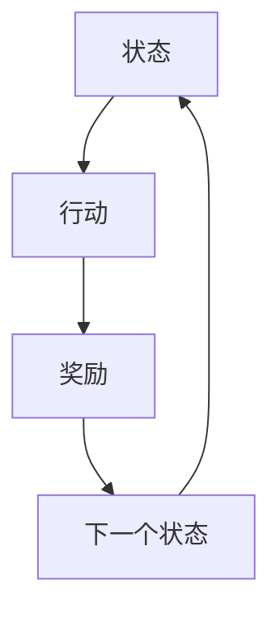
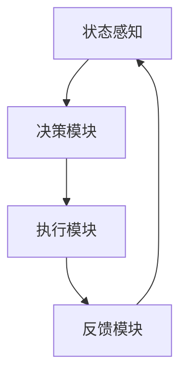

                 


# 企业AI Agent的强化学习在复杂决策场景中的实践

> 关键词：企业AI Agent，强化学习，复杂决策，Q-learning，Deep Q-Networks（DQN）

> 摘要：本文详细探讨了强化学习在企业AI Agent中的应用，特别是在复杂决策场景中的实践。通过分析强化学习的核心概念、数学模型、系统架构设计，以及项目实战案例，深入讲解了强化学习在企业决策中的优势和实现方法。本文旨在为企业技术决策者和开发人员提供理论支持和实践指导，帮助他们在复杂决策场景中有效应用强化学习技术。

---

## 第一部分: 强化学习与企业AI Agent概述

### 第1章: 强化学习与企业AI Agent的基本概念

#### 1.1 强化学习的基本概念
强化学习（Reinforcement Learning, RL）是一种机器学习范式，通过智能体与环境的交互，学习最优策略以最大化累积奖励。与监督学习和无监督学习不同，强化学习强调通过试错和经验积累来优化决策。

企业AI Agent是一种能够感知环境、自主决策并执行操作的智能实体。它广泛应用于供应链管理、金融投资、资源分配等领域，通过强化学习提升决策效率和效果。

#### 1.2 企业AI Agent的核心特点
- **自主性**：AI Agent能够独立感知环境并做出决策，无需人工干预。
- **反应性**：能够实时响应环境变化，动态调整策略。
- **目标导向**：基于明确的目标函数（如利润最大化、风险最小化）进行决策。
- **学习能力**：通过强化学习不断优化决策策略，适应复杂环境。

---

### 第2章: 强化学习的核心概念与联系

#### 2.1 强化学习的核心概念
1. **状态（State）**：环境在某一时刻的描述，表示智能体所处的环境情况。
2. **行动（Action）**：智能体在给定状态下做出的行为选择。
3. **奖励（Reward）**：智能体执行动作后，环境给予的反馈，用于评估动作的好坏。
4. **策略（Policy）**：智能体在不同状态下选择动作的概率分布，决定如何从状态中选择动作。

#### 2.2 强化学习与监督学习的对比
| 对比维度         | 监督学习               | 强化学习               |
|------------------|-----------------------|-----------------------|
| 数据来源         | 标签化数据             | 环境反馈（奖励）       |
| 目标             | 模型预测准确率         | 最大化累积奖励         |
| 动作空间         | 无                   | 明确的行动空间         |
| 交互方式         | 单向                 | 双向（智能体与环境）   |

#### 2.3 马尔可夫决策过程（MDP）的实体关系图


---

## 第二部分: 强化学习的数学模型与算法原理

### 第3章: Q-learning算法的数学模型
Q-learning是一种经典的强化学习算法，通过学习状态-动作对的Q值来优化决策。其核心公式为：
$$ Q(s,a) = Q(s,a) + \alpha [r + \gamma \max Q(s',a') - Q(s,a)] $$
其中：
- \( Q(s,a) \)：当前状态 \( s \) 下执行动作 \( a \) 的Q值。
- \( \alpha \)：学习率，控制更新步长。
- \( r \)：执行动作 \( a \) 后获得的奖励。
- \( \gamma \)：折扣因子，平衡当前奖励和未来奖励的重要性。
- \( \max Q(s',a') \)：下一个状态下所有动作的最大Q值。

### 第4章: Deep Q-Networks（DQN）算法的数学模型
DQN通过深度神经网络近似Q值函数，解决高维状态空间的问题。其数学模型为：
$$ Q(s,a) = \theta \cdot \phi(s,a) $$
其中：
- \( \theta \)：神经网络的参数。
- \( \phi(s,a) \)：状态-动作对的特征表示。

DQN的核心流程如下：
1. 环境反馈当前状态 \( s \)。
2. 神经网络输出所有动作的Q值，选择最优动作 \( a \)。
3. 执行动作 \( a \)，获得奖励 \( r \) 和下一个状态 \( s' \)。
4. 更新神经网络参数 \( \theta \)，以最小化预测Q值与实际Q值的差。

---

## 第三部分: 系统分析与架构设计方案

### 第5章: 系统功能设计与实现
#### 5.1 问题场景介绍
以智能供应链管理为例，企业需要在库存管理、订单处理、物流调度等场景中做出复杂决策。强化学习可以帮助AI Agent在动态变化的环境中优化决策，如库存补货时机、供应商选择等。

#### 5.2 系统功能设计
- **状态感知模块**：收集环境信息，如库存量、订单需求、供应商交货时间等。
- **决策模块**：基于当前状态，通过强化学习算法生成最优决策。
- **执行模块**：将决策转化为具体操作，如发出采购订单、调整物流计划等。
- **反馈模块**：根据执行结果更新奖励函数，优化Q值。

#### 5.3 系统架构设计


---

## 第四部分: 项目实战与优化

### 第6章: 项目实战
#### 6.1 环境安装与配置
- 安装Python、TensorFlow、OpenAI Gym等依赖库。
- 构建强化学习环境，如模拟供应链库存管理。

#### 6.2 核心代码实现
以下是一个简单的DQN算法实现示例：
```python
import numpy as np
import gym
from tensorflow.keras import layers

# 环境初始化
env = gym.make('CartPole-v1')
state_space = env.observation_space.shape[0]
action_space = env.action_space.n

# 神经网络模型
model = tf.keras.Sequential([
    layers.Dense(24, activation='relu', input_shape=(state_space,)),
    layers.Dense(action_space, activation='linear')
])

# 策略函数
def get_action(state, epsilon=0.1):
    if np.random.random() < epsilon:
        return np.random.randint(action_space)
    else:
        Q = model.predict(state.reshape(1, -1))
        return np.argmax(Q[0])

# 神经网络更新
def update_model(state, action, reward, next_state):
    target = reward + gamma * np.max(model.predict(next_state.reshape(1, -1))[0])
    target = target.reshape(1, -1)
    Q = model.predict(state.reshape(1, -1))
    Q[0][action] = target[0][0]
    model.fit(state.reshape(1, -1), Q, epochs=1, verbose=0)
```

#### 6.3 实际案例分析
以供应链库存管理为例，通过DQN算法优化库存补货策略，减少缺货和过剩情况，提高供应链效率。

---

## 第五部分: 总结与展望

### 第7章: 总结与展望
#### 7.1 小结
本文详细探讨了强化学习在企业AI Agent中的应用，从理论到实践，展示了如何在复杂决策场景中优化决策过程。通过数学模型、系统设计和项目实战，为企业技术团队提供了实用的指导。

#### 7.2 注意事项
- 强化学习需要大量数据和计算资源，企业需评估实施成本。
- 环境动态变化可能导致策略失效，需定期更新模型。
- 需选择合适的强化学习算法，避免过度优化。

#### 7.3 拓展阅读
- DeepMind的DQN论文：Mnih et al., 2013
- 现代强化学习框架：OpenAI Gym、RLlib

---

## 作者信息

作者：AI天才研究院（AI Genius Institute） & 禅与计算机程序设计艺术（Zen And The Art of Computer Programming）

---

通过以上目录结构，文章将从理论到实践，系统性地讲解强化学习在企业AI Agent中的应用，帮助企业技术团队深入理解和应用这一技术，解决复杂决策场景中的实际问题。

