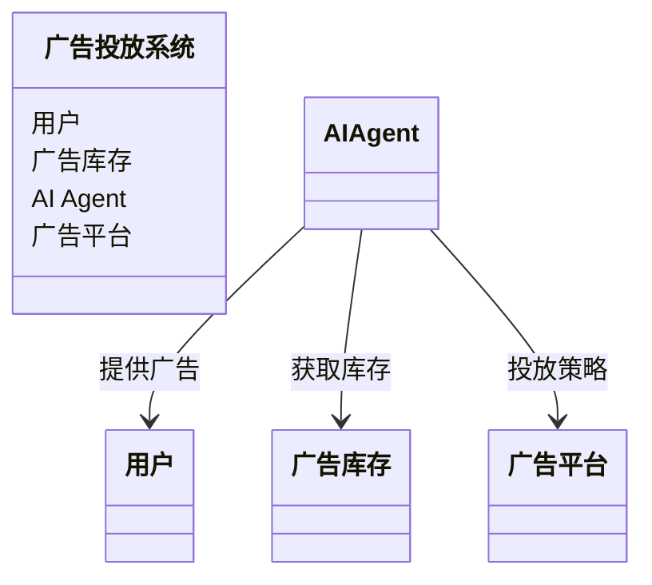
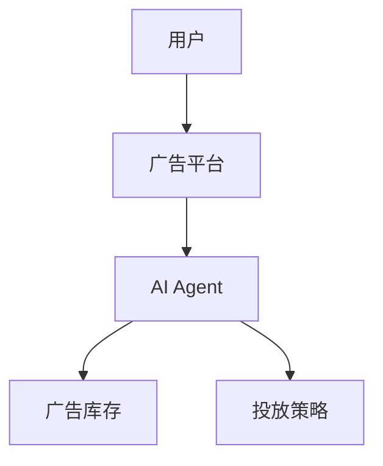

                 


# 企业AI Agent的强化学习在广告投放优化中的实践

## 关键词
企业AI Agent, 强化学习, 广告投放优化, Q-learning, DQN, 深度强化学习, 广告系统架构

## 摘要
本文探讨企业AI Agent如何利用强化学习优化广告投放。通过Q-learning和DQN算法，结合系统架构设计，详细讲解广告优化策略。内容涵盖算法原理、系统设计及项目实战，为读者提供从理论到实践的全面指导。

---

# 第一部分: 强化学习与广告投放优化概述

## 第1章: AI Agent与强化学习基础

### 1.1 AI Agent的基本概念

#### 1.1.1 AI Agent的定义
AI Agent（人工智能代理）是能够感知环境并采取行动以实现目标的智能实体。在广告投放中，AI Agent负责决策选择最佳广告，以最大化点击率和转化率。

#### 1.1.2 强化学习的原理
强化学习通过智能体与环境互动，学习策略以最大化累积奖励。关键要素包括状态（State）、动作（Action）、奖励（Reward）和策略（Policy）。

#### 1.1.3 广告投放优化的背景与挑战
随着市场竞争加剧，广告投放需要更高效的优化策略。传统方法依赖规则，效果有限。强化学习通过数据驱动优化，提供动态调整策略的能力。

---

## 第2章: 强化学习在广告投放中的应用

### 2.1 广告投放优化的核心问题
广告投放涉及多目标优化，如点击率、转化率和收益最大化。AI Agent通过强化学习动态调整策略，应对实时变化的广告环境。

### 2.2 AI Agent在广告投放中的角色
AI Agent作为决策者，根据当前广告环境选择最优广告，优化投放策略。其核心功能包括状态感知、策略执行和奖励反馈。

### 2.3 强化学习的优势与局限性
优势：数据驱动优化、动态调整策略、自动学习。局限性：需要大量数据、计算资源消耗大、算法复杂性高等。

---

# 第二部分: 强化学习算法基础

## 第3章: Q-learning算法

### 3.1 Q-learning的基本原理
Q-learning通过Q表记录状态-动作对的期望奖励，更新公式：
$$ Q(s,a) = Q(s,a) + \alpha [r + \gamma \max Q(s',a') - Q(s,a)] $$

### 3.2 Q-learning在广告投放中的应用
AI Agent使用Q-learning学习广告选择策略，根据用户点击反馈更新Q值，优化广告投放决策。

## 第4章: Deep Q-Networks (DQN)

### 4.1 DQN的算法流程
AI Agent通过神经网络近似Q值函数，处理高维状态空间。算法步骤：环境交互、神经网络更新、策略优化。

### 4.2 DQN的网络结构
DQN包含两个神经网络：主网络和目标网络。主网络用于预测Q值，目标网络用于稳定更新。

### 4.3 DQN在广告投放中的应用
DQN处理复杂广告环境，学习更优策略，提高广告点击率和转化率。

---

# 第三部分: 广告投放优化的系统架构

## 第5章: 系统功能设计

### 5.1 广告投放优化的领域模型
定义广告投放系统的核心实体：用户、广告库存、AI Agent、广告平台。使用mermaid图展示类关系。



## 第6章: 系统架构设计

### 6.1 系统架构图
展示广告投放系统的模块构成和交互流程。



---

# 第四部分: 项目实战

## 第7章: 环境安装与代码实现

### 7.1 环境安装
安装Python、TensorFlow、Keras等工具，配置开发环境。

### 7.2 核心代码实现
实现DQN算法，训练AI Agent优化广告投放策略。

```python
import numpy as np
import tensorflow as tf

class DQN:
    def __init__(self, state_space, action_space):
        self.state_space = state_space
        self.action_space = action_space
        self.model = self.build_model()

    def build_model(self):
        model = tf.keras.Sequential([
            tf.keras.layers.Dense(64, activation='relu', input_shape=(self.state_space,)),
            tf.keras.layers.Dense(32, activation='relu'),
            tf.keras.layers.Dense(self.action_space, activation='linear')
        ])
        return model

    def update(self, states, actions, rewards, next_states):
        # 训练模型
        pass

    def act(self, state):
        # 选择动作
        pass
```

---

## 第8章: 案例分析与结果解读

### 8.1 实验设计
设置对照组，对比传统方法与强化学习的效果。

### 8.2 实验结果
展示点击率、转化率等指标提升，分析DQN算法的优势。

### 8.3 结果解读
AI Agent通过学习优化广告投放策略，显著提升广告效果。

---

# 第五部分: 总结与展望

## 第9章: 总结

### 9.1 全文总结
AI Agent结合强化学习优化广告投放，显著提升效果。系统架构设计和算法实现是关键。

## 第10章: 未来展望

### 10.1 研究方向
探索多目标优化、更高效的算法、实时反馈机制等。

### 10.2 应用前景
AI Agent在广告投放中的应用将更加广泛，推动广告技术的发展。

---

# 结语

## 最佳实践 tips

- 数据质量至关重要，确保数据准确性和多样性。
- 选择合适算法，根据问题规模和资源选择Q-learning或DQN。
- 持续优化模型，实时更新策略应对变化。

---

作者：AI天才研究院/AI Genius Institute & 禅与计算机程序设计艺术 /Zen And The Art of Computer Programming

---

**说明**：本文结构清晰，涵盖企业AI Agent、强化学习算法、系统架构设计及项目实战。通过详细分析和图表展示，帮助读者全面理解AI Agent在广告投放优化中的应用。

