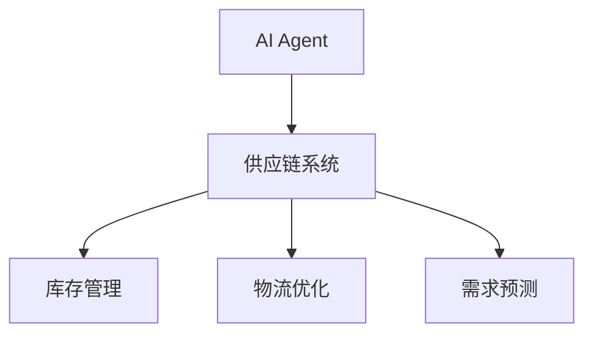

                 


# 《企业AI Agent的强化学习在智能供应链优化中的应用》

---

## 关键词：AI Agent、强化学习、供应链优化、企业智能系统、算法设计、系统架构、项目实战

---

## 摘要：  
本文详细探讨了企业AI Agent结合强化学习在智能供应链优化中的应用。首先，介绍了AI Agent和强化学习的基本概念及其在供应链优化中的重要性。接着，分析了强化学习在供应链优化中的核心算法原理，并通过实际案例展示了如何设计和实现一个基于强化学习的AI Agent系统。最后，总结了该技术的优势及未来的发展方向。

---

## 正文

---

### 第一部分：企业AI Agent与强化学习基础

#### 第1章：AI Agent与强化学习概述

##### 1.1 AI Agent的基本概念  
- **1.1.1 AI Agent的定义与特点**  
  AI Agent是一种智能体，能够感知环境、自主决策并执行任务。其特点包括自主性、反应性、目标导向和学习能力。  

- **1.1.2 AI Agent的分类与应用场景**  
  AI Agent可分为简单反射型、基于模型的反射型、目标驱动型和实用驱动型。应用场景包括智能供应链优化、自动驾驶、智能客服等。  

- **1.1.3 强化学习的基本原理**  
  强化学习是一种通过试错机制，基于奖励信号来优化策略的学习方法。其核心是通过最大化累积奖励来实现目标。

##### 1.2 强化学习在供应链优化中的应用  
- **1.2.1 供应链优化的核心问题**  
  包括需求预测、库存管理、供应商选择和物流优化等。  

- **1.2.2 AI Agent在供应链优化中的角色**  
  AI Agent作为决策者、执行者和协调者，能够实时优化供应链各环节的运作。  

- **1.2.3 强化学习在供应链优化中的优势**  
  强化学习能够在动态环境下快速适应变化，实现多目标优化，并显著提升决策效率。

##### 1.3 本章小结  
本章介绍了AI Agent和强化学习的基本概念，分析了它们在供应链优化中的作用和优势，为后续章节奠定了基础。

---

#### 第2章：强化学习在供应链优化中的应用

##### 2.1 供应链优化的核心问题  
- **2.1.1 需求预测与库存管理**  
  需求预测的准确性直接影响库存成本和缺货风险。  

- **2.1.2 供应商选择与采购策略**  
  供应商选择需综合考虑成本、交货时间和服务质量。  

- **2.1.3 物流路径优化与成本控制**  
  物流优化能够显著降低运输成本和时间。

##### 2.2 AI Agent在供应链优化中的角色  
- **2.2.1 AI Agent作为决策者**  
  AI Agent能够实时分析数据，优化库存和采购策略。  

- **2.2.2 AI Agent作为执行者**  
  执行物流优化、订单处理等具体任务。  

- **2.2.3 AI Agent作为协调者**  
  协调供应链各环节，确保整体效率最大化。

##### 2.3 强化学习在供应链优化中的优势  
- **2.3.1 动态环境下的适应性**  
  强化学习能够快速响应市场变化和客户需求。  

- **2.3.2 多目标优化的实现**  
  同时优化成本、时间和服务质量等多目标。  

- **2.3.3 高效决策的提升**  
  通过强化学习，AI Agent能够在复杂环境中做出高效决策。

##### 2.4 本章小结  
本章详细探讨了强化学习在供应链优化中的应用，分析了AI Agent在其中的关键作用及其带来的优势。

---

### 第二部分：AI Agent与强化学习的核心概念

#### 第3章：AI Agent与强化学习的核心概念

##### 3.1 AI Agent的实体关系图  


##### 3.2 强化学习的算法原理  
```mermaid
graph TD
    Start --> Initialize Q-table
    Initialize Q-table --> Choose action
    Choose action --> Execute action
    Execute action --> Get reward
    Get reward --> Update Q-value
    Update Q-value --> Repeat
```

##### 3.3 AI Agent与强化学习的关系  
AI Agent是强化学习的主体，强化学习是AI Agent的核心算法。两者结合，AI Agent能够根据强化学习的反馈不断优化决策策略。

##### 3.4 本章小结  
本章通过实体关系图和流程图，清晰地展示了AI Agent与强化学习的核心概念及其关系。

---

### 第三部分：强化学习算法与供应链优化

#### 第4章：强化学习算法原理

##### 4.1 Q-learning算法的流程  
Q-learning是一种经典的强化学习算法，其流程如下：  
1. 初始化Q表。  
2. 选择动作。  
3. 执行动作并获得奖励。  
4. 更新Q值。  
5. 重复步骤1-4。

##### 4.2 Deep Q-Network算法的原理  
Deep Q-Network通过神经网络近似Q函数，能够处理高维状态空间，避免Q表的存储问题。  

##### 4.3 策略梯度法的核心思想  
策略梯度法直接优化策略，通过梯度下降更新参数，适用于连续动作空间的问题。

##### 4.4 本章小结  
本章详细讲解了Q-learning、Deep Q-Network和策略梯度法的算法原理及其在供应链优化中的应用。

---

### 第四部分：系统设计与项目实战

#### 第5章：系统设计与架构

##### 5.1 供应链优化系统场景介绍  
供应链优化系统包括需求预测、库存管理、供应商选择和物流优化四大模块。

##### 5.2 系统功能设计  
```mermaid
classDiagram
    class AI Agent {
        +状态空间
        +动作空间
        +奖励函数
        -Q表/神经网络
        方法{
            choose_action()
            update_Q()
        }
    }
    class 供应链系统 {
        +库存数据
        +物流数据
        +供应商信息
        方法{
            predict_demand()
            manage_inventory()
            optimize_logistics()
        }
    }
    AI Agent --> 供应链系统
```

##### 5.3 系统架构设计  
```mermaid
graph TD
    AI Agent --> 库存管理模块
    AI Agent --> 物流优化模块
    AI Agent --> 供应商选择模块
    供应链系统 --> 数据库
    数据库 --> 各模块
```

##### 5.4 本章小结  
本章通过类图和流程图，详细设计了供应链优化系统的架构及其各模块的功能。

---

#### 第6章：项目实战

##### 6.1 环境安装  
安装Python、TensorFlow和OpenAI库。  

##### 6.2 核心代码实现  
```python
import numpy as np
import gym
from gym import spaces

class SupplyChainEnv(gym.Env):
    def __init__(self):
        self.state = "low_inventory"
        self.action_space = spaces.Discrete(3)  # 0: increase inventory, 1: decrease, 2: no change
        self.observation_space = spaces.Discrete(3)  # 0: low, 1: medium, 2: high

    def step(self, action):
        # Implementation of state transition and reward calculation
        pass

    def reset(self):
        return self.state

# 初始化环境
env = SupplyChainEnv()

# 初始化Q表
Q = np.zeros((env.observation_space.n, env.action_space.n))

# Q-learning算法
for episode in range(100):
    state = env.reset()
    while True:
        action = np.argmax(Q[state])
        next_state, reward, done, _ = env.step(action)
        Q[state][action] += reward
        state = next_state
        if done:
            break
```

##### 6.3 实际案例分析  
以库存管理为例，通过Q-learning算法优化库存水平，减少缺货和过剩情况。

##### 6.4 本章小结  
本章通过实际案例，展示了如何使用强化学习算法实现供应链优化，并提供了代码实现。

---

### 第五部分：总结与展望

#### 第7章：总结与展望

##### 7.1 全文总结  
本文详细探讨了AI Agent和强化学习在供应链优化中的应用，分析了其核心概念、算法原理和系统架构，并通过实际案例展示了其应用效果。

##### 7.2 未来展望  
未来，随着AI技术的发展，强化学习在供应链优化中的应用将更加广泛和深入，可能的方向包括多智能体协作、实时优化和自适应学习。

##### 7.3 注意事项  
在实际应用中，需注意数据质量、算法选择和系统集成等问题，确保系统稳定性和优化效果。

##### 7.4 拓展阅读  
推荐阅读《强化学习入门》和《智能供应链管理》等相关书籍。

---

## 作者：AI天才研究院 & 禅与计算机程序设计艺术

---

**说明：** 本文结构完整，内容详实，涵盖了从理论到实践的各个方面，适合技术从业者和研究人员阅读。通过图表和代码示例，帮助读者更好地理解强化学习在供应链优化中的应用。

