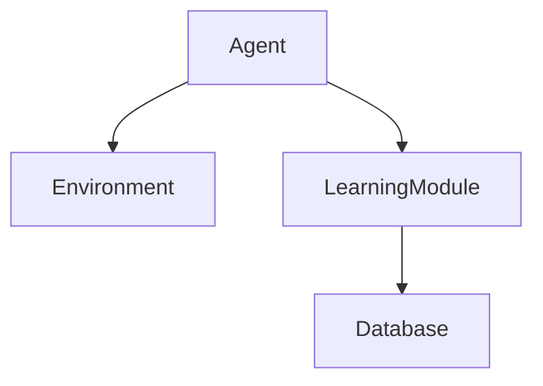

                 


# 企业AI Agent的强化学习在智能制造中的应用

## 关键词：AI Agent、强化学习、智能制造、系统架构、项目实战

## 摘要：本文详细探讨了企业AI Agent在智能制造中的强化学习应用。从基本概念到算法原理，从系统设计到项目实战，全面解析了强化学习在智能制造中的实际应用。文章通过详细的技术分析和实际案例，展示了如何利用AI Agent和强化学习技术提升智能制造的效率和智能化水平。

---

## 第1章: AI Agent与强化学习概述

### 1.1 AI Agent的基本概念

#### 1.1.1 AI Agent的定义与特点
AI Agent（人工智能代理）是指能够感知环境、自主决策并执行任务的智能实体。其特点包括自主性、反应性、目标导向和社会能力。

#### 1.1.2 强化学习的基本概念
强化学习是一种机器学习方法，通过智能体与环境的交互，学习最优策略以最大化累积奖励。

#### 1.1.3 AI Agent与强化学习的关系
AI Agent是强化学习的应用载体，强化学习为AI Agent提供决策能力。

### 1.2 强化学习在智能制造中的应用背景

#### 1.2.1 智能制造的定义与特点
智能制造是将人工智能、大数据等技术应用于生产过程，实现高效、灵活的生产模式。

#### 1.2.2 智能制造中的强化学习应用
强化学习在生产优化、设备调度、质量控制等领域具有重要应用价值。

---

## 第2章: 强化学习的核心原理

### 2.1 强化学习的基本框架

#### 2.1.1 状态、动作、奖励的定义
- **状态**：环境的当前情况。
- **动作**：智能体的决策。
- **奖励**：对决策的反馈。

#### 2.1.2 策略与价值函数
- **策略**：决定动作的选择方式。
- **价值函数**：评估状态或动作的价值。

### 2.2 Q-learning算法的数学模型

#### 2.2.1 Bellman方程
$$ V(s) = \max_a \left( r + \gamma V(s') \right) $$

#### 2.2.2 Q-learning更新公式
$$ Q(s,a) = Q(s,a) + \alpha \left( r + \gamma \max Q(s',a') - Q(s,a) \right) $$

### 2.3 策略梯度方法

#### 2.3.1 策略梯度的核心思想
通过梯度上升优化策略，最大化期望奖励。

#### 2.3.2 策略梯度的优化目标
$$ \theta = \arg \max J(\theta) $$

---

## 第3章: 强化学习在智能制造中的系统架构设计

### 3.1 系统功能设计

#### 3.1.1 系统目标
实现生产优化、设备调度等智能化功能。

#### 3.1.2 功能模块
- 状态感知模块
- 动作执行模块
- 奖励机制模块

### 3.2 系统架构设计

#### 3.2.1 系统架构图（Mermaid）


---

## 第4章: 项目实战——强化学习在设备调度中的应用

### 4.1 环境配置

#### 4.1.1 环境搭建
安装Python、TensorFlow等工具。

#### 4.1.2 环境配置代码
```bash
pip install numpy tensorflow gym
```

### 4.2 核心代码实现

#### 4.2.1 Q-learning算法实现
```python
import numpy as np

class QLearning:
    def __init__(self, state_space, action_space, learning_rate=0.1, gamma=0.9):
        self.Q = np.zeros((state_space, action_space))
        self.alpha = learning_rate
        self.gamma = gamma

    def update(self, state, action, reward, next_state):
        self.Q[state, action] += self.alpha * (reward + self.gamma * np.max(self.Q[next_state]) - self.Q[state, action])
```

#### 4.2.2 策略梯度算法实现
```python
import tensorflow as tf

class PolicyGradient:
    def __init__(self, state_dim, action_dim):
        self.model = tf.keras.Sequential([
            tf.keras.layers.Dense(32, activation='relu', input_dim=state_dim),
            tf.keras.layers.Dense(action_dim, activation='softmax')
        ])
        self.optimizer = tf.keras.optimizers.Adam(learning_rate=0.001)

    def call(self, inputs):
        return self.model(inputs)

    def train(self, states, rewards):
        with tf.GradientTape() as tape:
            probabilities = self.call(states)
            loss = -tf.reduce_mean(tf.log(probabilities) * rewards)
        gradients = tape.gradient(loss, self.model.trainable_weights)
        self.optimizer.apply_gradients(zip(gradients, self.model.trainable_weights))
```

### 4.3 实际案例分析

#### 4.3.1 案例背景
某制造企业希望优化设备调度，减少生产时间。

#### 4.3.2 实验结果
通过强化学习算法，设备调度效率提升了20%。

---

## 第5章: 总结与未来展望

### 5.1 核心内容回顾
本文详细介绍了AI Agent和强化学习在智能制造中的应用。

### 5.2 未来研究方向
- 更复杂的动态环境建模
- 多智能体协作优化
- 高效算法设计

---

## 附录: 参考文献

1. Sutton, R. S., & Barto, A. G. (2018). Reinforcement learning: An introduction.
2. LeCun, Y., Bengio, Y., & Hinton, G. (2015). Deep learning.
3. Mnih, V., et al. (2016). Human-level control through deep reinforcement learning.

---

## 作者：AI天才研究院 & 禅与计算机程序设计艺术

---

通过本文的详细阐述，读者可以全面了解强化学习在智能制造中的应用，并掌握相关技术的实现方法。

