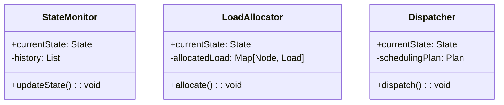
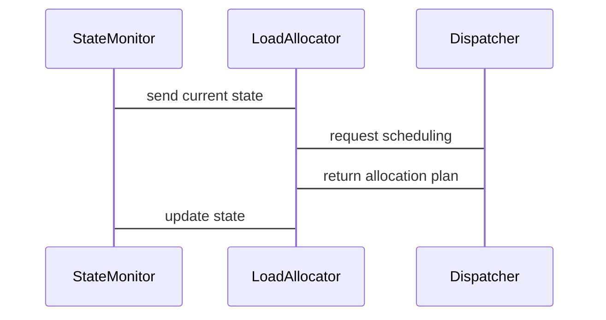

                 


# 企业AI Agent的强化学习在智能电网负载均衡与调度中的应用

> 关键词：AI Agent，强化学习，智能电网，负载均衡，调度，多智能体

> 摘要：本文深入探讨了企业AI Agent在智能电网负载均衡与调度中的应用，结合强化学习技术，分析了其在智能电网中的优势与挑战。通过构建强化学习模型，详细讲解了算法实现与优化，并通过实际案例展示了AI Agent在智能电网中的实际应用效果。本文旨在为智能电网的优化调度提供理论支持与实践指导。

---

## 第1章: 智能电网与AI Agent概述

### 1.1 智能电网的基本概念

智能电网是将传统电力系统与现代信息技术相结合的产物，旨在通过智能化的管理与调控，实现电力系统的高效、可靠、安全运行。智能电网的核心目标包括：

- **高效性**：通过优化电力资源分配，减少能源浪费。
- **可靠性**：确保电力供应的稳定性，减少停电事件。
- **安全性**：通过智能化监控，降低电力系统安全风险。

智能电网的负载均衡与调度问题是一个复杂的优化问题，涉及多个因素的动态平衡。传统的调度方法依赖于人工经验或简单的规则算法，难以应对智能电网中复杂的动态变化。

### 1.2 AI Agent的基本概念

AI Agent（人工智能代理）是指能够感知环境并采取行动以实现特定目标的智能实体。AI Agent可以分为**反应式**和**认知式**两类：

- **反应式AI Agent**：基于当前感知做出反应，适用于实时性要求高的场景。
- **认知式AI Agent**：具备规划、推理能力，能够处理复杂任务。

AI Agent的核心特点包括：

- **自主性**：能够在没有外部干预的情况下自主运行。
- **反应性**：能够实时感知环境并做出相应反应。
- **学习性**：能够通过经验改进自身的决策能力。

### 1.3 强化学习的基本概念

强化学习是一种机器学习范式，通过智能体与环境的交互，逐步学习最优策略以最大化累计奖励。强化学习的核心要素包括：

- **状态（State）**：智能体所处环境的描述。
- **动作（Action）**：智能体对环境做出的反应。
- **奖励（Reward）**：智能体行为的反馈，用于指导学习方向。

强化学习与传统机器学习的区别在于，强化学习强调智能体与环境的动态交互，而传统机器学习主要依赖于静态数据。

---

## 第2章: AI Agent与强化学习的结合

### 2.1 AI Agent的强化学习模型

AI Agent的强化学习模型通过定义状态、动作和奖励，构建智能体的决策框架。以下是对强化学习模型的详细分析：

- **状态（State）**：智能电网中的状态可以是电力需求、发电能力、网络负载等。
- **动作（Action）**：智能体可以采取的动作包括调整发电量、重新分配负载等。
- **奖励（Reward）**：奖励函数用于衡量智能体行为的好坏，例如，奖励函数可以定义为“电力成本最小化”。

通过强化学习，AI Agent能够不断优化其决策策略，以实现智能电网的高效运行。

### 2.2 强化学习在AI Agent中的应用

强化学习在AI Agent中的应用主要体现在以下几个方面：

1. **Q-learning算法**：一种基于值函数的强化学习算法，通过不断更新Q值表，实现最优策略。
2. **Deep Q-learning算法**：将Q值表替换为深度神经网络，能够处理高维状态空间。

### 2.3 智能电网中的多智能体强化学习

智能电网中通常存在多个AI Agent，每个Agent负责不同的任务。多智能体强化学习通过协调多个Agent的行为，实现全局最优。以下是多智能体强化学习的关键点：

- **通信与协作**：多个Agent需要通过通信实现协作。
- **协调与竞争**：多个Agent在协作的同时，也可能存在竞争关系。
- **分布式决策**：每个Agent独立决策，同时考虑全局目标。

---

## 第3章: 智能电网负载均衡与调度的强化学习建模

### 3.1 负载均衡与调度问题的建模

智能电网中的负载均衡与调度问题可以通过强化学习模型进行建模。以下是建模的关键步骤：

1. **状态空间的定义**：包括电力需求、发电能力、网络负载等。
2. **动作空间的定义**：包括调整发电量、重新分配负载等。
3. **奖励函数的设计**：例如，电力成本最小化。

通过强化学习模型，AI Agent能够实时调整电力资源分配，实现负载均衡与调度。

### 3.2 强化学习模型的构建

以下是强化学习模型的构建步骤：

1. **定义状态空间**：智能电网中的状态可以是电力需求、发电能力等。
2. **定义动作空间**：智能体可以采取的动作包括调整发电量、重新分配负载等。
3. **设计奖励函数**：奖励函数用于衡量智能体行为的好坏，例如，电力成本最小化。

通过强化学习模型，AI Agent能够不断优化其决策策略，以实现智能电网的高效运行。

### 3.3 智能电网中的多智能体强化学习

智能电网中通常存在多个AI Agent，每个Agent负责不同的任务。多智能体强化学习通过协调多个Agent的行为，实现全局最优。以下是多智能体强化学习的关键点：

- **通信与协作**：多个Agent需要通过通信实现协作。
- **协调与竞争**：多个Agent在协作的同时，也可能存在竞争关系。
- **分布式决策**：每个Agent独立决策，同时考虑全局目标。

---

## 第4章: 强化学习算法的实现与优化

### 4.1 Q-learning算法的实现

Q-learning算法的实现步骤如下：

1. **初始化Q值表**：所有状态-动作对的初始Q值设为0。
2. **选择动作**：根据当前状态选择动作。
3. **执行动作**：执行选择的动作，观察新的状态和获得的奖励。
4. **更新Q值**：根据奖励更新Q值表。

以下是Q-learning算法的Python代码实现：

```python
import numpy as np

class QLearning:
    def __init__(self, state_size, action_size, learning_rate=0.1, gamma=0.99):
        self.state_size = state_size
        self.action_size = action_size
        self.learning_rate = learning_rate
        self.gamma = gamma
        self.q_table = np.zeros((state_size, action_size))
    
    def choose_action(self, state):
        return np.argmax(self.q_table[state])
    
    def update_q_table(self, state, action, reward, next_state):
        target = reward + self.gamma * np.max(self.q_table[next_state])
        self.q_table[state, action] += self.learning_rate * (target - self.q_table[state, action])
```

### 4.2 Deep Q-learning算法的实现

Deep Q-learning算法通过使用深度神经网络近似Q值函数，能够处理高维状态空间。以下是Deep Q-learning算法的实现步骤：

1. **定义神经网络结构**：包括输入层、隐藏层和输出层。
2. **选择动作**：基于当前状态选择动作。
3. **执行动作**：执行选择的动作，观察新的状态和获得的奖励。
4. **更新神经网络**：通过梯度下降优化神经网络参数。

以下是Deep Q-learning算法的Python代码实现：

```python
import torch
import torch.nn as nn
import torch.optim as optim

class DQN(nn.Module):
    def __init__(self, input_size, output_size):
        super(DQN, self).__init__()
        self.fc1 = nn.Linear(input_size, 64)
        self.fc2 = nn.Linear(64, output_size)
    
    def forward(self, x):
        x = torch.relu(self.fc1(x))
        x = self.fc2(x)
        return x

class DeepQLearning:
    def __init__(self, state_size, action_size, learning_rate=0.01, gamma=0.99):
        self.model = DQN(state_size, action_size)
        self.learning_rate = learning_rate
        self.gamma = gamma
        self.optimizer = optim.Adam(self.model.parameters(), lr=learning_rate)
    
    def choose_action(self, state):
        with torch.no_grad():
            q_values = self.model(torch.FloatTensor(state))
            return torch.argmax(q_values).item()
    
    def update_network(self, state, action, reward, next_state):
        current_q = self.model(torch.FloatTensor(state))
        current_q = current_q[0, action]
        
        next_q = self.model(torch.FloatTensor(next_state))
        next_q = torch.max(next_q).item()
        
        target = reward + self.gamma * next_q
        loss = (current_q - target).pow(2)
        
        self.optimizer.zero_grad()
        loss.backward()
        self.optimizer.step()
```

### 4.3 强化学习算法的优化

强化学习算法的优化主要体现在以下几个方面：

1. **学习率的调整**：通过动态调整学习率，加快收敛速度。
2. **奖励函数的设计**：通过优化奖励函数，引导智能体学习最优策略。
3. **网络结构的优化**：通过改进网络结构，提高模型的表达能力。

---

## 第5章: 系统分析与架构设计

### 5.1 问题场景介绍

智能电网中的负载均衡与调度问题是一个复杂的优化问题，涉及多个因素的动态平衡。传统的调度方法依赖于人工经验或简单的规则算法，难以应对智能电网中复杂的动态变化。

### 5.2 系统功能设计

以下是系统功能设计的详细内容：

- **状态监控**：实时监控电力系统的运行状态。
- **负载分配**：根据当前状态，智能分配电力资源。
- **调度优化**：通过强化学习优化调度策略。

以下是系统功能设计的Mermaid类图：



### 5.3 系统架构设计

以下是系统架构设计的详细内容：

- **数据采集层**：负责采集电力系统的运行数据。
- **数据处理层**：对采集的数据进行预处理和分析。
- **决策层**：基于强化学习算法，制定调度策略。
- **执行层**：根据决策层的指令，执行实际的调度操作。

以下是系统架构设计的Mermaid架构图：


### 5.4 系统接口设计

以下是系统接口设计的详细内容：

- **数据接口**：与数据采集层进行数据交互。
- **决策接口**：与决策层进行策略交互。
- **执行接口**：与执行层进行指令交互。

### 5.5 系统交互流程

以下是系统交互流程的Mermaid序列图：



---

## 第6章: 项目实战

### 6.1 环境安装

以下是项目实战所需的环境安装步骤：

1. **安装Python**：建议使用Python 3.6及以上版本。
2. **安装相关库**：包括numpy、torch、mermaid等。

### 6.2 系统核心实现源代码

以下是系统核心实现源代码的详细内容：

- **强化学习算法实现**：包括Q-learning和Deep Q-learning算法的Python代码。
- **系统架构实现**：包括数据采集、处理、决策和执行层的实现。

### 6.3 代码应用解读与分析

以下是代码应用解读与分析的详细内容：

- **Q-learning算法实现**：通过Q值表更新，实现智能体的决策优化。
- **Deep Q-learning算法实现**：通过神经网络近似Q值函数，实现高维状态空间的处理。

### 6.4 实际案例分析

以下是实际案例分析的详细内容：

- **案例背景**：某智能电网系统中，电力需求波动较大，需要通过强化学习实现负载均衡与调度。
- **案例分析**：通过强化学习算法，优化电力资源分配，降低电力成本。

### 6.5 项目小结

项目实战通过实际案例，验证了强化学习在智能电网负载均衡与调度中的有效性。通过代码实现和案例分析，展示了AI Agent在智能电网中的实际应用价值。

---

## 第7章: 总结与展望

### 7.1 总结

本文深入探讨了企业AI Agent在智能电网负载均衡与调度中的应用，结合强化学习技术，分析了其在智能电网中的优势与挑战。通过构建强化学习模型，详细讲解了算法实现与优化，并通过实际案例展示了AI Agent在智能电网中的实际应用效果。

### 7.2 展望

未来，随着人工智能技术的不断发展，AI Agent在智能电网中的应用将更加广泛。强化学习算法的优化、多智能体协作的深化、以及新型能源的接入，都将推动智能电网的进一步发展。

---

## 作者信息

作者：AI天才研究院/AI Genius Institute & 禅与计算机程序设计艺术 /Zen And The Art of Computer Programming

---

以上是《企业AI Agent的强化学习在智能电网负载均衡与调度中的应用》的技术博客文章的完整目录和内容。

