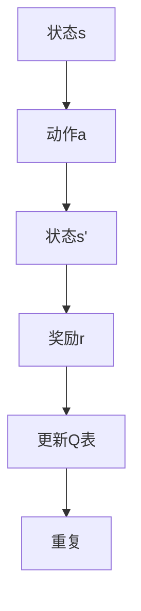

                 


# 企业AI Agent的强化学习在程序化广告投放中的实践

> 关键词：AI Agent，强化学习，程序化广告，广告投放，马尔可夫决策过程，Q-learning算法，广告收益最大化

> 摘要：本文深入探讨了企业AI Agent在程序化广告投放中的应用，重点分析了强化学习在广告投放决策中的核心作用。通过详细讲解强化学习的基本原理、算法实现、系统架构设计以及实际项目案例，本文为读者提供了从理论到实践的全面指导。文章还总结了强化学习在广告投放中的最佳实践，为企业的技术实践提供了宝贵的经验。

---

# 第一部分：企业AI Agent与强化学习的背景

## 第1章：AI Agent与强化学习概述

### 1.1 AI Agent的基本概念

AI Agent（人工智能代理）是指能够感知环境并采取行动以实现目标的智能体。AI Agent的核心特点包括：

- **自主性**：能够在没有外部干预的情况下自主决策。
- **反应性**：能够实时感知环境并做出反应。
- **目标导向性**：通过目标驱动来优化决策。
- **学习能力**：能够通过经验改进自身的决策能力。

AI Agent在企业中的应用非常广泛，尤其是在需要自主决策和优化的场景中，例如供应链管理、金融投资、广告投放等领域。

### 1.2 程序化广告投放的背景与挑战

程序化广告是指通过自动化技术在互联网上投放广告的过程。与传统广告投放相比，程序化广告具有以下优势：

- **精准性**：可以根据用户的行为和特征精准投放广告。
- **效率性**：通过自动化技术提高广告投放的速度和效率。
- **数据驱动**：依赖于大量数据进行决策优化。

然而，程序化广告投放也面临诸多挑战，例如如何在复杂的市场环境中优化广告收益，如何实时调整广告策略以应对市场变化等。这些问题的解决需要借助AI Agent和强化学习技术。

### 1.3 强化学习的基本原理

强化学习是一种机器学习范式，通过智能体与环境的交互来学习最优策略。强化学习的核心要素包括：

- **状态（State）**：智能体所处的环境状态。
- **动作（Action）**：智能体在给定状态下采取的行动。
- **奖励（Reward）**：智能体采取行动后所获得的反馈。
- **策略（Policy）**：智能体在不同状态下选择动作的概率分布。

强化学习的目标是通过不断试错，找到最大化累计奖励的策略。

---

## 第2章：强化学习与程序化广告的核心概念

### 2.1 程序化广告投放中的强化学习模型

在程序化广告投放中，强化学习可以用于解决以下问题：

- **广告点击率预测**：通过强化学习模型预测用户点击广告的概率。
- **广告收益最大化**：通过强化学习算法优化广告投放策略，最大化广告收益。
- **广告策略动态调整**：根据市场环境的变化动态调整广告投放策略。

### 2.2 强化学习在广告投放中的应用

图1展示了强化学习在程序化广告投放中的基本流程：


通过上述流程，强化学习模型能够实时感知用户行为，做出广告投放决策，并根据广告点击的反馈优化策略。

### 2.3 强化学习与传统广告投放的对比

表1对比了强化学习与传统广告投放方法在广告收益、实时性、数据依赖性等方面的差异：

| **维度**       | **传统广告投放** | **强化学习广告投放** |
|----------------|------------------|-----------------------|
| **广告收益**   | 离线计算，收益有限 | 实时优化，收益最大化 |
| **实时性**      | 非实时，周期性调整 | 实时决策，动态优化   |
| **数据依赖性**  | 依赖历史数据     | 依赖实时数据流       |

---

## 第3章：强化学习的数学模型与算法原理

### 3.1 马尔可夫决策过程（MDP）

马尔可夫决策过程是强化学习的核心模型，其定义如下：

- **状态空间（S）**：智能体所处的状态集合。
- **动作空间（A）**：智能体在给定状态下可以采取的动作集合。
- **转移概率（P）**：从状态s采取动作a后转移到状态s'的概率。
- **奖励函数（R）**：智能体采取动作a后所获得的奖励。

马尔可夫决策过程的目标是找到一个策略π，使得累计奖励最大化。

### 3.2 Q-learning算法的数学推导

Q-learning是一种基于值函数的强化学习算法，其核心思想是通过不断更新Q值表来学习最优策略。Q值表的更新公式如下：

$$ Q(s, a) = Q(s, a) + \alpha \cdot (r + \gamma \cdot \max_{a'} Q(s', a') - Q(s, a)) $$

其中：
- α 是学习率。
- γ 是折扣因子。
- r 是即时奖励。
- s' 是下一个状态。

图2展示了Q-learning算法的流程：



### 3.3 程序化广告中的强化学习模型

在程序化广告投放中，强化学习模型需要解决的问题可以建模为一个MDP。例如，广告投放决策可以看作是一个状态转移过程，其中每个状态代表用户的行为特征，动作是广告投放策略，奖励是广告点击带来的收益。

图3展示了程序化广告投放中的MDP模型：


---

## 第4章：程序化广告投放的系统架构设计

### 4.1 系统功能设计

程序化广告投放系统的核心功能模块包括：

- **数据采集模块**：实时采集用户行为数据和广告投放数据。
- **数据处理模块**：对采集到的数据进行清洗、特征提取和预处理。
- **模型训练模块**：基于强化学习算法训练广告投放模型。
- **策略执行模块**：根据模型预测结果动态调整广告投放策略。

### 4.2 系统架构图

图4展示了程序化广告投放系统的整体架构：


### 4.3 项目实战——基于强化学习的程序化广告投放系统

#### 4.3.1 环境搭建与数据准备

- **环境搭建**：安装Python、TensorFlow、OpenAI Gym等依赖库。
- **数据准备**：获取用户行为数据和广告点击数据，进行数据清洗和特征提取。

#### 4.3.2 系统核心实现

以下是基于Q-learning算法的程序化广告投放系统的代码实现：

```python
import numpy as np

class Advertiser:
    def __init__(self, state_space, action_space, learning_rate=0.1, gamma=0.9):
        self.state_space = state_space
        self.action_space = action_space
        self.learning_rate = learning_rate
        self.gamma = gamma
        self.q_table = np.zeros((state_space, action_space))
    
    def get_action(self, state):
        return np.argmax(self.q_table[state])
    
    def update_q_table(self, state, action, reward, next_state):
        current_q = self.q_table[state, action]
        next_max_q = np.max(self.q_table[next_state])
        self.q_table[state, action] = current_q + self.learning_rate * (reward + self.gamma * next_max_q - current_q)

# 示例用法
state_space = 10
action_space = 5
advertiser = Advertiser(state_space, action_space)
state = 0
action = advertiser.get_action(state)
next_state = 1
reward = 1
advertiser.update_q_table(state, action, reward, next_state)
```

#### 4.3.3 实际案例分析

假设我们有一个包含10个状态和5个动作的程序化广告投放系统。通过上述代码，我们可以训练出一个能够最大化广告收益的策略。

---

## 第5章：强化学习在程序化广告投放中的最佳实践

### 5.1 小结

本文详细探讨了企业AI Agent在程序化广告投放中的应用，重点分析了强化学习在广告投放决策中的核心作用。通过理论分析和实际案例，我们展示了如何利用强化学习算法优化广告投放策略。

### 5.2 注意事项

- **数据质量**：强化学习算法的效果高度依赖于数据质量，需要确保数据的完整性和准确性。
- **算法选择**：选择合适的强化学习算法需要根据具体场景和数据特点进行分析。
- **模型调优**：强化学习模型的性能需要通过大量实验进行调优。

### 5.3 拓展阅读

- 建议进一步阅读《强化学习导论》（Introduction to Reinforcement Learning）和《深度强化学习》（Deep Reinforcement Learning）等书籍，以深入了解强化学习的理论和应用。

---

作者：AI天才研究院 & 禅与计算机程序设计艺术

