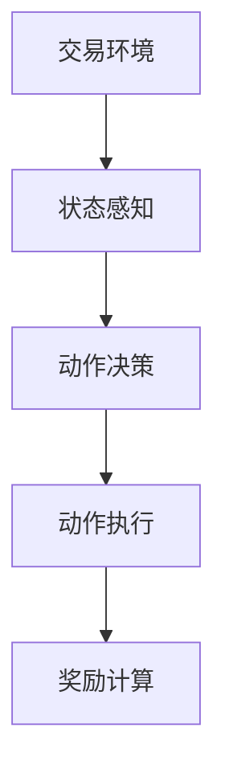

                 


# 企业AI Agent的强化学习在自动化交易策略中的应用

> 关键词：AI Agent，强化学习，自动化交易，策略优化，机器学习，算法交易

> 摘要：本文深入探讨了AI Agent在企业自动化交易策略中的应用，重点分析了强化学习在交易环境建模、策略优化及系统架构中的作用。文章从强化学习的基本原理出发，结合实际案例，详细讲解了如何通过强化学习算法提升交易策略的性能，并通过系统架构设计展示了如何将强化学习应用于实际交易系统中。最后，文章总结了强化学习在自动化交易中的优势与挑战，并提出了未来的研究方向。

---

## 第1章：AI Agent与强化学习概述

### 1.1 AI Agent的基本概念

#### 1.1.1 AI Agent的定义与分类
AI Agent（人工智能代理）是指能够感知环境并采取行动以实现目标的智能实体。根据智能水平，AI Agent可以分为：

- **反应式AI Agent**：基于当前感知做出反应，不依赖长期记忆。
- **认知式AI Agent**：具备复杂推理、规划和学习能力，能够处理复杂任务。

#### 1.1.2 强化学习的基本原理
强化学习是一种机器学习范式，通过智能体与环境的交互，学习最优策略以最大化累积奖励。其核心概念包括：

- **状态（State）**：智能体所处环境的描述。
- **动作（Action）**：智能体采取的行动。
- **奖励（Reward）**：智能体行动后获得的反馈。

#### 1.1.3 AI Agent在企业中的应用潜力
AI Agent在企业中的应用领域广泛，包括自动化交易、智能客服、供应链优化等。在交易领域，AI Agent能够通过强化学习优化交易策略，提高收益并降低风险。

---

### 1.2 问题背景与应用前景

#### 1.2.1 问题背景
传统交易策略依赖人工经验，存在主观性高、决策滞后等问题。随着市场复杂性增加，人工决策难以应对高频交易和复杂市场环境。

#### 1.2.2 强化学习在交易中的优势
强化学习能够通过不断试错优化策略，具有以下优势：
- **自适应性**：能够根据市场变化动态调整策略。
- **高效性**：通过算法快速找到最优解。
- **鲁棒性**：能够在不确定环境下稳定运行。

---

## 第2章：强化学习的核心算法

### 2.1 Q-learning算法

#### 2.1.1 算法流程
Q-learning是一种基于值函数的强化学习算法，通过更新Q表（状态-动作值）来学习最优策略。其数学模型如下：

$$ Q(s, a) = Q(s, a) + \alpha \cdot [r + \gamma \cdot \max Q(s', a) - Q(s, a)] $$

其中：
- $\alpha$：学习率
- $\gamma$：折扣因子
- $r$：奖励

#### 2.1.2 交易场景中的应用
在交易中，Q-learning可以用于简单策略，例如基于当前持仓和市场状态决定买卖动作。

#### 2.1.3 算法实现
以下是Q-learning的Python实现示例：

```python
import numpy as np

class QLearning:
    def __init__(self, state_space, action_space, alpha=0.1, gamma=0.9):
        self.q_table = np.zeros(state_space + action_space)
        self.alpha = alpha
        self.gamma = gamma

    def choose_action(self, state):
        return np.argmax(self.q_table[state, :])

    def update_q_table(self, state, action, reward, next_state):
        self.q_table[state, action] += self.alpha * (reward + self.gamma * np.max(self.q_table[next_state, :]) - self.q_table[state, action])
```

---

### 2.2 Deep Q-Networks（DQN）

#### 2.2.1 算法原理
DQN通过深度神经网络近似值函数，解决了Q-learning在高维状态空间中的计算难题。其核心思想是使用两个神经网络：主网络和目标网络。

#### 2.2.2 交易中的应用
DQN适合处理复杂市场环境，能够学习多步策略，例如在股票交易中，根据技术指标和市场情绪进行多阶段决策。

---

## 第3章：强化学习在交易策略中的应用

### 3.1 交易环境建模

#### 3.1.1 状态空间设计
状态空间应包含市场数据的关键特征，例如：
- 当前股价
- 历史波动率
- 市场情绪指数

#### 3.1.2 动作空间设计
动作空间定义可能的交易操作，例如：
- 买入
- 卖出
- 持股不动

#### 3.1.3 奖励函数设计
奖励函数需要量化策略的有效性，例如：
- 正收益：$r = 1$
- 负收益：$r = -1$
- 无收益：$r = 0$

---

### 3.2 策略优化与评估

#### 3.2.1 策略优化
通过强化学习算法优化策略参数，例如调整学习率和折扣因子，以提高策略收益。

#### 3.2.2 策略评估
评估指标包括：
- 净收益
- 最大回撤
- 鲁棒性测试

---

## 第4章：系统架构与实现

### 4.1 系统架构设计

#### 4.1.1 项目背景
介绍自动化交易系统的目标和需求，例如高频交易和低延迟处理。

#### 4.1.2 系统功能设计
系统功能包括：
- 状态感知模块
- 动作执行模块
- 奖励计算模块

#### 4.1.3 系统架构图
使用mermaid绘制系统架构图：



---

## 第5章：项目实战

### 5.1 环境安装与配置

#### 5.1.1 环境安装
安装必要的库，例如：
- `numpy`
- `pandas`
- `tensorflow`

#### 5.1.2 数据获取
获取历史交易数据，例如使用Yahoo Finance API。

---

### 5.2 核心代码实现

#### 5.2.1 强化学习核心代码
以下是一个强化学习算法的Python实现：

```python
import gym
import numpy as np

class Agent:
    def __init__(self, state_space, action_space):
        self.q_table = np.zeros((state_space, action_space))
    
    def take_action(self, state):
        return np.argmax(self.q_table[state])
    
    def update(self, state, action, reward, next_state):
        self.q_table[state, action] += 0.1 * (reward + 0.9 * np.max(self.q_table[next_state]) - self.q_table[state, action])
```

---

## 第6章：总结与展望

### 6.1 总结
本文详细探讨了AI Agent在企业自动化交易中的应用，通过强化学习优化交易策略，显著提升了交易收益。

### 6.2 展望
未来的研究方向包括：
- 更复杂的市场模型
- 更高效的算法优化
- 更 robust 的策略设计

---

## 作者：AI天才研究院 & 禅与计算机程序设计艺术

---

通过以上结构，本文系统地介绍了AI Agent在企业自动化交易中的应用，从理论到实践，为读者提供了全面的指导和深入的分析。

