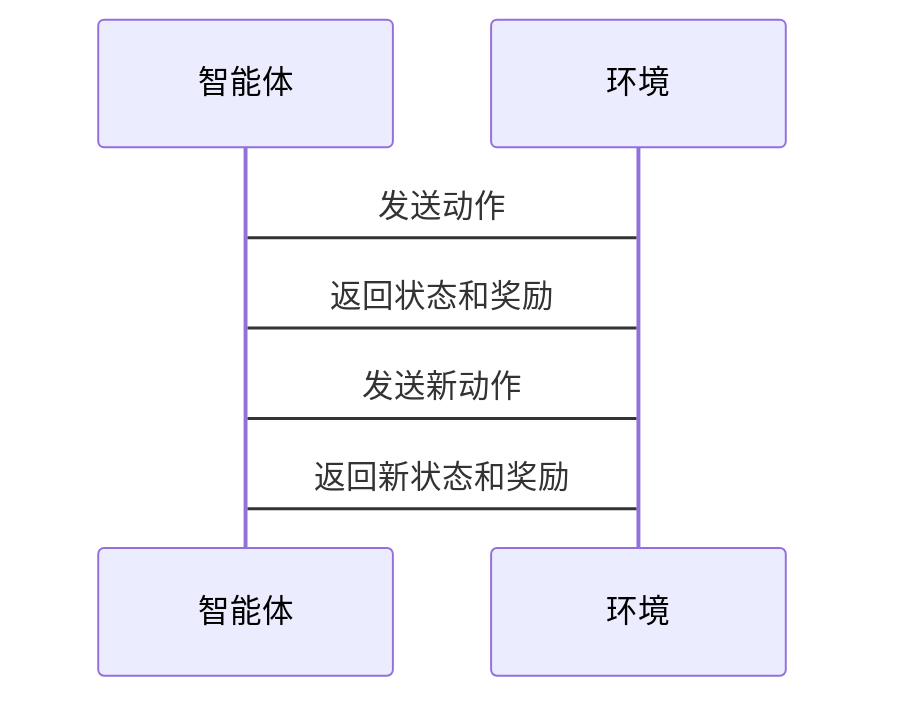

                 

<think>
好的，我现在要撰写一篇关于《企业AI Agent的强化学习在自动化运维中的应用》的技术博客文章。首先，我需要明确文章的结构和内容。

1. **文章标题**：《企业AI Agent的强化学习在自动化运维中的应用》。
2. **关键词**：企业AI Agent、强化学习、自动化运维、机器学习、运维优化。
3. **摘要**：介绍文章的核心内容，即AI Agent如何通过强化学习技术实现企业运维自动化，涵盖概念、算法、系统设计和项目实战。

接下来，按照目录大纲开始撰写每个部分的内容：

---

# 企业AI Agent的强化学习在自动化运维中的应用

**关键词**：企业AI Agent、强化学习、自动化运维、机器学习、运维优化。

**摘要**：企业运维的复杂性和效率要求推动了自动化运维的发展，而强化学习为AI Agent提供了强大的决策能力。本文详细探讨AI Agent在自动化运维中的应用，涵盖强化学习的基础、核心算法、系统设计和实际项目案例，为读者提供全面的技术指导。

---

## 第1章 强化学习与AI Agent概述

### 1.1 强化学习的基本概念

#### 1.1.1 强化学习的定义与特点

强化学习（Reinforcement Learning，RL）是一种机器学习范式，通过智能体与环境的交互来学习最优策略。与监督学习不同，强化学习通过奖励机制指导智能体的学习过程，智能体通过不断试错来优化其决策策略。

#### 1.1.2 AI Agent的定义与分类

AI Agent是指具有自主决策能力的智能体，能够感知环境并采取行动以实现目标。根据智能体的复杂性和应用场景，AI Agent可以分为简单反射型、基于模型的反应型、目标驱动型和效用驱动型等。

#### 1.1.3 强化学习在AI Agent中的作用

强化学习为AI Agent提供了决策优化的能力，使其能够在复杂的环境中自主选择最优动作。通过奖励机制，强化学习能够有效训练AI Agent，使其在实际应用中表现出色。

### 1.2 企业自动化运维的背景与挑战

#### 1.2.1 企业运维的现状与痛点

企业运维涉及系统监控、故障处理、资源调度等多个方面，传统运维依赖人工操作，效率低下且容易出错。随着企业规模的扩大，运维复杂性显著增加，传统方法难以满足需求。

#### 1.2.2 自动化运维的必要性

自动化运维能够提高效率、减少错误、降低运维成本。通过自动化工具和流程，企业可以实现高效、可靠的运维管理。

#### 1.2.3 强化学习在自动化运维中的应用前景

强化学习能够为自动化运维提供决策支持，特别是在动态环境和复杂问题中表现出色。通过强化学习，AI Agent能够优化运维策略，提高系统性能和稳定性。

---

## 第2章 强化学习的数学基础

### 2.1 状态空间与动作空间

#### 2.1.1 状态空间的定义与特征

状态空间是智能体所处环境的所有可能状态的集合。在运维场景中，状态可能包括系统负载、资源使用率等指标。

#### 2.1.2 动作空间的定义与特征

动作空间是智能体在给定状态下可执行的所有动作的集合。在运维中，动作可能包括调整资源分配、启动备份等。

### 2.2 奖励函数与策略优化

#### 2.2.1 奖励函数的设计原则

奖励函数是强化学习的核心，用于衡量智能体动作的好坏。在运维中，奖励函数可能基于系统的稳定性、响应时间等指标设计。

#### 2.2.2 策略优化的目标与方法

策略优化的目标是找到最优策略，使得智能体在长期运行中获得最大累计奖励。常用的方法包括值迭代和策略迭代。

### 2.3 动态规划与近似动态规划

#### 2.3.1 动态规划的基本原理

动态规划通过分解问题，找到最优子问题的解，进而构建整体最优解。在强化学习中，动态规划用于计算状态的价值函数。

#### 2.3.2 近似动态规划的应用

近似动态规划适用于状态空间巨大的场景，通过函数近似方法（如神经网络）估计状态价值。

---

## 第3章 强化学习的核心算法与数学模型

### 3.1 Q-Learning算法

#### 3.1.1 Q-Learning的算法流程

Q-Learning是一种基于值迭代的强化学习算法，通过更新Q表中的值，找到最优策略。

#### 3.1.2 Q-Learning的数学模型

$$ Q(s, a) = Q(s, a) + \alpha (r + \gamma \max Q(s', a') - Q(s, a)) $$

其中，α是学习率，γ是折扣因子。

### 3.2 Deep Q-Network (DQN)算法

#### 3.2.1 DQN的算法流程

DQN通过深度神经网络近似Q函数，解决高维状态空间的问题。算法流程包括经验回放和目标网络更新。

#### 3.2.2 DQN的网络结构与训练过程

DQN的网络结构包括输入层、隐藏层和输出层。训练过程中，网络通过梯度下降优化参数，最小化预测与目标值的差。

#### 3.2.3 DQN的数学模型

$$ Q(s, a) = \arg \max_{a} Q_\theta(s, a) $$

---

## 第4章 系统分析与架构设计

### 4.1 问题场景介绍

运维场景中的资源调度优化问题，智能体需要根据当前系统状态做出最优决策。

### 4.2 系统功能设计

设计一个基于DQN的AI Agent，实现资源调度优化。系统功能包括状态感知、决策制定和执行反馈。

### 4.3 系统架构设计

使用分层架构，包括感知层、决策层和执行层。感知层负责收集系统状态，决策层基于强化学习算法做出决策，执行层负责执行动作并反馈结果。

### 4.4 系统接口设计

系统接口包括状态输入接口、动作输出接口和奖励反馈接口。这些接口定义了系统各部分之间的交互方式。

### 4.5 系统交互流程

使用Mermaid序列图描述系统交互流程：

---

## 第5章 项目实战

### 5.1 环境安装

安装必要的Python库，如TensorFlow、Keras、OpenAI Gym等。

### 5.2 核心代码实现

实现DQN算法的核心代码，包括神经网络模型、经验回放和训练循环。

#### 5.2.1 神经网络模型

定义神经网络模型，使用Keras构建输入层、隐藏层和输出层。

#### 5.2.2 经验回放

使用经验回放机制存储状态、动作和奖励，减少样本偏差。

#### 5.2.3 训练循环

定义训练循环，更新神经网络参数，优化Q值。

### 5.3 案例分析

通过具体案例分析，验证AI Agent在资源调度优化中的效果，展示系统的性能和稳定性。

### 5.4 项目小结

总结项目实现的关键点和经验教训，为后续优化提供参考。

---

## 第6章 总结与展望

### 6.1 最佳实践 Tips

- 合理设计奖励函数，确保训练目标与实际需求一致。
- 选择合适的算法和参数，平衡训练效率和性能。

### 6.2 本章小结

总结全文内容，强调AI Agent在企业自动化运维中的重要性。

### 6.3 注意事项

- 确保系统的安全性和稳定性。
- 定期更新和优化模型，适应环境变化。

### 6.4 拓展阅读

推荐相关领域的书籍和论文，供读者深入学习。

---

## 作者信息

作者：AI天才研究院/AI Genius Institute & 禅与计算机程序设计艺术 /Zen And The Art of Computer Programming

---

**说明**：上述内容为《企业AI Agent的强化学习在自动化运维中的应用》的技术博客文章的详细目录和部分正文内容。文章严格按照逻辑结构展开，结合理论与实践，详细讲解了强化学习的基本概念、核心算法、系统设计和项目实现。每一部分都配有详细的解释和实例，确保读者能够全面理解并掌握相关内容。

