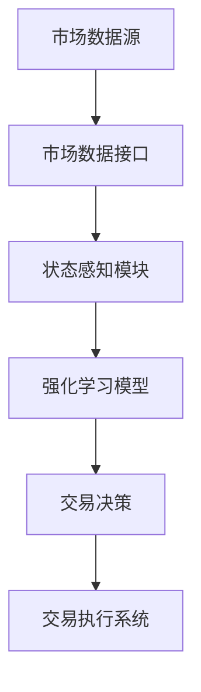
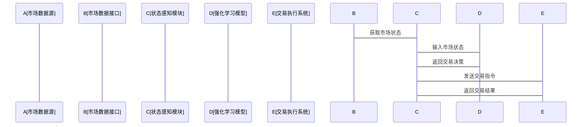

                 


# 企业AI Agent的强化学习在金融交易中的应用

> 关键词：企业AI Agent，强化学习，金融交易，Q-learning，策略梯度，风险管理

> 摘要：本文探讨了企业AI Agent在金融交易中的应用，重点分析了强化学习技术在金融交易中的实现与优化。通过详细阐述强化学习的数学基础、算法实现、系统架构设计以及实际项目案例，本文为读者提供了一个全面理解企业AI Agent在金融交易中应用的框架。

---

# 第一部分: 企业AI Agent的强化学习基础

## 第1章: 强化学习与AI Agent概述

### 1.1 强化学习的基本概念
强化学习（Reinforcement Learning, RL）是一种机器学习范式，通过智能体（Agent）与环境交互，学习如何做出决策以最大化累积奖励。其核心在于通过试错机制优化策略，使智能体能够在动态环境中做出最优决策。

- **智能体（Agent）**：智能体是强化学习中的主体，负责感知环境并采取行动。在金融交易中，AI Agent可以看作是一个自动化交易系统。
- **环境（Environment）**：环境是智能体所处的外部世界。在金融交易中，环境可以是股票市场、外汇市场等，智能体通过与环境交互获得状态信息。
- **状态（State）**：状态是环境在某一时刻的描述，反映了当前的市场情况。例如，股票的价格、成交量等。
- **动作（Action）**：动作是智能体在给定状态下采取的操作，例如买入、卖出或持有。
- **奖励（Reward）**：奖励是对智能体行为的反馈，通常以数值形式表示，用于指导智能体的行为优化。

### 1.2 金融交易中的强化学习应用背景
金融交易的复杂性和不确定性使得传统的方法难以应对市场的快速变化。强化学习作为一种数据驱动的决策方法，具有以下优势：

1. **动态适应性**：强化学习能够根据市场变化动态调整策略，适合金融市场的不确定性。
2. **非线性关系建模**：强化学习擅长处理复杂的非线性关系，能够捕捉市场中的隐含规律。
3. **自动化决策**：通过训练强化学习模型，可以实现交易策略的自动化，减少人为干预。

### 1.3 本章小结
本章介绍了强化学习的基本概念和AI Agent的核心概念，重点分析了强化学习在金融交易中的应用背景和优势。

---

## 第2章: 强化学习的数学基础

### 2.1 状态、动作与奖励函数
- **状态空间**：状态空间是所有可能状态的集合，通常用S表示。在金融交易中，状态可能包括当前的价格、市场情绪等。
- **动作空间**：动作空间是所有可能动作的集合，通常用A表示。在金融交易中，动作可能是买入、卖出或持有。
- **奖励函数**：奖励函数r(s, a)定义了智能体在状态s下采取动作a后获得的奖励。

### 2.2 Q-learning算法的数学模型
Q-learning是一种经典的强化学习算法，通过学习状态-动作值函数（Q-value）来优化决策。其核心公式如下：

$$ Q(s, a) = Q(s, a) + \alpha (r + \gamma \max Q(s', a') - Q(s, a)) $$

其中：
- Q(s, a)：当前状态下采取动作a的Q值。
- $\alpha$：学习率，控制更新步长。
- $\gamma$：折扣因子，平衡当前奖励和未来奖励的重要性。
- $s'$：采取动作a后的下一个状态。

### 2.3 策略梯度方法的数学模型
策略梯度方法通过优化策略参数$\theta$来最大化期望奖励。其基本公式为：

$$ \nabla \theta J(\theta) = \mathbb{E}[ \nabla \log \pi(a|s) Q(s,a) ] $$

其中：
- $\pi(a|s)$：策略函数，表示在状态s下采取动作a的概率。
- $Q(s,a)$：状态-动作值函数。

### 2.4 本章小结
本章详细介绍了强化学习的数学基础，包括状态、动作、奖励函数，以及Q-learning和策略梯度算法的数学模型。

---

## 第3章: AI Agent在金融交易中的应用

### 3.1 金融市场的强化学习环境构建
- **状态定义**：在金融交易中，状态可能包括当前价格、成交量、市场情绪等。
- **动作定义**：动作可能包括买入、卖出或持有。
- **奖励函数设计**：奖励函数通常基于交易收益，例如：$r = \text{收益} - \text{交易成本}$。

### 3.2 基于强化学习的交易策略
- **基于Q-learning的交易策略**：通过训练Q值函数，智能体可以学习在不同状态下采取最优动作。
- **基于策略梯度的交易策略**：通过优化策略参数，智能体能够直接学习最优交易策略。

### 3.3 金融市场的风险控制
- **风险控制的强化学习建模**：通过引入风险因子，强化学习模型可以更好地平衡收益与风险。
- **基于强化学习的风险控制策略**：智能体可以根据当前风险状况调整交易策略，例如减少杠杆或增加头寸。

### 3.4 本章小结
本章探讨了AI Agent在金融交易中的具体应用，包括环境构建、交易策略优化和风险控制。

---

## 第4章: 强化学习算法的实现

### 4.1 策略网络的实现
- **神经网络结构设计**：策略网络通常采用多层感知机（MLP）结构，输入为市场状态，输出为动作概率。
- **网络权重更新**：通过梯度下降方法优化网络参数，例如Adam优化器。

### 4.2 值函数网络的实现
- **值函数网络的结构设计**：值函数网络通常采用类似的神经网络结构，输入为市场状态，输出为状态值。
- **值函数的更新公式**：通过强化学习算法更新值函数，例如Q-learning或策略梯度方法。

### 4.3 强化学习算法的超参数调优
- **学习率的调整**：学习率$\alpha$的大小影响模型收敛速度和稳定性。
- **奖励衰减因子的设置**：折扣因子$\gamma$的大小影响未来奖励的重要性。
- **探索与利用的平衡**：通过策略如$\epsilon$-贪心策略平衡探索新策略和利用已知最优策略。

### 4.4 本章小结
本章详细介绍了强化学习算法的实现过程，包括策略网络和值函数网络的设计与优化。

---

## 第5章: 企业AI Agent的系统架构设计

### 5.1 项目介绍
企业AI Agent系统用于金融交易的自动化决策，通过强化学习算法优化交易策略。

### 5.2 系统功能设计
- **市场数据接口**：与金融市场数据源对接，获取实时市场数据。
- **状态感知模块**：分析市场数据，生成智能体的状态输入。
- **决策模块**：基于强化学习模型生成交易决策。
- **执行模块**：将交易决策发送至交易系统执行。

### 5.3 系统架构设计
以下是系统架构的Mermaid图：



### 5.4 系统接口设计
- **市场数据接口**：提供市场数据查询和订阅功能。
- **交易执行接口**：提供交易指令的发送和执行结果查询功能。

### 5.5 系统交互设计
以下是系统交互的Mermaid图：



### 5.6 本章小结
本章详细介绍了企业AI Agent系统的架构设计，包括功能模块、接口设计和系统交互流程。

---

## 第6章: 项目实战

### 6.1 环境配置
- **安装依赖**：安装必要的Python库，例如TensorFlow、Keras、Pandas等。
- **数据获取**：从金融数据源获取历史数据，例如K线数据、成交量等。

### 6.2 核心代码实现
以下是Q-learning算法的核心代码示例：

```python
import numpy as np

class QLearning:
    def __init__(self, state_space_size, action_space_size):
        self.state_space_size = state_space_size
        self.action_space_size = action_space_size
        self.Q = np.zeros((state_space_size, action_space_size))
    
    def get_action(self, state, epsilon=0.1):
        if np.random.random() < epsilon:
            return np.random.randint(self.action_space_size)
        else:
            return np.argmax(self.Q[state])
    
    def update_Q(self, state, action, reward, next_state, alpha=0.1, gamma=0.9):
        current_Q = self.Q[state, action]
        next_max_Q = np.max(self.Q[next_state])
        self.Q[state, action] = current_Q + alpha * (reward + gamma * next_max_Q - current_Q)
```

### 6.3 案例分析
通过训练Q-learning模型，可以在金融数据上实现自动化的交易策略。例如，训练智能体在特定市场条件下买入或卖出股票。

### 6.4 本章小结
本章通过实际项目案例展示了强化学习在金融交易中的应用，包括环境配置、代码实现和案例分析。

---

## 第7章: 总结与展望

### 7.1 总结
本文详细探讨了企业AI Agent在金融交易中的应用，通过强化学习技术实现交易策略的自动化优化。从数学基础到系统架构设计，再到实际项目案例，本文为读者提供了一个全面的理解框架。

### 7.2 展望
未来，随着强化学习技术的不断发展，企业AI Agent在金融交易中的应用将更加广泛。例如，多智能体协同交易、实时动态策略优化等领域都值得进一步研究。

### 7.3 最佳实践Tips
- 在实际应用中，建议结合市场专家的知识进行策略优化。
- 注意风险管理，避免过度依赖算法决策。

### 7.4 本章小结
本章总结了全文内容，并展望了强化学习在金融交易中的未来发展方向。

---

## 作者：AI天才研究院/AI Genius Institute & 禅与计算机程序设计艺术 /Zen And The Art of Computer Programming

---

这篇文章全面介绍了企业AI Agent在金融交易中的强化学习应用，涵盖了从基础理论到实际应用的各个方面，为读者提供了一个系统的知识框架。

