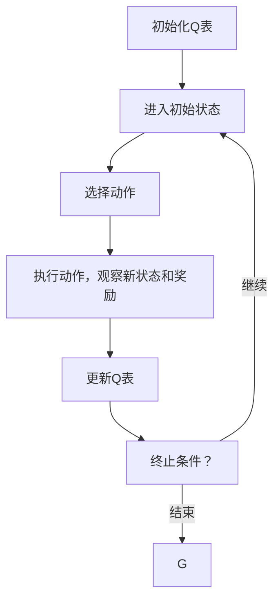
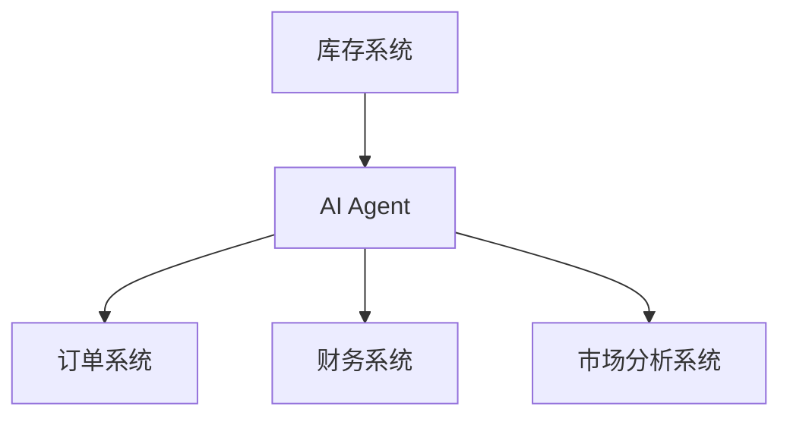

                 


# 企业AI Agent的强化学习应用：持续优化决策

> 关键词：AI Agent，强化学习，企业决策，决策优化，机器学习

> 摘要：本文探讨了AI Agent在企业中的应用，重点分析了强化学习如何帮助企业在复杂环境中优化决策。文章从强化学习的基本原理到具体算法，再到企业应用场景和项目实战，全面解析了AI Agent在企业决策优化中的潜力和实现方法。

---

# 第1章 强化学习与AI Agent概述

## 1.1 强化学习的基本概念

### 1.1.1 强化学习的定义与特点

强化学习（Reinforcement Learning, RL）是一种机器学习范式，其中智能体通过与环境交互来学习如何做出最优决策。与监督学习不同，强化学习不依赖于标记数据，而是通过探索环境、学习策略来最大化累计奖励。

**特点：**
- **自主性**：智能体能够根据环境反馈自主调整行为。
- **延迟反馈**：奖励信号通常在决策之后才给出，增加了学习的难度。
- **策略优化**：目标是找到最优策略，使累计奖励最大化。

### 1.1.2 AI Agent的基本概念

AI Agent（人工智能代理）是指能够感知环境、自主决策并执行动作的智能实体。AI Agent可以是软件程序、机器人或其他智能系统，其核心目标是通过感知和行动来实现特定任务。

**AI Agent的特点：**
- **自主性**：能够在无外部干预的情况下运行。
- **反应性**：能够实时感知环境并做出反应。
- **目标导向**：所有行为均以实现目标为导向。

### 1.1.3 强化学习与AI Agent的关系

强化学习为AI Agent提供了决策优化的方法。AI Agent通过强化学习算法不断改进决策策略，从而在复杂环境中实现更优的性能。强化学习是AI Agent实现自主决策的核心技术。

## 1.2 企业决策优化的背景与挑战

### 1.2.1 企业决策的复杂性

现代企业面临复杂的决策环境，涉及多个部门、多种变量和不确定因素。例如，供应链管理需要考虑生产、库存、物流等多个环节，且每个环节都可能受到外部市场波动的影响。

### 1.2.2 传统决策方法的局限性

传统决策方法依赖于人工经验或简单的规则，难以应对复杂多变的环境。例如，基于规则的系统在面对非结构化问题时表现不佳，且难以快速适应变化。

### 1.2.3 强化学习在决策优化中的优势

强化学习能够在复杂环境中通过试错和学习找到最优策略，适用于动态变化和多目标优化的场景。AI Agent结合强化学习，能够显著提升企业的决策效率和效果。

## 1.3 强化学习的核心原理

### 1.3.1 状态、动作与奖励的定义

- **状态（State）**：环境在某一时刻的描述，例如库存水平或市场需求。
- **动作（Action）**：AI Agent在给定状态下做出的决策，例如增加生产或减少库存。
- **奖励（Reward）**：AI Agent执行动作后获得的反馈，通常是一个标量值，表示动作的好坏。

### 1.3.2 策略与价值函数的解释

- **策略（Policy）**：描述AI Agent在给定状态下选择动作的概率分布。
- **价值函数（Value Function）**：评估某个状态下采取某种行动后的预期累计奖励。

### 1.3.3 探索与利用的平衡

AI Agent需要在探索新策略和利用已知最优策略之间找到平衡。探索有助于发现更好的策略，而利用则确保在当前最佳策略下获得最大收益。

---

# 第2章 强化学习算法基础

## 2.1 Q-Learning算法

### 2.1.1 算法原理与数学模型

Q-Learning是一种经典的强化学习算法，适用于离散状态和动作空间。其核心思想是通过Q表记录每个状态下各动作的累计奖励，逐步更新Q值以逼近最优策略。

**数学模型：**
$$ Q(s, a) = Q(s, a) + \alpha [r + \gamma \max Q(s', a') - Q(s, a)] $$

### 2.1.2 算法步骤与流程图

1. 初始化Q表。
2. 进入初始状态。
3. 根据策略选择动作。
4. 执行动作，观察新状态和奖励。
5. 更新Q表。
6. 重复步骤2-5，直到满足终止条件。

**流程图：**



### 2.1.3 应用场景与优缺点

**应用场景：** 适用于离散动作空间和状态空间的问题，如游戏控制、资源分配。

**优缺点：** 
- 优点：简单易实现。
- 缺点：在连续状态空间中表现不佳。

## 2.2 Deep Q-Networks (DQN) 算法

### 2.2.1 DQN的创新点与改进

DQN通过深度神经网络近似Q值函数，解决了Q-Learning在高维状态空间中的应用难题。

### 2.2.2 网络结构与训练过程

- **网络结构：** 输入层 → 隐藏层 → 输出层。
- **训练过程：** 使用经验回放和目标网络优化训练稳定性。

### 2.2.3 应用案例分析

DQN在游戏《Breakout》中的应用展示了其在复杂环境中的优秀表现。

## 2.3 策略梯度方法

### 2.3.1 策略梯度的基本原理

策略梯度方法直接优化策略，通过梯度 ascent 确保奖励最大化。

### 2.3.2 PPO与Actor-Critic算法对比

- **PPO（Proximal Policy Optimization）：** 基于策略的渐进式优化。
- **Actor-Critic：** 同时学习策略和价值函数。

### 2.3.3 算法实现与优化技巧

通过策略评估和策略改进交替进行，确保策略收敛。

---

# 第3章 企业AI Agent的强化学习应用

## 3.1 企业决策优化的核心问题

### 3.1.1 状态空间的构建

企业环境中，状态空间可能包括市场数据、库存水平等多维信息。

### 3.1.2 动作空间的设计

根据企业目标设计动作，例如调整生产量或优化供应链。

### 3.1.3 奖励函数的定义

奖励函数需准确反映企业目标，例如利润最大化。

## 3.2 AI Agent在企业中的典型应用场景

### 3.2.1 资源分配优化

通过强化学习优化资源分配策略，提升效率。

### 3.2.2 供应链管理

AI Agent可以优化供应链中的库存管理和物流调度。

### 3.2.3 市场策略调整

动态调整市场策略，应对市场变化。

## 3.3 强化学习在企业决策优化中的挑战

### 3.3.1 环境复杂性

企业环境通常高度复杂，状态空间维度高。

### 3.3.2 数据获取难度

高质量的数据获取困难，影响模型训练。

### 3.3.3 模型解释性

强化学习模型通常缺乏可解释性，影响企业应用。

---

# 第4章 项目实战：企业AI Agent的强化学习实现

## 4.1 项目背景与目标

以库存管理优化为例，探讨如何应用强化学习提升库存周转率。

## 4.2 系统设计与实现

### 4.2.1 系统功能设计

- 状态感知：实时监测库存水平。
- 动作选择：决定补货量。
- 奖励机制：基于库存成本和利润。

### 4.2.2 系统架构设计



### 4.2.3 系统接口设计

- 接收库存数据和市场信息。
- 发出补货指令。
- 返回执行结果。

## 4.3 算法实现与优化

### 4.3.1 算法选择与实现

选择DQN算法实现库存管理优化。

### 4.3.2 代码实现与分析

```python
class DQN:
    def __init__(self, state_space, action_space):
        self.state_space = state_space
        self.action_space = action_space
        # 神经网络定义
        self.model = self.build_model()
    
    def build_model(self):
        # 网络结构定义
        pass
    
    def remember(self, state, action, reward, next_state):
        # 记忆存储
        pass
    
    def act(self, state):
        # 动作选择
        pass
    
    def replay(self, batch_size):
        # 回放训练
        pass
```

---

# 第5章 最佳实践与未来展望

## 5.1 最佳实践

### 5.1.1 数据质量的重要性

确保数据准确性和实时性。

### 5.1.2 算法选择的注意事项

根据具体问题选择合适的算法。

## 5.2 未来展望

### 5.2.1 多智能体协作

未来，AI Agent将更多地在多智能体协作环境中应用。

### 5.2.2 智能决策系统的自动化

强化学习将推动企业决策系统的高度自动化。

---

# 结语

强化学习作为AI Agent的核心技术，正在改变企业的决策方式。通过持续优化，AI Agent将为企业带来更大的竞争优势。

---

# 作者

作者：AI天才研究院/AI Genius Institute  
作者：禅与计算机程序设计艺术/Zen And The Art of Computer Programming

