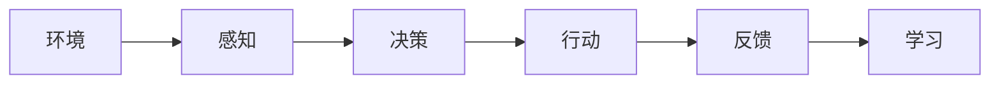

                 


# 企业AI Agent的快速适应框架：应对瞬息万变的市场环境

> **关键词**：AI Agent、企业应用、市场适应、算法原理、系统架构、快速响应、智能决策  
>
> **摘要**：随着市场环境的瞬息万变，企业需要一种能够快速适应变化的AI Agent框架。本文将深入探讨AI Agent的核心概念、算法原理、系统架构，并通过实际案例展示如何构建一个快速响应市场变化的企业AI Agent系统。我们还将提供最佳实践和注意事项，帮助企业在复杂多变的市场中保持竞争优势。

---

## 第1章: 企业AI Agent的背景与核心概念

### 1.1 AI Agent的基本概念
#### 1.1.1 AI Agent的定义与核心要素
AI Agent（人工智能代理）是一种能够感知环境、自主决策并执行任务的智能实体。它通过与环境交互，利用传感器获取信息，运用算法处理数据，并通过执行器采取行动。AI Agent的核心要素包括感知能力、决策能力、执行能力和自适应能力。

#### 1.1.2 企业AI Agent的独特性
企业AI Agent与通用AI Agent相比，具有更强的目标导向性。它专注于企业的特定目标，如提高效率、降低成本或优化客户体验。企业AI Agent通常需要处理复杂的业务逻辑和多维度的数据，因此在设计时需要考虑企业的组织结构、业务流程和行业特点。

#### 1.1.3 问题背景与问题描述
现代市场环境变化迅速，企业需要快速响应市场需求的变化。传统的企业系统通常基于固定的规则和流程，难以应对动态变化。AI Agent的引入为企业提供了一种灵活、智能的解决方案，能够实时感知市场变化并做出调整。

---

### 1.2 企业AI Agent的应用场景
#### 1.2.1 企业AI Agent的典型应用场景
- **供应链管理**：实时监控供应链状态，优化库存管理和物流调度。
- **客户服务**：通过自然语言处理和对话系统，提供个性化的客户支持。
- **市场预测**：利用大数据分析和机器学习，预测市场趋势并制定应对策略。

#### 1.2.2 企业AI Agent的边界与外延
企业AI Agent的边界在于其目标和职责的范围。它通常与企业现有的系统和流程相结合，而不是完全替代它们。外延则包括与外部数据源、第三方服务和企业内部系统的集成。

#### 1.2.3 企业AI Agent的潜在价值
企业AI Agent能够提高企业的运营效率、增强决策的准确性，并提供个性化的客户体验。它还能够通过快速响应市场变化，为企业创造竞争优势。

---

### 1.3 企业AI Agent的核心问题
#### 1.3.1 快速适应市场环境的核心问题
企业AI Agent需要能够实时感知市场变化，并快速调整其行为以应对这些变化。这涉及到数据的实时处理、模型的动态更新以及系统的快速响应。

#### 1.3.2 企业AI Agent的挑战与机遇
- **挑战**：数据的质量和实时性、模型的可解释性、系统的安全性。
- **机遇**：通过AI Agent实现业务的智能化升级，提升企业的竞争力。

#### 1.3.3 问题解决的思路与框架
通过构建一个快速适应的框架，企业可以实现AI Agent的快速部署和动态调整。这需要结合先进的算法、灵活的系统架构和高效的数据处理能力。

---

## 第2章: 企业AI Agent的核心概念与联系

### 2.1 核心概念的原理
#### 2.1.1 AI Agent的感知机制
AI Agent通过传感器或数据接口获取环境信息，包括结构化数据和非结构化数据。感知机制的核心是数据的采集和预处理。

#### 2.1.2 AI Agent的决策机制
基于感知到的信息，AI Agent运用算法和模型做出决策。决策机制通常包括监督学习、强化学习和无监督学习等方法。

#### 2.1.3 AI Agent的执行机制
AI Agent根据决策结果采取行动，通过执行器与环境交互。执行机制需要考虑行动的可行性和效果评估。

---

### 2.2 核心概念的属性特征对比
| **属性**       | **感知机制**       | **决策机制**       | **执行机制**       |
|----------------|--------------------|--------------------|--------------------|
| 数据来源       | 环境数据           | 数据和规则         | 行动结果           |
| 处理方式       | 数据清洗和特征提取 | 算法和模型         | 行动规划和执行     |
| 输出结果       | 数据流             | 决策指令           | 行动序列           |

---

### 2.3 ER实体关系图架构
```mermaid
erd
actor: 用户
agent: AI Agent
environment: 环境
action: 行动
decision: 决策
sensing: 感知
```

---

## 第3章: 企业AI Agent的算法原理

### 3.1 算法原理概述
#### 3.1.1 强化学习算法
强化学习是一种通过试错学习来优化决策的算法。AI Agent通过与环境的交互，学习最优策略以最大化累积奖励。



#### 3.1.2 监督学习算法
监督学习通过标注数据训练模型，使其能够预测新的数据点。常用算法包括线性回归和随机森林。

#### 3.1.3 混合学习算法
混合学习结合了强化学习和监督学习的优势，适用于复杂环境下的决策问题。

---

### 3.2 算法原理的数学模型与公式
#### 强化学习的数学模型
状态值函数 $V(s)$ 表示在状态 $s$ 下的最大期望奖励：
$$ V(s) = \max_{a} \left( r(s, a) + \gamma V(s') \right) $$

---

## 第4章: 系统分析与架构设计方案

### 4.1 系统功能设计
企业AI Agent系统的功能模块包括：
- 感知模块：数据采集和预处理。
- 决策模块：算法实现和模型部署。
- 执行模块：行动规划和结果反馈。

### 4.2 系统架构设计


---

## 第5章: 项目实战

### 5.1 环境配置
安装必要的依赖库，如TensorFlow和Scikit-learn。

### 5.2 核心代码实现
```python
import numpy as np
from sklearn import linear_model

# 示例代码：基于线性回归的预测模型
X = np.array([[1], [2], [3], [4]])
y = np.array([2, 4, 6, 8])

model = linear_model.LinearRegression()
model.fit(X, y)

print(model.predict(np.array([[5]])))
```

---

## 第6章: 企业AI Agent的快速适应框架

### 6.1 最佳实践
- 数据质量是关键，确保数据的实时性和准确性。
- 模型的可解释性有助于快速定位问题。
- 定期更新模型以适应市场变化。

### 6.2 小结
企业AI Agent的快速适应框架为企业提供了灵活、智能的解决方案，能够帮助企业在瞬息万变的市场中保持竞争优势。

---

## 作者信息

**作者**：AI天才研究院/AI Genius Institute & 禅与计算机程序设计艺术 /Zen And The Art of Computer Programming

---

通过以上思考和规划，我能够系统性地撰写一篇结构清晰、内容详实的技术博客，帮助读者深入了解企业AI Agent的快速适应框架及其实际应用。

