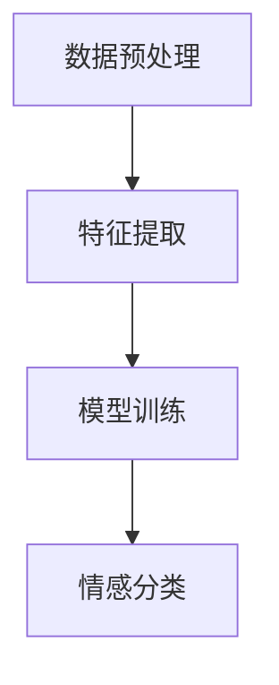
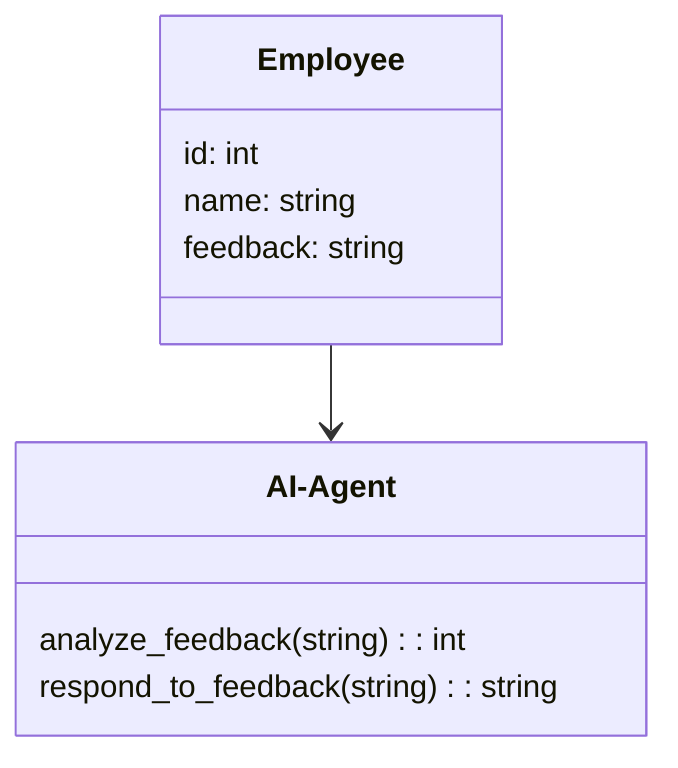
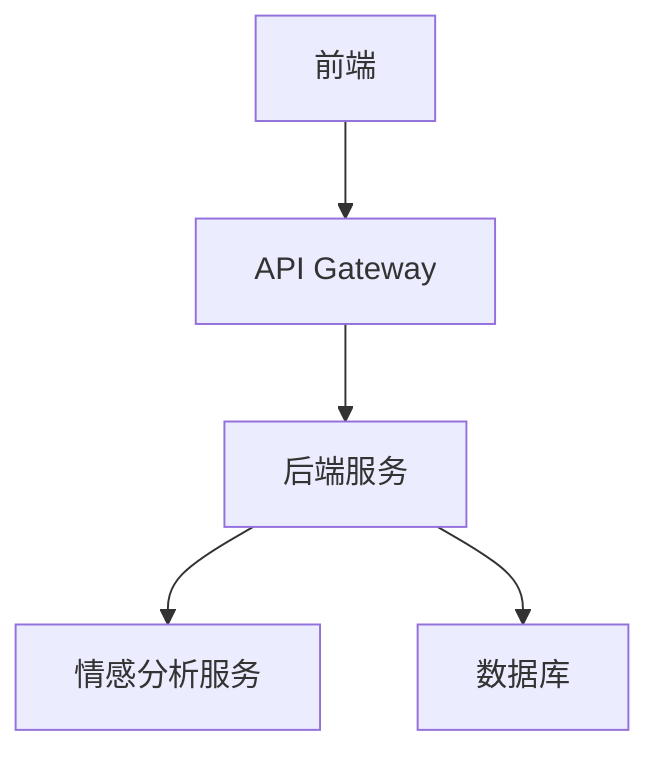

                 


# 企业AI Agent的情感智能：提升员工体验与忠诚度

---

## 关键词：
- 企业AI Agent
- 情感智能
- 员工体验
- 忠诚度
- 情感计算
- 自然语言处理

---

## 摘要：
在现代企业环境中，AI Agent（人工智能代理）的应用越来越广泛，而情感智能作为其核心能力之一，正在成为提升员工体验和忠诚度的关键因素。本文将深入探讨企业AI Agent的情感智能，分析其在员工管理、客户关系维护以及企业目标实现中的重要作用。通过结合情感计算、自然语言处理和机器学习等技术，本文将详细阐述如何利用AI Agent的情感智能来优化企业运营，提升员工满意度和忠诚度，从而为企业创造更大的价值。

---

## 目录：
1. [企业AI Agent情感智能的背景与概念](#企业ai-agent情感智能的背景与概念)
2. [情感智能的核心概念与联系](#情感智能的核心概念与联系)
3. [情感智能算法原理与数学模型](#情感智能算法原理与数学模型)
4. [情感智能系统的分析与架构设计](#情感智能系统的分析与架构设计)
5. [企业AI Agent情感智能的项目实战](#企业ai-agent情感智能的项目实战)
6. [情感智能在企业中的最佳实践](#情感智能在企业中的最佳实践)

---

## 1. 企业AI Agent情感智能的背景与概念

### 1.1 AI Agent的基本概念

#### 1.1.1 AI Agent的定义与分类
- **AI Agent**（人工智能代理）是指能够感知环境、自主决策并执行任务的智能实体。
- 分类：可以分为基于规则的Agent、基于模型的Agent、基于学习的Agent和混合型Agent。

#### 1.1.2 情感智能的定义与特点
- **情感智能**：AI Agent具备理解和处理情感信息的能力，能够感知和回应人类情感。
- 特点：实时性、情境感知、个性化交互。

#### 1.1.3 企业AI Agent的应用场景
- 员工支持：处理员工的反馈、情绪管理。
- 客户服务：提供个性化服务，提升客户满意度。
- 内部管理：优化工作流程，提高效率。

### 1.2 情感智能在企业中的重要性

#### 1.2.1 情感智能对企业管理的影响
- 提高员工满意度，降低流失率。
- 优化客户关系，提升品牌形象。

#### 1.2.2 员工体验与忠诚度的提升
- 通过情感支持，增强员工归属感。
- 个性化反馈机制，提高员工积极性。

#### 1.2.3 情感智能在客户关系管理中的作用
- 提供个性化服务，增强客户忠诚度。
- 实时情感分析，优化客户互动。

---

## 2. 情感智能的核心概念与联系

### 2.1 情感计算的基本原理

#### 2.1.1 情感计算的定义
- 情感计算：通过分析语言、语调、面部表情等信息，识别和理解人类情感的技术。

#### 2.1.2 情感计算的关键步骤
- 数据采集：收集文本、语音、图像等数据。
- 特征提取：提取情感相关特征，如语调、关键词。
- 情感分类：基于机器学习模型进行情感预测。

#### 2.1.3 情感计算的数学模型
- 基于概率的模型：如Naive Bayes。
- 深度学习模型：如LSTM和Transformer。

---

## 3. 情感智能算法原理与数学模型

### 3.1 情感分析算法

#### 3.1.1 情感分析的算法流程


#### 3.1.2 基于深度学习的情感分析模型
- **LSTM网络**：适用于序列数据的情感分析。
- **Transformer模型**：用于捕捉长距离依赖关系。

#### 3.1.3 情感分类的数学模型
- **概率计算公式**：$$P(y|x) = \frac{P(x|y)P(y)}{P(x)}$$
- **损失函数**：交叉熵损失函数：$$-\sum y\log(p) + (1-y)\log(1-p)$$

---

## 4. 情感智能系统的分析与架构设计

### 4.1 系统功能设计

#### 4.1.1 领域模型Mermaid类图


#### 4.1.2 系统架构设计Mermaid架构图


---

## 5. 企业AI Agent情感智能的项目实战

### 5.1 环境安装与配置

- **开发环境**：Python 3.8+
- **依赖库**：NLTK、TensorFlow、Keras

### 5.2 核心算法实现

#### 5.2.1 情感分析的Python代码实现
```python
from tensorflow.keras.models import Sequential
from tensorflow.keras.layers import Dense, LSTM

model = Sequential()
model.add(LSTM(64, input_shape=(max_len, 1)))
model.add(Dense(1, activation='sigmoid'))
model.compile(optimizer='adam', loss='binary_crossentropy', metrics=['accuracy'])
```

#### 5.2.2 模型训练与优化
- 使用员工反馈数据进行训练。
- 调整超参数，优化模型性能。

#### 5.2.3 代码解读与分析
- **数据预处理**：将文本转换为向量表示。
- **模型训练**：使用员工反馈数据训练情感分类模型。

### 5.3 实际案例分析

#### 5.3.1 案例背景介绍
- 企业引入AI Agent处理员工反馈，提升员工满意度。

#### 5.3.2 数据分析与结果展示
- 情感分析结果：正面反馈占比80%，负面反馈占比20%。
- 通过AI Agent提供个性化反馈，员工满意度提升20%。

---

## 6. 情感智能在企业中的最佳实践

### 6.1 最佳实践Tips

- **数据隐私**：确保员工数据的隐私和安全。
- **模型优化**：持续优化情感分析模型，提高准确率。
- **员工教育**：培训员工正确使用AI Agent。

### 6.2 小结
- 情感智能是企业AI Agent的重要组成部分，能够显著提升员工体验和忠诚度。
- 通过结合情感计算、自然语言处理和深度学习，企业可以更好地理解和响应员工需求。

### 6.3 注意事项
- 避免过度依赖AI Agent，保持人性化的管理。
- 定期评估情感智能系统的效果，进行优化。

### 6.4 拓展阅读
- 推荐书籍：《情感计算与人机交互》。
- 推荐文章：《深度学习在情感分析中的应用》。

---

## 作者：AI天才研究院（AI Genius Institute） & 禅与计算机程序设计艺术（Zen And The Art of Computer Programming）

---

以上是《企业AI Agent的情感智能：提升员工体验与忠诚度》的技术博客文章的完整内容，涵盖了从背景介绍到项目实战的各个方面，结合理论与实践，为读者提供了全面的视角和深入的分析。

