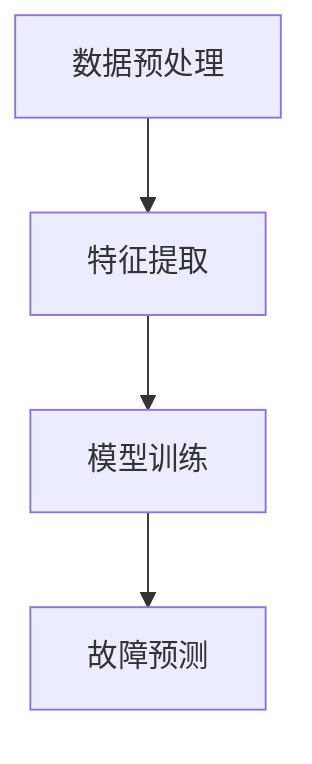
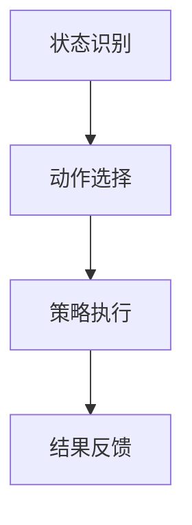
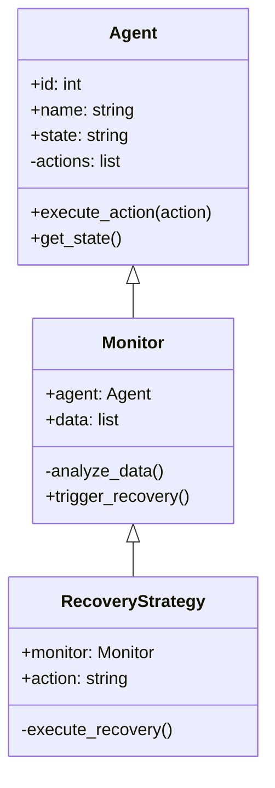
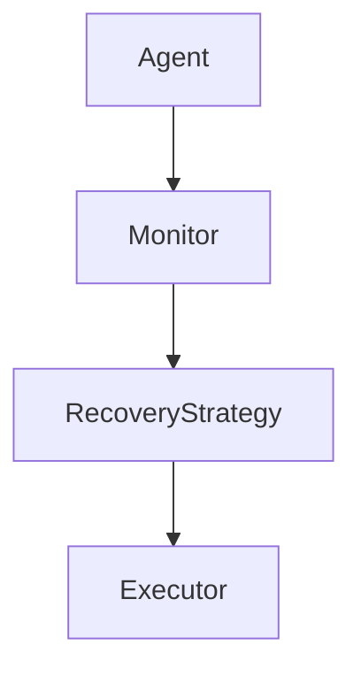
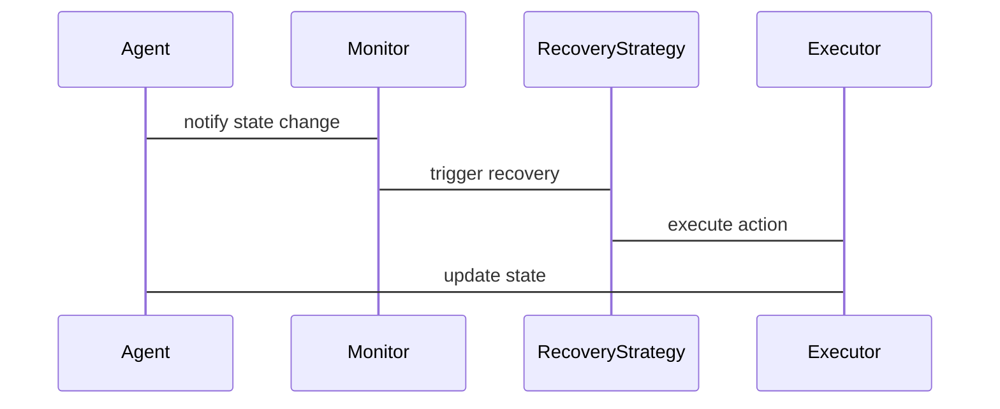

                 


# 企业AI Agent的故障恢复机制

> 关键词：故障恢复机制、AI Agent、企业应用场景、算法实现、系统架构设计

> 摘要：本文深入探讨了企业AI Agent的故障恢复机制，从核心原理到系统架构设计，结合实际案例，详细解析了故障监控、检测与恢复的全过程。文章重点介绍了基于机器学习和强化学习的算法实现，并通过系统架构图和类图展示了整体设计思路，最后通过项目实战指导读者实现故障恢复机制。

---

## 第一部分: 企业AI Agent的背景与概念

### 第1章: 企业AI Agent的背景与概念

#### 1.1 AI Agent的基本概念

##### 1.1.1 AI Agent的定义与特点
AI Agent（人工智能代理）是指具有感知环境、自主决策和执行任务能力的智能体。其特点包括：  
- **自主性**：能够在无外部干预的情况下执行任务。  
- **反应性**：能够根据环境变化动态调整行为。  
- **目标导向性**：以实现特定目标为导向执行任务。  
- **学习能力**：能够通过经验优化自身的决策和行为。  

##### 1.1.2 企业AI Agent的分类
企业AI Agent可以根据功能、智能水平和应用场景进行分类：  
1. **按功能分类**：  
   - **任务型Agent**：专注于完成特定任务，如数据处理、自动化操作等。  
   - **决策型Agent**：用于决策支持，如风险评估、资源分配等。  
   - **监控型Agent**：用于实时监控系统状态，如设备监控、数据流监控等。  

2. **按智能水平分类**：  
   - **反应式Agent**：基于当前感知做出反应，适用于实时任务。  
   - **认知式Agent**：具备复杂推理和规划能力，适用于复杂场景。  
   - **混合式Agent**：结合反应式和认知式的特点，适用于综合任务。  

3. **按应用场景分类**：  
   - **企业资源管理（ERP）**：用于库存管理、供应链优化等。  
   - **客户关系管理（CRM）**：用于客户服务、客户关系维护等。  
   - **数据分析与决策支持**：用于数据挖掘、预测分析等。  

##### 1.1.3 企业AI Agent的应用场景
企业AI Agent的应用场景广泛，常见的包括：  
- **自动化操作**：如自动邮件发送、自动化审批流程等。  
- **智能监控**：如实时监控生产流程、设备状态等。  
- **决策支持**：如市场分析、财务预测等。  
- **客户交互**：如智能客服、自动化聊天机器人等。  

#### 1.2 企业AI Agent的故障恢复机制

##### 1.2.1 故障恢复机制的核心概念
故障恢复机制是指在AI Agent运行过程中，当出现故障时，系统能够自动检测并采取措施恢复到正常状态的能力。其核心目标是确保AI Agent的连续性和可靠性。  

##### 1.2.2 企业AI Agent故障恢复机制的分类与特点
故障恢复机制可以分为以下几类：  
1. **简单恢复**：通过重启或重置AI Agent来恢复状态，适用于简单的故障场景。  
2. **智能恢复**：通过分析故障原因，采取针对性措施恢复，适用于复杂故障场景。  
3. **自愈式恢复**：通过自我修复机制，自动检测并修复故障，适用于需要高可靠性的场景。  

##### 1.2.3 企业AI Agent故障恢复机制的应用前景
随着企业对AI Agent的需求增加，故障恢复机制的重要性日益凸显。通过有效的故障恢复机制，企业可以提高系统的可靠性和稳定性，降低因故障导致的损失，提升整体运营效率。

---

## 第二部分: 企业AI Agent的故障恢复机制核心原理

### 第2章: 企业AI Agent的故障恢复机制核心原理

#### 2.1 故障监控与检测

##### 2.1.1 故障监控的实现方法
故障监控可以通过以下方法实现：  
1. **基于指标监控**：通过监控系统的性能指标（如CPU使用率、内存占用等）来发现异常。  
2. **基于日志分析**：通过分析系统日志，发现异常行为或错误信息。  
3. **基于行为模式识别**：通过分析AI Agent的行为模式，发现偏离正常模式的情况。  

##### 2.1.2 故障检测算法的原理
故障检测算法的核心在于通过数据特征提取和分类器训练，识别异常状态。常见的故障检测算法包括：  
1. **基于统计的方法**：如Z-score、孤立森林等。  
2. **基于机器学习的方法**：如支持向量机（SVM）、随机森林（Random Forest）等。  
3. **基于深度学习的方法**：如自动编码器（Autoencoder）、长短期记忆网络（LSTM）等。  

##### 2.1.3 故障检测的性能优化
为了提高故障检测的性能，可以采取以下措施：  
1. **数据预处理**：去除噪声数据，提高特征的准确性。  
2. **特征选择**：选择最具代表性的特征，降低计算复杂度。  
3. **模型优化**：通过调参和交叉验证，提高模型的准确性和效率。  

#### 2.2 故障恢复策略

##### 2.2.1 简单恢复策略
简单恢复策略是一种快速恢复故障的方法，适用于简单故障场景。常见的简单恢复策略包括：  
1. **重启策略**：通过重启AI Agent或相关服务恢复状态。  
2. **重置策略**：通过重置系统参数或数据恢复到正常状态。  

##### 2.2.2 智能恢复策略
智能恢复策略通过分析故障原因，采取针对性措施恢复状态，适用于复杂故障场景。常见的智能恢复策略包括：  
1. **故障定位**：通过日志分析和性能监控，定位故障的根本原因。  
2. **修复策略**：根据故障原因，采取相应的修复措施，如修复错误代码、调整系统参数等。  
3. **自适应恢复**：根据故障情况动态调整恢复策略，提高恢复效率。  

##### 2.2.3 恢复策略的评估与优化
为了提高恢复策略的效果，可以采取以下措施：  
1. **策略评估**：通过模拟测试和实际运行，评估恢复策略的有效性和效率。  
2. **策略优化**：根据评估结果，优化恢复策略，提高恢复的成功率和速度。  

---

## 第三部分: 企业AI Agent故障恢复机制的算法原理

### 第3章: 企业AI Agent故障恢复机制的算法原理

#### 3.1 基于机器学习的故障预测算法

##### 3.1.1 算法流程图


##### 3.1.2 算法实现代码
```python
import numpy as np
from sklearn.ensemble import IsolationForest

def predict_failure(data):
    # 数据预处理
    preprocessed_data = preprocess(data)
    # 特征提取
    features = extract_features(preprocessed_data)
    # 模型训练
    model = IsolationForest(random_state=42)
    model.fit(features)
    # 故障预测
    result = model.predict(features)
    return result
```

##### 3.1.3 算法实现细节
- 数据预处理：对原始数据进行清洗和标准化，确保数据质量。  
- 特征提取：选择最具代表性的特征，如CPU使用率、内存占用等。  
- 模型训练：使用孤立森林算法训练模型，识别异常数据点。  
- 故障预测：通过模型预测数据点是否为异常，识别故障。

##### 3.1.4 算法优势与局限性
- 优势：能够有效识别异常数据点，适用于复杂故障场景。  
- 局限性：需要大量数据训练，且对异常数据的识别可能存在误报或漏报。

#### 3.2 基于强化学习的故障恢复策略

##### 3.2.1 算法流程图


##### 3.2.2 算法实现代码
```python
import numpy as np
from tensorflow.keras.models import Sequential
from tensorflow.keras.layers import Dense

def choose_action(state):
    # 状态识别
    state = identify_state(state)
    # 动作选择
    model = Sequential()
    model.add(Dense(64, activation='relu', input_dim=len(state)))
    model.add(Dense(1, activation='sigmoid'))
    model.compile(optimizer='adam', loss='binary_crossentropy')
    action = model.predict(state)
    return action
```

##### 3.2.3 算法实现细节
- 状态识别：通过传感器数据或系统日志识别当前系统状态。  
- 动作选择：基于当前状态，选择最优的恢复动作，如重启服务、调整参数等。  
- 策略执行：执行选择的动作，恢复系统状态。  
- 结果反馈：根据恢复结果调整策略，优化恢复效果。

##### 3.2.4 算法优势与局限性
- 优势：能够根据环境动态调整恢复策略，适用于复杂场景。  
- 局限性：需要大量的训练数据，且策略的优化可能需要较长时间。

---

## 第四部分: 企业AI Agent故障恢复机制的系统架构设计

### 第4章: 企业AI Agent故障恢复机制的系统架构设计

#### 4.1 系统架构

##### 4.1.1 领域模型类图


##### 4.1.2 系统架构图


##### 4.1.3 系统交互图


#### 4.2 系统接口设计
- **输入接口**：接收系统状态数据和用户指令。  
- **输出接口**：输出恢复操作的结果和状态反馈。  

#### 4.3 系统功能设计
- **故障监控**：实时监控系统状态，发现异常。  
- **故障检测**：识别故障类型和原因。  
- **恢复策略选择**：根据故障情况选择合适的恢复策略。  
- **恢复操作执行**：执行恢复操作，恢复正常状态。  

---

## 第五部分: 企业AI Agent故障恢复机制的项目实战

### 第5章: 企业AI Agent故障恢复机制的项目实战

#### 5.1 环境安装与配置

##### 5.1.1 安装依赖
```bash
pip install numpy scikit-learn tensorflow mermaid
```

##### 5.1.2 配置环境变量
```bash
export PYTHONPATH=$PYTHONPATH:./src
```

#### 5.2 核心实现

##### 5.2.1 故障监控模块
```python
import logging

class FaultMonitor:
    def __init__(self, threshold=0.8):
        self.threshold = threshold
        self.data = []
    
    def add_data(self, value):
        self.data.append(value)
    
    def analyze_data(self):
        if len(self.data) == 0:
            return False
        last_value = self.data[-1]
        if last_value < self.threshold:
            return True
        return False
```

##### 5.2.2 故障恢复策略模块
```python
class RecoveryStrategy:
    def __init__(self):
        self.actions = []
    
    def add_action(self, action):
        self.actions.append(action)
    
    def execute(self, action_index):
        if action_index < len(self.actions):
            action = self.actions[action_index]
            return action
        return None
```

##### 5.2.3 系统交互模块
```python
class SystemInteraction:
    def __init__(self, monitor, recovery_strategy):
        self.monitor = monitor
        self.recovery_strategy = recovery_strategy
    
    def check_and_recover(self):
        if self.monitor.analyze_data():
            action = self.recovery_strategy.execute(0)
            if action:
                return True
        return False
```

#### 5.3 实际案例分析与代码解读
假设我们有一个简单的AI Agent，用于监控服务器的CPU使用率。当CPU使用率超过预设阈值时，触发恢复机制，采取重启服务的措施。代码实现如下：

##### 监控模块
```python
monitor = FaultMonitor(threshold=0.8)
monitor.add_data(0.9)
monitor.add_data(0.7)
monitor.add_data(0.85)
monitor.add_data(0.95)
```

##### 恢复策略模块
```python
recovery_strategy = RecoveryStrategy()
recovery_strategy.add_action('restart_service')
```

##### 系统交互模块
```python
system = SystemInteraction(monitor, recovery_strategy)
system.check_and_recover()  # 返回True，执行重启服务操作
```

#### 5.4 项目小结
通过以上代码实现，我们可以看到故障恢复机制的基本实现过程。故障监控模块负责实时监控系统状态，检测异常；恢复策略模块根据故障情况选择合适的恢复动作；系统交互模块负责协调各个模块的工作，实现故障恢复。

---

## 第六部分: 总结与最佳实践

### 第6章: 总结与最佳实践

#### 6.1 总结
企业AI Agent的故障恢复机制是确保系统稳定运行的重要保障。通过有效的故障监控、检测与恢复策略，可以最大限度地减少因故障导致的损失，提高系统的可靠性和可用性。

#### 6.2 最佳实践

##### 6.2.1 定期维护与优化
- 定期检查系统的性能和稳定性，优化故障恢复机制。  
- 定期更新故障检测算法，提高检测的准确性和效率。  

##### 6.2.2 日志管理与分析
- 建立完善的日志管理系统，便于故障分析和恢复策略优化。  
- 使用日志分析工具，快速定位故障原因。  

##### 6.2.3 系统容灾与备份
- 建立系统的容灾机制，确保在严重故障情况下系统仍能部分运行。  
- 定期备份系统数据，防止数据丢失。  

##### 6.2.4 团队协作与知识共享
- 建立故障恢复机制的文档，明确各个角色的职责和操作流程。  
- 定期进行故障恢复演练，提高团队的应急响应能力。  

#### 6.3 注意事项
- 在实际应用中，需要根据具体的业务需求和系统特点，调整故障恢复机制的设计。  
- 确保故障恢复机制的可靠性和安全性，防止因恢复操作引发新的问题。  

#### 6.4 拓展阅读
- 《Deep Learning for Anomaly Detection in Time Series Data》  
- 《Reinforcement Learning for Fault Recovery in Distributed Systems》  

---

## 结语

企业AI Agent的故障恢复机制是一个复杂而重要的课题。通过本文的详细讲解，希望能够帮助读者深入了解故障恢复机制的核心原理和实现方法。同时，也希望本文能够为企业的技术团队提供实际的指导和参考，助力企业在AI Agent的应用中实现更高的可靠性和稳定性。

---

**作者：AI天才研究院/AI Genius Institute & 禅与计算机程序设计艺术 /Zen And The Art of Computer Programming**

