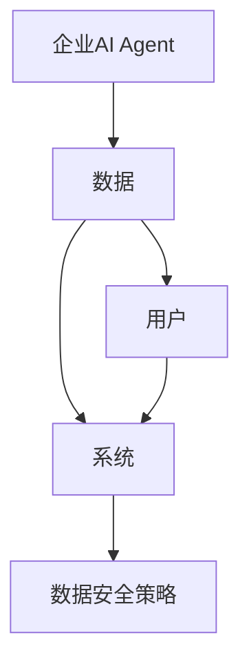
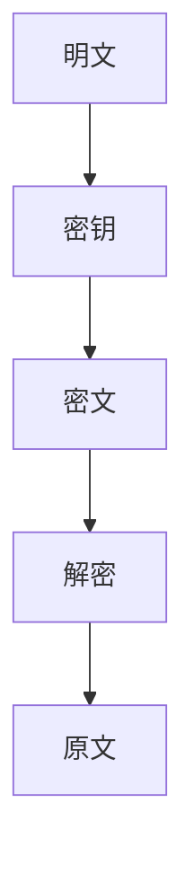
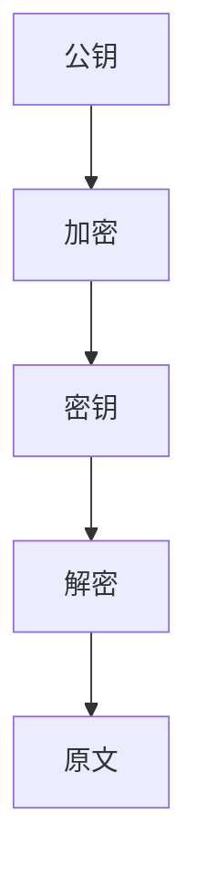
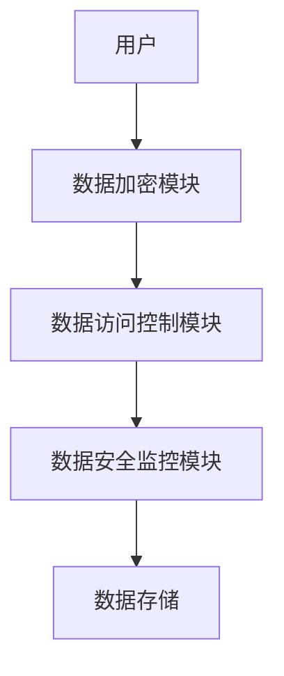
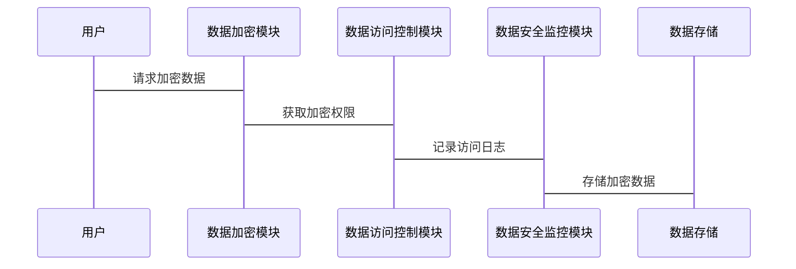

                 


# 企业AI Agent的数据安全策略

> 关键词：企业AI Agent, 数据安全, 加密算法, 系统架构, 安全策略

> 摘要：本文详细探讨了企业AI Agent在数据安全领域的核心策略，包括数据安全的核心概念、算法原理、系统架构设计、项目实战以及最佳实践。通过深入分析AI Agent与数据安全的关系，结合具体的技术实现和实际案例，为企业构建安全的AI Agent系统提供全面的指导和参考。

---

# 第1章 企业AI Agent与数据安全概述

## 1.1 AI Agent的基本概念

### 1.1.1 AI Agent的定义与特点
AI Agent（人工智能代理）是一种能够感知环境、执行任务并做出决策的智能实体。其特点包括：
- **自主性**：能够在没有外部干预的情况下自主运行。
- **反应性**：能够根据环境变化实时调整行为。
- **社会性**：能够与其他系统或用户进行交互。

### 1.1.2 企业AI Agent的应用场景
企业AI Agent广泛应用于以下几个场景：
1. **智能客服**：通过自然语言处理技术为用户提供7×24小时的咨询服务。
2. **自动化运维**：用于系统监控、故障诊断和自动修复。
3. **智能决策支持**：基于大数据分析为企业提供决策支持。

### 1.1.3 数据安全在AI Agent中的重要性
AI Agent的运行依赖大量数据，这些数据可能包含企业的核心机密和用户的敏感信息。因此，数据安全是保障AI Agent正常运行的基础。

---

## 1.2 数据安全的基本概念

### 1.2.1 数据安全的定义与分类
数据安全是指通过技术手段保护数据的机密性、完整性和可用性。数据安全可以分为以下几类：
1. **物理安全**：防止数据被物理破坏或未经授权的访问。
2. **网络安全**：防止数据在传输过程中被截获或篡改。
3. **数据存储安全**：防止数据在存储过程中被泄露或篡改。

### 1.2.2 数据安全的威胁与挑战
数据安全的主要威胁包括：
- **网络攻击**：如DDoS攻击、钓鱼攻击等。
- **内部威胁**：如员工误操作或故意泄露数据。
- **数据泄露**：由于数据 breaches导致的敏感信息泄露。

### 1.2.3 企业数据安全的现状与趋势
随着数据量的爆炸式增长，数据安全问题日益严重。企业需要采用更加智能化、自动化的方法来应对数据安全挑战。

---

## 1.3 企业AI Agent与数据安全的关系

### 1.3.1 AI Agent对数据安全的影响
AI Agent的引入为企业数据安全带来了新的挑战：
- **数据依赖性**：AI Agent需要大量数据支持，增加了数据泄露的风险。
- **复杂性**：AI Agent的运行依赖多种系统和数据源，增加了安全漏洞的可能性。

### 1.3.2 数据安全对AI Agent的保障作用
有效的数据安全策略能够：
- **保护AI Agent的核心算法**：防止竞争对手窃取AI算法。
- **确保数据完整性**：保证AI Agent的数据输入准确无误。
- **提升用户信任**：通过数据安全保护，增强用户对AI Agent的信任。

### 1.3.3 企业AI Agent数据安全的核心问题
企业AI Agent数据安全的核心问题包括：
1. **数据隐私保护**：防止用户数据被滥用。
2. **数据访问控制**：确保只有授权人员可以访问敏感数据。
3. **数据加密**：通过加密技术保护数据在传输和存储过程中的安全性。

---

# 第2章 企业AI Agent数据安全的核心概念

## 2.1 数据安全的关键属性

### 2.1.1 机密性
机密性是指只有授权的人员才能访问数据。在企业AI Agent中，机密性是数据安全的核心属性。

### 2.1.2 完整性
完整性是指数据在存储和传输过程中保持一致性和准确性。完整性确保AI Agent的决策基于准确的数据。

### 2.1.3 可用性
可用性是指数据在需要时能够被及时访问。在企业AI Agent中，数据的可用性直接影响系统的响应速度和用户体验。

---

## 2.2 AI Agent数据安全的核心要素

### 2.2.1 数据生命周期管理
数据生命周期管理包括数据的生成、存储、使用、归档和销毁的全过程管理。

### 2.2.2 数据访问控制
数据访问控制通过权限管理确保只有授权人员可以访问数据。

### 2.2.3 数据加密与解密
数据加密与解密是保护数据机密性的关键技术。

---

## 2.3 企业AI Agent数据安全的实体关系图



---

# 第3章 企业AI Agent数据安全的算法原理

## 3.1 数据加密算法

### 3.1.1 对称加密算法

#### 3.1.1.1 AES加密算法
AES（高级加密标准）是一种广泛使用的对称加密算法。其加密过程如下：

$$ AES加密过程：明文 \rightarrow 密钥 \rightarrow 密文 $$

流程图如下：



#### 3.1.2 非对称加密算法

##### 3.1.2.1 RSA算法
RSA（Rivest-Shamir-Adleman）是一种非对称加密算法。其加密过程如下：

$$ RSA加密过程：明文 \rightarrow 公钥 \rightarrow 密文 $$

流程图如下：



---

## 3.2 数据安全算法的数学模型

### 3.2.1 AES加密算法的数学模型
AES加密算法基于有限域GF(2^8)上的线性变换。其基本操作包括：

$$ y = (x \times a + b) \mod 256 $$

其中，$a$ 和 $b$ 是密钥扩展算法生成的常数。

### 3.2.2 RSA算法的数学模型
RSA算法基于大整数分解的困难性。其基本操作包括：

$$ C = P^k \mod n $$

其中，$C$ 是密文，$P$ 是明文，$k$ 是公钥指数，$n$ 是模数。

---

# 第4章 企业AI Agent数据安全的系统架构设计

## 4.1 系统功能设计

### 4.1.1 数据加密模块
数据加密模块负责对敏感数据进行加密和解密。

### 4.1.2 数据访问控制模块
数据访问控制模块通过权限管理确保只有授权人员可以访问数据。

### 4.1.3 数据安全监控模块
数据安全监控模块实时监控数据访问行为，发现异常行为立即告警。

---

## 4.2 系统架构图



---

## 4.3 系统接口设计

### 4.3.1 数据加密接口
数据加密接口用于对敏感数据进行加密：

```python
def encrypt(data, key):
    cipher = AES.new(key, AES.MODE_ECB)
    return cipher.encrypt(data)
```

### 4.3.2 数据解密接口
数据解密接口用于对加密数据进行解密：

```python
def decrypt(ciphertext, key):
    cipher = AES.new(key, AES.MODE_ECB)
    return cipher.decrypt(ciphertext)
```

---

## 4.4 系统交互流程



---

# 第5章 企业AI Agent数据安全的项目实战

## 5.1 项目背景

### 5.1.1 项目介绍
本项目旨在为企业AI Agent系统提供数据安全保护，防止数据泄露和网络攻击。

### 5.1.2 项目目标
通过本项目，实现以下目标：
1. 数据加密与解密
2. 数据访问控制
3. 数据安全监控

---

## 5.2 环境安装

### 5.2.1 环境要求
- 操作系统：Linux/Windows/MacOS
- Python版本：3.6以上
- 依赖库：AES-Cipher

---

## 5.3 系统核心实现

### 5.3.1 数据加密模块实现
```python
from cryptography.hazmat.primitives.ciphers import AES
from cryptography.hazmat.primitives.ciphers import modes
from cryptography.hazmat.primitives.asymmetric.rsa import RSAPublicNumbers
from cryptography.hazmat.primitives.asymmetric.rsa import RSAPrivateNumbers
from cryptography.hazmat.primitives.asymmetric.rsa import generate_private_key

def aes_encrypt(plaintext, key):
    cipher = AES.new(key, modes.ECB)
    return cipher.encrypt(plaintext)

def rsa_encrypt(plaintext, public_key):
    private_key = generate_private_key(
        public_numbers=RSAPublicNumbers(
            n=public_key.n,
            e=public_key.e
        )
    )
    cipher = private_key.private_numbers().public_numbers
    return pow(plaintext, cipher.e, cipher.n)
```

### 5.3.2 数据访问控制模块实现
```python
def access_control(request, role):
    if role == 'admin':
        return True
    elif role == 'user':
        return False
    else:
        return False
```

---

## 5.4 实际案例分析

### 5.4.1 案例背景
某电商企业使用AI Agent作为智能客服，需要保护用户的订单数据。

### 5.4.2 案例实现
通过数据加密模块对订单数据进行加密，通过数据访问控制模块限制只有管理员可以访问订单数据。

---

## 5.5 项目小结

通过本项目，我们成功实现了企业AI Agent的数据安全保护，确保了数据的机密性、完整性和可用性。

---

# 第6章 企业AI Agent数据安全的最佳实践

## 6.1 数据安全策略建议

### 6.1.1 数据分类与分级
根据数据的重要性和敏感程度进行分类和分级，制定不同的安全策略。

### 6.1.2 最小权限原则
确保每个用户和系统组件只拥有完成任务所需的最小权限。

### 6.1.3 数据安全监控与日志管理
实时监控数据访问行为，记录日志并进行分析，发现异常行为立即告警。

---

## 6.2 小结

企业AI Agent的数据安全策略需要从数据生命周期管理、数据加密与解密、数据访问控制等多个方面进行综合考虑。通过合理的安全策略和技术创新，可以有效保障企业AI Agent的数据安全。

---

## 6.3 注意事项

- 数据安全是一个持续性的工作，需要定期进行安全评估和优化。
- 在实际应用中，需要根据企业实际情况调整安全策略。
- 数据安全不仅仅是技术问题，还需要企业内部管理和制度的支持。

---

## 6.4 拓展阅读

- 《数据安全管理体系》
- 《AI安全与伦理》
- 《加密算法原理与应用》

---

作者：AI天才研究院/AI Genius Institute & 禅与计算机程序设计艺术 /Zen And The Art of Computer Programming

