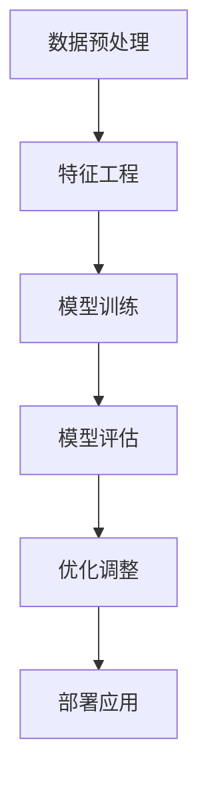
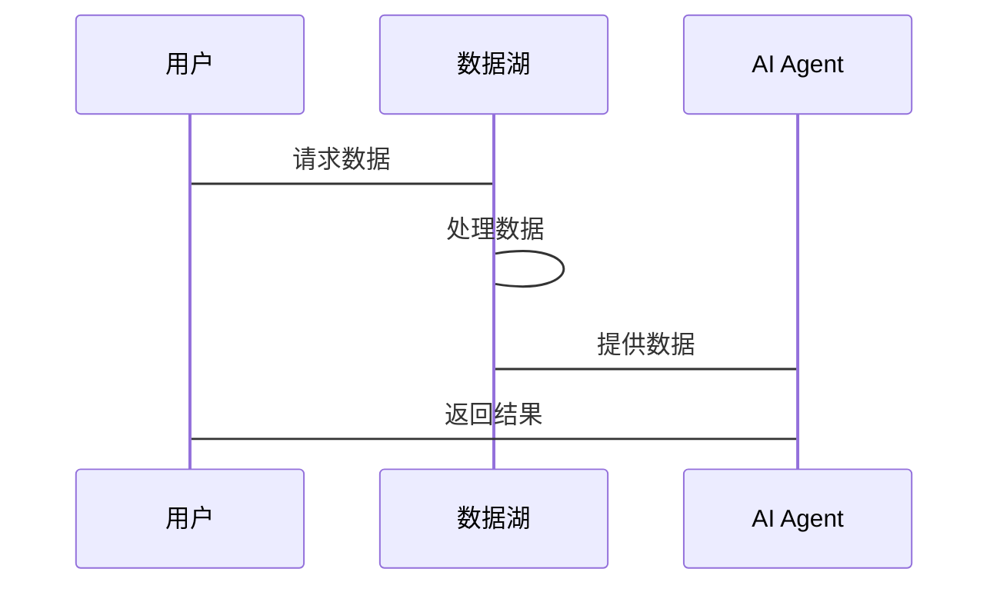

                 


# 《企业AI Agent的数据湖架构设计》

> 关键词：数据湖，AI Agent，企业架构，算法原理，系统设计

> 摘要：本文详细探讨了企业AI Agent与数据湖的结合，从背景、核心概念、算法原理到系统架构设计和项目实战，全面解析了如何设计和实现企业级AI Agent的数据湖架构。

---

## 目录

1. **企业AI Agent与数据湖概述**
2. **数据湖与AI Agent的核心概念与联系**
3. **数据湖与AI Agent的算法原理与实现**
4. **企业AI Agent数据湖系统架构设计**
5. **项目实战——构建企业AI Agent**

---

## 第三章: 数据湖与AI Agent的算法原理与实现

### 3.1 数据预处理算法

#### 3.1.1 数据清洗算法

数据清洗是数据预处理的关键步骤，旨在消除数据中的噪声和不一致。以下是几种常用的数据清洗算法：

- **处理缺失值：** 使用均值、中位数或众数填充缺失值。
  - 示例：使用中位数填充年龄列的缺失值。
    ```python
    import pandas as pd
    data['age'].fillna(data['age'].median(), inplace=True)
    ```

- **处理重复值：** 删除重复行或列。
  - 示例：删除重复行。
    ```python
    data.drop_duplicates(inplace=True)
    ```

- **处理异常值：** 使用箱线图或Z-score方法检测并替换异常值。
  - 示例：使用Z-score方法检测异常值。
    ```python
    from scipy import stats
    z = np.abs(stats.zscore(data))
    data = data[(z < 3).all(axis=1)]
    ```

#### 3.1.2 数据转换算法

数据转换旨在将数据转换为适合建模的形式。

- **文本数据转换：** 使用TF-IDF向量化处理文本数据。
  ```python
  from sklearn.feature_extraction.text import TfidfVectorizer
  vectorizer = TfidfVectorizer()
  text_features = vectorizer.fit_transform(corpus)
  ```

- **数值数据标准化：** 使用标准差标准化。
  ```python
  from sklearn.preprocessing import StandardScaler
  scaler = StandardScaler()
  scaled_data = scaler.fit_transform(data)
  ```

- **时间序列数据转换：** 将时间序列数据转换为滑动窗口特征。
  ```python
  def create_window(data, window_size):
      for i in range(len(data) - window_size):
          yield data[i:i+window_size], data[i+window_size]
  ```

#### 3.1.3 数据增强算法

数据增强通过增加训练数据的多样性来提高模型泛化能力。

- **图像数据增强：** 使用OpenCV或Keras的ImageDataGenerator进行旋转、缩放等操作。
- **文本数据增强：** 使用同义词替换或随机插入停用词。
  ```python
  from spacy.lang.en import English
  import random
  nlp = English()
  def synonym_replacement(text, n=1):
      doc = nlp(text)
      tokens = [token.text for token in doc]
      for i in range(n):
          if random.random() < 0.5:
              if i < len(tokens)-1:
                  tokens[i], tokens[i+1] = tokens[i+1], tokens[i]
      return ' '.join(tokens)
  ```

#### 3.1.4 数据分箱

将连续变量离散化为箱，便于某些模型（如决策树）处理。
```python
from sklearn.preprocessing import KBinsDiscretizer
discretizer = KBinsDiscretizer(n_bins=5, encode='ordinal')
discretized_data = discretizer.fit_transform(data[['age', 'income']])
```

#### 3.1.5 空值填充

使用KNN算法填充空值，基于特征相似性。
```python
from sklearn.impute import KNNImputer
imputer = KNNImputer(n_neighbors=5)
imputed_data = imputer.fit_transform(data)
```

### 3.2 特征工程算法

#### 3.2.1 特征选择算法

特征选择旨在减少特征数量，提高模型性能。

- **基于相关系数：** 使用皮尔逊相关系数选择高相关性特征。
  ```python
  import numpy as np
  import pandas as pd
  df = pd.DataFrame({'x1': [1,2,3,4,5], 'x2': [6,7,8,9,10], 'y': [11,12,13,14,15]})
  correlation_matrix = df.corr()
  print(correlation_matrix)
  ```

- **基于模型特征重要性：** 使用Lasso回归选择特征。
  ```python
  from sklearn.linear_model import Lasso
  model = Lasso(alpha=0.1)
  model.fit(df[['x1', 'x2']], df['y'])
  print(model.coef_)
  ```

- **基于树模型特征重要性：** 使用随机森林或梯度提升树提取特征重要性。
  ```python
  from sklearn.ensemble import RandomForestClassifier
  model = RandomForestClassifier().fit(df[['x1', 'x2']], df['y'])
  print(model.feature_importances_)
  ```

#### 3.2.2 特征提取算法

特征提取旨在降低维度，同时保留重要信息。

- **主成分分析（PCA）：**
  ```python
  from sklearn.decomposition import PCA
  pca = PCA(n_components=2)
  principal_components = pca.fit_transform(data)
  ```

- **线性判别分析（LDA）：** 适用于分类任务。
  ```python
  from sklearn.discriminant_analysis import LinearDiscriminantAnalysis
  lda = LinearDiscriminantAnalysis(n_components=2)
  lda_components = lda.fit_transform(X, y)
  ```

- **NLP中的词嵌入：** 使用Word2Vec或BERT生成词向量。
  ```python
  from gensim.models import Word2Vec
  model = Word2Vec(sentences, vector_size=100, window=5, min_count=1, workers=4)
  ```

#### 3.2.3 特征组合算法

通过组合现有特征生成新特征，提升模型表现。

- **多项式特征：** 将现有特征生成多项式组合。
  ```python
  from sklearn.preprocessing import PolynomialFeatures
  poly = PolynomialFeatures(degree=2)
  poly_features = poly.fit_transform(df[['x1', 'x2']])
  ```

- **基于规则的特征：** 根据业务规则生成新特征，如“是否节假日”。
- **特征哈希：** 使用哈希函数将特征映射到低维空间。
  ```python
  from sklearn.feature_extraction import DictVectorizer
  vec = DictVectorizer()
  transformed_features = vec.fit_transform({'x1': x1_values, 'x2': x2_values})
  ```

### 3.3 模型训练算法

#### 3.3.1 监督学习算法

监督学习基于标记数据训练模型，预测新的样本。

- **线性回归：** 预测连续型目标变量。
  ```python
  from sklearn.linear_model import LinearRegression
  model = LinearRegression().fit(X_train, y_train)
  y_pred = model.predict(X_test)
  ```

- **支持向量机（SVM）：** 适用于分类和回归。
  ```python
  from sklearn.svm import SVC
  model = SVC(kernel='rbf', gamma='auto').fit(X_train, y_train)
  ```

- **随机森林：** 基于树的集成方法，适合高维数据。
  ```python
  from sklearn.ensemble import RandomForestClassifier
  model = RandomForestClassifier(n_estimators=100).fit(X_train, y_train)
  ```

#### 3.3.2 无监督学习算法

无监督学习在无标记数据上发现隐含结构。

- **K-means聚类：** 将数据分成K个簇。
  ```python
  from sklearn.cluster import KMeans
  model = KMeans(n_clusters=3).fit(X)
  ```

- **DBSCAN聚类：** 基于密度的聚类算法。
  ```python
  from sklearn.cluster import DBSCAN
  model = DBSCAN(eps=0.5, min_samples=5).fit(X)
  ```

- **主成分分析（PCA）：** 降维技术，用于数据可视化。
  ```python
  from sklearn.decomposition import PCA
  pca = PCA(n_components=2).fit_transform(X)
  ```

#### 3.3.3 强化学习算法

强化学习通过试错学习最优策略。

- **Q-learning：** 在环境中学习最优动作。
- **深度强化学习：** 使用深度神经网络处理复杂状态。
  ```python
  import numpy as np
  from collections import deque
  class DQN:
      def __init__(self, state_space, action_space, lr=0.01):
          self.state_space = state_space
          self.action_space = action_space
          self.lr = lr
          self.model = ...  # 定义神经网络
      def remember(self, state, action, reward, next_state):
          self.memory.append((state, action, reward, next_state))
      def act(self, state):
          # 返回动作
      def replay(self, batch_size):
          # 使用经验回放训练模型
  ```

#### 3.3.4 集成学习算法

集成学习通过组合多个模型提升性能。

- **投票分类器：** 多个分类器投票决定最终结果。
  ```python
  from sklearn.ensemble import VotingClassifier
  clf1 = SVC()
  clf2 = RandomForestClassifier()
  model = VotingClassifier(estimators=[('svm', clf1), ('rf', clf2)])
  ```

- **梯度提升：** 使用Boosting方法（如XGBoost、LightGBM）。
  ```python
  import xgboost as xgb
  model = xgb.XGBClassifier().fit(X_train, y_train)
  ```

### 3.4 算法实现与优化

#### 3.4.1 算法实现步骤

1. **数据预处理：** 清洗、转换、增强数据。
2. **特征工程：** 选择、提取和组合特征。
3. **模型训练：** 选择合适的算法，训练模型。
4. **模型评估：** 使用准确率、F1分数、AUC等指标评估性能。
5. **模型优化：** 调参、交叉验证、集成方法。

#### 3.4.2 算法优化方法

- **超参数调优：** 使用网格搜索或随机搜索。
  ```python
  from sklearn.model_selection import GridSearchCV
  param_grid = {'n_estimators': [100, 200], 'max_depth': [None, 10]}
  grid_search = GridSearchCV(RandomForestClassifier(), param_grid, cv=5)
  grid_search.fit(X_train, y_train)
  best_model = grid_search.best_estimator_
  ```

- **特征选择优化：** 使用Lasso回归或递归特征消除（RFECV）。
  ```python
  from sklearn.feature_selection import RFECV
  selector = RFECV(RandomForestClassifier(), step=1, min_features_to_select=1)
  selector.fit(X_train, y_train)
  selected_features = selector.transform(X_train)
  ```

- **模型集成优化：** 使用投票分类器或Stacking集成方法。
  ```python
  from sklearn.ensemble import StackingClassifier
  stack_model = StackingClassifier(estimators=[('rf', RandomForestClassifier()), ('svm', SVC())], final_estimator=LogisticRegression())
  ```

### 3.5 算法实现案例

以下是一个完整的算法实现示例，结合数据预处理、特征工程和模型训练。

#### 3.5.1 数据预处理代码

```python
import pandas as pd
import numpy as np
from sklearn.impute import KNNImputer
from sklearn.preprocessing import PolynomialFeatures, StandardScaler
from sklearn.feature_selection import SelectKBest, chi2

# 数据加载
data = pd.read_csv('data.csv')

# 处理缺失值
imputer = KNNImputer(n_neighbors=3)
imputed_data = imputer.fit_transform(data)

# 数据转换
poly = PolynomialFeatures(degree=2)
transformed_features = poly.fit_transform(imputed_data)

# 特征选择
selector = SelectKBest(score_func=chi2, k=5)
selected_features = selector.fit_transform(transformed_features, target)
```

#### 3.5.2 模型训练代码

```python
from sklearn.ensemble import RandomForestClassifier
from sklearn.model_selection import train_test_split
from sklearn.metrics import accuracy_score, confusion_matrix, classification_report

# 数据分割
X_train, X_test, y_train, y_test = train_test_split(selected_features, target, test_size=0.2, random_state=42)

# 模型训练
model = RandomForestClassifier(n_estimators=100, max_depth=10, random_state=42)
model.fit(X_train, y_train)

# 模型预测
y_pred = model.predict(X_test)
print("Accuracy:", accuracy_score(y_test, y_pred))
print(classification_report(y_test, y_pred))
```

#### 3.5.3 流程图



---

## 第四章: 企业AI Agent数据湖系统架构设计

### 4.1 系统功能设计

企业AI Agent数据湖系统需要具备以下功能模块：

1. **数据采集模块：** 从企业内部系统、数据库、文件等多种数据源采集数据。
2. **数据存储模块：** 将数据存储在Hadoop、云存储或其他大数据平台中。
3. **数据处理模块：** 包括数据清洗、转换、特征工程和增强。
4. **AI Agent交互模块：** 提供自然语言接口或API供用户交互。
5. **结果展示模块：** 可视化结果，生成报告。

### 4.2 系统架构设计

采用分层架构，各层功能模块如下：

1. **数据层：** 负责数据的存储和管理。
2. **处理层：** 负责数据处理和特征工程。
3. **应用层：** 包括AI Agent和用户交互界面。

### 4.3 系统接口设计

1. **数据接口：** 使用REST API提供数据存取接口。
2. **AI Agent接口：** 支持WebSocket或HTTP协议，实现实时交互。

### 4.4 系统交互流程

用户请求处理流程：

1. 用户通过自然语言或API向AI Agent提出请求。
2. AI Agent解析请求，提取所需数据。
3. 数据湖提供数据，AI Agent进行分析和处理。
4. AI Agent返回结果或建议给用户。

### 4.5 系统交互图



---

## 第五章: 项目实战——构建企业AI Agent

### 5.1 环境安装

安装必要的工具和库：

- **Python：** 3.8+
- **Jupyter Notebook：** 用于数据处理和建模。
- **数据湖存储：** 使用Hadoop或云存储解决方案。
- **AI框架：** TensorFlow/PyTorch或scikit-learn。
- **API框架：** FastAPI或Flask。

### 5.2 代码实现

#### 5.2.1 数据湖接口

```python
from fastapi import FastAPI
from fastapi.responses import JSONResponse
import pandas as pd

app = FastAPI()

@app.get('/data/{filename}')
async def get_data(filename: str):
    data = pd.read_csv(f'data/{filename}.csv')
    return JSONResponse(content=data.to_dict('records'))
```

#### 5.2.2 AI Agent接口

```python
from fastapi import FastAPI
from fastapi.responses import JSONResponse
from sklearn.ensemble import RandomForestClassifier

app = FastAPI()

@app.post('/agent/predict')
async def predict(data: dict):
    # 数据处理和预测逻辑
    df = pd.DataFrame([data])
    model = RandomForestClassifier().fit(X_train, y_train)
    prediction = model.predict(df)
    return JSONResponse(content={'result': prediction[0]})
```

### 5.3 案例分析

**案例：企业销售预测**

1. **数据湖存储：** 存储企业过去几年的销售数据，包括时间、销售额、地区、产品类别等。
2. **数据处理：** 对数据进行清洗、转换和增强，提取有用的特征。
3. **AI Agent训练：** 使用随机森林模型训练销售预测模型。
4. **用户交互：** 用户输入地区和时间，AI Agent返回预测的销售额和建议。

### 5.4 项目小结

通过本项目，我们成功构建了一个基于数据湖的企业AI Agent系统，展示了如何将数据湖与AI Agent结合，实现企业级的智能应用。系统具备高效的数据处理能力、灵活的AI Agent交互和强大的预测分析能力，为企业决策提供了有力支持。

---

## 总结

本文详细探讨了企业AI Agent与数据湖的结合，从算法原理到系统架构设计，再到项目实战，全面解析了如何设计和实现企业级AI Agent的数据湖架构。通过本文的学习，读者可以掌握数据湖的核心概念、AI Agent的工作原理，以及如何在实际项目中应用这些技术。未来，随着大数据和人工智能技术的不断发展，企业AI Agent与数据湖的结合将更加紧密，为企业创造更大的价值。

---

**作者：AI天才研究院（AI Genius Institute） & 禅与计算机程序设计艺术（Zen And The Art of Computer Programming）**

