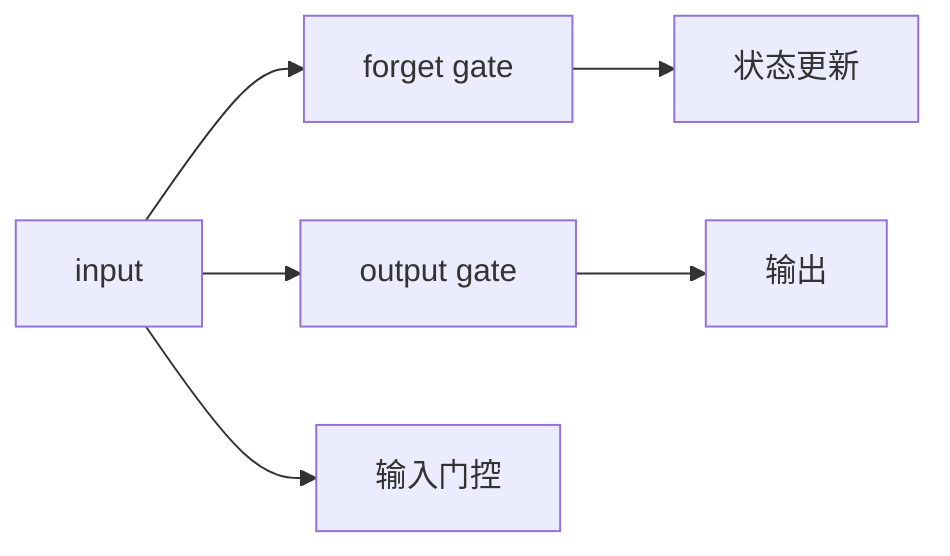
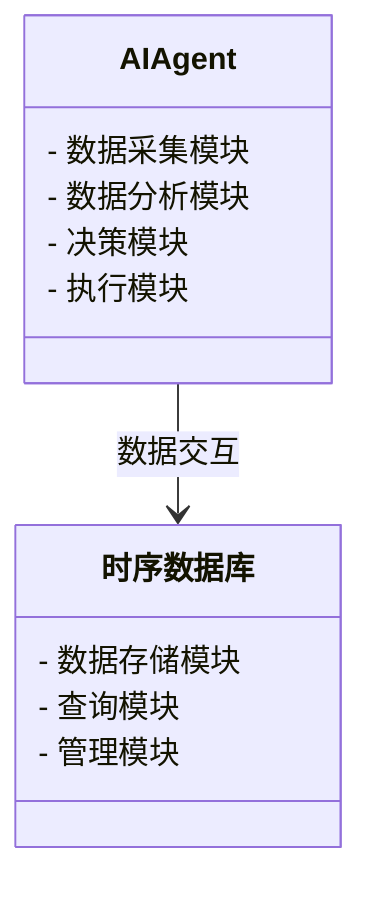
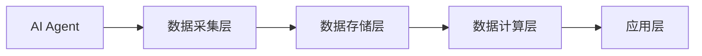
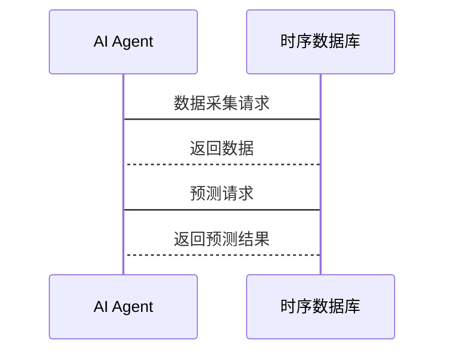

                 


# 企业AI Agent的时序数据库设计与应用

> 关键词：企业AI Agent，时序数据库，时间序列数据，系统设计，人工智能

> 摘要：本文深入探讨了企业AI Agent与时序数据库的结合，分析了时序数据的特征与设计原则，详细讲解了基于AI Agent的时序数据分析与建模方法，介绍了时序数据库的算法原理与实现，以及系统分析与架构设计方案。通过实际项目实战，展示了如何在企业中高效应用时序数据库，提供了最佳实践与注意事项。

---

# 第1章: 企业AI Agent的时序数据库背景介绍

## 1.1 企业AI Agent的基本概念

### 1.1.1 什么是企业AI Agent

企业AI Agent（Artificial Intelligence Agent）是指在企业环境中，能够感知环境、自主决策并执行任务的智能实体。它结合了人工智能技术，能够处理复杂业务逻辑，优化企业运营效率。

**关键术语解释：**

- **自主性**：AI Agent能够自主决策，无需人工干预。
- **反应性**：能够实时感知环境变化并做出反应。
- **目标导向**：基于明确的目标执行任务。

### 1.1.2 AI Agent的核心功能与特点

AI Agent的核心功能包括数据采集、分析、决策和执行。其特点如下：

1. **智能化**：基于AI算法进行复杂决策。
2. **实时性**：能够实时处理数据并做出反应。
3. **适应性**：能够根据环境变化自适应调整策略。

### 1.1.3 企业AI Agent的应用场景

企业AI Agent广泛应用于智能监控、自动化运维、供应链管理等领域。例如，在智能工厂中，AI Agent可以实时监控设备状态，预测维护时间，优化生产流程。

---

## 1.2 时序数据库的定义与特点

### 1.2.1 时序数据库的定义

时序数据库（Time Series Database）是一种专门用于存储和处理时间序列数据的数据库。时间序列数据是指按时间顺序记录的数据，例如传感器读数、股票价格、气象数据等。

### 1.2.2 时序数据库的核心特征

- **高时效性**：数据按时间戳排序，支持快速查询。
- **大规模存储**：能够处理海量时间序列数据。
- **高效查询**：支持时间范围查询和趋势分析。

### 1.2.3 时序数据库与传统数据库的区别

| 特性 | 时序数据库 | 传统数据库 |
|------|------------|------------|
| 数据类型 | 时间序列数据 | 结构化或非结构化数据 |
| 查询优化 | 时间范围查询优化 | 全文检索或复杂查询优化 |
| 存储效率 | 适合压缩存储 | 适合多样化数据存储 |

---

## 1.3 企业AI Agent与时序数据库的结合

### 1.3.1 时序数据在AI Agent中的重要性

时序数据是AI Agent进行预测和决策的基础。例如，在智能电网中，AI Agent需要分析历史用电数据，预测未来用电量。

### 1.3.2 AI Agent如何利用时序数据库

AI Agent通过时序数据库获取实时数据，结合预测模型，生成决策建议。例如，在设备监控场景中，AI Agent可以实时获取传感器数据，预测设备故障时间。

### 1.3.3 企业级应用中的典型场景

- **智能监控**：实时监控设备状态，预测维护时间。
- **供应链优化**：基于历史销售数据，预测未来需求。
- **金融分析**：实时分析股票价格，提供投资建议。

---

## 1.4 本章小结

本章介绍了企业AI Agent的基本概念、核心功能与应用场景，详细讲解了时序数据库的定义、特点与设计原则，分析了AI Agent与时序数据库结合的重要性。

---

# 第2章: 时序数据库的核心概念与设计原则

## 2.1 时序数据的特征分析

### 2.1.1 时间序列数据的属性

时间序列数据具有以下属性：

1. **连续性**：数据按时间顺序排列。
2. **周期性**：可能存在周期性变化。
3. **趋势性**：数据可能呈现上升或下降趋势。

### 2.1.2 数据量与存储效率的平衡

时序数据库需要在存储效率和查询性能之间找到平衡。例如，使用压缩算法存储数据，同时支持快速查询。

### 2.1.3 数据一致性的挑战

时序数据的实时性要求高，可能导致数据一致性问题。需要通过分布式系统设计解决。

---

## 2.2 时序数据库的架构设计

### 2.2.1 数据模型的选择

时序数据库常用的数据模型包括：

1. **时间戳+数值模型**：记录每个时间点的数值。
2. **标签+时间戳模型**：支持多维度标签查询。

### 2.2.2 数据分区与存储优化

- **分区策略**：按时间分区，便于数据归档和删除。
- **存储优化**：使用压缩算法减少存储空间。

### 2.2.3 查询性能的提升策略

- **索引优化**：为时间戳字段建立索引。
- **缓存机制**：使用内存缓存减少磁盘访问。

---

## 2.3 时序数据库的扩展性与可维护性

### 2.3.1 水平扩展与分片技术

通过水平扩展（Sharding）技术，将数据分片存储在不同的节点中，提高系统的处理能力。

### 2.3.2 数据归档与过期处理

- **数据归档**：将旧数据归档到存储系统中。
- **过期处理**：自动删除过期数据，减少存储压力。

### 2.3.3 高可用性设计

- **主从复制**：通过主从复制保证数据的高可用性。
- **负载均衡**：使用负载均衡技术分担请求压力。

---

## 2.4 本章小结

本章详细分析了时序数据的特征，探讨了时序数据库的架构设计与优化策略，介绍了扩展性和高可用性设计。

---

# 第3章: 企业AI Agent中的时序数据分析与建模

## 3.1 时序数据的预处理

### 3.1.1 数据清洗与异常处理

- **数据清洗**：去除噪声数据，填补缺失值。
- **异常处理**：识别并处理异常值。

### 3.1.2 数据标准化与归一化

- **标准化**：将数据按比例缩放到相同范围。
- **归一化**：将数据按比例缩放到[0,1]范围。

### 3.1.3 数据窗口化与特征提取

- **滑动窗口法**：提取固定长度的时间窗口数据。
- **特征提取**：提取均值、方差等统计特征。

---

## 3.2 常见的时序数据分析方法

### 3.2.1 统计分析方法

- **移动平均法（MA）**：基于过去若干个周期的数据预测未来值。
- **指数平滑法（ES）**：基于加权平均数预测未来值。

### 3.2.2 机器学习方法

- **线性回归**：用于趋势预测。
- **支持向量回归（SVR）**：适用于非线性关系。

### 3.2.3 深度学习方法

- **LSTM网络**：适合处理长序列数据。
- **Transformer模型**：适用于全局依赖关系。

---

## 3.3 基于AI Agent的时序数据建模

### 3.3.1 状态空间模型

状态空间模型通过状态变量和转移方程描述系统的动态行为。例如，使用状态空间模型预测设备运行状态。

### 3.3.2 预测模型的选择与优化

- **模型选择**：根据数据特征选择合适的模型。
- **超参数优化**：使用网格搜索或随机搜索优化模型参数。

### 3.3.3 模型的实时更新与维护

- **在线学习**：实时更新模型参数。
- **模型评估**：定期评估模型性能，调整模型结构。

---

## 3.4 本章小结

本章介绍了时序数据的预处理方法，分析了常见的时序数据分析方法，详细讲解了基于AI Agent的时序数据建模方法。

---

# 第4章: 时序数据库的算法原理与实现

## 4.1 时间序列预测算法概述

### 4.1.1 ARIMA模型

ARIMA（自回归积分滑动平均模型）是一种常用的时序预测模型。其数学公式如下：

$$ ARIMA(p, d, q) $$

其中，$p$ 表示自回归阶数，$d$ 表示差分阶数，$q$ 表示滑动平均阶数。

### 4.1.2 LSTM网络

LSTM（长短期记忆网络）通过 gates（门控机制）捕捉时序数据中的长期依赖关系。LSTM的结构如下图所示：



### 4.1.3 Prophet模型

Prophet模型由Facebook开源，适用于非等距时间序列数据的预测。其数学模型如下：

$$ y(t) = s(t) + t(t) + y(t) $$

其中，$s(t)$ 表示周期性部分，$t(t)$ 表示趋势部分，$y(t)$ 表示噪声部分。

---

## 4.2 算法实现与优化

### 4.2.1 算法实现

以下是一个简单的ARIMA模型实现代码：

```python
from statsmodels.tsa.arima_model import ARIMA
import numpy as np

data = np.array([...])  # 时间序列数据
model = ARIMA(data, order=(p, d, q))
result = model.fit()
forecast = result.forecast(steps=5)
```

### 4.2.2 算法优化

- **参数优化**：使用网格搜索优化ARIMA模型的参数。
- **模型组合**：将多个模型的结果进行组合，提高预测精度。

---

## 4.3 本章小结

本章详细讲解了时间序列预测算法的原理与实现，分析了ARIMA、LSTM和Prophet模型的优缺点，提供了算法实现的代码示例。

---

# 第5章: 系统分析与架构设计方案

## 5.1 问题场景介绍

以智能工厂设备监控为例，AI Agent需要实时采集设备传感器数据，预测设备故障时间，优化设备维护计划。

---

## 5.2 系统功能设计

### 5.2.1 领域模型设计



### 5.2.2 功能模块设计

- **数据采集模块**：实时采集设备传感器数据。
- **数据分析模块**：对时序数据进行预处理和建模。
- **决策模块**：基于预测结果做出决策。
- **执行模块**：执行维护任务。

---

## 5.3 系统架构设计

### 5.3.1 系统架构图



### 5.3.2 分层设计

- **数据采集层**：负责数据采集和预处理。
- **数据存储层**：负责数据的存储和管理。
- **数据计算层**：负责数据的分析和建模。
- **应用层**：负责与用户交互和任务执行。

---

## 5.4 接口设计与交互流程

### 5.4.1 接口设计

- **数据采集接口**：提供数据采集的API。
- **数据查询接口**：提供数据查询的API。
- **模型预测接口**：提供模型预测的API。

### 5.4.2 交互流程图



---

## 5.5 本章小结

本章通过智能工厂设备监控的场景，详细设计了系统的功能模块与架构，展示了接口设计与交互流程。

---

# 第6章: 项目实战与案例分析

## 6.1 环境安装与配置

### 6.1.1 安装时序数据库

```bash
pip install influxdb
```

### 6.1.2 安装AI Agent框架

```bash
pip install scikit-learn tensorflow
```

---

## 6.2 核心代码实现

### 6.2.1 数据采集代码

```python
import influxdb

client = influxdb.InfluxDBClient('localhost', 8086)
client.create_database('ai_agent')
```

### 6.2.2 预测模型代码

```python
from tensorflow.keras import layers

model = layers.Sequential([
    layers.LSTM(64, input_shape=(None, 1)),
    layers.Dense(1)
])
model.compile(optimizer='adam', loss='mse')
```

---

## 6.3 代码解读与分析

- **数据采集代码**：连接InfluxDB数据库，创建数据库。
- **预测模型代码**：构建LSTM网络，训练模型。

---

## 6.4 实际案例分析

以智能电网为例，AI Agent通过时序数据库获取历史用电数据，预测未来用电量，优化电力分配。

---

## 6.5 本章小结

本章通过实际项目实战，展示了时序数据库与AI Agent的结合，提供了环境安装、核心代码实现和案例分析。

---

# 第7章: 最佳实践与注意事项

## 7.1 最佳实践

### 7.1.1 数据预处理的重要性

数据预处理是时序数据分析的关键步骤，直接影响模型性能。

### 7.1.2 模型调优的技巧

- **参数优化**：使用网格搜索或随机搜索优化模型参数。
- **模型组合**：将多个模型的结果进行组合，提高预测精度。

### 7.1.3 系统扩展性设计

- **水平扩展**：通过分片技术实现数据的水平扩展。
- **负载均衡**：使用负载均衡技术分担系统压力。

---

## 7.2 注意事项

### 7.2.1 数据安全

确保时序数据的安全性，防止数据泄露。

### 7.2.2 系统性能

关注系统的性能瓶颈，及时进行优化。

### 7.2.3 可维护性

确保系统的可维护性，便于后续升级和维护。

---

## 7.3 本章小结

本章总结了时序数据库与AI Agent结合的最佳实践，提出了系统的注意事项，为读者提供了宝贵的参考。

---

# 结语

企业AI Agent与时序数据库的结合为企业智能化转型提供了强大的技术支撑。通过本文的详细讲解，读者可以深入了解时序数据库的设计与应用，掌握基于AI Agent的时序数据分析方法，为实际项目提供参考。

---

# 作者：AI天才研究院（AI Genius Institute） & 禅与计算机程序设计艺术（Zen And The Art of Computer Programming）

