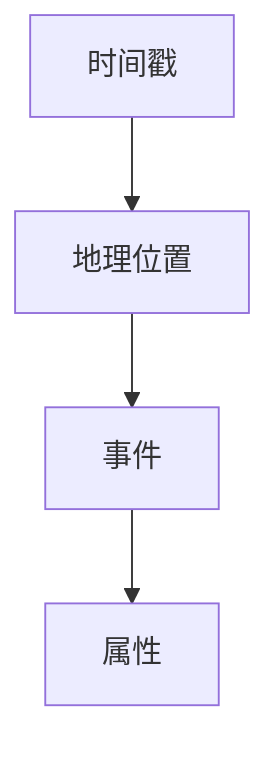
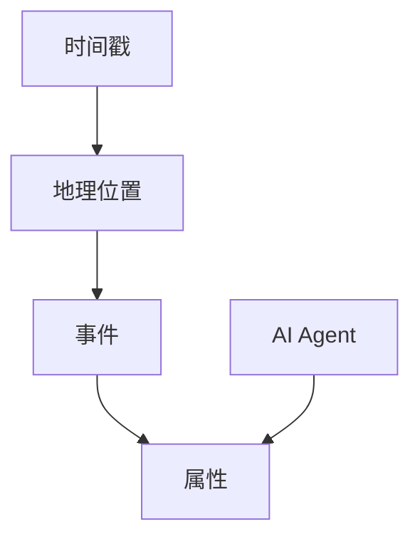
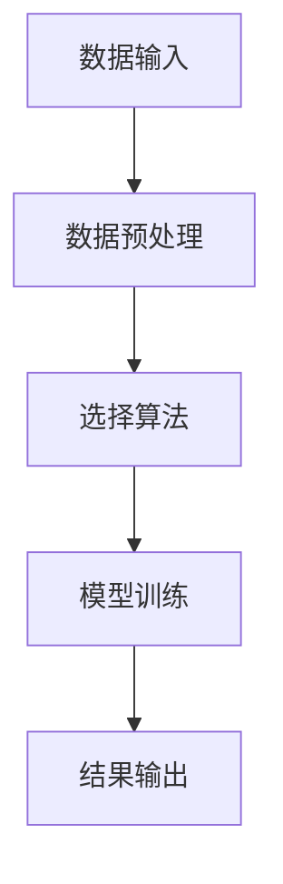
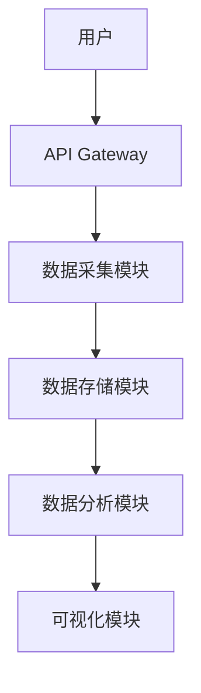
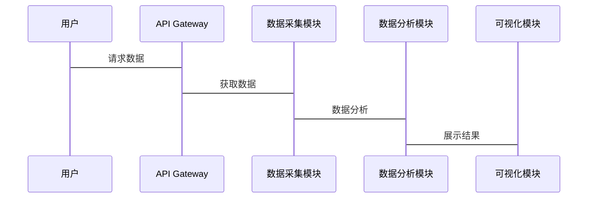

                 


# 企业AI Agent的时空大数据挖掘平台

> 关键词：企业AI Agent，时空大数据，数据挖掘，系统架构，机器学习

> 摘要：本文探讨了企业AI Agent在时空大数据挖掘中的应用，结合实际案例分析了时空大数据的特点、AI Agent的核心能力，详细讲解了时空大数据挖掘平台的系统架构设计、算法实现和项目实战。通过本文，读者将能够理解时空大数据挖掘平台的核心原理、实现方法和应用场景，为企业的数字化转型提供参考。

---

## 第一部分：企业AI Agent与时空大数据挖掘平台的背景与概念

### 第1章：企业AI Agent与时空大数据挖掘平台概述

#### 1.1 问题背景与应用价值
- 1.1.1 企业数字化转型中的数据挑战
  - 数据量爆炸式增长，企业面临海量数据处理的挑战。
  - 数据维度复杂，包括时间序列和空间位置等多维度信息。
  - 数据价值密度高，如何高效提取数据价值成为关键。

- 1.1.2 时空大数据的定义与特征
  - 时空数据：包含时间戳和地理位置的数据。
  - 数据特征：时间序列性、空间关联性、动态变化性。

- 1.1.3 AI Agent在企业时空大数据中的作用
  - AI Agent能够实时感知、分析和决策，为企业提供智能化支持。
  - 通过时空大数据挖掘，帮助企业发现潜在规律和商业机会。

#### 1.2 问题描述与解决思路
- 1.2.1 企业时空大数据的痛点分析
  - 数据孤岛问题：企业各部门数据分散，难以整合。
  - 数据处理复杂性：时空数据的复杂性导致传统数据分析方法难以适用。
  - 数据价值挖掘不足：缺乏有效的工具和方法来提取时空数据中的价值。

- 1.2.2 AI Agent如何解决时空大数据问题
  - 通过AI Agent的实时感知和分析能力，快速处理时空数据。
  - 利用机器学习算法，挖掘时空数据中的潜在规律。

- 1.2.3 平台化解决方案的必要性
  - 平台化设计能够整合企业内外部数据源，提供统一的分析界面。
  - 平台化设计能够支持多种数据格式和分析需求，提高企业的数据利用率。

#### 1.3 平台边界与外延
- 1.3.1 平台的功能边界
  - 数据采集与预处理：支持多种数据源的接入和清洗。
  - 数据分析与挖掘：提供多种算法模型，支持时空数据的深度挖掘。
  - 可视化与决策支持：通过可视化界面，帮助企业做出决策。

- 1.3.2 平台的外延与扩展性
  - 支持多种数据源的扩展接入。
  - 支持多种算法模型的扩展开发。
  - 支持多行业应用场景的扩展适配。

- 1.3.3 平台与其他系统的接口关系
  - 数据源：企业内部数据库、外部API接口。
  - 用户界面：提供Web或移动端界面，供用户进行操作。
  - 第三方服务：支持与企业其他系统的集成，如CRM、ERP等。

#### 1.4 核心概念与组成要素
- 1.4.1 AI Agent的核心特征
  - 自主性：能够自主决策和执行任务。
  - 反应性：能够实时感知环境变化并做出反应。
  - 学习能力：能够通过数据学习和优化模型。

- 1.4.2 时空大数据的组成要素
  - 时间戳：数据发生的时间。
  - 地理位置：数据发生的地点。
  - 事件：数据描述的具体事件。
  - 属性：事件的相关属性信息。

- 1.4.3 平台架构的核心模块
  - 数据采集模块：负责数据的采集和预处理。
  - 数据存储模块：负责数据的存储和管理。
  - 数据分析模块：负责数据的挖掘和分析。
  - 可视化模块：负责数据的展示和结果呈现。

---

## 第二部分：时空大数据与AI Agent的核心概念与联系

### 第2章：时空大数据的核心概念与特征

#### 2.1 时空数据的定义与属性
- 2.1.1 时间序列数据的特征
  - 数据的时间性：数据按时间顺序排列。
  - 数据的连续性：数据在时间上是连续的。
  - 数据的趋势性：数据具有明显的趋势特征。

- 2.1.2 空间数据的特征
  - 数据的空间性：数据具有地理位置属性。
  - 数据的关联性：地理位置相关联的数据具有相似性。
  - 数据的分布性：数据在空间上分布不均匀。

- 2.1.3 时空数据的综合特征
  - 数据的多维性：包含时间、空间和事件等多个维度。
  - 数据的动态性：数据随时间变化而变化。
  - 数据的复杂性：数据的时空关联性复杂，难以简单处理。

#### 2.2 时空数据与传统数据的对比
- 2.2.1 数据类型对比
  | 数据类型 | 传统数据 | 时空数据 |
  |----------|----------|----------|
  | 时间维度 | 无或单一 | 多维且连续 |
  | 空间维度 | 无或单一 | 多维且关联 |
  | 数据结构 | 结构化数据 | 结构化与非结构化数据混合 |

- 2.2.2 数据处理复杂度对比
  - 传统数据处理：主要关注数据的数值特征，处理相对简单。
  - 时空数据处理：需要同时考虑时间序列和空间关联性，处理复杂。

- 2.2.3 数据价值密度对比
  - 传统数据：价值密度较低，需要大量数据清洗和特征提取。
  - 时空数据：价值密度较高，直接包含时间、空间和事件信息，可挖掘的价值更多。

#### 2.3 时空数据的实体关系分析


---

### 第3章：AI Agent的核心原理与能力

#### 3.1 AI Agent的基本原理
- 3.1.1 AI Agent的定义
  - AI Agent是一种能够感知环境、自主决策并执行任务的智能体。
  - 基于感知、推理、学习和执行四大核心能力。

- 3.1.2 AI Agent的核心能力
  - 感知能力：通过传感器或API接口感知环境信息。
  - 推理能力：基于感知信息进行逻辑推理和决策。
  - 学习能力：通过机器学习算法不断优化模型。
  - 执行能力：根据决策结果执行具体操作。

- 3.1.3 AI Agent的决策机制
  - 基于规则的决策：通过预定义的规则进行决策。
  - 基于机器学习的决策：通过训练好的模型进行决策。
  - 基于强化学习的决策：通过试错和奖励机制优化决策。

#### 3.2 AI Agent与时空大数据的结合
- 3.2.1 时空大数据驱动的AI Agent
  - 通过时空大数据的分析，AI Agent能够实时感知环境变化。
  - 时空大数据为AI Agent提供决策依据。

- 3.2.2 AI Agent在时空数据分析中的应用
  - 实时监控：通过AI Agent实时监控时空数据变化。
  - 预测分析：利用AI Agent预测未来时空数据的趋势。
  - 智能决策：基于时空数据分析结果，AI Agent做出最优决策。

- 3.2.3 AI Agent的时空推理能力
  - 空间推理：基于地理位置信息进行关联推理。
  - 时间推理：基于时间序列信息进行趋势推理。
  - 综合推理：结合时间和空间信息进行综合推理。

#### 3.3 AI Agent的实体关系分析


---

## 第三部分：企业AI Agent时空大数据挖掘平台的算法与系统设计

### 第4章：时空大数据挖掘的核心算法

#### 4.1 时间序列分析算法
- 4.1.1 ARIMA模型
  - ARIMA模型用于预测时间序列数据。
  - 模型公式：$$ARIMA(p, d, q)$$，其中p为自回归阶数，d为差分阶数，q为移动平均阶数。
  - Python代码实现：
    ```python
    from statsmodels.tsa.arima.model import ARIMA
    model = ARIMA(train_data, order=(p, d, q))
    model_fit = model.fit()
    ```

#### 4.2 空间数据挖掘算法
- 4.2.1 K-Means聚类算法
  - K-Means算法用于空间数据的聚类分析。
  - 聚类公式：$$\min \sum_{i=1}^{k} \sum_{j=1}^{n_i} \|x_j - c_i\|_2^2$$
  - Python代码实现：
    ```python
    from sklearn.cluster import KMeans
    kmeans = KMeans(n_clusters=k).fit(X)
    ```

#### 4.3 算法流程图


---

### 第5章：企业AI Agent时空大数据挖掘平台的系统设计

#### 5.1 系统功能设计
- 数据采集模块：负责采集企业内外部数据。
- 数据存储模块：负责存储和管理时空数据。
- 数据分析模块：负责数据的挖掘和分析。
- 可视化模块：负责数据的展示和结果呈现。

#### 5.2 系统架构设计


#### 5.3 系统接口设计
- 用户接口：提供Web或移动端界面，供用户进行操作。
- 数据接口：支持多种数据源的接入和数据格式的转换。
- 第三方接口：支持与企业其他系统的集成，如CRM、ERP等。

#### 5.4 系统交互流程


---

## 第四部分：企业AI Agent时空大数据挖掘平台的项目实战

### 第6章：项目实施与核心代码实现

#### 6.1 项目环境配置
- 操作系统：Linux/Windows/MacOS
- 开发工具：Python/Java/JavaScript
- 数据库：MySQL/PostgreSQL
- 机器学习框架：Scikit-learn/ TensorFlow

#### 6.2 数据采集与预处理代码
```python
import pandas as pd
import numpy as np

# 数据采集
data = pd.read_csv('data.csv')
# 数据清洗
data.dropna(inplace=True)
data = data[~data.duplicated()]
```

#### 6.3 数据分析与挖掘代码
```python
from sklearn.cluster import KMeans
import numpy as np

# K-Means聚类
X = data[['longitude', 'latitude']]
kmeans = KMeans(n_clusters=5).fit(X)
labels = kmeans.labels_
```

#### 6.4 数据可视化代码
```python
import matplotlib.pyplot as plt
import seaborn as sns

# 可视化展示
plt.scatter(X[:, 0], X[:, 1], c=labels, cmap='viridis')
plt.xlabel('Longitude')
plt.ylabel('Latitude')
plt.title('K-Means Clustering Results')
plt.show()
```

---

## 第五部分：总结与展望

### 第7章：总结与展望

#### 7.1 核心总结
- 企业AI Agent时空大数据挖掘平台的核心价值在于通过AI Agent的智能分析能力，挖掘时空数据中的潜在规律，为企业决策提供支持。
- 通过平台化设计，企业能够高效地整合和利用数据资源，提升数据驱动的决策能力。

#### 7.2 最佳实践 tips
- 数据预处理是关键：确保数据的完整性和准确性。
- 选择合适的算法：根据具体场景选择适合的算法模型。
- 可视化是沟通的桥梁：通过可视化展示分析结果，帮助用户更好地理解数据。

#### 7.3 未来展望
- AI Agent的智能化将进一步提升，支持更复杂的时空数据分析。
- 时空大数据挖掘技术将更加成熟，应用场景将更加广泛。
- 平台化设计将更加完善，支持更多行业和场景的应用。

---

## 作者信息

作者：AI天才研究院/AI Genius Institute & 禅与计算机程序设计艺术 /Zen And The Art of Computer Programming

---

以上为完整目录大纲内容，涵盖了企业AI Agent时空大数据挖掘平台的核心概念、算法实现、系统设计和项目实战。通过本文，读者可以系统地了解企业AI Agent时空大数据挖掘平台的构建与应用，并能够结合实际场景进行开发和部署。

