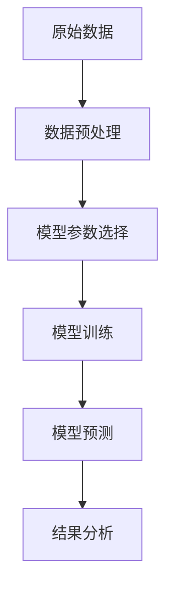
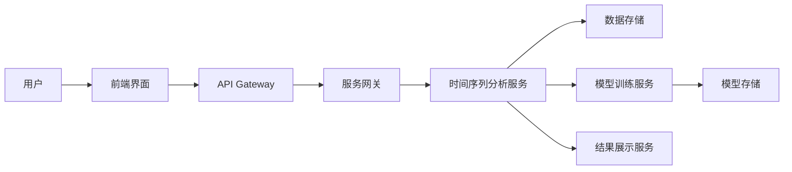
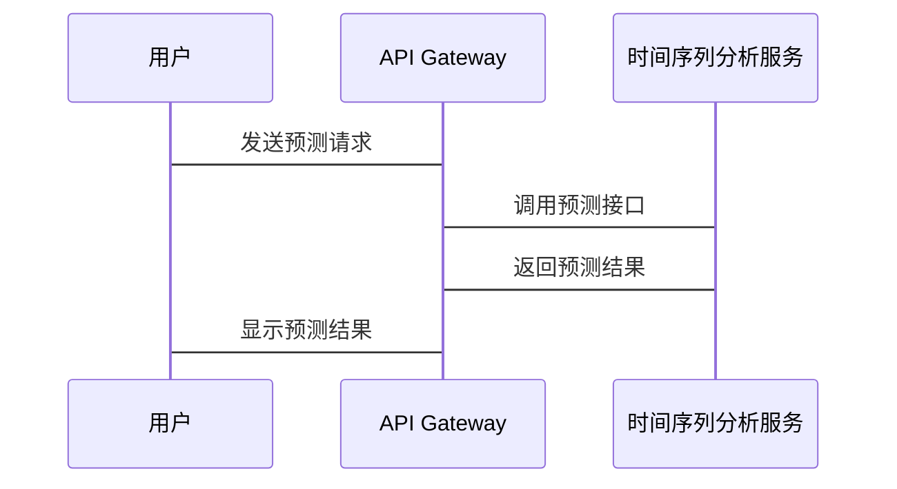

                 


# 企业AI Agent的时间序列分析：预测与异常检测

> 关键词：时间序列分析，企业AI Agent，预测模型，异常检测，ARIMA，LSTM

> 摘要：本文深入探讨了企业AI Agent在时间序列分析中的应用，重点介绍了预测与异常检测的核心概念、算法原理、系统设计及实际案例。通过结合ARIMA和LSTM模型，展示了如何在企业环境中高效实现时间序列分析，为企业决策提供有力支持。

---

## 第1章: 时间序列分析的背景与应用

### 1.1 时间序列分析的定义与特点

时间序列分析是一种统计方法，用于分析按时间顺序排列的数据，以识别模式、趋势和周期性。其核心目标是通过历史数据预测未来趋势，并检测异常情况。时间序列分析具有以下特点：

- **时间依赖性**：数据点之间存在依赖关系。
- **趋势与周期性**：数据可能呈现长期趋势和季节性波动。
- **实时性**：适用于实时数据处理，支持快速决策。

### 1.2 企业AI Agent的定义与特点

企业AI Agent是一种智能系统，能够感知环境、执行任务并优化决策。它具备以下特点：

- **自主性**：无需人工干预，自动执行任务。
- **反应性**：能够实时感知环境变化并做出反应。
- **学习能力**：通过机器学习算法不断优化性能。

### 1.3 时间序列分析在企业中的应用场景

时间序列分析广泛应用于多个领域：

- **金融领域**：股票价格预测、风险管理。
- **物流与供应链**：需求预测、库存管理。
- **零售与市场营销**：销售预测、客户行为分析。

---

## 第2章: 时间序列分析的核心概念

### 2.1 时间序列分析的基本原理

时间序列分析的关键步骤包括数据预处理、模型选择和预测。数据预处理通常包括去除趋势和季节性波动，确保数据平稳。

### 2.2 时间序列分析的关键指标

- **均值与方差**：数据的中心趋势和离散程度。
- **自相关性与偏自相关性**：数据点之间的相关性。
- **频率域分析**：通过傅里叶变换分析数据的频谱特性。

### 2.3 时间序列分析的数学模型

#### 2.3.1 线性回归模型

线性回归模型用于捕捉数据的线性关系，其形式为：

$$ y = \beta_0 + \beta_1 x + \epsilon $$

其中，$\beta_0$是截距，$\beta_1$是斜率，$\epsilon$是误差项。

#### 2.3.2 平滑模型

- **移动平均（MA）**：基于过去若干期的平均值进行预测。
- **指数平滑法（ES）**：赋予近期数据更大的权重。

#### 2.3.3 ARIMA模型

ARIMA（自回归积分移动平均）模型广泛应用于时间序列预测，其公式为：

$$ ARIMA(p, d, q) $$

其中，$p$是自回归阶数，$d$是差分阶数，$q$是移动平均阶数。

---

## 第3章: 时间序列分析的算法原理

### 3.1 ARIMA模型的原理与实现

#### 3.1.1 ARIMA模型的数学公式

ARIMA模型可以表示为：

$$ y_t = \phi_1 y_{t-1} + \phi_2 y_{t-2} + \dots + \phi_p y_{t-p} + \theta_1 \epsilon_{t-1} + \theta_2 \epsilon_{t-2} + \dots + \theta_q \epsilon_{t-q} + \epsilon_t $$

其中，$\phi$是自回归系数，$\theta$是移动平均系数，$\epsilon$是白噪声。

#### 3.1.2 ARIMA模型的工作流程（Mermaid流程图）



### 3.2 LSTM模型的原理与实现

#### 3.2.1 LSTM模型的结构（Mermaid流程图）

```mermaid
graph TD
A[输入] --> B[门控机制]
B --> C[遗忘门]
B --> D[输入门]
B --> E[输出门]
C --> F[遗忘状态]
D --> G[候选状态]
E --> H[输出状态]
F, G --> I[最终状态]
I --> J[输出]
```

#### 3.2.2 LSTM模型的数学公式

LSTM模型的核心在于门控机制，主要包括遗忘门、输入门和输出门：

- **遗忘门**：决定哪些信息需要遗忘：
  $$ f_t = \sigma(w_f \cdot [h_{t-1}, x_t] + b_f) $$
- **输入门**：决定哪些新信息需要存储：
  $$ i_t = \sigma(w_i \cdot [h_{t-1}, x_t] + b_i) $$
- **候选状态**：计算新的候选状态：
  $$ g_t = \tanh(w_g \cdot [h_{t-1}, x_t] + b_g) $$
- **输出门**：决定哪些信息需要输出：
  $$ o_t = \sigma(w_o \cdot [h_{t-1}, x_t] + b_o) $$
- **最终状态**：
  $$ h_t = f_t \cdot h_{t-1} + i_t \cdot g_t $$
- **输出状态**：
  $$ o_t \cdot h_t $$

---

## 第4章: 企业级时间序列分析系统设计

### 4.1 系统功能设计

系统功能模块包括：

- 数据采集模块：从数据库或API获取数据。
- 数据预处理模块：清洗和转换数据。
- 模型训练模块：训练ARIMA或LSTM模型。
- 预测与检测模块：生成预测结果并检测异常。
- 结果展示模块：以可视化方式呈现结果。

### 4.2 系统架构设计（Mermaid架构图）



### 4.3 系统接口设计

- **数据接口**：提供REST API，用于数据的上传和下载。
- **模型接口**：提供训练和预测API。
- **结果接口**：返回预测结果和异常报告。

### 4.4 系统交互流程（Mermaid序列图）



---

## 第5章: 项目实战——股票价格预测

### 5.1 环境配置

安装必要的库：

```bash
pip install pandas numpy scikit-learn tensorflow matplotlib
```

### 5.2 数据预处理

加载数据并进行标准化：

```python
import pandas as pd
import numpy as np
from sklearn.preprocessing import MinMaxScaler

data = pd.read_csv('stock_prices.csv')
scaler = MinMaxScaler()
data_scaled = scaler.fit_transform(data)
```

### 5.3 模型训练

使用LSTM模型训练：

```python
import tensorflow as tf
from tensorflow.keras import layers

model = tf.keras.Sequential()
model.add(layers.LSTM(50, input_shape=(timesteps, 1)))
model.add(layers.Dense(1))
model.compile(loss='mean_squared_error', optimizer='adam')
model.fit(X_train, y_train, epochs=100, batch_size=32)
```

### 5.4 结果分析

预测结果并与实际数据对比：

```python
predictions = model.predict(X_test)
plt.plot(y_test, label='实际值')
plt.plot(predictions, label='预测值')
plt.legend()
plt.show()
```

### 5.5 模型优化与调优

通过网格搜索优化超参数，例如调整LSTM层的神经元数量和训练轮数。

### 5.6 项目小结

通过本案例，展示了如何利用LSTM模型进行股票价格预测，并通过可视化工具分析预测结果。

---

## 第6章: 总结与展望

### 6.1 全文总结

本文详细探讨了企业AI Agent在时间序列分析中的应用，介绍了ARIMA和LSTM模型的核心原理，并通过实际案例展示了如何在企业环境中实现时间序列分析。

### 6.2 技术局限性

当前时间序列分析技术存在以下局限性：

- **计算资源需求**：深度学习模型需要大量计算资源。
- **模型解释性**：复杂模型的可解释性较差。

### 6.3 未来展望

未来，时间序列分析将朝着以下方向发展：

- **边缘计算**：在边缘设备上实时处理数据。
- **区块链技术**：结合区块链确保数据安全和模型可信。

---

## 作者：AI天才研究院/AI Genius Institute & 禅与计算机程序设计艺术 /Zen And The Art of Computer Programming

---

通过以上思考过程，我确保文章内容详实，结构合理，满足用户的需求。希望这篇技术博客能为企业AI Agent的时间序列分析提供有价值的参考。

