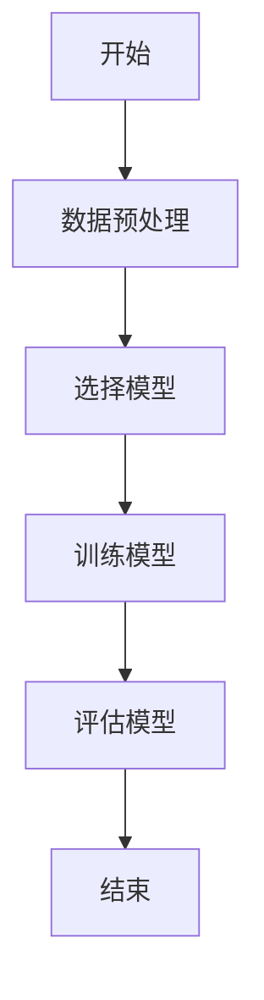
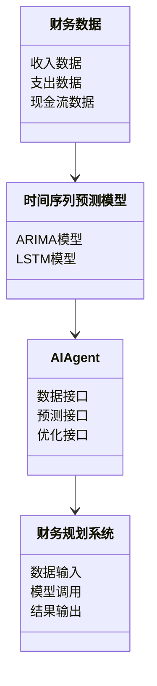
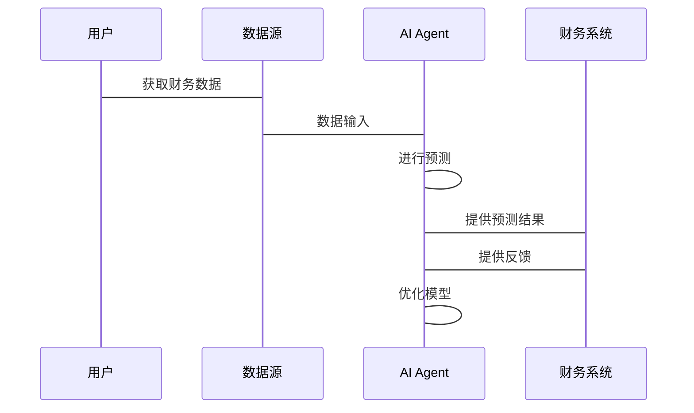

                 


# 企业AI Agent的时间序列预测在财务规划中的应用

> 关键词：企业AI Agent，时间序列预测，财务规划，机器学习，深度学习

> 摘要：本文探讨了企业AI Agent如何利用时间序列预测技术优化财务规划，通过具体的方法和应用场景，展示了该技术在提升财务预测准确性、支持决策和实现自动化中的价值。

---

## 第一部分：背景与概述

### 第1章：时间序列预测与AI Agent概述

#### 1.1 时间序列预测的基本概念
- **1.1.1 时间序列预测的定义**  
  时间序列预测是一种利用历史数据预测未来趋势的统计方法，广泛应用于金融、经济等领域。

- **1.1.2 时间序列预测的核心要素**  
  包括数据的周期性、趋势和随机性。

- **1.1.3 时间序列预测的分类与特点**  
  分为单变量和多变量预测，具有时序依赖性和复杂性。

#### 1.2 AI Agent的基本概念
- **1.2.1 AI Agent的定义**  
  AI Agent是一种能够感知环境、自主决策的智能实体，具备学习和优化能力。

- **1.2.2 AI Agent的核心功能**  
  包括感知、决策、执行和反馈机制。

- **1.2.3 AI Agent与传统预测模型的区别**  
  AI Agent能够动态调整预测模型，更具适应性和主动性。

#### 1.3 时间序列预测在财务规划中的应用
- **1.3.1 财务规划中的时间序列预测需求**  
  包括销售额预测、成本控制和现金流预测。

- **1.3.2 AI Agent在财务规划中的优势**  
  提高预测精度，实现自动化和实时更新。

- **1.3.3 应用场景**  
  销售预测、成本预测、预算编制和风险管理。

---

## 第2章：核心概念与原理

### 2.1 时间序列预测的基本原理
- **2.1.1 时间序列的组成部分**  
  包括趋势、周期性、季节性和随机干扰。

- **2.1.2 时间序列预测的数学模型**  
  包括ARIMA、LSTM等模型。

- **2.1.3 时间序列预测的假设条件**  
  数据的平稳性、线性关系和独立性。

### 2.2 AI Agent的核心原理
- **2.2.1 AI Agent的感知与决策机制**  
  利用传感器和API获取数据，结合模型进行决策。

- **2.2.2 AI Agent的学习与优化算法**  
  使用强化学习和梯度下降优化模型。

- **2.2.3 AI Agent的自适应能力**  
  基于反馈不断优化预测模型。

### 2.3 时间序列预测与AI Agent的结合
- **2.3.1 时间序列预测作为数据输入**  
  AI Agent利用时间序列数据进行预测。

- **2.3.2 AI Agent优化预测结果**  
  通过机器学习算法提升预测准确性。

- **2.3.3 协同工作流程**  
  数据采集、预测、反馈优化的循环过程。

---

## 第3章：时间序列预测的数学模型与算法

### 3.1 ARIMA模型
- **3.1.1 ARIMA模型的数学公式**  
  $$ARIMA(p, d, q)$$
  其中，p为自回归阶数，d为差分阶数，q为移动平均阶数。

- **3.1.2 ARIMA模型的实现步骤**  
  数据预处理、参数估计、模型验证。

### 3.2 LSTM模型
- **3.2.1 LSTM模型的结构**  
  包括输入门、遗忘门和输出门。

- **3.2.2 LSTM模型的数学公式**  
  $$i_t = \sigma(W_i x_t + U_i h_{t-1} + b_i)$$
  $$f_t = \sigma(W_f x_t + U_f h_{t-1} + b_f)$$
  $$o_t = \sigma(W_o x_t + U_o h_{t-1} + b_o)$$
  $$h_t = i_t \cdot \tanh(W_c x_t + U_c h_{t-1} + b_c)$$
  $$c_t = f_t \cdot c_{t-1} + i_t \cdot h_t$$
  $$o_t = o_t \cdot \tanh(c_t)$$

- **3.2.3 LSTM模型的优缺点**  
  优点：适合长期依赖关系；缺点：训练复杂度高。

### 3.3 算法流程图


---

## 第4章：系统分析与架构设计

### 4.1 领域模型设计


### 4.2 系统架构设计


### 4.3 接口设计
- 数据接口：负责数据输入和输出。
- 预测接口：提供预测结果。
- 优化接口：根据反馈优化模型。

### 4.4 交互流程


---

## 第5章：项目实战

### 5.1 环境安装
- 安装Python、TensorFlow、Keras、pandas和numpy。

### 5.2 核心代码实现
```python
import numpy as np
from tensorflow.keras.models import Sequential
from tensorflow.keras.layers import LSTM, Dense

model = Sequential()
model.add(LSTM(128, input_shape=(1, 1)))
model.add(Dense(1))
model.compile(optimizer='adam', loss='mean_squared_error')
model.fit(X_train, y_train, epochs=100, batch_size=32)
```

### 5.3 案例分析
- 案例：预测公司未来3个月的收入。
- 数据预处理：归一化和分割训练集与测试集。
- 模型训练：使用LSTM模型进行训练。
- 结果分析：对比预测值与实际值，计算误差。

---

## 第6章：最佳实践与总结

### 6.1 最佳实践
- 数据质量：确保数据的完整性和准确性。
- 模型选择：根据数据特性选择合适模型。
- 模型优化：定期更新模型，结合反馈优化。

### 6.2 小结
本文详细探讨了企业AI Agent在时间序列预测中的应用，展示了如何通过技术手段提升财务规划的效率和准确性。

### 6.3 注意事项
- 数据隐私：确保数据安全。
- 模型解释性：便于分析结果。
- 系统维护：定期更新和维护系统。

### 6.4 拓展阅读
推荐书籍和论文，深入学习时间序列预测和AI Agent相关知识。

---

## 作者信息
作者：AI天才研究院  
地址：禅与计算机程序设计艺术  
联系：[email protected]

---

通过以上结构，文章详细讲解了企业AI Agent在时间序列预测中的应用，从理论到实践，确保读者能够全面理解并应用这些技术。

