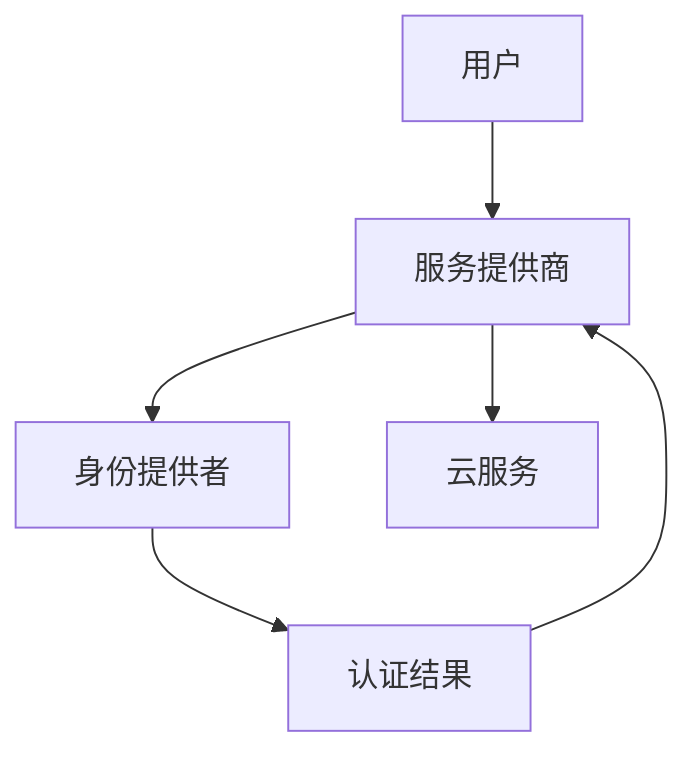
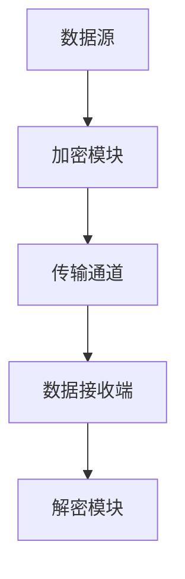
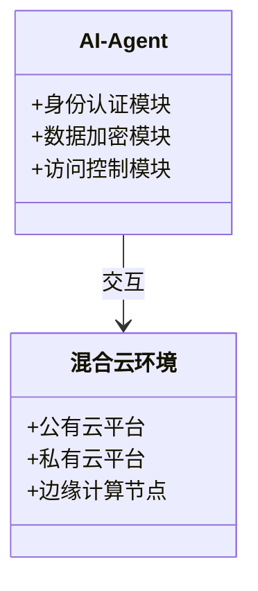
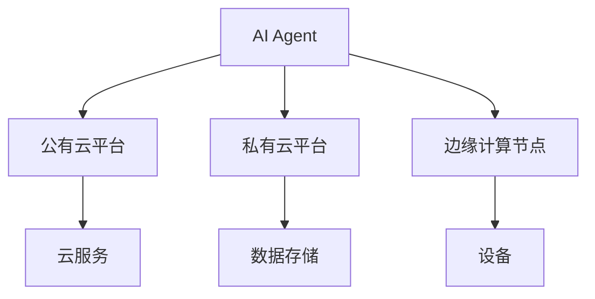
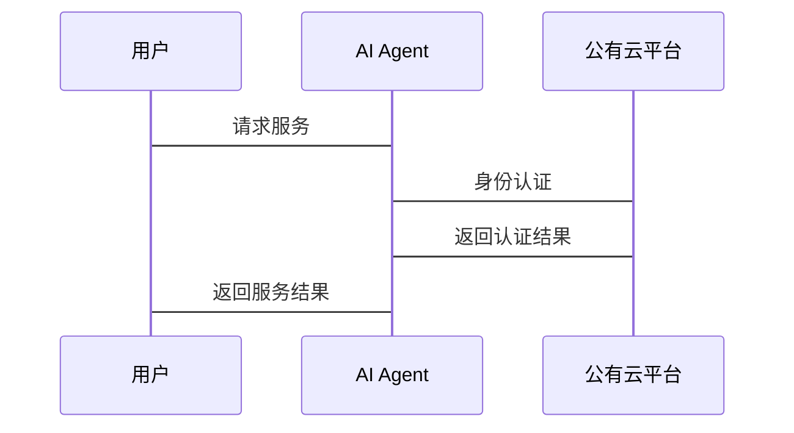

                 


# 企业AI Agent的混合云安全策略

> 关键词：企业AI Agent，混合云，安全策略，身份认证，数据加密，访问控制

> 摘要：随着人工智能技术的快速发展，企业AI Agent在混合云环境中的应用越来越广泛。然而，混合云环境下的安全威胁也在不断增加，如何制定有效的安全策略成为企业面临的重要挑战。本文将从背景介绍、核心概念、算法原理、系统架构设计、安全策略实现、项目实战等多个方面，详细探讨企业AI Agent的混合云安全策略。

---

# 第一部分: 企业AI Agent的混合云安全策略背景介绍

## 第1章: 混合云与AI Agent概述

### 1.1 混合云的基本概念

#### 1.1.1 混合云的定义与特点
混合云是一种结合了公有云和私有云的云计算模式。它的特点包括灵活性高、成本优化、资源可扩展性强等。企业可以根据实际需求选择不同的云服务提供商，实现资源的最优分配。

#### 1.1.2 混合云的架构与优势
混合云的架构通常包括公有云、私有云、边缘计算等部分，通过统一的管理平台实现资源的协同工作。其优势在于能够充分利用公有云的弹性和私有云的安全性，满足企业的多样化需求。

#### 1.1.3 混合云在企业中的应用现状
目前，混合云已经在金融、医疗、制造等多个行业得到了广泛应用。企业通过混合云架构能够实现数据的高效存储、计算资源的弹性扩展以及多平台的协同工作。

### 1.2 AI Agent的核心概念

#### 1.2.1 AI Agent的定义与特点
AI Agent是一种能够自主执行任务的智能代理，它能够通过传感器、数据库或其他输入源获取信息，并根据预设的规则或模型做出决策。

#### 1.2.2 AI Agent的工作原理
AI Agent的工作原理通常包括感知环境、目标设定、规划与执行、学习与优化等几个阶段。它能够通过机器学习算法不断优化自身的决策能力。

#### 1.2.3 AI Agent在企业中的应用场景
在企业中，AI Agent广泛应用于智能客服、自动化运维、智能监控等领域。它能够帮助企业提高效率、降低成本，并增强客户体验。

### 1.3 混合云与AI Agent的结合

#### 1.3.1 混合云环境下AI Agent的部署模式
在混合云环境下，AI Agent可以部署在公有云、私有云或边缘计算节点上，根据任务需求灵活切换。

#### 1.3.2 混合云与AI Agent结合的优势
混合云的灵活性和扩展性为AI Agent的部署提供了更大的空间，能够满足不同场景下的需求。

#### 1.3.3 混合云环境下AI Agent的安全挑战
混合云环境下的数据分散存储和多平台交互增加了AI Agent的安全风险，如数据泄露、身份仿冒等问题。

## 第2章: 企业AI Agent的混合云安全问题背景

### 2.1 混合云环境下的安全威胁

#### 2.1.1 混合云环境中的主要安全威胁
- 数据泄露：由于数据分布在不同的云平台上，容易成为攻击目标。
- 身份仿冒：攻击者可能通过伪造身份获取敏感信息。
- 恶意软件：通过感染设备或平台，窃取数据或破坏系统。

#### 2.1.2 混合云环境下的数据泄露风险
数据泄露是混合云环境下的主要安全威胁之一，尤其是在AI Agent涉及大量敏感数据时。

#### 2.1.3 混合云环境下的身份认证挑战
在混合云环境下，AI Agent需要在多个云平台之间进行身份认证，这增加了身份管理的复杂性。

### 2.2 AI Agent的安全需求

#### 2.2.1 AI Agent对数据隐私的要求
AI Agent处理的大量数据需要确保隐私安全，防止未经授权的访问。

#### 2.2.2 AI Agent对身份认证的需求
为了确保AI Agent的合法性和操作权限，需要建立严格的身份认证机制。

#### 2.2.3 AI Agent对访问控制的要求
通过访问控制策略，确保AI Agent只能执行授权的操作，防止越权访问。

### 2.3 混合云环境下AI Agent安全策略的重要性

#### 2.3.1 安全策略对企业AI Agent的重要性
通过制定合理的安全策略，可以有效降低AI Agent面临的安全风险。

#### 2.3.2 安全策略对混合云环境的重要性
安全策略能够确保混合云环境下的数据和资源安全，避免因安全漏洞导致的损失。

#### 2.3.3 安全策略对AI Agent与云服务交互的影响
合理的安全策略能够规范AI Agent与云服务的交互行为，确保系统的稳定性和安全性。

---

# 第二部分: 企业AI Agent的混合云安全策略核心概念与联系

## 第3章: 核心概念与原理

### 3.1 混合云环境下的身份认证机制

#### 3.1.1 联合身份认证的原理
联合身份认证通过使用SAML（Security Assertion Markup Language）等标准协议，实现跨云平台的身份认证。

#### 3.1.2 基于SAML的认证流程
以下是基于SAML的认证流程的Mermaid图：



#### 3.1.3 跨云服务的身份认证挑战
在混合云环境下，跨云服务的身份认证需要解决信任域不一致、认证协议兼容性等问题。

### 3.2 数据加密与安全传输

#### 3.2.1 数据加密算法的选择与应用
以下是常用加密算法的对比表格：

| 加密算法 | 加密模式 | 适用场景 | 优点 | 缺点 |
|----------|----------|----------|------|------|
| AES      | 块加密   | 数据存储 | 加密快，安全性高 | 密钥管理复杂 |
| RSA      | 常规加密 | 数据传输 | 安全性高，适合公钥加密 | 加密速度慢 |

#### 3.2.2 数据安全传输的实现方式
以下是数据安全传输的Mermaid图：



---

## 第4章: 算法原理讲解

### 4.1 加密算法原理

#### 4.1.1 AES加密算法的原理
AES（Advanced Encryption Standard）是一种基于块的加密算法，常用的密钥长度为128、192和256位。

#### 4.1.2 AES加密的数学模型
以下是AES加密的数学模型：

$$
y = f(x) = x \oplus k
$$

其中，$x$ 是明文，$k$ 是密钥，$\oplus$ 表示异或操作。

#### 4.1.3 AES加密的实现代码
以下是Python中AES加密的实现代码：

```python
import hashlib
from cryptography.fernet import Fernet

# 生成密钥
key = Fernet.generate_key()
cipher = Fernet(key)

# 加密
encrypted_data = cipher.encrypt(b"Hello, World!")
print(encrypted_data)

# 解密
decrypted_data = cipher.decrypt(encrypted_data)
print(decrypted_data.decode())
```

### 4.2 数据完整性校验

#### 4.2.1 哈希算法的原理
哈希算法通过将数据转换为固定长度的哈希值，实现数据完整性校验。

#### 4.2.2 SHA-256哈希函数的实现
以下是SHA-256哈希函数的Python实现代码：

```python
import hashlib

def compute_sha256(data):
    hash_object = hashlib.sha256(data.encode())
    return hash_object.hexdigest()

print(compute_sha256("Hello, World!"))
```

---

## 第5章: 系统分析与架构设计方案

### 5.1 问题场景介绍

#### 5.1.1 当前的安全问题
在混合云环境下，AI Agent面临的主要安全问题是数据泄露和身份仿冒。

#### 5.1.2 需求分析
需要实现跨云平台的身份认证、数据加密传输和访问控制。

### 5.2 系统功能设计

#### 5.2.1 系统功能模块
以下是系统功能模块的Mermaid类图：



### 5.3 系统架构设计

#### 5.3.1 系统架构图
以下是系统架构的Mermaid图：



### 5.4 系统接口设计

#### 5.4.1 API接口
以下是系统主要接口的序列图：



---

## 第6章: 安全策略与实现

### 6.1 身份认证策略

#### 6.1.1 基于SAML的联合身份认证
通过SAML协议实现跨云平台的联合身份认证，确保AI Agent的身份合法性。

#### 6.1.2 实现步骤
以下是基于SAML的认证流程：

1. 用户向服务提供商发起请求。
2. 服务提供商要求用户进行身份认证。
3. 用户身份提供者进行身份验证。
4. 身份提供者返回认证结果。
5. 服务提供商提供相应的服务。

### 6.2 数据加密策略

#### 6.2.1 数据传输加密
使用AES加密算法对数据进行加密，确保数据在传输过程中的安全性。

#### 6.2.2 数据存储加密
对存储在云平台上的数据进行加密，防止数据泄露。

### 6.3 访问控制策略

#### 6.3.1 基于角色的访问控制
通过RBAC（基于角色的访问控制）模型，确保AI Agent只能访问其权限范围内的资源。

#### 6.3.2 实施步骤
以下是RBAC的实施步骤：

1. 定义角色和权限。
2. 为用户分配角色。
3. 根据角色分配权限。
4. 在系统中实施访问控制。

---

## 第7章: 项目实战

### 7.1 环境安装

#### 7.1.1 安装Python和相关库
以下是安装Python和Cryptography库的命令：

```bash
python -m pip install cryptography
```

### 7.2 系统核心实现

#### 7.2.1 身份认证模块实现
以下是基于SAML的认证模块实现代码：

```python
from cryptography.hazmat.primitives.asymmetric import padding
from cryptography.hazmat.primitives.asymmetric.rsa import (
    generate_private_key, generate_public_key,
)

# 生成RSA密钥对
private_key = generate_private_key()
public_key = generate_public_key(private_key.public_numbers())

# 签名数据
data = b"Hello, World!"
signature = private_key.sign(data, padding.PKCS1v15())

# 验证签名
public_key.verify(signature, data, padding.PKCS1v15())
```

### 7.3 代码应用解读与分析

#### 7.3.1 加密模块解读
上述代码实现了RSA加密算法，用于数据签名和验证。

#### 7.3.2 安全策略分析
通过RSA加密，确保数据在传输过程中的完整性和真实性。

### 7.4 实际案例分析

#### 7.4.1 案例背景
某企业AI Agent需要在混合云环境下实现跨平台的身份认证。

#### 7.4.2 实施方案
通过SAML协议实现联合身份认证，确保AI Agent能够安全地访问多个云平台的服务。

### 7.5 项目小结

#### 7.5.1 项目总结
通过项目实战，验证了混合云环境下AI Agent的安全策略的有效性。

#### 7.5.2 经验总结
在实际项目中，需要充分考虑混合云环境的复杂性和多样性，制定灵活且 robust的安全策略。

---

# 第三部分: 总结与展望

## 第8章: 总结与展望

### 8.1 全文总结
本文详细探讨了企业AI Agent在混合云环境下的安全策略，涵盖了身份认证、数据加密、访问控制等多个方面。

### 8.2 未来研究方向

#### 8.2.1 深度学习在安全策略中的应用
通过深度学习技术，优化安全策略的制定和实施。

#### 8.2.2 多云环境下的安全挑战
研究多云环境下AI Agent的安全策略，探索新的解决方案。

---

# 作者

作者：AI天才研究院/AI Genius Institute & 禅与计算机程序设计艺术 /Zen And The Art of Computer Programming

