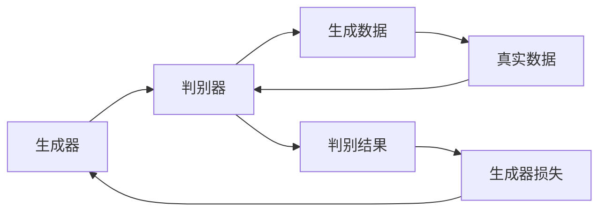
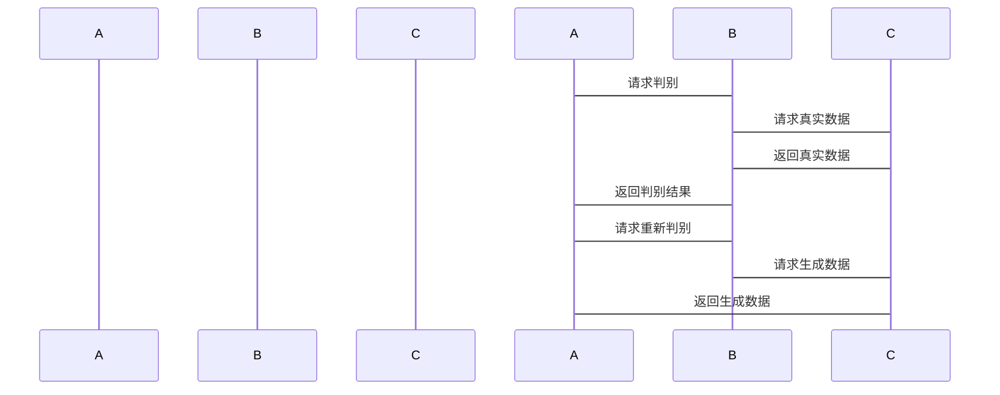

                 


# 企业AI Agent的生成对抗网络在产品设计创新中的前沿应用

> 关键词：生成对抗网络，企业AI Agent，产品设计创新，深度学习，生成模型，AI驱动设计

> 摘要：  
本文深入探讨了生成对抗网络（GAN）在企业AI Agent中的应用，特别是在产品设计创新方面。通过分析GAN的基本原理、企业AI Agent的概念、产品设计创新的具体应用场景，以及实际案例的分析，本文揭示了GAN如何赋能企业AI Agent，推动产品设计的智能化与个性化。文章内容涵盖GAN的数学模型、算法原理、系统架构设计，以及项目实战等多方面内容，为读者提供全面而深入的技术解读。

---

# 第一部分: 生成对抗网络（GAN）基础

## 第1章: 生成对抗网络（GAN）概述

### 1.1 生成对抗网络的基本概念

#### 1.1.1 生成模型与判别模型的定义
生成对抗网络（GAN）由两个神经网络构成：生成器（Generator）和判别器（Discriminator）。生成器负责生成数据，判别器负责区分真实数据和生成数据。两者通过对抗训练相互竞争，最终达到生成逼真数据的目的。

#### 1.1.2 GAN的核心思想与工作原理
GAN的核心思想是通过对抗训练实现数据生成。生成器的目标是生成能够欺骗判别器的数据，而判别器的目标是识别出生成数据与真实数据之间的差异。通过不断迭代训练，生成器和判别器的能力不断提升，最终达到生成高质量数据的效果。

#### 1.1.3 GAN的优缺点分析
- **优点**：生成的数据质量高，适用于图像生成、风格迁移等多种任务。
- **缺点**：训练不稳定，容易出现模式坍塌问题，生成器和判别器的训练需要精细的超参数调整。

### 1.2 GAN的发展历程

#### 1.2.1 GAN的起源与发展
GAN由Ian Goodfellow等人于2014年提出，最初主要用于图像生成任务。随后，GAN在学术界和产业界得到了广泛应用，衍生出多种变体，如Wasserstein GAN（WGAN）、风格迁移GAN（StyleGAN）等。

#### 1.2.2 不同类型的GAN模型
- **基本GAN（GAN）**：最早提出，用于图像生成。
- **Wasserstein GAN（WGAN）**：通过 Wasserstein 距离改进损失函数，提升生成质量。
- **Conditional GAN（cGAN）**：在生成过程中引入条件，用于特定任务的生成，如条件图像生成。

#### 1.2.3 GAN在学术界与产业界的影响力
GAN在学术界和产业界都取得了巨大成功，广泛应用于图像生成、风格迁移、数据增强等领域。特别是在计算机视觉、自然语言处理和人工智能领域，GAN的应用前景广阔。

### 1.3 GAN在企业中的应用潜力

#### 1.3.1 GAN在数据生成中的应用
企业在数据不足的情况下，可以通过GAN生成合成数据，用于模型训练和测试。

#### 1.3.2 GAN在图像处理中的应用
企业可以利用GAN进行图像修复、图像增强、图像风格迁移等任务，提升图像处理能力。

#### 1.3.3 GAN在产品设计中的创新潜力
GAN可以用于生成新的产品设计原型，辅助设计师进行创新设计。

---

## 第2章: GAN的核心算法原理

### 2.1 GAN的基本算法流程

#### 2.1.1 GAN的损失函数
GAN的损失函数由生成器和判别器的损失组成：
- 判别器的损失函数：
$$\mathcal{L}_{\text{D}} = \mathbb{E}_{x \sim p_{\text{data}}}[ \log D(x)] + \mathbb{E}_{z \sim p_z}[ \log(1 - D(G(z)))]$$
- 生成器的损失函数：
$$\mathcal{L}_{\text{G}} = \mathbb{E}_{z \sim p_z}[ \log D(G(z))]$$

#### 2.1.2 GAN的训练过程
1. 初始化生成器和判别器的参数。
2. 训练判别器，使其能够区分真实数据和生成数据。
3. 训练生成器，使其生成的数据能够欺骗判别器。
4. 重复上述步骤，直到生成器和判别器的损失函数收敛。

#### 2.1.3 GAN的收敛性分析
GAN的训练过程可能不稳定，容易出现模式坍塌问题。解决方法包括调整损失函数、引入正则化项等。

### 2.2 常见的GAN变体

#### 2.2.1 WGAN：Wasserstein GAN
WGAN通过引入Wasserstein距离作为损失函数，提高了生成数据的质量和稳定性。

#### 2.2.2 GAN的改进版本：如StyleGAN
StyleGAN通过引入风格编码器，实现了高质量的图像生成，特别是在图像风格迁移任务中表现出色。

#### 2.2.3 多模态GAN：用于多领域数据生成
多模态GAN可以在不同领域之间生成数据，例如同时生成图像和文本。

### 2.3 GAN的数学模型与算法流程图

#### 2.3.1 GAN的数学模型
生成器和判别器的数学模型如下：
- 生成器：
$$G: z \rightarrow x$$
- 判别器：
$$D: x \rightarrow \{0,1\}$$

#### 2.3.2 GAN的训练过程与优化策略
生成器和判别器的交替训练过程可以用以下流程图表示：



---

## 第3章: 企业AI Agent的概念与应用

### 3.1 企业AI Agent的基本概念

#### 3.1.1 AI Agent的定义与分类
企业AI Agent是一种能够感知环境、执行任务并做出决策的智能体。根据功能不同，可以分为执行型AI Agent和决策型AI Agent。

#### 3.1.2 企业AI Agent的核心功能
- 数据分析与处理
- 任务执行与优化
- 智能决策与反馈

#### 3.1.3 企业AI Agent的应用场景
- 生产优化
- 质量控制
- 产品设计

### 3.2 企业AI Agent与产品设计创新

#### 3.2.1 产品设计中的需求分析
AI Agent可以通过分析市场数据和用户反馈，生成设计需求。

#### 3.2.2 AI Agent在产品设计中的创新应用
AI Agent可以通过GAN生成新的设计原型，辅助设计师进行创新设计。

#### 3.2.3 产品设计的智能化与个性化
通过AI Agent，产品设计可以实现智能化和个性化，满足不同用户的需求。

### 3.3 企业AI Agent的架构与实现

#### 3.3.1 AI Agent的系统架构
AI Agent的系统架构包括感知层、决策层和执行层。

#### 3.3.2 AI Agent的核心算法实现
AI Agent的核心算法包括监督学习、强化学习和生成对抗网络。

#### 3.3.3 AI Agent的交互界面设计
AI Agent需要设计友好的交互界面，方便用户与AI Agent进行交互。

---

## 第4章: GAN在企业AI Agent中的应用

### 4.1 GAN在产品设计中的创新应用

#### 4.1.1 基于GAN的产品设计生成
通过GAN生成新的设计原型，辅助设计师进行创新设计。

#### 4.1.2 GAN在设计优化中的应用
GAN可以通过生成多种设计方案，优化产品设计。

#### 4.1.3 GAN在用户体验设计中的应用
通过GAN生成用户画像，优化用户体验设计。

### 4.2 GAN在企业AI Agent中的系统设计

#### 4.2.1 GAN的系统架构
GAN的系统架构包括生成器、判别器和数据源。

#### 4.2.2 GAN的系统接口设计
GAN需要与企业AI Agent的其他模块进行交互，设计良好的系统接口。

#### 4.2.3 GAN的系统交互流程
GAN的系统交互流程可以通过以下序列图表示：



---

## 第5章: 项目实战

### 5.1 环境配置

#### 5.1.1 Python环境安装
安装Python和相关库，如TensorFlow、Keras、numpy等。

#### 5.1.2 GAN模型的实现
实现生成器和判别器的神经网络模型。

#### 5.1.3 数据集准备
准备训练数据集，如MNIST手写数字数据集。

### 5.2 生成器和判别器的实现

#### 5.2.1 生成器的代码实现
```python
import tensorflow as tf
from tensorflow.keras import layers

def make_generator_model():
    model = tf.keras.Sequential()
    model.add(layers.Dense(256, activation='relu', input_shape=(100,)))
    model.add(layers.Dense(512, activation='relu'))
    model.add(layers.Dense(784, activation='sigmoid'))
    return model
```

#### 5.2.2 判别器的代码实现
```python
def make_discriminator_model():
    model = tf.keras.Sequential()
    model.add(layers.Dense(512, activation='relu', input_shape=(784,)))
    model.add(layers.Dense(256, activation='relu'))
    model.add(layers.Dense(1, activation='sigmoid'))
    return model
```

### 5.3 训练过程与结果展示

#### 5.3.1 模型训练
通过交替训练生成器和判别器，逐步优化模型参数。

#### 5.3.2 训练结果
展示生成器生成的数字图像和判别器的判别结果。

### 5.4 案例分析与经验总结

#### 5.4.1 案例分析
分析GAN生成的数字图像的质量，评估模型的性能。

#### 5.4.2 经验总结
总结GAN在企业AI Agent中的应用经验，提出改进建议。

---

## 第6章: 最佳实践与未来展望

### 6.1 最佳实践 tips

#### 6.1.1 数据质量的重要性
保证训练数据的质量，可以提升生成模型的效果。

#### 6.1.2 模型调参技巧
合理调整生成器和判别器的超参数，确保模型训练的稳定性。

#### 6.1.3 模型评估方法
使用多种指标评估生成模型的性能，如FID分数、IS分数等。

### 6.2 小结

#### 6.2.1 本文总结
总结本文的主要内容和研究成果，强调GAN在企业AI Agent中的应用潜力。

#### 6.2.2 后续研究方向
提出未来的研究方向，如多模态GAN、实时生成对抗网络等。

### 6.3 注意事项

#### 6.3.1 数据隐私与安全
在企业应用中，需要注意数据隐私和安全问题。

#### 6.3.2 模型的可解释性
提升生成模型的可解释性，便于企业用户理解和使用。

### 6.4 拓展阅读

#### 6.4.1 相关技术
推荐相关的技术资料和论文，供读者进一步学习。

#### 6.4.2 应用领域
介绍GAN在其他领域的应用，如医学图像生成、自然语言处理等。

---

# 作者：AI天才研究院/AI Genius Institute & 禅与计算机程序设计艺术/Zen And The Art of Computer Programming

---

这篇技术博客文章从生成对抗网络的基本原理到企业AI Agent的应用，再到实际项目实战，全面而深入地探讨了GAN在产品设计创新中的前沿应用。文章内容丰富，逻辑清晰，为读者提供了理论与实践相结合的详细解读。

