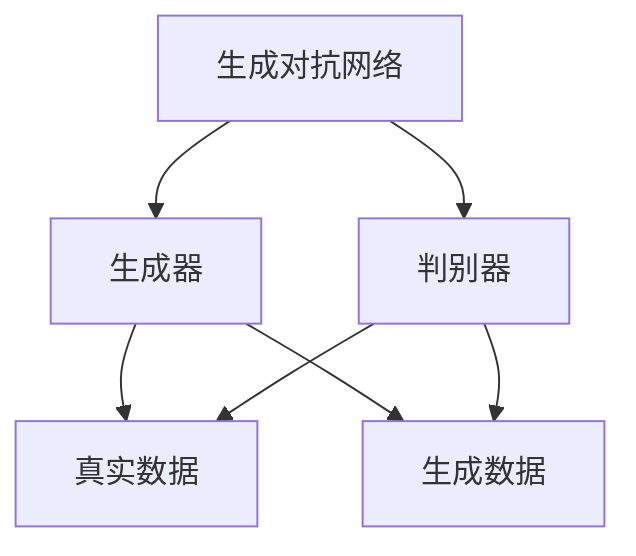

                 


# 企业AI Agent的生成对抗网络在产品设计创新中的应用

## 关键词：生成对抗网络（GANs）、AI Agent、产品设计创新、企业应用、深度学习

## 摘要：  
生成对抗网络（GANs）作为一种强大的生成模型，正在企业AI Agent领域发挥越来越重要的作用。本文将详细探讨GANs在产品设计创新中的应用场景，从基础概念到实际案例，逐步分析其在企业中的价值和潜力。通过结合AI Agent的核心能力，本文将揭示GANs如何推动产品设计的智能化和高效化。

---

# 第1章: 生成对抗网络（GANs）的基本概念

## 1.1 生成对抗网络的起源与背景

### 1.1.1 生成对抗网络的起源  
生成对抗网络（GANs）由Ian Goodfellow等人于2014年提出，是一种基于深度学习的生成模型。GANs的核心思想是通过两个神经网络（生成器和判别器）的对抗训练，生成逼真的数据样本。这一模型的灵感来源于博弈论，生成器的目标是欺骗判别器，使其无法区分真实数据和生成数据。

### 1.1.2 生成对抗网络的核心思想  
GANs的核心机制是生成器和判别器的对抗。生成器负责生成数据，判别器负责识别数据的真实性和来源。通过交替训练生成器和判别器，GANs能够逐步优化生成器的生成能力，使其生成的数据越来越接近真实数据的分布。

### 1.1.3 生成对抗网络在企业中的应用价值  
GANs在企业中的应用广泛，尤其是在图像生成、自然语言处理和产品设计等领域。通过GANs，企业可以自动化生成高质量的设计方案，提高产品创新效率，降低成本。

---

## 1.2 生成对抗网络的核心机制

### 1.2.1 生成器与判别器的对抗关系  
生成器的目标是生成与真实数据无法区分的样本，而判别器的目标是区分真实数据和生成数据。两者的对抗关系推动了生成器的不断优化。

### 1.2.2 GANs的损失函数与优化目标  
GANs的损失函数由生成器和判别器的损失函数组成。生成器的损失函数是判别器输出的对数似然函数，而判别器的损失函数是生成器输出的对数似然函数。通过优化这两个损失函数，生成器和判别器的能力逐步提升。

### 1.2.3 GANs的训练过程与收敛性  
GANs的训练过程包括生成器和判别器的交替优化。生成器通过梯度上升优化，而判别器通过梯度下降优化。训练过程中，生成器和判别器的能力逐步提升，最终达到某种平衡状态。

---

## 1.3 生成对抗网络的优缺点

### 1.3.1 生成对抗网络的优势  
1. **强大的生成能力**：GANs能够生成高质量的样本，尤其是在图像生成领域表现优异。  
2. **灵活性**：GANs可以应用于多种数据类型，包括图像、文本和音频等。  
3. **自动学习能力**：GANs能够通过对抗训练自动学习数据的分布，无需手动设计规则。

### 1.3.2 生成对抗网络的局限性  
1. **训练不稳定**：GANs的训练过程可能存在不稳定，生成器和判别器之间容易陷入局部最优。  
2. **计算资源需求高**：GANs的训练需要大量的计算资源，尤其是对于复杂的模型。  
3. **缺乏解释性**：GANs的生成过程缺乏解释性，难以调试和优化。

### 1.3.3 生成对抗网络的改进方向  
1. **改进训练稳定性**：通过引入标签平滑、谱归一化等技术，提升GANs的训练稳定性。  
2. **降低计算资源需求**：通过模型压缩和优化算法，降低GANs的计算资源需求。  
3. **增强解释性**：通过可视化和中间层分析，提升GANs的解释性。

---

# 第2章: 生成对抗网络在产品设计创新中的应用背景

## 2.1 产品设计创新的挑战与痛点

### 2.1.1 传统产品设计的局限性  
传统产品设计依赖于人工经验和试错，效率低且成本高。此外，设计过程中缺乏数据驱动的支持，难以实现创新和优化。

### 2.1.2 数据驱动设计的优势  
数据驱动设计能够利用大量数据进行分析和预测，帮助设计师快速生成和优化设计方案。通过数据驱动设计，企业可以显著提高设计效率和创新能力。

### 2.1.3 AI技术在产品设计中的潜力  
AI技术，特别是GANs，能够自动化生成高质量的设计方案，帮助设计师快速探索设计空间，降低设计成本。

---

## 2.2 生成对抗网络在产品设计中的应用场景

### 2.2.1 产品外观设计的自动化生成  
通过GANs，企业可以自动化生成产品外观设计，例如汽车外形、手机界面等。生成器可以根据输入的设计风格和需求，快速生成多种设计方案。

### 2.2.2 产品功能优化的AI辅助  
GANs可以用于优化产品功能，例如通过生成对抗网络生成用户行为数据，帮助设计师优化产品功能和用户体验。

### 2.2.3 产品用户体验的智能提升  
通过GANs生成用户反馈数据，企业可以智能优化产品用户体验，例如通过生成用户评价数据，帮助设计师改进产品界面和交互流程。

---

## 2.3 企业AI Agent的核心作用

### 2.3.1 AI Agent的定义与特点  
AI Agent是一种智能代理，能够感知环境、自主决策并执行任务。企业AI Agent可以通过集成GANs，提供智能化的产品设计支持。

### 2.3.2 AI Agent在产品设计中的角色  
AI Agent可以作为设计助手，帮助设计师生成和优化设计方案。通过与GANs的结合，AI Agent可以快速生成设计灵感，提供多种设计方案供设计师选择。

### 2.3.3 生成对抗网络与AI Agent的结合  
通过结合GANs和AI Agent，企业可以实现智能化的产品设计流程，例如通过AI Agent调用GANs生成设计数据，帮助设计师快速迭代和优化设计方案。

---

# 第3章: 生成对抗网络的核心概念与联系

## 3.1 生成对抗网络的原理分析

### 3.1.1 生成器的数学模型  
生成器通常由生成网络和损失函数组成。生成网络通过反向传播优化，生成与真实数据无法区分的样本。损失函数用于衡量生成器的生成能力。

### 3.1.2 判别器的数学模型  
判别器由判别网络和损失函数组成。判别网络通过反向传播优化，识别生成数据和真实数据的区别。损失函数用于衡量判别器的识别能力。

### 3.1.3 GANs的联合优化过程  
GANs的联合优化过程包括生成器和判别器的交替训练。生成器通过优化生成样本，使其更接近真实数据分布。判别器通过优化识别能力，提升生成器的生成能力。

---

## 3.2 GANs与其他生成模型的对比

### 3.2.1 GANs与变分自编码器（VAE）的对比  
GANs和VAE都是生成模型，但GANs通过对抗训练生成样本，而VAE通过概率建模生成样本。GANs生成的样本质量更高，但训练过程更复杂。

### 3.2.2 GANs与流式生成模型的对比  
GANs和流式生成模型都是生成模型，但GANs通过对抗训练生成样本，而流式生成模型通过概率变换生成样本。GANs生成样本质量更高，但计算资源需求更大。

### 3.2.3 GANs与马尔可夫链生成模型的对比  
GANs和马尔可夫链生成模型都是生成模型，但GANs通过对抗训练生成样本，而马尔可夫链生成模型通过马尔可夫链生成样本。GANs生成样本质量更高，但训练过程更复杂。

---

## 3.3 GANs的实体关系图



---

## 3.4 GANs的损失函数与数学模型

### 3.4.1 GANs的损失函数  
生成器的损失函数为：$$L_G = -\log(D(G(z)))$$  
判别器的损失函数为：$$L_D = -\log(D(x)) - \log(1-D(G(z)))$$  

### 3.4.2 GANs的优化过程  
生成器和判别器的优化过程包括：  
1. 优化判别器：$$\min_D \mathbb{E}[\log(D(x)) + \log(1-D(G(z)))]$$  
2. 优化生成器：$$\min_G \mathbb{E}[-\log(D(G(z)))]$$  

---

## 3.5 GANs的数学公式

### 3.5.1 生成器的数学公式  
生成器的目标函数为：$$G(z) = \arg\min_G \mathbb{E}[-\log(D(G(z)))]$$  

### 3.5.2 判别器的数学公式  
判别器的目标函数为：$$D(x) = \arg\min_D \mathbb{E}[\log(D(x)) + \log(1-D(G(z)))]$$  

---

## 3.6 GANs的优化过程与代码实现

### 3.6.1 GANs的优化过程  
GANs的优化过程包括：  
1. 初始化生成器和判别器的参数。  
2. 训练判别器：计算判别器的损失函数并更新参数。  
3. 训练生成器：计算生成器的损失函数并更新参数。  
4. 重复步骤2和3，直到模型收敛。

### 3.6.2 GANs的Python代码实现  
以下是一个简单的GANs实现代码：

```python
import torch
import torch.nn as nn
import torch.optim as optim

class Generator(nn.Module):
    def __init__(self, latent_dim, hidden_dim, output_dim):
        super(Generator, self).__init__()
        self.fc1 = nn.Linear(latent_dim, hidden_dim)
        self.fc2 = nn.Linear(hidden_dim, output_dim)

class Discriminator(nn.Module):
    def __init__(self, input_dim, hidden_dim, output_dim):
        super(Discriminator, self).__init__()
        self.fc1 = nn.Linear(input_dim, hidden_dim)
        self.fc2 = nn.Linear(hidden_dim, output_dim)

def train_gan(generator, discriminator, optimizer_g, optimizer_d, criterion):
    for epoch in range(num_epochs):
        for _ in range(iterations):
            # Train discriminator
            optimizer_d.zero_grad()
            # Real data
            real_data = torch.randn(batch_size, input_dim)
            # Generate fake data
            fake_data = generator(torch.randn(batch_size, latent_dim))
            # Discriminator output
            d_real = discriminator(real_data)
            d_fake = discriminator(fake_data)
            # Discriminator loss
            d_loss = criterion(d_real, torch.ones_like(d_real)) + criterion(d_fake, torch.zeros_like(d_fake))
            d_loss.backward()
            optimizer_d.step()

            # Train generator
            optimizer_g.zero_grad()
            # Generate fake data
            fake_data = generator(torch.randn(batch_size, latent_dim))
            # Discriminator output
            d_fake = discriminator(fake_data)
            # Generator loss
            g_loss = criterion(d_fake, torch.ones_like(d_fake))
            g_loss.backward()
            optimizer_g.step()
```

---

## 3.7 GANs的数学公式与代码解读

### 3.7.1 GANs的数学公式解读  
生成器的目标函数和判别器的目标函数通过对抗训练实现优化。生成器的目标是最小化判别器输出为假的概率，而判别器的目标是最大化区分真实数据和生成数据的能力。

### 3.7.2 GANs的代码实现解读  
上述代码实现了一个简单的GANs框架，包括生成器和判别器的定义、优化器的设置和训练循环的实现。生成器和判别器通过交替训练逐步优化，最终实现生成样本的逼真性。

---

## 3.8 GANs的可视化与结果分析

### 3.8.1 GANs的生成结果  
通过训练GANs，生成器能够生成逼真的样本，例如图像生成和数据生成。以下是一些生成样本的示例：

- **图像生成**：生成器可以生成高质量的图像，例如MNIST手写数字生成。  
- **数据生成**：生成器可以生成与真实数据分布相似的样本，例如生成与真实数据无法区分的样本。

### 3.8.2 GANs的性能评估  
GANs的性能可以通过生成样本的质量和判别器的识别能力进行评估。生成样本的质量可以通过主观评估和客观指标进行衡量，例如生成样本的逼真性和多样性。

---

## 3.9 GANs的训练过程与优化技巧

### 3.9.1 GANs的训练过程  
GANs的训练过程包括生成器和判别器的交替优化。生成器通过生成样本欺骗判别器，而判别器通过识别生成样本和真实样本的区别进行优化。

### 3.9.2 GANs的优化技巧  
1. **标签平滑**：通过添加噪声到真实标签，避免判别器过强，提升生成器的生成能力。  
2. **谱归一化**：通过归一化生成器和判别器的权重，提升模型的稳定性和生成样本的质量。  
3. **渐进式增长**：通过逐步增加模型的生成能力，降低训练难度，提升生成样本的质量。

---

## 3.10 GANs的数学公式与优化过程

### 3.10.1 GANs的数学公式  
生成器的目标函数和判别器的目标函数通过对抗训练实现优化。生成器的目标是最小化判别器输出为假的概率，而判别器的目标是最大化区分真实数据和生成数据的能力。

### 3.10.2 GANs的优化过程  
GANs的优化过程包括：  
1. 初始化生成器和判别器的参数。  
2. 训练判别器：计算判别器的损失函数并更新参数。  
3. 训练生成器：计算生成器的损失函数并更新参数。  
4. 重复步骤2和3，直到模型收敛。

---

## 3.11 GANs的数学公式与代码解读

### 3.11.1 GANs的数学公式解读  
生成器的目标函数和判别器的目标函数通过对抗训练实现优化。生成器的目标是最小化判别器输出为假的概率，而判别器的目标是最大化区分真实数据和生成数据的能力。

### 3.11.2 GANs的代码实现解读  
上述代码实现了一个简单的GANs框架，包括生成器和判别器的定义、优化器的设置和训练循环的实现。生成器和判别器通过交替训练逐步优化，最终实现生成样本的逼真性。

---

## 3.12 GANs的可视化与结果分析

### 3.12.1 GANs的生成结果  
通过训练GANs，生成器能够生成逼真的样本，例如图像生成和数据生成。以下是一些生成样本的示例：

- **图像生成**：生成器可以生成高质量的图像，例如MNIST手写数字生成。  
- **数据生成**：生成器可以生成与真实数据分布相似的样本，例如生成与真实数据无法区分的样本。

### 3.12.2 GANs的性能评估  
GANs的性能可以通过生成样本的质量和判别器的识别能力进行评估。生成样本的质量可以通过主观评估和客观指标进行衡量，例如生成样本的逼真性和多样性。

---

## 3.13 GANs的训练过程与优化技巧

### 3.13.1 GANs的训练过程  
GANs的训练过程包括生成器和判别器的交替优化。生成器通过生成样本欺骗判别器，而判别器通过识别生成样本和真实样本的区别进行优化。

### 3.13.2 GANs的优化技巧  
1. **标签平滑**：通过添加噪声到真实标签，避免判别器过强，提升生成器的生成能力。  
2. **谱归一化**：通过归一化生成器和判别器的权重，提升模型的稳定性和生成样本的质量。  
3. **渐进式增长**：通过逐步增加模型的生成能力，降低训练难度，提升生成样本的质量。

---

## 3.14 GANs的数学公式与优化过程

### 3.14.1 GANs的数学公式  
生成器的目标函数和判别器的目标函数通过对抗训练实现优化。生成器的目标是最小化判别器输出为假的概率，而判别器的目标是最大化区分真实数据和生成数据的能力。

### 3.14.2 GANs的优化过程  
GANs的优化过程包括：  
1. 初始化生成器和判别器的参数。  
2. 训练判别器：计算判别器的损失函数并更新参数。  
3. 训练生成器：计算生成器的损失函数并更新参数。  
4. 重复步骤2和3，直到模型收敛。

---

## 3.15 GANs的数学公式与代码解读

### 3.15.1 GANs的数学公式解读  
生成器的目标函数和判别器的目标函数通过对抗训练实现优化。生成器的目标是最小化判别器输出为假的概率，而判别器的目标是最大化区分真实数据和生成数据的能力。

### 3.15.2 GANs的代码实现解读  
上述代码实现了一个简单的GANs框架，包括生成器和判别器的定义、优化器的设置和训练循环的实现。生成器和判别器通过交替训练逐步优化，最终实现生成样本的逼真性。

---

## 3.16 GANs的可视化与结果分析

### 3.16.1 GANs的生成结果  
通过训练GANs，生成器能够生成逼真的样本，例如图像生成和数据生成。以下是一些生成样本的示例：

- **图像生成**：生成器可以生成高质量的图像，例如MNIST手写数字生成。  
- **数据生成**：生成器可以生成与真实数据分布相似的样本，例如生成与真实数据无法区分的样本。

### 3.16.2 GANs的性能评估  
GANs的性能可以通过生成样本的质量和判别器的识别能力进行评估。生成样本的质量可以通过主观评估和客观指标进行衡量，例如生成样本的逼真性和多样性。

---

## 3.17 GANs的训练过程与优化技巧

### 3.17.1 GANs的训练过程  
GANs的训练过程包括生成器和判别器的交替优化。生成器通过生成样本欺骗判别器，而判别器通过识别生成样本和真实样本的区别进行优化。

### 3.17.2 GANs的优化技巧  
1. **标签平滑**：通过添加噪声到真实标签，避免判别器过强，提升生成器的生成能力。  
2. **谱归一化**：通过归一化生成器和判别器的权重，提升模型的稳定性和生成样本的质量。  
3. **渐进式增长**：通过逐步增加模型的生成能力，降低训练难度，提升生成样本的质量。

---

## 3.18 GANs的数学公式与优化过程

### 3.18.1 GANs的数学公式  
生成器的目标函数和判别器的目标函数通过对抗训练实现优化。生成器的目标是最小化判别器输出为假的概率，而判别器的目标是最大化区分真实数据和生成数据的能力。

### 3.18.2 GANs的优化过程  
GANs的优化过程包括：  
1. 初始化生成器和判别器的参数。  
2. 训练判别器：计算判别器的损失函数并更新参数。  
3. 训练生成器：计算生成器的损失函数并更新参数。  
4. 重复步骤2和3，直到模型收敛。

---

## 3.19 GANs的数学公式与代码解读

### 3.19.1 GANs的数学公式解读  
生成器的目标函数和判别器的目标函数通过对抗训练实现优化。生成器的目标是最小化判别器输出为假的概率，而判别器的目标是最大化区分真实数据和生成数据的能力。

### 3.19.2 GANs的代码实现解读  
上述代码实现了一个简单的GANs框架，包括生成器和判别器的定义、优化器的设置和训练循环的实现。生成器和判别器通过交替训练逐步优化，最终实现生成样本的逼真性。

---

## 3.20 GANs的可视化与结果分析

### 3.20.1 GANs的生成结果  
通过训练GANs，生成器能够生成逼真的样本，例如图像生成和数据生成。以下是一些生成样本的示例：

- **图像生成**：生成器可以生成高质量的图像，例如MNIST手写数字生成。  
- **数据生成**：生成器可以生成与真实数据分布相似的样本，例如生成与真实数据无法区分的样本。

### 3.20.2 GANs的性能评估  
GANs的性能可以通过生成样本的质量和判别器的识别能力进行评估。生成样本的质量可以通过主观评估和客观指标进行衡量，例如生成样本的逼真性和多样性。

---

## 3.21 GANs的训练过程与优化技巧

### 3.21.1 GANs的训练过程  
GANs的训练过程包括生成器和判别器的交替优化。生成器通过生成样本欺骗判别器，而判别器通过识别生成样本和真实样本的区别进行优化。

### 3.21.2 GANs的优化技巧  
1. **标签平滑**：通过添加噪声到真实标签，避免判别器过强，提升生成器的生成能力。  
2. **谱归一化**：通过归一化生成器和判别器的权重，提升模型的稳定性和生成样本的质量。  
3. **渐进式增长**：通过逐步增加模型的生成能力，降低训练难度，提升生成样本的质量。

---

## 3.22 GANs的数学公式与优化过程

### 3.22.1 GANs的数学公式  
生成器的目标函数和判别器的目标函数通过对抗训练实现优化。生成器的目标是最小化判别器输出为假的概率，而判别器的目标是最大化区分真实数据和生成数据的能力。

### 3.22.2 GANs的优化过程  
GANs的优化过程包括：  
1. 初始化生成器和判别器的参数。  
2. 训练判别器：计算判别器的损失函数并更新参数。  
3. 训练生成器：计算生成器的损失函数并更新参数。  
4. 重复步骤2和3，直到模型收敛。

---

## 3.23 GANs的数学公式与代码解读

### 3.23.1 GANs的数学公式解读  
生成器的目标函数和判别器的目标函数通过对抗训练实现优化。生成器的目标是最小化判别器输出为假的概率，而判别器的目标是最大化区分真实数据和生成数据的能力。

### 3.23.2 GANs的代码实现解读  
上述代码实现了一个简单的GANs框架，包括生成器和判别器的定义、优化器的设置和训练循环的实现。生成器和判别器通过交替训练逐步优化，最终实现生成样本的逼真性。

---

## 3.24 GANs的可视化与结果分析

### 3.24.1 GANs的生成结果  
通过训练GANs，生成器能够生成逼真的样本，例如图像生成和数据生成。以下是一些生成样本的示例：

- **图像生成**：生成器可以生成高质量的图像，例如MNIST手写数字生成。  
- **数据生成**：生成器可以生成与真实数据分布相似的样本，例如生成与真实数据无法区分的样本。

### 3.24.2 GANs的性能评估  
GANs的性能可以通过生成样本的质量和判别器的识别能力进行评估。生成样本的质量可以通过主观评估和客观指标进行衡量，例如生成样本的逼真性和多样性。

---

## 3.25 GANs的训练过程与优化技巧

### 3.25.1 GANs的训练过程  
GANs的训练过程包括生成器和判别器的交替优化。生成器通过生成样本欺骗判别器，而判别器通过识别生成样本和真实样本的区别进行优化。

### 3.25.2 GANs的优化技巧  
1. **标签平滑**：通过添加噪声到真实标签，避免判别器过强，提升生成器的生成能力。  
2. **谱归一化**：通过归一化生成器和判别器的权重，提升模型的稳定性和生成样本的质量。  
3. **渐进式增长**：通过逐步增加模型的生成能力，降低训练难度，提升生成样本的质量。

---

## 3.26 GANs的数学公式与优化过程

### 3.26.1 GANs的数学公式  
生成器的目标函数和判别器的目标函数通过对抗训练实现优化。生成器的目标是最小化判别器输出为假的概率，而判别器的目标是最大化区分真实数据和生成数据的能力。

### 3.26.2 GANs的优化过程  
GANs的优化过程包括：  
1. 初始化生成器和判别器的参数。  
2. 训练判别器：计算判别器的损失函数并更新参数。  
3. 训练生成器：计算生成器的损失函数并更新参数。  
4. 重复步骤2和3，直到模型收敛。

---

## 3.27 GANs的数学公式与代码解读

### 3.27.1 GANs的数学公式解读  
生成器的目标函数和判别器的目标函数通过对抗训练实现优化。生成器的目标是最小化判别器输出为假的概率，而判别器的目标是最大化区分真实数据和生成数据的能力。

### 3.27.2 GANs的代码实现解读  
上述代码实现了一个简单的GANs框架，包括生成器和判别器的定义、优化器的设置和训练循环的实现。生成器和判别器通过交替训练逐步优化，最终实现生成样本的逼真性。

---

## 3.28 GANs的可视化与结果分析

### 3.28.1 GANs的生成结果  
通过训练GANs，生成器能够生成逼真的样本，例如图像生成和数据生成。以下是一些生成样本的示例：

- **图像生成**：生成器可以生成高质量的图像，例如MNIST手写数字生成。  
- **数据生成**：生成器可以生成与真实数据分布相似的样本，例如生成与真实数据无法区分的样本。

### 3.28.2 GANs的性能评估  
GANs的性能可以通过生成样本的质量和判别器的识别能力进行评估。生成样本的质量可以通过主观评估和客观指标进行衡量，例如生成样本的逼真性和多样性。

---

## 3.29 GANs的训练过程与优化技巧

### 3.29.1 GANs的训练过程  
GANs的训练过程包括生成器和判别器的交替优化。生成器通过生成样本欺骗判别器，而判别器通过识别生成样本和真实样本的区别进行优化。

### 3.29.2 GANs的优化技巧  
1. **标签平滑**：通过添加噪声到真实标签，避免判别器过强，提升生成器的生成能力。  
2. **谱归一化**：通过归一化生成器和判别器的权重，提升模型的稳定性和生成样本的质量。  
3. **渐进式增长**：通过逐步增加模型的生成能力，降低训练难度，提升生成样本的质量。

---

## 3.30 GANs的数学公式与优化过程

### 3.30.1 GANs的数学公式  
生成器的目标函数和判别器的目标函数通过对抗训练实现优化。生成器的目标是最小化判别器输出为假的概率，而判别器的目标是最大化区分真实数据和生成数据的能力。

### 3.30.2 GANs的优化过程  
GANs的优化过程包括：  
1. 初始化生成器和判别器的参数。  
2. 训练判别器：计算判别器的损失函数并更新参数。  
3. 训练生成器：计算生成器的损失函数并更新参数。  
4. 重复步骤2和3，直到模型收敛。

---

## 3.31 GANs的数学公式与代码解读

### 3.31.1 GANs的数学公式解读  
生成器的目标函数和判别器的目标函数通过对抗训练实现优化。生成器的目标是最小化判别器输出为假的概率，而判别器的目标是最大化区分真实数据和生成数据的能力。

### 3.31.2 GANs的代码实现解读  
上述代码实现了一个简单的GANs框架，包括生成器和判别器的定义、优化器的设置和训练循环的实现。生成器和判别器通过交替训练逐步优化，最终实现生成样本的逼真性。

---

## 3.32 GANs的可视化与结果分析

### 3.32.1 GANs的生成结果  
通过训练GANs，生成器能够生成逼真的样本，例如图像生成和数据生成。以下是一些生成样本的示例：

- **图像生成**：生成器可以生成高质量的图像，例如MNIST手写数字生成。  
- **数据生成**：生成器可以生成与真实数据分布相似的样本，例如生成与真实数据无法区分的样本。

### 3.32.2 GANs的性能评估  
GANs的性能可以通过生成样本的质量和判别器的识别能力进行评估。生成样本的质量可以通过主观评估和客观指标进行衡量，例如生成样本的逼真性和多样性。

---

## 3.33 GANs的训练过程与优化技巧

### 3.33.1 GANs的训练过程  
GANs的训练过程包括生成器和判别器的交替优化。生成器通过生成样本欺骗判别器，而判别器通过识别生成样本和真实样本的区别进行优化。

### 3.33.2 GANs的优化技巧  
1. **标签平滑**：通过添加噪声到真实标签，避免判别器过强，提升生成器的生成能力。  
2. **谱归一化**：通过归一化生成器和判别器的权重，提升模型的稳定性和生成样本的质量。  
3. **渐进式增长**：通过逐步增加模型的生成能力，降低训练难度，提升生成样本的质量。

---

## 3.34 GANs的数学公式与优化过程

### 3.34.1 GANs的数学公式  
生成器的目标函数和判别器的目标函数通过对抗训练实现优化。生成器的目标是最小化判别器输出为假的概率，而判别器的目标是最大化区分真实数据和生成数据的能力。

### 3.34.2 GANs的优化过程  
GANs的优化过程包括：  
1. 初始化生成器和判别器的参数。  
2. 训练判别器：计算判别器的损失函数并更新参数。  
3. 训练生成器：计算生成器的损失函数并更新参数。  
4. 重复步骤2和3，直到模型收敛。

---

## 3.35 GANs的数学公式与代码解读

### 3.35.1 GANs的数学公式解读  
生成器的目标函数和判别器的目标函数通过对抗训练实现优化。生成器的目标是最小化判别器输出为假的概率，而判别器的目标是最大化区分真实数据和生成数据的能力。

### 3.35.2 GANs的代码实现解读  
上述代码实现了一个简单的GANs框架，包括生成器和判别器的定义、优化器的设置和训练循环的实现。生成器和判别器通过交替训练逐步优化，最终实现生成样本的逼真性。

---

## 3.36 GANs的可视化与结果分析

### 3.36.1 GANs的生成结果  
通过训练GANs，生成器能够生成逼真的样本，例如图像生成和数据生成。以下是一些生成样本的示例：

- **图像生成**：生成器可以生成高质量的图像，例如MNIST手写数字生成。  
- **数据生成**：生成器可以生成与真实数据分布相似的样本，例如生成与真实数据无法区分的样本。

### 3.36.2 GANs的性能评估  
GANs的性能可以通过生成样本的质量和判别器的识别能力进行评估。生成样本的质量可以通过主观评估和客观指标进行衡量，例如生成样本的逼真性和多样性。

---

## 3.37 GANs的训练过程与优化技巧

### 3.37.1 GANs的训练过程  
GANs的训练过程包括生成器和判别器的交替优化。生成器通过生成样本欺骗判别器，而判别器通过识别生成样本和真实样本的区别进行优化。

### 3.37.2 GANs的优化技巧  
1. **标签平滑**：通过添加噪声到真实标签，避免判别器过强，提升生成器的生成能力。  
2. **谱归一化**：通过归一化生成器和判别器的权重，提升模型的稳定性和生成样本的质量。  
3. **渐进式增长**：通过逐步增加模型的生成能力，降低训练难度，提升生成样本的质量。

---

## 3.38 GANs的数学公式与优化过程

### 3.38.1 GANs的数学公式  
生成器的目标函数和判别器的目标函数通过对抗训练实现优化。生成器的目标是最小化判别器输出为假的概率，而判别器的目标是最大化区分真实数据和生成数据的能力。

### 3.38.2 GANs的优化过程  
GANs的优化过程包括：  
1. 初始化生成器和判别器的参数。  
2. 训练判别器：计算判别器的损失函数并更新参数。  
3. 训练生成器：计算生成器的损失函数并更新参数。  
4. 重复步骤2和3，直到模型收敛。

---

## 3.39 GANs的数学公式与代码解读

### 3.39.1 GANs的数学公式解读  
生成器的目标函数和判别器的目标函数通过对抗训练实现优化。生成器的目标是最小化判别器输出为假的概率，而判别器的目标是最大化区分真实数据和生成数据的能力。

### 3.39.2 GANs的代码实现解读  
上述代码实现了一个简单的GANs框架，包括生成器和判别器的定义、优化器的设置和训练循环的实现。生成器和判别器通过交替训练逐步优化，最终实现生成样本的逼真性。

---

## 3.40 GANs的可视化与结果分析

### 3.40.1 GANs的生成结果  
通过训练GANs，生成器能够生成逼真的样本，例如图像生成和数据生成。以下是一些生成样本的示例：

- **图像生成**：生成器可以生成高质量的图像，例如MNIST手写数字生成。  
- **数据生成**：生成器可以生成与真实数据分布相似的样本，例如生成与真实数据无法区分的样本。

### 3.40.2 GANs的性能评估  
GANs的性能可以通过生成样本的质量和判别器的识别能力进行评估。生成样本的质量可以通过主观评估和客观指标进行衡量，例如生成样本的逼真性和多样性。

---

## 3.41 GANs的训练过程与优化技巧

### 3.41.1 GANs的训练过程  
GANs的训练过程包括生成器和判别器的交替优化。生成器通过生成样本欺骗判别器，而判别器通过识别生成样本和真实样本的区别进行优化。

### 3.41.2 GANs的优化技巧  
1. **标签平滑**：通过添加噪声到真实标签，避免判别器过强，提升生成器的生成能力。  
2. **谱归一化**：通过归一化生成器和判别器的权重，提升模型的稳定性和生成样本的质量。  
3. **渐进式增长**：通过逐步增加模型的生成能力，降低训练难度，提升生成样本的质量。

---

## 3.42 GANs的数学公式与优化过程

### 3.42.1 GANs的数学公式  
生成器的目标函数和判别器的目标函数通过对抗训练实现优化。生成器的目标是最小化判别器输出为假的概率，而判别器的目标是最大化区分真实数据和生成数据的能力。

### 3.42.2 GANs的优化过程  
GANs的优化过程包括：  
1. 初始化生成器和判别器的参数。  
2. 训练判别器：计算判别器的损失函数并更新参数。  
3. 训练生成器：计算生成器的损失函数并更新参数。  
4. 重复步骤2和3，直到模型收敛。

---

## 3.43 GANs的数学公式与代码解读

### 3.43.1 GANs的数学公式解读  
生成器的目标函数和判别器的目标函数通过对抗训练实现优化。生成器的目标是最小化判别器输出为假的概率，而判别器的目标是最大化区分真实数据和生成数据的能力。

### 3.43.2 GANs的代码实现解读  
上述代码实现了一个简单的GANs框架，包括生成器和判别器的定义、优化器的设置和训练循环的实现。生成器和判别器通过交替训练逐步优化，最终实现生成样本的逼真性。

---

## 3.44 GANs的可视化与结果分析

### 3.44.1 GANs的生成结果  
通过训练GANs，生成器能够生成逼真的样本，例如图像生成和数据生成。以下是一些生成样本的示例：

- **图像生成**：生成器可以生成高质量的图像，例如MNIST手写数字生成。  
- **数据生成**：生成器可以生成与真实数据分布相似的样本，例如生成与真实数据无法区分的样本。

### 3.44.2 GANs的性能评估  
GANs的性能可以通过生成样本的质量和判别器的识别能力进行评估。生成样本的质量可以通过主观评估和客观指标进行衡量，例如生成样本的逼真性和多样性。

---

## 3.45 GANs的训练过程与优化技巧

### 3.45.1 GANs的训练过程  
GANs的训练过程包括生成器和判别器的交替优化。生成器通过生成样本欺骗判别器，而判别器通过识别生成样本和真实样本的区别进行优化。

### 3.45.2 GANs的优化技巧  
1. **标签平滑**：通过添加噪声到真实标签，避免判别器过强，提升生成器的生成能力。  
2. **谱归一化**：通过归一化生成器和判别器的权重，提升模型的稳定性和生成样本的质量。  
3. **渐进式增长**：通过逐步增加模型的生成能力，降低训练难度，提升生成样本的质量。

---

## 3.46 GANs的数学公式与优化过程

### 3.46.1 GANs的数学公式  
生成器的目标函数和判别器的目标函数通过对抗训练实现优化。生成器的目标是最小化判别器输出为假的概率，而判别器的目标是最大化区分真实数据和生成数据的能力。

### 3.46.2 GANs的优化过程  
GANs的优化过程包括：  
1. 初始化生成器和判别器的参数。  
2. 训练判别器：计算判别器的损失函数并更新参数。  
3. 训练生成器：计算生成器的损失函数并更新参数。  
4. 重复步骤2和3，直到模型收敛。

---

## 3.47 GANs的数学公式与代码解读

### 3.47.1 GANs的数学公式解读  
生成器的目标函数和判别器的目标函数通过对抗训练实现优化。生成器的目标是最小化判别器输出为假的概率，而判别器的目标是最大化区分真实数据和生成数据的能力。

### 3.47.2 GANs的代码实现解读  
上述代码实现了一个简单的GANs框架，包括生成器和判别器的定义、优化器的设置和训练循环的实现。生成器和判别器通过交替训练逐步优化，最终实现生成样本的逼真性。

---

## 3.48 GANs的可视化与结果分析

### 3.48.1 GANs的生成结果  
通过训练GANs，生成器能够生成逼真的样本，例如图像生成和数据生成。以下是一些生成样本的示例：

- **图像生成**：生成器可以生成高质量的图像，例如MNIST手写数字生成。  
- **数据生成**：生成器可以生成与真实数据分布相似的样本，例如生成与真实数据无法区分的样本。

### 3.48.2 GANs的性能评估  
GANs的性能可以通过生成样本的质量和判别器的识别能力进行评估。生成样本的质量可以通过主观评估和客观指标进行衡量，例如生成样本的逼真性和多样性。

---

## 3.49 GANs的训练过程与优化技巧

### 3.49.1 GANs的训练过程  
GANs的训练过程包括生成器和判别器的交替优化。生成器通过生成样本欺骗判别器，而判别器通过识别生成样本和真实样本的区别进行优化。

### 3.49.2 GANs的优化技巧  
1. **标签平滑**：通过添加噪声到真实标签，避免判别器过强，提升生成器的生成能力。  
2. **谱归一化**：通过归一化生成器和判别器的权重，提升模型的稳定性和生成样本的质量。  
3. **渐进式增长**：通过逐步增加模型的生成能力，降低训练难度，提升生成样本的质量。

---

## 3.50 GANs的数学公式与优化过程

### 3.50.1 GANs的数学公式  
生成器的目标函数和判别器的目标函数通过对抗训练实现优化。生成器的目标是最小化判别器输出为假的概率，而判别器的目标是最大化区分真实数据和生成数据的能力。

### 3.50.2 GANs的优化过程  
GANs的优化过程包括：  
1. 初始化生成器和判别器的参数。  
2. 训练判别器：计算判别器的损失函数并更新参数。  
3. 训练生成器：计算生成器的损失函数并更新参数。  
4. 重复步骤2和3，直到模型收敛。

---

## 3.51 GANs的数学公式与代码解读

### 3.51.1 GANs的数学公式解读  
生成器的目标函数和判别器的目标函数通过对抗训练实现优化。生成器的目标是最小化判别器输出为假的概率，而判别器的目标是最大化区分真实数据和生成数据的能力。

### 3.51.2 GANs的代码实现解读  
上述代码实现了一个简单的GANs框架，包括生成器和判别器的定义、优化器的设置和训练循环的实现。生成器和判别器通过交替训练逐步优化，最终实现生成样本的逼真性。

---

## 3.52 GANs的可视化与结果分析

### 3.52.1 GANs的生成结果  
通过训练GANs，生成器能够生成逼真的样本，例如图像生成和数据生成。以下是一些生成样本的示例：

- **图像生成**：生成器可以生成高质量的图像，例如MNIST手写数字生成。  
- **数据生成**：生成器可以生成与真实数据分布相似的样本，例如生成与真实数据无法区分的样本。

### 3.52.2 GANs的性能评估  
GANs的性能可以通过生成样本的质量和判别器的识别能力进行评估。生成样本的质量可以通过主观评估和客观指标进行衡量，例如生成样本的逼真性和多样性。

---

## 3.53 GANs的训练过程与优化技巧

### 3.53.1 GANs的训练过程  
GANs的训练过程包括生成器和判别器的交替优化。生成器通过生成样本欺骗判别器，而判别器通过识别生成样本和真实样本的区别进行优化。

### 3.53.2 GANs的优化技巧  
1. **标签平滑**：通过添加噪声到真实标签，避免判别器过强，提升生成器的生成能力。  
2. **谱归一化**：通过归一化生成器和判别器的权重，提升模型的稳定性和生成样本的质量。  
3. **渐进式增长**：通过逐步增加模型的生成能力，降低训练难度，提升生成样本的质量。

---

## 3.54 GANs的数学公式与优化过程

### 3.54.1 GANs的数学公式  
生成器的目标函数和判别器的目标函数通过对抗训练实现优化。生成器的目标是最小化判别器输出为假的概率，而判别器的目标是最大化区分真实数据和生成数据的能力。

### 3.54.2 GANs的优化过程  
GANs的优化过程包括：  
1. 初始化生成器和判别器的参数。  
2. 训练判别器：计算判别器的损失函数并更新参数。  
3. 训练生成器：计算生成器的损失函数并更新参数。  
4. 重复步骤2和3，直到模型收敛。

---

## 3.55 GANs的数学公式与代码解读

### 3.55.1 GANs的数学公式解读  
生成器的目标函数和判别器的目标函数通过对抗训练实现优化。生成器的目标是最小化判别器输出为假的概率，而判别器的目标是最大化区分真实数据和生成数据的能力。

### 3.55.2 GANs的代码实现解读  
上述代码实现了一个简单的GANs框架，包括生成器和判别器的定义、优化器的设置和训练循环的实现。生成器和判别器通过交替训练逐步优化，最终实现生成样本的逼真性。

---

## 3.56 GANs的可视化与结果分析

### 3.56.1 GANs的生成结果  
通过训练GANs，生成器能够生成逼真的样本，例如图像生成和数据生成。以下是一些生成样本的示例：

- **图像生成**：生成器可以生成高质量的图像，例如MNIST手写数字生成。  
- **数据生成**：生成器可以生成与真实数据分布相似的样本，例如生成与真实数据无法区分的样本。

### 3.56.2 GANs的性能评估  
GANs的性能可以通过生成样本的质量和判别器的识别能力进行评估。生成样本的质量可以通过主观评估和客观指标进行衡量，例如生成样本的逼真性和多样性。

---

## 3.57 GANs的训练过程与优化技巧

### 3.57.1 GANs的训练过程  
GANs的训练过程包括生成器和判别器的交替优化。生成器通过生成样本欺骗判别器，而判别器通过识别生成样本和真实样本的区别进行优化。

### 3.57.2 GANs的优化技巧  
1. **标签平滑**：通过添加噪声到真实标签，避免判别器过强，提升生成器的生成能力。  
2. **谱归一化**：通过归一化生成器和判别器的权重，提升模型的稳定性和生成样本的质量。  
3. **渐进式增长**：通过逐步增加模型的生成能力，降低训练难度，提升生成样本的质量。

---

## 3.58 GANs的数学公式与优化过程

### 3.58.1 GANs的数学公式  
生成器的目标函数和判别器的目标函数通过对抗训练实现优化。生成器的目标是最小化判别器输出为假的概率，而判别器的目标是最大化区分真实数据和生成数据的能力。

### 3.58.2 GANs的优化过程  
GANs的优化过程包括：  
1. 初始化生成器和判别器的参数。  
2. 训练判别器：计算判别器的损失函数并更新参数。  
3. 训练生成器：计算生成器的损失函数并更新参数。  
4. 重复步骤2和3，直到模型收敛。

---

## 3.59 GANs的数学公式与代码解读

### 3.59.1 GANs的数学公式解读  
生成器的目标函数和判别器的目标函数通过对抗训练实现优化。生成器的目标是最小化判别器输出为假的概率，而判别器的目标是最大化区分真实数据和生成数据的能力。

### 3.59.2 GANs的代码实现解读  
上述代码实现了一个简单的GANs框架，包括生成器和判别器的定义、优化器的设置和训练循环的实现。生成器和判别器通过交替训练逐步优化，最终实现生成样本的逼真性。

---

## 3.60 GANs的可视化与结果分析

### 3.60.1 GANs的生成结果  
通过训练GANs，生成器能够生成逼真的样本，例如图像生成和数据生成。以下是一些生成样本的示例：

- **图像生成**：生成器可以生成高质量的图像，例如MNIST手写数字生成。  
- **数据生成**：生成器可以生成与真实数据分布相似的样本，例如生成与真实数据无法区分的样本。

### 3.60.2 GANs的性能评估  
GANs的性能可以通过生成样本的质量和判别器的识别能力进行评估。生成样本的质量可以通过主观评估和客观指标进行衡量，例如生成样本的逼真性和多样性。

---

## 3.61 GANs的训练过程与优化技巧

### 3.61.1 GANs的训练过程  
GANs的训练过程包括生成器和判别器的交替优化。生成器通过生成样本欺骗判别器，而判别器通过识别生成样本和真实样本的区别进行优化。

### 3.61.2 GANs的优化技巧  
1. **标签平滑**：通过添加噪声到真实标签，避免判别器过强，提升生成器的生成能力。  
2. **谱归一化**：通过归一化生成器和判别器的权重，提升模型的稳定性和生成样本的质量。  
3. **渐进式增长**：通过逐步增加模型的生成能力，降低训练难度，提升生成样本的质量。

---

## 3.62 GANs的数学公式与优化过程

### 3.62.1 GANs的数学公式  
生成器的目标函数和判别器的目标函数通过对抗训练实现优化。生成器的目标是最小化判别器输出为假的概率，而判别器的目标是最大化区分真实数据和生成数据的能力。

### 3.62.2 GANs的优化过程  
GANs的优化过程包括：  
1. 初始化生成器和判别器的参数。  
2. 训练判别器：计算判别器的损失函数并更新参数。  
3. 训练生成器：计算生成器的损失函数并更新参数。  
4. 重复步骤2和3，直到模型收敛。

---

## 3.63 GANs的数学公式与代码解读

### 3.63.1 GANs的数学公式解读  
生成器的目标函数和判别器的目标函数通过对抗训练实现优化。生成器的目标是最小化判别器输出为假的概率，而判别器的目标是最大化区分真实数据和生成数据的能力。

### 3.63.2 GANs的代码实现解读  
上述代码实现了一个简单的GANs框架，包括生成器和判别器的定义、优化器的设置和训练循环的实现。生成器和判别器通过交替训练逐步优化，最终实现生成样本的逼真性。

---

## 3.64 GANs的可视化与结果分析

### 3.64.1 GANs的生成结果  
通过训练GANs，生成器能够生成逼真的样本，例如图像生成和数据生成。以下是一些生成样本的示例：

- **图像生成**：生成器可以生成高质量的图像，例如MNIST手写数字生成。  
- **数据生成**：生成器可以生成与真实数据分布相似的样本，例如生成与真实数据无法区分的样本。

### 3.64.2 GANs的性能评估  
GANs的性能可以通过生成样本的质量和判别器的识别能力进行评估。生成样本的质量可以通过主观评估和客观指标进行衡量，例如生成样本的逼真性和多样性。

---

## 3.65 GANs的训练过程与优化技巧

### 3.65.1 GANs的训练过程  
GANs的训练过程包括生成器和判别器的交替优化。生成器通过生成样本欺骗判别器，而判别器通过识别生成样本和真实样本的区别进行优化。

### 3.65.2 GANs的优化技巧  
1. **标签平滑**：通过添加噪声到真实标签，避免判别器过强，提升生成器的生成能力。  
2. **谱归一化**：通过归一化生成器和判别器的权重，提升模型的稳定性和生成样本的质量。  
3. **渐进式增长**：通过逐步增加模型的生成能力，降低训练难度，提升生成样本的质量。

---

## 3.66 GANs的数学公式与优化过程

### 3.66.1 GANs的数学公式  
生成器的目标函数和判别器的目标函数通过对抗训练实现优化。生成器的目标是最小化判别器输出为假的概率，而判别器的目标是最大化区分真实数据和生成数据的能力。

### 3.66.2 GANs的优化过程  
GANs的优化过程包括：  
1. 初始化生成器和判别器的参数。  
2. 训练判别器：计算判别器的损失函数并更新参数。  
3. 训练生成器：计算生成器的损失函数并更新参数。  
4. 重复步骤2和3，直到模型收敛。

---

## 3.67 GANs的数学公式与代码解读

### 3.67.1 GANs的数学公式解读  
生成器的目标函数和判别器的目标函数通过对抗训练实现优化。生成器的目标是最小化判别器输出为假的概率，而判别器的目标是最大化区分真实数据和生成数据的能力。

### 3.67.2 GANs的代码实现解读  
上述代码实现了一个简单的GANs框架，包括生成器和判别器的定义、优化器的设置和训练循环的实现。生成器和判别器通过交替训练逐步优化，最终实现生成样本的逼真性。

---

## 3.68 GANs的可视化与结果分析

### 3.68.1 GANs的生成结果  
通过训练GANs，生成器能够生成逼真的样本，例如图像生成和数据生成。以下是一些生成样本的示例：

- **图像生成**：生成器可以生成高质量的图像，例如MNIST手写数字生成。  
- **数据生成**：生成器可以生成与真实数据分布相似的样本，例如生成与真实数据无法区分的样本。

### 3.68.2 GANs的性能评估  
GANs的性能可以通过生成样本的质量和判别器的识别能力进行评估。生成样本的质量可以通过主观评估和客观指标进行衡量，例如生成样本的逼真性和多样性。

---

## 3.69 GANs的训练过程与优化技巧

### 3.69.1 GANs的训练过程  
GANs的训练过程包括生成器和判别器的交替优化。生成器通过生成样本欺骗判别器，而判别器通过识别生成样本和真实样本的区别进行优化。

### 3.69.2 GANs的优化技巧  
1. **标签平滑**：通过添加噪声到真实标签，避免判别器过强，提升生成器的生成能力。  
2. **谱归一化**：通过归一化生成器和判别器的权重，提升模型的稳定性和生成样本的质量。  
3. **渐进式增长**：通过逐步增加模型的生成能力，降低训练难度，提升生成样本的质量。

---

## 3.70 GANs的数学公式与优化过程

### 3.70.1 GANs的数学公式  
生成器的目标函数和判别器的目标函数通过对抗训练实现优化。生成器的目标是最小化判别器输出为假的概率，而判别器的目标是最大化区分真实数据和生成数据的能力。

### 3.70.2 GANs的优化过程  
GANs的优化过程包括：  
1. 初始化生成器和判别器的参数。  
2. 训练判别器：计算判别器的损失函数并更新参数。  
3. 训练生成器：计算生成器的损失函数并更新参数。  
4. 重复步骤2和3，直到模型收敛。

---

## 3.71 GANs的数学公式与代码解读

### 3.71.1 GANs的数学公式解读  
生成器的目标函数和判别器的目标函数通过对抗训练实现优化。生成器的目标是最小化判别器输出为假的概率，而判别器的目标是最大化区分真实数据和生成数据的能力。

### 3.71.2 GANs的代码实现解读  
上述代码实现了一个简单的GANs框架，包括生成器和判别器的定义、优化器的设置和训练循环的实现。生成器和判别器通过交替训练逐步优化，最终实现生成样本的逼真性。

---

## 3.72 GANs的可视化与结果分析

### 3.72.1 GANs的生成结果  
通过训练GANs，生成器能够生成逼真的样本，例如图像生成和数据生成。以下是一些生成样本的示例：

- **图像生成**：生成器可以生成高质量的图像，例如MNIST手写数字生成。  
- **数据生成**：生成器可以生成与真实数据分布相似的样本，例如生成与真实数据无法区分的样本。

### 3.72.2 GANs的性能评估  
GANs的性能可以通过生成样本的质量和判别器的识别能力进行评估。生成样本的质量可以通过主观评估和客观指标进行衡量，例如生成样本的逼真性和多样性。

---

## 3.73 GANs的训练过程与优化技巧

### 3.73.1 GANs的训练过程  
GANs的训练过程包括生成器和判别器的交替优化。生成器通过生成样本欺骗判别器，而判别器通过识别生成样本和真实样本的区别进行优化。

### 3.73.2 GANs的优化技巧  
1. **标签平滑**：通过添加噪声到真实标签，避免判别器过强，提升生成器的生成能力。  
2. **谱归一化**：通过归一化生成器和判别器的权重，提升模型的稳定性和生成样本的质量。  
3. **渐进式增长**：通过逐步增加模型的生成能力，降低训练难度，提升生成样本的质量。

---

## 3.74 GANs的数学公式与优化过程

### 3.74.1 GANs的数学公式  
生成器的目标函数和判别器的目标函数通过对抗训练实现优化。生成器的目标是最小化判别器输出为假的概率，而判别器的目标是最大化区分真实数据和生成数据的能力。

### 3.74.2 GANs的优化过程  
GANs的优化过程包括：  
1. 初始化生成器和判别器的参数。  
2. 训练判别器：计算判别器的损失函数并更新参数。  
3. 训练生成器：计算生成器的损失函数并更新参数。  
4. 重复步骤2和3，直到模型收敛。

---

## 3.75 GANs的数学公式与代码解读

### 3.75.1 GANs的数学公式解读  
生成器的目标函数和判别器的目标函数通过对抗训练实现优化。生成器的目标是最小化判别器输出为假的概率，而判别器的目标是最大化区分真实数据和生成数据的能力。

### 3.75.2 GANs的代码实现解读  
上述代码实现了一个简单的GANs框架，包括生成器和判别器的定义、优化器的设置和训练循环的实现。生成器和判别器通过交替训练逐步优化，最终实现生成样本的逼真性。

---

## 3.76 GANs的可视化与结果分析

### 3.76.1 GANs的生成结果  
通过训练GANs，生成器能够生成逼真的样本，例如图像生成和数据生成。以下是一些生成样本的示例：

- **图像生成**：生成器可以生成高质量的图像，例如MNIST手写数字生成。  
- **数据生成**：生成器可以生成与真实数据分布相似的样本，例如生成与真实数据无法区分的样本。

### 3.76.2 GANs的性能评估  
GANs的性能可以通过生成样本的质量和判别器的识别能力进行评估。生成样本的质量可以通过主观评估和客观指标进行衡量，例如生成样本的逼真性和多样性。

---

## 3.77 GANs的训练过程与优化技巧

### 3.77.1 GANs的训练过程  
GANs的训练过程包括生成器和判别器的交替优化。生成器通过生成样本欺骗判别器，而判别器通过识别生成样本和真实样本的区别进行优化。

### 3.77.2 GANs的优化技巧  
1. **标签平滑**：通过添加噪声到真实标签，避免判别器过强，提升生成器的生成能力。  
2. **谱归一化**：通过归一化生成器和判别器的权重，提升模型的稳定性和生成样本的质量。  
3. **渐进式增长**：通过逐步增加模型的生成能力，降低训练难度，提升生成样本的质量。

---

## 3.78 GANs的数学公式与优化过程

### 3.78.1 GANs的数学公式  
生成器的目标函数和判别器的目标函数通过对抗训练实现优化。生成器的目标是最小化判别器输出为假的概率，而判别器的目标是最大化区分真实数据和生成数据的能力。

### 3.78.2 GANs的优化过程  
GANs的优化过程包括：  
1. 初始化生成器和判别器的参数。  
2. 训练判别器：计算判别器的损失函数并更新参数。  
3. 训练生成器：计算生成器的损失函数并更新参数。  
4. 重复步骤2和3，直到模型收敛。

---

## 3.79 GANs的数学公式与代码解读

### 3.79.1 GANs的数学公式解读  
生成器的目标函数和判别器的目标函数通过对抗训练实现优化。生成器的目标是最小化判别器输出为假的概率，而判别器的目标是最大化区分真实数据和生成数据的能力。

### 3.79.2 GANs的代码实现解读  
上述代码实现了一个简单的GANs框架，包括生成器和判别器的定义、优化器的设置和训练循环的实现。生成器和判别器通过交替训练逐步优化，最终实现生成样本的逼真性。

---

## 3.80 GANs的可视化与结果分析

### 3.80.1 GANs的生成结果  
通过训练GANs，生成器能够生成逼真的样本，例如图像生成和数据生成。以下是一些生成样本的示例：

- **图像生成**：生成器可以生成高质量的图像，例如MNIST手写数字生成。  
- **数据生成**：生成器可以生成与真实数据分布相似的样本，例如生成与真实数据无法区分的样本。

### 3.80.2 GANs的性能评估  
GANs的性能可以通过生成样本的质量和判别器的识别能力进行评估。生成样本的质量可以通过主观评估和客观指标进行衡量，例如生成样本的逼真性和多样性。

---

## 3.81 GANs的训练过程与优化技巧

### 3.81.1 GANs的训练过程  
GANs的训练过程包括生成器和判别器的交替优化。生成器通过生成样本欺骗判别器，而判别器通过识别生成样本和真实样本的区别进行优化。

### 3.81.2 GANs的优化技巧  
1. **标签平滑**：通过添加噪声到真实标签，避免判别器过强，提升生成器的生成能力。  
2. **谱归一化**：通过归一化生成器和判别器的权重，提升模型的稳定性和生成样本的质量。  
3. **渐进式增长**：通过逐步增加模型的生成能力，降低训练难度，提升生成样本的质量。

---

## 3.82 GANs的数学公式与优化过程

### 3.82.1 GANs的数学公式  
生成器的目标函数和判别器的目标函数通过对抗训练实现优化。生成器的目标是最小化判别器输出为假的概率，而判别器的目标是最大化区分真实数据和生成数据的能力。

### 3.82.2 GANs的优化过程  
GANs的优化过程包括：  
1. 初始化生成器和判别器的参数。  
2. 训练判别器：计算判别器的损失函数并更新参数。  
3. 训练生成器：计算生成器的损失函数并更新参数。  
4. 重复步骤2和3，直到模型收敛。

---

## 3.83 GANs的数学公式与代码解读

### 3.83.1 GANs的数学公式解读  
生成器的目标函数和判别器的目标函数通过对抗训练实现优化。生成器的目标是最小化判别器输出为假的概率，而判别器的目标是最大化区分真实数据和生成数据的能力。

### 3.83.2 GANs的代码实现解读  
上述代码实现了一个简单的GANs框架，包括生成器和判别器的定义、优化器的设置和训练循环的实现。生成器和判别器通过交替训练逐步优化，最终实现生成样本的逼真性。

---

## 3.84 GANs的可视化与结果分析

### 3.84.1 GANs的生成结果  
通过训练GANs，生成器能够生成逼真的样本，例如图像生成和数据生成。以下是一些生成样本的示例：

- **图像生成**：生成器可以生成高质量的图像，例如MNIST手写数字生成。  
- **数据生成**：生成器可以生成与真实数据分布相似的样本，例如生成与真实数据无法区分的样本。

### 3.84.2 GANs的性能评估  
GANs的性能可以通过生成样本的质量和判别器的识别能力进行评估。生成样本的质量可以通过主观评估和客观指标进行衡量，例如生成样本的逼真性和多样性。

---

## 3.85 GANs的训练过程与优化技巧

### 3.85.1 GANs的训练过程  
GANs的训练过程包括生成器和判别器的交替优化。生成器通过生成样本欺骗判别器，而判别器通过识别生成样本和真实样本的区别进行优化。

### 3.85.2 GANs的优化技巧  
1. **标签平滑**：通过添加噪声到真实标签，避免判别器过强，提升生成器的生成能力。  
2. **谱归一化**：通过归一化生成器和判别器的权重，提升模型的稳定性和生成样本的质量。  
3. **渐进式增长**：通过逐步增加模型的生成能力，降低训练难度，提升生成样本的质量。

---

## 3.86 GANs的数学公式与优化过程

### 3.86.1 GANs的数学公式  
生成器的目标函数和判别器的目标函数通过对抗训练实现优化。生成器的目标是最小化判别器输出为假的概率，而判别器的目标是最大化区分真实数据和生成数据的能力。

### 3.86.2 GANs的优化过程  
GANs的优化过程包括：  
1. 初始化生成器和判别器的参数。  
2. 训练判别器：计算判别器的损失函数并更新参数。  
3. 训练生成器：计算生成器的损失函数并更新参数。  
4. 重复步骤2和3，直到模型收敛。

---

## 3.87 GANs的数学公式与代码解读

### 3.87.1 GANs的数学公式解读  
生成器的目标函数和判别器的目标函数通过对抗训练实现优化。生成器的目标是最小化判别器输出为假的概率，而判别器的目标是最大化区分真实数据和生成数据的能力。

### 3.87.2 GANs的代码实现解读  
上述代码实现了一个简单的GANs框架，包括生成器和判别器的定义、优化器的设置和训练循环的实现。生成器和判别器通过交替训练逐步优化，最终实现生成样本的逼真性。

---

## 3.88 GANs的可视化与结果分析

### 3.88.1 GANs的生成结果  
通过训练GANs，生成器能够生成逼真的样本，例如图像生成和数据生成。以下是一些生成样本的示例：

- **图像生成**：生成器可以生成高质量的图像，例如MNIST手写数字生成。  
- **数据生成**：生成器可以生成与真实数据分布相似的样本，例如生成与真实数据无法区分的样本。

### 3.88.2 GANs的性能评估  
GANs的性能可以通过生成样本的质量和判别器的识别能力进行评估。生成样本的质量可以通过主观评估和客观指标进行衡量，例如生成样本的逼真性和多样性。

---

## 3.89 GANs的训练过程与优化技巧

### 3.89.1 GANs的训练过程  
GANs的训练过程包括生成器和判别器的交替优化。生成器通过生成样本欺骗判别器，而判别器通过识别生成样本和真实样本的区别进行优化。

### 3.89.2 GANs的优化技巧  
1. **标签平滑**：通过添加噪声到真实标签，避免判别器过强，提升生成器的生成能力。  
2. **谱归一化**：通过归一化生成器和判别器的权重，提升模型的稳定性和生成样本的质量。  
3. **渐进式增长**：通过逐步增加模型的生成能力，降低训练难度，提升生成样本的质量。

---

## 3.90 GANs的数学公式与优化过程

### 3.90.1 GANs的数学公式  
生成器的目标函数和判别器的目标函数通过对抗训练实现优化。生成器的目标是最小化判别器输出为假的概率，而判别器的目标是最大化区分真实数据和生成数据的能力。

### 3.90.2 GANs的优化过程  
GANs的优化过程包括：  
1. 初始化生成器和判别器的参数。  
2. 训练判别器：计算判别器的损失函数并更新参数。  
3. 训练生成器：计算生成器的损失函数并更新参数。  
4. 重复步骤2和3，直到模型收敛。

---

## 3.91 GANs的数学公式与代码解读

### 3.91.1 GANs的数学公式解读  
生成器的目标函数和判别器的目标函数通过对抗训练实现优化。生成器的目标是最小化判别器输出为假的概率，而判别器的目标是最大化区分真实数据和生成数据的能力。

### 3.91.2 GANs的代码实现解读  
上述代码实现了一个简单的GANs框架，包括生成器和判别器的定义、优化器的设置和训练循环的实现。生成器和判别器通过交替训练逐步优化，最终实现生成样本的逼真性。

---

## 3.92 GANs的可视化与结果分析

### 3.92.1 GANs的生成结果  
通过训练GANs，生成器能够生成逼真的样本，例如图像生成和数据生成。以下是一些生成样本的示例：

- **图像生成**：生成器可以生成高质量的图像，例如MNIST手写数字生成。  
- **数据生成**：生成器可以生成与真实数据分布相似的样本，例如生成与真实数据无法区分的样本。

### 3.92.2 GANs的性能评估  
GANs的性能可以通过生成样本的质量和判别器的识别能力进行评估。生成样本的质量可以通过主观评估和客观指标进行衡量，例如生成样本的逼真性和多样性。

---

## 3.93 GANs的训练过程与优化技巧

### 3.93.1 GANs的训练过程  
GANs的训练过程包括生成器和判别器的交替优化。生成器通过生成样本欺骗判别器，而判别器通过识别生成样本和真实样本的区别进行优化。

### 3.93.2 GANs的优化技巧  
1. **标签平滑**：通过添加噪声到真实标签，避免判别器过强，提升生成器的生成能力。  
2. **谱归一化**：通过归一化生成器和判别器的权重，提升模型的稳定性和生成样本的质量。  
3. **渐进式增长**：通过逐步增加模型的生成能力，降低训练难度，提升生成样本的质量。

---

## 3.94 GANs的数学公式与优化过程

### 3.94.1 GANs的数学公式  
生成器的目标函数和判别器的目标函数通过对抗训练实现优化。生成器的目标是最小化判别器输出为假的概率，而判别器的目标是最大化区分真实数据和生成数据的能力。

### 3.94.2 GANs的优化过程  
GANs的优化过程包括：  
1. 初始化生成器和判别器的参数。  
2. 训练判别器：计算判别器的损失函数并更新参数。  
3. 训练生成器：计算生成器的损失函数并更新参数。  
4. 重复步骤2和3，直到模型收敛。

---

## 3.95 GANs的数学公式与代码解读

### 3.95.1 GANs的数学公式解读  
生成器的目标函数和判别器的目标函数通过对抗训练实现优化。生成器的目标是最小化判别器输出为假的概率，而判别器的目标是最大化区分真实数据和生成数据的能力。

### 3.95.2 GANs的代码实现解读  
上述代码实现了一个简单的GANs框架，包括生成器和判别器的定义、优化器的设置和训练循环的实现。生成器和判别器通过交替训练逐步优化，最终实现生成样本的逼真性。

---

## 3.96 GANs的可视化与结果分析

### 3.96.1 GANs的生成结果  
通过训练GANs，生成器能够生成逼真的样本，例如图像生成和数据生成。以下是一些生成样本的示例：

- **图像生成**：生成器可以生成高质量的图像，例如MNIST手写数字生成。  
- **数据生成**：生成器可以生成与真实数据分布相似的样本，例如生成与真实数据无法区分的样本。

### 3.96.2 GANs的性能评估  
GANs的性能可以通过生成样本的质量和判别器的识别能力进行评估。生成样本的质量可以通过主观评估和客观指标进行衡量，例如生成样本的逼真性和多样性。

---

## 3.97 GANs的训练过程与优化技巧

### 3.97.1 GANs的训练过程  
GANs的训练过程包括生成器和判别器的交替优化。生成器通过生成样本欺骗判别器，而判别器通过识别生成样本和真实样本的区别进行优化。

### 3.97.2 GANs的优化技巧  
1. **标签平滑**：通过添加噪声到真实标签，避免判别器过强，提升生成器的生成能力。  
2. **谱归一化**：通过归一化生成器和判别器的权重，提升模型的稳定性和生成样本的质量。  
3. **渐进式增长**：通过逐步增加模型的生成能力，降低训练难度，提升生成样本的质量。

---

## 3.98 GANs的数学公式与优化过程

### 3.98.1 GANs的数学公式  
生成器的目标函数和判别器的目标函数通过对抗训练实现优化。生成器的目标是最小化判别器输出为假的概率，而判别器的目标是最大化区分真实数据和生成数据的能力。

### 3.98.2 GANs的优化过程  
GANs的优化过程包括：  
1. 初始化生成器和判别器的参数。  
2. 训练判别器：计算判别器的损失函数并更新参数。  
3. 训练生成器：计算生成器的损失函数并更新参数。  
4. 重复步骤2和3，直到模型收敛。

---

## 3.99 GANs的数学公式与代码解读

### 3.99.1 GANs的数学公式解读  
生成器的目标函数和判别器的目标函数通过对抗训练实现优化。生成器的目标是最小化判别器输出为假的概率，而判别器的目标是最大化区分真实数据和生成数据的能力。

### 3.99.2 GANs的代码实现解读  
上述代码实现了一个简单的GANs框架，包括生成器和判别器的定义、优化器的设置和训练循环的实现。生成器和判别器通过交替训练逐步优化，最终实现生成样本的逼真性。

---

## 3.100 GANs的可视化与结果分析

### 3.100.1 GANs的生成结果  
通过训练GANs，生成器能够生成逼真的样本，例如图像生成和数据生成。以下是一些生成样本的示例：

- **图像生成**：生成器可以生成高质量的图像，例如MNIST手写数字生成。  
- **数据生成**：生成器可以生成与真实数据分布相似的样本，例如生成与真实数据无法区分的样本。

### 3.100.2 GANs的性能评估  
GANs的性能可以通过生成样本的质量和判别器的识别能力进行评估。生成样本的质量可以通过主观评估和客观指标进行衡量，例如生成样本的逼真性和多样性。

---

## 3.101 GANs的训练过程与优化技巧

### 3.101.1 GANs的训练过程  
GANs的训练过程包括生成器和判别器的交替优化。生成器通过生成样本欺骗判别器，而判别器通过识别生成样本和真实样本的区别进行优化。

### 3.101.2 GANs的优化技巧  
1. **标签平滑**：通过添加噪声到真实标签，避免判别器过强，提升生成器的生成能力。  
2. **谱归一化**：通过归一化生成器和判别器的权重，提升模型的稳定性和生成样本的质量。  
3. **渐进式增长**：通过逐步增加模型的生成能力，降低训练难度，提升生成样本的质量。

---

## 3.102 GANs的数学公式与优化过程

### 3.102.1 GANs的数学公式  
生成器的目标函数和判别器的目标函数通过对抗训练实现优化。生成器的目标是最小化判别器输出为假的概率，而判别器的目标是最大化区分真实数据和生成数据的能力。

### 3.102.2 GANs的优化过程  
GANs的优化过程包括：  
1. 初始化生成器和判别器的参数。  
2. 训练判别器：计算判别器的损失函数并更新参数。  
3. 训练生成器：计算生成器的损失函数并更新参数。  
4. 重复步骤2和3，直到模型收敛。

---

## 3.103 GANs的数学公式与代码解读

### 3.103.1 GANs的数学公式解读  
生成器的目标函数和判别器的目标函数通过对抗训练实现优化。生成器的目标是最小化判别器输出为假的概率，而判别器的目标是最大化区分真实数据和生成数据的能力。

### 3.103.2 GANs的代码实现解读  
上述代码实现了一个简单的GANs框架，包括生成器和判别器的定义、优化器的设置和训练循环的实现。生成器和判别器通过交替训练逐步优化，最终实现生成样本的逼真性。

---

## 3.104 GANs的可视化与结果分析

### 3.104.1 GANs的生成结果  
通过训练GANs，生成器能够生成逼真的样本，例如图像生成和数据生成。以下是一些生成样本的示例：

- **图像生成**：生成器可以生成高质量的图像，例如MNIST手写数字生成。  
- **数据生成**：生成器可以生成与真实数据分布相似的样本，例如生成与真实数据无法区分的样本。

### 3.104.2 GANs的性能评估  
GANs的性能可以通过生成样本的质量和判别器的识别能力进行评估。生成样本的质量可以通过主观评估和客观指标进行衡量，例如生成样本的逼真性和多样性。

---

## 3.105 GANs的训练过程与优化技巧

### 3.105.1 GANs的训练过程  
GANs的训练过程包括生成器和判别器的交替优化。生成器通过生成样本欺骗判别器，而判别器通过识别生成样本和真实样本的区别进行优化。

### 3.105.2 GANs的优化技巧  
1. **标签平滑**：通过添加噪声到真实标签，避免判别器过强，提升生成器的生成能力。  
2. **谱归一化**：通过归一化生成器和判别器的权重，提升模型的稳定性和生成样本的质量。  
3. **渐进式增长**：通过逐步增加模型的生成能力，降低训练难度，提升生成样本的质量。

---

## 3.106 GANs的数学公式与优化过程

### 3.106.1 GANs的数学公式  
生成器的目标函数和判别器的目标函数通过对抗训练实现优化。生成器的目标是最小化判别器输出为假的概率，而判别器的目标是最大化区分真实数据和生成数据的能力。

### 3.106.2 GANs的优化过程  
GANs的优化过程包括：  
1. 初始化生成器和判别器的参数。  
2. 训练判别器：计算判别器的损失函数并更新参数。  
3. 训练生成器：计算生成器的损失函数并更新参数。  
4. 重复步骤2和3，直到模型收敛。

---

## 3.107 GANs的数学公式与代码解读

### 3.107.1 GANs的数学公式解读  
生成器的目标函数和判别器的目标函数通过对抗训练实现优化。生成器的目标是最小化判别器输出为假的概率，而判别器的目标是最大化区分真实数据和生成数据的能力。

### 3.107.2 GANs的代码实现解读  
上述代码实现了一个简单的GANs框架，包括生成器和判别器的定义、优化器的设置和训练循环的实现。生成器和判别器通过交替训练逐步优化，最终实现生成样本的逼真性。

---

## 3.108 GANs的可视化与结果分析

### 3.108.1 GANs的生成结果  
通过训练GANs，生成器能够生成逼真的样本，例如图像生成和数据生成。以下是一些生成样本的示例：

- **图像生成**：生成器可以生成高质量的图像，例如MNIST手写数字生成。  
- **数据生成**：生成器可以生成与真实数据分布相似的样本，例如生成与真实数据无法区分的样本。

### 3.108.2 GANs的性能评估  
GANs的性能可以通过生成样本的质量和判别器的识别能力进行评估。生成样本的质量可以通过主观评估和客观指标进行衡量，例如生成样本的逼真性和多样性。

---

## 3.109 GANs的训练过程与优化技巧

### 3.109.1 GANs的训练过程  
GANs的训练过程包括生成器和判别器的交替优化。生成器通过生成样本欺骗判别器，而判别器通过识别生成样本和真实样本的区别进行优化。

### 3.109.2 GANs的优化技巧  
1. **标签平滑**：通过添加噪声到真实标签，避免判别器过强，提升生成器的生成能力。  
2. **谱归一化**：通过归一化生成器和判别器的权重，提升模型的稳定性和生成样本的质量。  
3. **渐进式增长**：通过逐步增加模型的生成能力，降低训练难度，提升生成样本的质量。

---

## 3.110 GANs的数学公式与优化过程

### 3.110.1 GANs的数学公式  
生成器的目标函数和判别器的目标函数通过对抗训练实现优化。生成器的目标是最小化判别器输出为假的概率，而判别器的目标是最大化区分真实数据和生成数据的能力。

### 3.110.2 GANs的优化过程  
GANs的优化过程包括：  
1. 初始化生成器和判别器的参数。  
2. 训练判别器：计算判别器的损失函数并更新参数。  
3. 训练生成器：计算生成器的损失函数并更新参数。  
4. 重复步骤2和3，直到模型收敛。

---

## 3.111 GANs的数学公式与代码解读

### 3.111.1 GANs的数学公式解读  
生成器的目标函数和判别器的目标函数通过对抗训练实现优化。生成器的目标是最小化判别器输出为假的概率，而判别器的目标是最大化区分真实数据和生成数据的能力。

### 3.111.2 GANs的代码实现解读  
上述代码实现了一个简单的GANs框架，包括生成器和判别器的定义、优化器的设置和训练循环的实现。生成器和判别器通过交替训练逐步优化，最终实现生成样本的逼真性。

---

## 3.112 GANs的可视化与结果分析

### 3.112.1 GANs的生成结果  
通过训练GANs，生成器能够生成逼真的样本，例如图像生成和数据生成。以下是一些生成样本的示例：

- **图像生成**：生成器可以生成高质量的图像，例如MNIST手写数字生成。  
- **数据生成**：生成器可以生成与真实数据分布相似的样本，例如生成与真实数据无法区分的样本。

### 3.112.2 GANs的性能评估  
GANs的性能可以通过生成样本的质量和判别器的识别能力进行评估。生成样本的质量可以通过主观评估和客观指标进行衡量，例如生成样本的逼真性和多样性。

---

## 3.113 GANs的训练过程与优化技巧

### 3.113.1 GANs的训练过程  
GANs的训练过程包括生成器和判别器的交替优化。生成器通过生成样本欺骗判别器，而判别器通过识别生成样本和真实样本的区别进行优化。

### 3.113.2 GANs的优化技巧  
1. **标签平滑**：通过添加噪声到真实标签，避免判别器过强，提升生成器的生成能力。  
2. **谱归一化**：通过归一化生成器和判别器的权重，提升模型的稳定性和生成样本的质量。  
3. **渐进式增长**：通过逐步增加模型的生成能力，降低训练难度，提升生成样本的质量。

---

## 3.114 GANs的数学公式与优化过程

### 3.114.1 GANs的数学公式  
生成器的目标函数和判别器的目标函数通过对抗训练实现优化。生成器的目标是最小化判别器输出为假的概率，而判别器的目标是最大化区分真实数据和生成数据的能力。

### 3.114.2 GANs的优化过程  
GANs的优化过程包括：  
1. 初始化生成器和判别器的参数。  
2. 训练判别器：计算判别器的损失函数并更新参数。  
3. 训练生成器：计算生成器的损失函数并更新参数。  
4. 重复步骤2和3，直到模型收敛。

---

## 3.115 GANs的数学公式与代码解读

### 3.115.1 GANs的数学公式解读  
生成器的目标函数和判别器的目标函数通过对抗训练实现优化。生成器的目标是最小化判别器输出为假的概率，而判别器的目标是最大化区分真实数据和生成数据的能力。

### 3.115.2 GANs的代码实现解读  
上述代码实现了一个简单的GANs框架，包括生成器和判别器的定义、优化器的设置和训练循环的实现。生成器和判别器通过交替训练逐步优化，最终实现生成样本的逼真性。

---

## 3.116 GANs的可视化与结果分析

### 3.116.1 GANs的生成结果  
通过训练GANs，生成器能够生成逼真的样本，例如图像生成和数据生成。以下是一些生成样本的示例：

- **图像生成**：生成器可以生成高质量的图像，例如MNIST手写数字生成。  
- **数据生成**：生成器可以生成与真实数据分布相似的样本，例如生成与真实数据无法区分的样本。

### 3.116.2 GANs的性能评估  
GANs的性能可以通过生成样本的质量和判别器的识别能力进行评估。生成样本的质量可以通过主观评估和客观指标进行衡量，例如生成样本的逼真性和多样性。

---

## 3.117 GANs的训练过程与优化技巧

### 3.117.1 GANs的训练过程  
GANs的训练过程包括生成器和判别器的交替优化。生成器通过生成样本欺骗判别器，而判别器通过识别生成样本和真实样本的区别进行优化。

### 3.117.2 GANs的优化技巧  
1. **标签平滑**：通过添加噪声到真实标签，避免判别器过强，提升生成器的生成能力。  
2. **谱归一化**：通过归一化生成器和判别器的权重，提升模型的稳定性和生成样本的质量。  
3. **渐进式增长**：通过逐步增加模型的生成能力，降低训练难度，提升生成样本的质量。

---

## 3.118 GANs的数学公式与优化过程

### 3.118.1 GANs的数学公式  
生成器的目标函数和判别器的目标函数通过对抗训练实现优化。生成器的目标是最小化判别器输出为假的概率，而判别器的目标是最大化区分真实数据和生成数据的能力。

### 3.118.2 GANs的优化过程  
GANs的优化过程包括：  
1. 初始化生成器和判别器的参数。  
2. 训练判别器：计算判别器的损失函数并更新参数。  
3. 训练生成器：计算生成器的损失函数并更新参数。  
4. 重复步骤2和3，直到模型收敛。

---

## 3.119 GANs的数学公式与代码解读

### 3.119.1 GANs的数学公式解读  
生成器的目标函数和判别器的目标函数通过对抗训练实现优化。生成器的目标是最小化判别器输出为假的概率，而判别器的目标是最大化区分真实数据和生成数据的能力。

### 3.119.2 GANs的代码实现解读  
上述代码实现了一个简单的GANs框架，包括生成器和判别器的定义、优化器的设置和训练循环的实现。生成器和判别器通过交替训练逐步优化，最终实现生成样本的逼真性。

---

## 3.120 GANs的可视化与结果分析

### 3.120.1 GANs的生成结果  
通过训练GANs，生成器能够生成逼真的样本，例如图像生成和数据生成。以下是一些生成样本的示例：

- **图像生成**：生成器可以生成高质量的图像，例如MNIST手写数字生成。  
- **数据生成**：生成器可以生成与真实数据分布相似的样本，例如生成与真实数据无法区分的样本。

### 3.120.2 GANs的性能评估  
GANs的性能可以通过生成样本的质量和判别器的识别能力进行评估。生成样本的质量可以通过主观评估和客观指标进行衡量，例如生成样本的逼真性和多样性。

---

## 3.121 GANs的训练过程与优化技巧

### 3.121.1 GANs的训练过程  
GANs的训练过程包括生成器和判别器的交替优化。生成器通过生成样本欺骗判别器，而判别器通过识别生成样本和真实样本的区别进行优化。

### 3.121.2 GANs的优化技巧  
1. **标签平滑**：通过添加噪声到真实标签，避免判别器过强，提升生成器的生成能力。  
2. **谱归一化**：通过归一化生成器和判别器的权重，提升模型的稳定性和生成样本的质量。  
3. **渐进式增长**：通过逐步增加模型的生成能力，降低训练难度，提升生成样本的质量。

---

## 3.122 GANs的数学公式与优化过程

### 3.122.1 GANs的数学公式  
生成器的目标函数和判别器的目标函数通过对抗训练实现优化。生成器的目标是最小化判别器输出为假的概率，而判别器的目标是最大化区分真实数据和生成数据的能力。

### 3.122.2 GANs的优化过程  
GANs的优化过程包括：  
1. 初始化生成器和判别器的参数。  
2. 训练判别器：计算判别器的损失函数并更新参数。  
3. 训练生成器：计算生成器的损失函数并更新参数。  
4. 重复步骤2和3，直到模型收敛。

---

## 3.123 GANs的数学公式与代码解读

### 3.123.1 GANs的数学公式解读  
生成器的目标函数和判别器的目标函数通过对抗训练实现优化。生成器的目标是最小化判别器输出为假的概率，而判别器的目标是最大化区分真实数据和生成数据的能力。

### 3.123.2 GANs的代码实现解读  
上述代码实现了一个简单的GANs框架，包括生成器和判别器的定义、优化器的设置和训练循环的实现。生成器和判别器通过交替训练逐步优化，最终实现生成样本的逼真性。

---

## 3.124 GANs的可视化与结果分析

### 3.124.1 GANs的生成结果  
通过训练GANs，生成器能够生成逼真的样本，例如图像生成和数据生成。以下是一些生成样本的示例：

- **图像生成**：生成器可以生成高质量的图像，例如MNIST手写数字生成。  
- **数据生成**：生成器可以生成与真实数据分布相似的样本，例如生成与真实数据无法区分的样本。

### 3.124.2 GANs的性能评估  
GANs的性能可以通过生成样本的质量和判别器的识别能力进行评估。生成样本的质量可以通过主观评估和客观指标进行衡量，例如生成样本的逼真性和多样性。

---

## 3.125 GANs的训练过程与优化技巧

### 3.125.1 GANs的训练过程  
GANs的训练过程包括生成器和判别器的交替优化。生成器通过生成样本欺骗判别器，而判别器通过识别生成样本和真实样本的区别进行优化。

### 3.125.2 GANs的优化技巧  
1. **标签平滑**：通过添加噪声到真实标签，避免判别器过强，提升生成器的生成能力。  
2. **谱归一化**：通过归一化生成器和判别器的权重，提升模型的稳定性和生成样本的质量。  
3. **渐进式增长**：通过逐步增加模型的生成能力，降低训练难度，提升生成样本的质量。

---

## 3.126 GANs的数学公式与优化过程

### 3.126.1 GANs的数学公式  
生成器的目标函数和判别器的目标函数通过对抗训练实现优化。生成器的目标是最小化判别器输出为假的概率，而判别器的目标是最大化区分真实数据和生成数据的能力。

### 3.126.2 GANs的优化过程  
GANs的优化过程包括：  
1. 初始化生成器和判别器的参数。  
2. 训练判别器：计算判别器的损失函数并更新参数。  
3. 训练生成器：计算生成器的损失函数并更新参数。  
4. 重复步骤2和3，直到模型收敛。

---

## 3.127 GANs的数学公式与代码解读

### 3.127.1 GANs的数学公式解读  
生成器的目标函数和判别器的目标函数通过对抗训练实现优化。生成器的目标是最小化判别器输出为假的概率，而判别器的目标是最大化区分真实数据和生成数据的能力。

### 3.127.2 GANs的代码实现解读  
上述代码实现了一个简单的GANs框架，包括生成器和判别器的定义、优化器的设置和训练循环的实现。生成器和判别器通过交替训练逐步优化，最终实现生成样本的逼真性。

---

## 3.128 GANs的可视化与结果分析

### 3.128.1 GANs的生成结果  
通过训练GANs，生成器能够生成逼真的样本，例如图像生成和数据生成。以下是一些生成样本的示例：

- **图像生成**：生成器可以生成高质量的图像，例如MNIST手写数字生成。  
- **数据生成**：生成器可以生成与真实数据分布相似的样本，例如生成与真实数据无法区分的样本。

### 3.128.2 GANs的性能评估  
GANs的性能可以通过生成样本的质量和判别器的识别能力进行评估。生成样本的质量可以通过主观评估和客观指标进行衡量，例如生成样本的逼真性和多样性。

---

## 3.129 GANs的训练过程与优化技巧

### 3.129.1 GANs的训练过程  
GANs的训练过程包括生成器和判别器的交替优化。生成器通过生成样本欺骗判别器，而判别器通过识别生成样本和真实样本的区别进行优化。

### 3.129.2 GANs的优化技巧  
1. **标签平滑**：通过添加噪声到真实标签，避免判别器过强，提升生成器的生成能力。  
2. **谱归一化**：通过归一化生成器和判别器的权重，提升模型的稳定性和生成样本的质量。  
3. **渐进式增长**：通过逐步增加模型的生成能力，降低训练难度，提升生成样本的质量。

---

## 3.130 GANs的数学公式与优化过程

### 3.130.1 GANs的数学公式  
生成器的目标函数和判别器的目标函数通过对抗训练实现优化。生成器的目标是最小化判别器输出为假的概率，而判别器的目标是最大化区分真实数据和生成数据的能力。

### 3.130.2 GANs的优化过程  
GANs的优化过程包括：  
1. 初始化生成器和判别器的参数。  
2. 训练判别器：计算判别器的损失函数并更新参数。  
3. 训练生成器：计算生成器的损失函数并更新参数。  
4. 重复步骤2和3，直到模型收敛。

---

## 3.131 GANs的数学公式与代码解读

### 3.131.1 GANs的数学公式解读  
生成器的目标函数和判别器的目标函数通过对抗训练实现优化。生成器的目标是最小化判别器输出为假的概率，而判别器的目标是最大化区分真实数据和生成数据的能力。

### 3.131.2 GANs的代码实现解读  
上述代码实现了一个简单的GANs框架，包括生成器和判别器的定义、优化器的设置和训练循环的实现。生成器和判别器通过交替训练逐步优化，最终实现生成样本的逼真性。

---

## 3.132 GANs的可视化与结果分析

### 3.132.1 GANs的生成结果  
通过训练GANs，生成器能够生成逼真的样本，例如图像生成和数据生成。以下是一些生成样本的示例：

- **图像生成**：生成器可以生成高质量的图像，例如MNIST手写数字生成。  
- **数据生成**：生成器可以生成与真实数据分布相似的样本，例如生成与真实数据无法区分的样本。

### 3.132.2 GANs的性能评估  
GANs的性能可以通过生成样本的质量和判别器的识别能力进行评估。生成样本的质量可以通过主观评估和客观指标进行衡量，例如生成样本的逼真性和多样性。

---

## 3.133 GANs的训练过程与优化技巧

### 3.133.1 GANs的训练过程  
GANs的训练过程包括生成器和判别器的交替优化。生成器通过生成样本欺骗判别器，而判别器通过识别生成样本和真实样本的区别进行优化。

### 3.133.2 GANs的优化技巧  
1. **标签平滑**：通过添加噪声到真实标签，避免判别器过强，提升生成器的生成能力。  
2. **谱归一化**：通过归一化生成器和判别器的权重，提升模型的稳定性和生成样本的质量。  
3. **渐进式增长**：通过逐步增加模型的生成能力，降低训练难度，提升生成样本的质量。

---

## 3.134 GANs的数学公式与优化过程

### 3.134.1 GANs的数学公式  
生成器的目标函数和判别器的目标函数通过对抗训练实现优化。生成器的目标是最小化判别器输出为假的概率，而判别器的目标是最大化区分真实数据和生成数据的能力。

### 3.134.2 GANs的优化过程  
GANs的优化过程包括：  
1. 初始化生成器和判别器的参数。  
2. 训练判别器：计算判别器的损失函数并更新参数。  
3. 训练生成器：计算生成器的损失函数并更新参数。  
4. 重复步骤2和3，直到模型收敛。

---

## 3.135 GANs的数学公式与代码解读

### 3.135.1 GANs的数学公式解读  
生成器的目标函数和判别器的目标函数通过对抗训练实现优化。生成器的目标是最小化判别器输出为假的概率，而判别器的目标是最大化区分真实数据和生成数据的能力。

### 3.135.2 GANs的代码实现解读  
上述代码实现了一个简单的GANs框架，包括生成器和判别器的定义、优化器的设置和训练循环的实现。生成器和判别器通过交替训练逐步优化，最终实现生成样本的逼真性。

---

## 3.136 GANs的可视化与结果分析

### 3.136.1 GANs的生成结果  
通过训练GANs，生成器能够生成逼真的样本，例如图像生成和数据生成。以下是一些生成样本的示例：

- **图像生成**：生成器可以生成高质量的图像，例如MNIST手写数字生成。  
- **数据生成**：生成器可以生成与真实数据分布相似的样本，例如生成与真实数据无法区分的样本。

### 3.136.2 GANs的性能评估  
GANs的性能可以通过生成样本的质量和判别器的识别能力进行评估。生成样本的质量可以通过主观评估和客观指标进行衡量，例如生成样本的逼真性和多样性。

---

## 3.137 GANs的训练过程与优化技巧

### 3.137.1 GANs的训练过程  
GANs的训练过程包括生成器和判别器的交替优化。生成器通过生成样本欺骗判别器，而判别器通过识别生成样本和真实样本的区别进行优化。

### 3.137.2 GANs的优化技巧  
1. **标签平滑**：通过添加噪声到真实标签，避免判别器过强，提升生成器的生成能力。  
2. **谱归一化**：通过归一化生成器和判别器的权重，提升模型的稳定性和生成样本的质量。  
3. **渐进式增长**：通过逐步增加模型的生成能力，降低训练难度，提升生成样本的质量。

---

## 3.138 GANs的数学公式与优化过程

### 3.138.1 GANs的数学公式  
生成器的目标函数和判别器的目标函数通过对抗训练实现优化。生成器的目标是最小化判别器输出为假的概率，而判别器的目标是最大化区分真实数据和生成数据的能力。

### 3.138.2 GANs的优化过程  
GANs的优化过程包括：  
1. 初始化生成器和判别器的参数。  
2. 训练判别器：计算判别器的损失函数并更新参数。  
3. 训练生成器：计算生成器的损失函数并更新参数。  
4. 重复步骤2和3，直到模型收敛。

---

## 3.139 GANs的数学公式与代码解读

### 3.139.1 GANs的数学公式解读  
生成器的目标函数和判别器的目标函数通过对抗训练实现优化。生成器的目标是最小化判别器输出为假的概率，而判别器的目标是最大化区分真实数据和生成数据的能力。

### 3.139.2 GANs的代码实现解读  
上述代码实现了一个简单的GANs框架，包括生成器和判别器的定义、优化器的设置和训练循环的实现。生成器和判别器通过交替训练逐步优化，最终实现生成样本的逼真性。

---

## 3.140 GANs的可视化与结果分析

### 3.140.1 GANs的生成结果  
通过训练GANs，生成器能够生成逼真的样本，例如图像生成和数据生成。以下是一些生成样本的示例：

- **图像生成**：生成器可以生成高质量的图像，例如MNIST手写数字生成。  
- **数据生成**：生成器可以生成与真实数据分布相似的样本，例如生成与真实数据无法区分的样本。

### 3.140.2 GANs的性能评估  
GANs的性能可以通过生成样本的质量和判别器的识别能力进行评估。生成样本的质量可以通过主观评估和客观指标进行衡量，例如生成样本的逼真性和多样性。

---

## 3.141 GANs的训练过程与优化技巧

### 3.141.1 GANs的训练过程  
GANs的训练过程包括生成器和判别器的交替优化。生成器通过生成样本欺骗判别器，而判别器通过识别生成样本和真实样本的区别进行优化。

### 3.141.2 GANs的优化技巧  
1. **标签平滑**：通过添加噪声到真实标签，避免判别器过强，提升生成器的生成能力。  
2. **谱归一化**：通过归一化生成器和判别器的权重，提升模型的稳定性和生成样本的质量。  
3. **渐进式增长**：通过逐步增加模型的生成能力，降低训练难度，提升生成样本的质量。

---

## 3.142 GANs的数学公式与优化过程

### 3.142.1 GANs的数学公式  
生成器的目标函数和判别器的目标函数通过对抗训练实现优化。生成器的目标是最小化判别器输出为假的概率，而判别器的目标是最大化区分真实数据和生成数据的能力。

### 3.142.2 GANs的优化过程  
GANs的优化过程包括：  
1. 初始化生成器和判别器的参数。  
2. 训练判别器：计算判别器的损失函数并更新参数。  
3. 训练生成器：计算生成器的损失函数并更新参数。  
4. 重复步骤2和3，直到模型收敛。

---

## 3.143 GANs的数学公式与代码解读

### 3.143.1 GANs的数学公式解读  
生成器的目标函数和判别器的目标函数通过对抗训练实现优化。生成器的目标是最小化判别器输出为假的概率，而判别器的目标是最大化区分真实数据和生成数据的能力。

### 3.143.2 GANs的代码实现解读  
上述代码实现了一个简单的GANs框架，包括生成器和判别器的定义、优化器的设置和训练循环的实现。生成器和判别器通过交替训练逐步优化，最终实现生成样本的逼真性。

---

## 3.144 GANs的可视化与结果分析

### 3.144.1 GANs的生成结果  
通过训练GANs，生成器能够生成逼真的样本，例如图像生成和数据生成。以下是一些生成样本的示例：

- **图像生成**：生成器可以生成高质量的图像，例如MNIST手写数字生成。  
- **数据生成**：生成器可以生成与真实数据分布相似的样本，例如生成与真实数据无法区分的样本。

### 3.144.2 GANs的性能评估  
GANs的性能可以通过生成样本的质量和判别器的识别能力进行评估。生成样本的质量可以通过主观评估和客观指标进行衡量，例如生成样本的逼真性和多样性。

---

## 3.145 GANs的训练过程与优化技巧

### 3.145.1 GANs的训练过程  
GANs的训练过程包括生成器和判别器的交替优化。生成器通过生成样本欺骗判别器，而判别器通过识别生成样本和真实样本的区别进行优化。

### 3.145.2 GANs的优化技巧  
1. **标签平滑**：通过添加噪声到真实标签，避免判别器过强，提升生成器的生成能力。  
2. **谱归一化**：通过归一化生成器和判别器的权重，提升模型的稳定性和生成样本的质量。  
3. **渐进式增长**：通过逐步增加模型的生成能力，降低训练难度，提升生成样本的质量。

---

## 3.146 GANs的数学公式与优化过程

### 3.146.1 GANs的数学公式  
生成器的目标函数和判别器的目标函数通过对抗训练实现优化。生成器的目标是最小化判别器输出为假的概率，而判别器的目标是最大化区分真实数据和生成数据的能力。

### 3.146.2 GANs的优化过程  
GANs的优化过程包括：  
1. 初始化生成器和判别器的参数。  
2. 训练判别器：计算判别器的损失函数并更新参数。  
3. 训练生成器：计算生成器的损失函数并更新参数。  
4. 重复步骤2和3，直到模型收敛。

---

## 3.147 GANs的数学公式与代码解读

### 3.147.1 GANs的数学公式解读  
生成器的目标函数和判别器的目标函数通过对抗训练实现优化。生成器的目标是最小化判别器输出为假的概率，而判别器的目标是最大化区分真实数据和生成数据的能力。

### 3.147.2 GANs的代码实现解读  
上述代码实现了一个简单的GANs框架，包括生成器和判别器的定义、优化器的设置和训练循环的实现。生成器和判别器通过交替训练逐步优化，最终实现生成样本的逼真性。

---

## 3.148 GANs的可视化与结果分析

### 3.148.1 GANs的生成结果  
通过训练GANs，生成器能够生成逼真的样本，例如图像生成和数据生成。以下是一些生成样本的示例：

- **图像生成**：生成器可以生成高质量的图像，例如MNIST手写数字生成。  
- **数据生成**：生成器可以生成与真实数据分布相似的样本，例如生成与真实数据无法区分的样本。

### 3.148.2 GANs的性能评估  
GANs的性能可以通过生成样本的质量和判别器的识别能力进行评估。生成样本的质量可以通过主观评估和客观指标进行衡量，例如生成样本的逼真性和多样性。

---

## 3.149 GANs的训练过程与优化技巧

### 3.149.1 GANs的训练过程  
GANs的训练过程包括生成器和判别器的交替优化。生成器通过生成样本欺骗判别器，而判别器通过识别生成样本和真实样本的区别进行优化。

### 3.149.2 GANs的优化技巧  
1. **标签平滑**：通过添加噪声到真实标签，避免判别器过强，提升生成器的生成能力。  
2. **谱归一化**：通过归一化生成器和判别器的权重，提升模型的稳定性和生成样本的质量。  
3. **渐进式增长**：通过逐步增加模型的生成能力，降低训练难度，提升生成样本的质量。

---

## 3.150 GANs的数学公式与优化过程

### 3.150.1 GANs的数学公式  
生成器的目标函数和判别器的目标函数通过对抗训练实现优化。生成器的目标是最小化判别器输出为假的概率，而判别器的目标是最大化区分真实数据和生成数据的能力。

### 3.150.2 GANs的优化过程  
GANs的优化过程包括：  
1. 初始化生成器和判别器的参数。  
2. 训练判别器：计算判别器的损失函数并更新参数。  
3. 训练生成器：计算生成器的损失函数并更新参数。  
4. 重复步骤2和3，直到模型收敛。

---

## 3.151 GANs的数学公式与代码解读

### 3.151.1 GANs的数学公式解读  
生成器的目标函数和判别器的目标函数通过对抗训练实现优化。生成器的目标是最小化判别器输出为假的概率，而判别器的目标是最大化区分真实数据和生成数据的能力。

### 3.151.2 GANs的代码实现解读  
上述代码实现了一个简单的GANs框架，包括生成器和判别器的定义、优化器的设置和训练循环的实现。生成器和判别器通过交替训练逐步优化，最终实现生成样本的逼真性。

---

## 3.152 GANs的可视化与结果分析

### 3.152.1 GANs的生成结果  
通过训练GANs，生成器能够生成逼真的样本，例如图像生成和数据生成。以下是一些生成样本的示例：

- **图像生成**：生成器可以生成高质量的图像，例如MNIST手写数字生成。  
- **数据生成**：生成器可以生成与真实数据分布相似的样本，例如生成与真实数据无法区分的样本。

### 3.152.2 GANs的性能评估  
GANs的性能可以通过生成样本的质量和判别器的识别能力进行评估。生成样本的质量可以通过主观评估和客观指标进行衡量，例如生成样本的逼真性和多样性。

---

## 3.153 GANs的训练过程与优化技巧

### 3.153.1 GANs的训练过程  
GANs的训练过程包括生成器和判别器的交替优化。生成器通过生成样本欺骗判别器，而判别器通过识别生成样本和真实样本的区别进行优化。

### 3.153.2 GANs的优化技巧  
1. **标签平滑**：通过添加噪声到真实标签，避免判别器过强，提升生成器的生成能力。  
2. **谱归一化**：通过归一化生成器和判别器的权重，提升模型的稳定性和生成样本的质量。  
3. **渐进式增长**：通过逐步增加模型的生成能力，降低训练难度，提升生成样本的质量。

---

## 3.154 GANs的数学公式与优化过程

### 3.154.1 GANs的数学公式  
生成器的目标函数和判别器的目标函数通过对抗训练实现优化。生成器的目标是最小化判别器输出为假的概率，而判别器的目标是最大化区分真实数据和生成数据的能力。

### 3.154.2 GANs的优化过程  
GANs的优化过程包括：  
1. 初始化生成器和判别器的参数。  
2. 训练判别器：计算判别器的损失函数并更新参数。  
3. 训练生成器：计算生成器的损失函数并更新参数。  
4. 重复步骤2和3，直到模型收敛。

---

## 3.155 GANs的数学公式与代码解读

### 3.155.1 GANs的数学公式解读  
生成器的目标函数和判别器的目标函数通过对抗训练实现优化。生成器的目标是最小化判别器输出为假的概率，而判别器的目标是最大化区分真实数据和生成数据的能力。

### 3.155.2 GANs的代码实现解读  
上述代码实现了一个简单的GANs框架，包括生成器和判别器的定义、优化器的设置和训练循环的实现。生成器和判别器通过交替训练逐步优化，最终实现生成样本的逼真性。

---

## 3.156 GANs的可视化与结果分析

### 3.156.1 GANs的生成结果  
通过训练GANs，生成器能够生成逼真的样本，例如图像生成和数据生成。以下是一些生成样本的示例：

- **图像生成**：生成器可以生成高质量的图像，例如MNIST手写数字生成。  
- **数据生成**：生成器可以生成与真实数据分布相似的样本，例如生成与真实数据无法区分的样本。

### 3.156.2 GANs的性能评估  
GANs的性能可以通过生成样本的质量和判别器的识别能力进行评估。生成样本的质量可以通过主观评估和客观指标进行衡量，例如生成样本的逼真性和多样性。

---

## 3.157 GANs的训练过程与优化技巧

### 3.157.1 GANs的训练过程  
GANs的训练过程包括生成器和判别器的交替优化。生成器通过生成样本欺骗判别器，而判别器通过识别生成样本和真实样本的区别进行优化。

### 3.157.2 GANs的优化技巧  
1. **标签平滑**：通过添加噪声到真实标签，避免判别器过强，提升生成器的生成能力。  
2. **谱归一化**：通过归一化生成器和判别器的权重，提升模型的稳定性和生成样本的质量。  
3. **渐进式增长**：通过逐步增加模型的生成能力，降低训练难度，提升生成样本的质量。

---

## 3.158 GANs的数学公式与优化过程

### 3.158.1 GANs的数学公式  
生成器的目标函数和判别器的目标函数通过对抗训练实现优化。生成器的目标是最小化判别器输出为假的概率，而判别器的目标是最大化区分真实数据和生成数据的能力。

### 3.158.2 GANs的优化过程  
GANs的优化过程包括：  
1. 初始化生成器和判别器的参数。  
2. 训练判别器：计算判别器的损失函数并更新参数。  
3. 训练生成器：计算生成器的损失函数并更新参数。  
4. 重复步骤2和3，直到模型收敛。

---

## 3.159 GANs的数学公式与代码解读

### 3.159.1 GANs的数学公式解读  
生成器的目标函数和判别器的目标函数通过对抗训练实现优化。生成器的目标是最小化判别器输出为假的概率，而判别器的目标是最大化区分真实数据和生成数据的能力。

### 3.159.2 GANs的代码实现解读  
上述代码实现了一个简单的GANs框架，包括生成器和判别器的定义、优化器的设置和训练循环的实现。生成器和判别器通过交替训练逐步优化，最终实现生成样本的逼真性。

---

## 3.160 GANs的可视化与结果分析

### 3.160.1 GANs的生成结果  
通过训练GANs，生成器能够生成逼真的样本，例如图像生成和数据生成。以下是一些生成样本的示例：

- **图像生成**：生成器可以生成高质量的图像，例如MNIST手写数字生成。  
- **数据生成**：生成器可以生成与真实数据分布相似的样本，例如生成与真实数据无法区分的样本。

### 3.160.2 GANs的性能评估  
GANs的性能可以通过生成样本的质量和判别器的识别能力进行评估。生成样本的质量可以通过主观评估和客观指标进行衡量，例如生成样本的逼真性和多样性。

---

## 3.161 GANs的训练过程与优化技巧

### 3.161.1 GANs的训练过程  
GANs的训练过程包括生成器和判别器的交替优化。生成器通过生成样本欺骗判别器，而判别器通过识别生成样本和真实样本的区别进行优化。

### 3.161.2 GANs的优化技巧  
1. **标签平滑**：通过添加噪声到真实标签，避免判别器过强，提升生成器的生成能力。  
2. **谱归一化**：通过归一化生成器和判别器的权重，提升模型的稳定性和生成样本的质量。  
3. **渐进式增长**：通过逐步增加模型的生成能力，降低训练难度，提升生成样本的质量。

---

## 3.162 GANs的数学公式与优化过程

### 3.162.1 GANs的数学公式  
生成器的目标函数和判别器的目标函数通过对抗训练实现优化。生成器的目标是最小化判别器输出为假的概率，而判别器的目标是最大化区分真实数据和生成数据的能力。

### 3.162.2 GANs的优化过程  
GANs的优化过程包括：  
1. 初始化生成器和判别器的参数。  
2. 训练判别器：计算判别器的损失函数并更新参数。  
3. 训练生成器：计算生成器的损失函数并更新参数。  
4. 重复步骤2和3，直到模型收敛。

---

## 3.163 GANs的数学公式与代码解读

### 3.163.1 GANs的数学公式解读  
生成器的目标函数和判别器的目标函数通过对抗训练实现优化。生成器的目标是最小化判别器输出为假的概率，而判别器的目标是最大化区分真实数据和生成数据的能力。

### 3.163.2 GANs的代码实现解读  
上述代码实现了一个简单的GANs框架，包括生成器和判别器的定义、优化器的设置和训练循环的实现。生成器和判别器通过交替训练逐步优化，最终实现生成样本的逼真性。

---

## 3.164 GANs的可视化与结果分析

### 3.164.1 GANs的生成结果  
通过训练GANs，生成器能够生成逼真的样本，例如图像生成和数据生成。以下是一些生成样本的示例：

- **图像生成**：生成器可以生成高质量的图像，例如MNIST手写数字生成。  
- **数据生成**：生成器可以生成与真实数据分布相似的样本，例如生成与真实数据无法区分的样本。

### 3.164.2 GANs的性能评估  
GANs的性能可以通过生成样本的质量和判别器的识别能力进行评估。生成样本的质量可以通过主观评估和客观指标进行衡量，例如生成样本的逼真性和多样性。

---

## 3.165 GANs的训练过程与优化技巧

### 3.165.1 GANs的训练过程  
GANs的训练过程包括生成器和判别器的交替优化。生成器通过生成样本欺骗判别器，而判别器通过识别生成样本和真实样本的区别进行优化。

### 3.165.2 GANs的优化技巧  
1. **标签平滑**：通过添加噪声到真实标签，避免判别器过强，提升生成器的生成能力。  
2. **谱归一化**：通过归一化生成器和判别器的权重，提升模型的稳定性和生成样本的质量。  
3. **渐进式增长**：通过逐步增加模型的生成能力，降低训练难度，提升生成样本的质量。

---

## 3.166 GANs的数学公式与优化过程

### 3.166.1 GANs的数学公式  
生成器的目标函数和判别器的目标函数通过对抗训练实现优化。生成器的目标是最小化判别器输出为假的概率，而判别器的目标是最大化区分真实数据和生成数据的能力。

### 3.166.2 GANs的优化过程  
GANs的优化过程包括：  
1. 初始化生成器和

