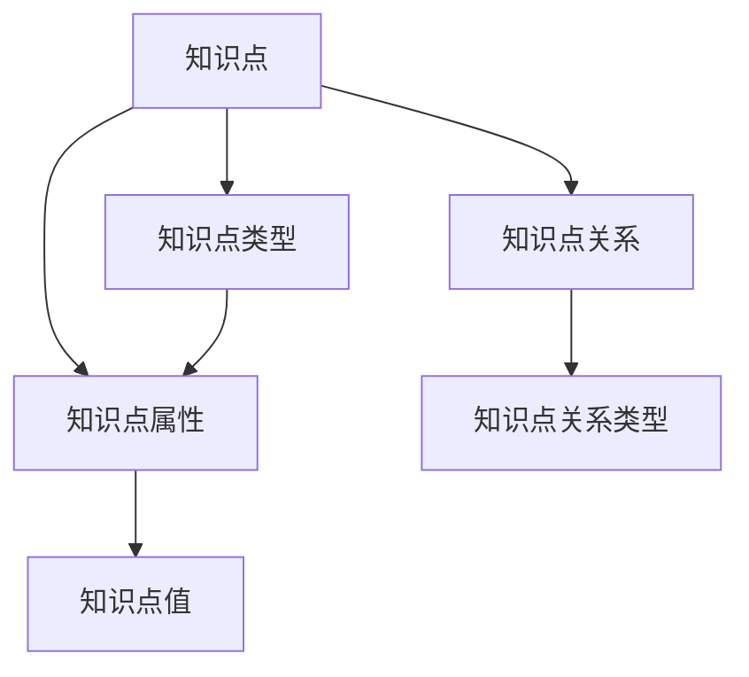
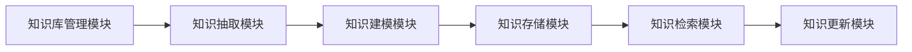
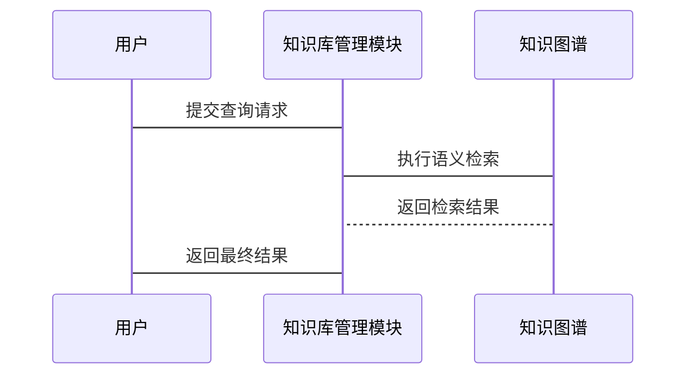

                 


# 企业AI Agent的知识库管理系统

## 关键词：AI Agent，知识库管理，知识图谱，系统架构，算法原理，项目实战

## 摘要：  
本文详细探讨了企业AI Agent的知识库管理系统的构建与应用。通过分析知识库管理的核心概念、算法原理、系统架构以及实际项目案例，展示了如何通过高效的管理方法和先进的技术手段，提升企业AI Agent的知识处理能力。文章内容涵盖从基础理论到实际应用的各个方面，为读者提供全面的知识库管理系统解决方案。

---

## 第一部分：企业AI Agent的知识库管理系统概述

## 第1章：企业AI Agent的知识库管理系统背景

### 1.1 问题背景  
#### 1.1.1 企业AI Agent的发展现状  
随着人工智能技术的快速发展，企业AI Agent（智能体）逐渐成为企业数字化转型的重要工具。AI Agent能够通过自然语言处理、机器学习等技术，为企业提供自动化决策、智能问答、知识检索等服务。然而，AI Agent的核心能力 heavily依赖于知识库的管理和应用。

#### 1.1.2 知识库管理在企业中的重要性  
知识库是AI Agent的核心资源，它存储了企业的业务知识、行业经验、数据规范等信息。一个高效的知识库管理系统能够显著提升AI Agent的响应速度和准确性，同时降低维护成本。

#### 1.1.3 当前知识库管理的主要挑战  
当前的知识库管理面临以下挑战：  
1. 数据冗余和不一致：企业中的数据来源多样，容易导致信息重复和矛盾。  
2. 知识表示复杂：知识库中的数据需要以多种形式表示，包括文本、表格、图结构等。  
3. 维护成本高：随着数据量的增加，知识库的更新和维护变得复杂且耗时。  
4. 安全性和一致性：大规模知识库的管理需要考虑数据的安全性、一致性和可扩展性。  

### 1.2 问题描述  
#### 1.2.1 企业AI Agent的核心需求  
企业AI Agent需要一个高效的知识库管理系统，支持以下功能：  
- 知识的快速检索与推理。  
- 知识的动态更新与扩展。  
- 知识的安全存储与访问控制。  

#### 1.2.2 知识库管理的痛点分析  
知识库管理的痛点主要体现在：  
1. **知识表示不统一**：不同部门或系统对知识的表示方式不同，导致数据孤岛。  
2. **知识推理能力不足**：现有知识库管理系统缺乏强大的推理能力，难以支持复杂的业务逻辑。  
3. **知识更新效率低**：知识库的更新需要人工介入，效率低下且容易出错。  

#### 1.2.3 知识库管理系统的边界与外延  
知识库管理系统的边界主要限定在知识的存储、检索和维护功能，不包括外部数据源的接入和外部系统的集成。其外延则涉及数据挖掘、机器学习等技术，用于增强知识库的智能性。

### 1.3 问题解决  
#### 1.3.1 知识库管理的解决方案  
为解决上述问题，本文提出了一种基于知识图谱的知识库管理系统，结合自然语言处理和图数据库技术，实现知识的高效存储、检索和推理。

#### 1.3.2 AI Agent在知识库管理中的作用  
AI Agent通过自然语言处理和机器学习算法，能够自动解析和生成知识库中的数据，提升知识库的智能化水平。

#### 1.3.3 知识库管理系统的实现路径  
1. 知识抽取与建模：从企业数据源中抽取知识，并构建知识图谱。  
2. 知识存储：使用图数据库存储知识图谱。  
3. 知识检索与推理：基于查询语句进行语义检索和逻辑推理。  
4. 知识更新：支持自动化的知识更新和版本控制。  

### 1.4 本章小结  
本章从企业AI Agent的发展背景出发，分析了知识库管理的重要性及其面临的挑战，并提出了基于知识图谱的知识库管理解决方案。

---

## 第二部分：核心概念与系统架构

## 第2章：核心概念与系统架构

### 2.1 核心概念  
#### 2.1.1 知识库管理的核心要素  
知识库管理的核心要素包括：  
- 数据源：企业内部的文档、数据库、API等。  
- 知识表示：包括实体、属性、关系等。  
- 知识推理：基于知识图谱的推理算法。  

#### 2.1.2 AI Agent的知识表示与推理  
知识表示是将知识转化为计算机可理解的形式，常用的知识表示方法包括：  
1. **符号表示**：使用符号和规则表示知识。  
2. **向量表示**：使用向量空间模型表示知识。  
3. **图表示**：使用图结构表示实体及其关系。  

知识推理则是基于知识表示，通过逻辑推理或机器学习算法，推导出新的知识。

#### 2.1.3 知识库的组织与存储  
知识库的组织方式直接影响其存储和检索效率。常见的知识库组织方式包括：  
- 层次化组织：基于层次结构分类存储。  
- 网络化组织：基于知识图谱的网络结构存储。  

### 2.2 系统架构设计  
#### 2.2.1 系统功能模块划分  
知识库管理系统的功能模块包括：  
1. **知识抽取模块**：从数据源中抽取知识。  
2. **知识建模模块**：构建知识图谱。  
3. **知识存储模块**：存储知识图谱。  
4. **知识检索模块**：支持语义检索和推理。  
5. **知识更新模块**：支持知识的动态更新。  

#### 2.2.2 系统架构的分层设计  
知识库管理系统的架构可以分为以下层次：  
1. **数据层**：存储知识图谱和元数据。  
2. **服务层**：提供知识抽取、建模、检索等服务。  
3. **应用层**：提供用户界面和API接口。  

#### 2.2.3 系统组件之间的关系  
知识库管理系统中，各组件之间的关系如下：  
1. 数据层为服务层提供数据支持。  
2. 服务层为应用层提供功能支持。  
3. 应用层通过API接口与外部系统进行交互。  

### 2.3 知识库管理系统的ER实体关系图  


### 2.4 本章小结  
本章详细阐述了知识库管理的核心概念和系统架构，为后续的算法设计和系统实现奠定了基础。

---

## 第三部分：算法原理与数学模型

## 第3章：知识库管理算法原理

### 3.1 知识表示与推理算法  
#### 3.1.1 知识图谱构建算法  
知识图谱构建算法包括以下步骤：  
1. 数据清洗：去除噪声数据。  
2. 数据抽取：从数据源中抽取实体和关系。  
3. 数据融合：将多个数据源中的数据进行整合。  

#### 3.1.2 基于图的推理算法  
基于图的推理算法通过遍历知识图谱中的路径，推导出新的知识。例如，可以使用深度优先搜索或广度优先搜索算法。

#### 3.1.3 知识表示的向量空间模型  
向量空间模型是一种将知识表示为向量的方法，常用余弦相似度计算两个向量之间的相似性。公式如下：  
$$
\cos\theta = \frac{\vec{A} \cdot \vec{B}}{|\vec{A}| |\vec{B}|}
$$  

### 3.2 知识库更新与维护算法  
#### 3.2.1 基于版本控制的更新算法  
基于版本控制的更新算法通过记录每次修改，确保知识库的可追溯性。  

#### 3.2.2 知识冲突检测与解决算法  
知识冲突检测算法通过比较不同来源的知识，检测冲突并提出解决方案。  

#### 3.2.3 知识库自适应优化算法  
自适应优化算法通过机器学习技术，自动优化知识库的结构和内容。  

### 3.3 算法数学模型  
#### 3.3.1 知识表示模型  
$$
E(knowledge) = \sum_{i=1}^{n} w_i \cdot x_i
$$  

#### 3.3.2 基于图的推理模型  
$$
P(h|e) = \prod_{i=1}^{m} P(h|e_i)
$$  

### 3.4 本章小结  
本章详细介绍了知识库管理的核心算法，包括知识表示、推理和更新算法，并给出了相应的数学模型。

---

## 第四部分：系统分析与设计

## 第4章：系统分析与架构设计

### 4.1 系统功能设计  
#### 4.1.1 知识库管理功能模块  
知识库管理功能模块包括：  
1. 知识抽取与建模。  
2. 知识存储与检索。  
3. 知识更新与维护。  

#### 4.1.2 AI Agent的知识库管理场景  
AI Agent的知识库管理场景包括：  
1. 自动化问答：基于知识库提供智能回答。  
2. 业务决策支持：基于知识库进行数据分析和决策。  

### 4.2 系统架构设计  
#### 4.2.1 系统架构图  


#### 4.2.2 系统组件交互图  


### 4.3 本章小结  
本章通过系统功能设计和架构设计，展示了知识库管理系统的整体框架和各模块之间的关系。

---

## 第五部分：项目实战

## 第5章：知识库管理系统项目实战

### 5.1 项目环境安装  
#### 5.1.1 安装Python环境  
使用Anaconda安装Python 3.8及以上版本。  

#### 5.1.2 安装依赖库  
安装以下依赖库：  
- `networkx`：用于图数据处理。  
- `numpy`：用于数值计算。  
- `spacy`：用于自然语言处理。  

### 5.2 知识库管理系统核心代码实现  
#### 5.2.1 知识抽取模块  
```python
import spacy

# 加载英文模型
nlp = spacy.load("en_core_web_sm")

# 抽取实体
def extract_entities(text):
    doc = nlp(text)
    entities = []
    for ent in doc.ents:
        entities.append((ent.text, ent.label_))
    return entities

# 示例
text = "Apple was founded by Steve Jobs in 1971."
print(extract_entities(text))
```

#### 5.2.2 知识建模模块  
```python
import networkx as nx

# 创建知识图谱
G = nx.DiGraph()

# 添加节点
G.add_node("Apple")
G.add_node("Steve Jobs")

# 添加边
G.add_edge("Apple", "Steve Jobs", label="founded by")

# 可视化
nx.draw(G, node_size=1500, alpha=0.8)
plt.show()
```

### 5.3 项目案例分析  
#### 5.3.1 案例背景  
以企业知识库管理为例，假设我们需要构建一个包含公司组织结构和员工信息的知识库。  

#### 5.3.2 案例实现  
1. 数据抽取：从企业数据库中抽取员工信息和组织结构。  
2. 知识建模：构建员工-部门关系的知识图谱。  
3. 知识检索：基于查询语句进行语义检索。  

### 5.4 项目总结  
通过本项目，读者可以掌握知识库管理系统的核心实现步骤，包括数据抽取、知识建模、知识检索等。

### 5.5 本章小结  
本章通过实际项目案例，展示了知识库管理系统的实现过程，帮助读者更好地理解和应用相关技术。

---

## 第六部分：最佳实践与总结

## 第6章：最佳实践与总结

### 6.1 最佳实践  
#### 6.1.1 知识库管理的技巧  
1. **数据清洗**：确保数据的准确性和一致性。  
2. **模型优化**：定期优化知识表示和推理算法。  
3. **版本控制**：对知识库的修改进行版本控制。  

#### 6.1.2 系统维护的注意事项  
1. **定期备份**：防止数据丢失。  
2. **权限管理**：确保知识库的安全性。  
3. **性能监控**：监控系统的运行状态。  

### 6.2 小结  
本章总结了知识库管理系统的最佳实践，包括数据清洗、模型优化、版本控制等方面的技巧。

### 6.3 注意事项  
在实际应用中，需要注意以下几点：  
1. **数据安全**：防止敏感数据泄露。  
2. **系统性能**：优化系统的响应速度。  
3. **用户体验**：提升用户交互体验。  

### 6.4 拓展阅读  
1. 《知识图谱入门与实践》  
2. 《图数据库实战指南》  
3. 《自然语言处理与知识工程》  

### 6.5 本章小结  
本章通过总结知识库管理系统的最佳实践，为读者提供了实际应用中的注意事项和拓展学习的方向。

---

## 附录：工具与资源

### 附录A：常用工具  
1. **NetworkX**：图数据处理工具。  
2. **Spacy**：自然语言处理工具。  
3. **Neo4j**：图数据库。  

### 附录B：术语表  
1. **知识图谱**：用于表示实体及其关系的图结构。  
2. **向量空间模型**：将知识表示为向量的方法。  

### 附录C：参考文献  
1. 参考文献1：Billion, T. (2018). *Knowledge Graph Construction*.  
2. 参考文献2：Manning, C. D. (2014). *Introduction to Information Retrieval*.  

---

## 作者：AI天才研究院/AI Genius Institute & 禅与计算机程序设计艺术/Zen And The Art of Computer Programming

---

本文详细介绍了企业AI Agent的知识库管理系统的构建与应用，涵盖了从核心概念到实际项目的各个方面。通过理论分析和实践案例的结合，为读者提供了一套完整的知识库管理系统解决方案。

