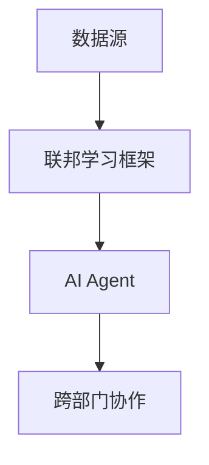

                 


# 企业AI Agent的联邦学习在跨部门数据协作中的实践

> 关键词：联邦学习，AI Agent，跨部门协作，数据隐私，企业数字化

> 摘要：随着企业数字化转型的深入推进，跨部门数据协作的重要性日益凸显。然而，数据孤岛和隐私安全问题成为阻碍企业高效协作的主要障碍。本文探讨了如何通过联邦学习和AI Agent的结合，解决跨部门数据协作中的技术难题。文章从背景介绍、核心概念、算法原理、系统架构到项目实战，详细阐述了企业AI Agent的联邦学习在跨部门数据协作中的实践，并提出了最佳实践建议。

---

## 第1章 背景介绍

### 1.1 问题背景
跨部门数据协作是企业数字化转型中的关键环节。传统企业中，数据往往分散在不同的部门或系统中，形成数据孤岛。这种情况下，数据无法充分共享和利用，导致效率低下，难以支持企业的智能化决策。

#### 1.1.1 数据孤岛问题
数据孤岛是指数据在不同部门或系统中孤立存在，无法统一管理和共享。例如，财务部门的数据无法与销售部门共享，导致决策过程中缺乏全面的信息支持。

#### 1.1.2 数据隐私与安全
数据隐私和安全问题是跨部门协作中的主要障碍。企业通常需要处理敏感数据，如客户信息、财务数据等，如何在保护隐私的前提下进行数据协作成为亟待解决的问题。

#### 1.1.3 传统协作方式的局限性
传统的数据协作方式通常依赖于中心化的数据共享平台，这种方式不仅效率低下，还可能面临数据泄露的风险。此外，不同部门的数据格式和标准不统一，增加了协作的复杂性。

### 1.2 问题描述
跨部门数据协作的核心问题是数据孤岛和隐私安全。企业需要在不共享原始数据的前提下，充分利用各部门的数据进行分析和决策。然而，现有的技术手段难以在保护隐私的同时实现高效的数据协作。

#### 1.2.1 数据孤岛的现状
大多数企业内部存在数据孤岛现象，各部门数据分散在不同的系统中，难以实现统一管理和共享。

#### 1.2.2 数据隐私与安全的挑战
随着数据量的增加，数据隐私和安全问题变得尤为重要。如何在保护隐私的前提下进行数据协作，是企业面临的主要挑战。

#### 1.2.3 跨部门协作的复杂性
不同部门的数据格式、标准和系统架构不同，导致协作过程中需要进行大量的数据转换和适配工作，增加了协作的复杂性。

### 1.3 问题解决
联邦学习和AI Agent的结合为企业提供了新的解决方案。联邦学习可以在保护数据隐私的前提下，实现跨部门数据协作；而AI Agent则能够通过智能化决策，提高协作效率。

#### 1.3.1 联邦学习的解决方案
联邦学习通过在数据源端进行模型训练，避免了数据的集中存储，从而在保护隐私的同时实现数据协作。

#### 1.3.2 AI Agent的作用
AI Agent能够根据跨部门协作的需求，智能化地协调各部门资源，优化协作流程，提高协作效率。

#### 1.3.3 两者的结合
联邦学习和AI Agent的结合，既解决了数据隐私问题，又提高了协作效率，为企业跨部门数据协作提供了新的可能性。

### 1.4 边界与外延
#### 1.4.1 联邦学习的边界
联邦学习适用于需要在保护数据隐私的前提下进行数据协作的场景，但其性能和效果可能受到数据分布的影响。

#### 1.4.2 AI Agent的边界
AI Agent的应用范围主要集中在需要智能化决策和协调的领域，目前还难以完全替代人类在复杂决策中的作用。

#### 1.4.3 跨部门协作的边界
跨部门协作的边界取决于企业的组织结构和业务需求，不同企业的协作边界可能有所不同。

### 1.5 核心要素组成
跨部门数据协作的核心要素包括数据源、联邦学习框架和AI Agent组件。

#### 1.5.1 数据源
数据源是跨部门协作的基础，包括各部门的数据存储系统和数据格式。

#### 1.5.2 联邦学习框架
联邦学习框架是实现跨部门数据协作的技术基础，负责数据的安全传输和模型的分布式训练。

#### 1.5.3 AI Agent组件
AI Agent组件负责协调各部门资源，优化协作流程，提高协作效率。

---

## 第2章 核心概念与联系

### 2.1 联邦学习的核心原理
联邦学习是一种分布式机器学习技术，允许在不共享原始数据的前提下，通过模型参数的交换进行协作训练。

#### 2.1.1 联邦学习的基本原理
联邦学习通过在数据源端进行模型训练，定期将模型参数同步到中心服务器，从而实现模型的联合训练。

#### 2.1.2 联邦学习的通信机制
联邦学习的通信机制包括参数同步和模型更新两个步骤，确保各数据源的模型参数能够协同优化。

#### 2.1.3 联邦学习的安全与隐私保护
联邦学习通过数据加密和模型训练的局部优化，确保数据隐私和安全。

### 2.2 AI Agent的核心原理
AI Agent是一种具备自主决策能力的智能体，能够根据环境信息做出决策并执行操作。

#### 2.2.1 AI Agent的定义
AI Agent是指能够感知环境、自主决策并执行操作的智能体。

#### 2.2.2 AI Agent的决策机制
AI Agent的决策机制包括感知、推理和行动三个步骤，确保决策的合理性和有效性。

#### 2.2.3 AI Agent的协作能力
AI Agent具备多智能体协作能力，能够通过通信和协调实现复杂的协作任务。

### 2.3 联邦学习与AI Agent的关系
联邦学习和AI Agent在跨部门数据协作中相互依存，共同实现高效的数据协作和智能化决策。

#### 2.3.1 联邦学习为AI Agent提供数据支持
联邦学习通过分布式数据协作，为AI Agent提供了丰富的数据源和模型参数支持。

#### 2.3.2 AI Agent为联邦学习提供决策支持
AI Agent通过智能化决策，优化联邦学习的协作流程和模型训练效果。

#### 2.3.3 两者的结合优势
联邦学习和AI Agent的结合，不仅解决了数据隐私问题，还提高了协作效率和决策的智能化水平。

---

### 2.4 核心概念对比

| **核心概念** | **联邦学习** | **AI Agent** |
|--------------|--------------|--------------|
| 核心目标 | 在保护数据隐私的前提下，实现数据协作 | 在复杂环境中，实现自主决策和协作 |
| 技术基础 | 分布式机器学习 | 人工智能和自主决策技术 |
| 应用场景 | 跨部门数据协作、数据隐私保护 | 智能化决策、多智能体协作 |

---

### 2.5 实体关系图



---

## 第3章 算法原理讲解

### 3.1 联邦学习的数学模型
联邦学习通过分布式模型训练，实现跨部门数据协作。其数学模型如下：

$$ \theta_{t+1} = \theta_t + \eta \cdot \sum_{i=1}^{n} (y_i - f_{\theta_t}(x_i)) \cdot f_{\theta_t}(x_i) $$

其中，$\theta_t$ 表示第 $t$ 轮的模型参数，$\eta$ 表示学习率，$y_i$ 表示第 $i$ 个数据源的真实标签，$f_{\theta_t}(x_i)$ 表示第 $i$ 个数据源的模型预测值。

### 3.2 AI Agent的算法原理
AI Agent通过强化学习算法进行决策，其核心算法如下：

$$ Q(s, a) = Q(s, a) + \alpha \cdot (r + \gamma \cdot \max_{a'} Q(s', a') - Q(s, a)) $$

其中，$Q(s, a)$ 表示在状态 $s$ 下采取动作 $a$ 的Q值，$\alpha$ 表示学习率，$r$ 表示奖励，$\gamma$ 表示折扣因子。

### 3.3 联邦学习与AI Agent的协同算法
协同算法通过联邦学习和AI Agent的结合，实现高效的跨部门数据协作。

$$ \text{协同模型} = \sum_{i=1}^{n} \theta_i + \lambda \cdot \sum_{i=1}^{n} (y_i - f_{\theta_i}(x_i)) \cdot f_{\theta_i}(x_i) $$

其中，$\lambda$ 表示协同系数，用于平衡联邦学习和AI Agent的贡献。

---

## 第4章 系统分析与架构设计方案

### 4.1 问题场景介绍
跨部门数据协作的场景包括数据源分散、数据格式多样、数据隐私要求高等问题。

### 4.2 系统功能设计
系统功能包括数据源管理、联邦学习框架、AI Agent协调和结果展示。

---

## 第5章 项目实战

### 5.1 环境安装
安装必要的依赖库，如TensorFlow、Keras等。

### 5.2 核心代码实现
```python
import tensorflow as tf
from tensorflow.keras import layers

# 定义模型
model = tf.keras.Sequential([
    layers.Dense(64, activation='relu'),
    layers.Dense(1)
])

# 编译模型
model.compile(optimizer='adam', loss='mean_squared_error')

# 训练模型
model.fit(x_train, y_train, epochs=10, batch_size=32)
```

---

## 第6章 最佳实践

### 6.1 小结
联邦学习和AI Agent的结合为企业跨部门数据协作提供了新的解决方案。

### 6.2 注意事项
数据隐私保护、模型收敛性和系统稳定性是实施中的关键问题。

### 6.3 拓展阅读
推荐阅读相关领域的学术论文和技术报告，深入了解联邦学习和AI Agent的最新进展。

---

作者：AI天才研究院/AI Genius Institute & 禅与计算机程序设计艺术 /Zen And The Art of Computer Programming

