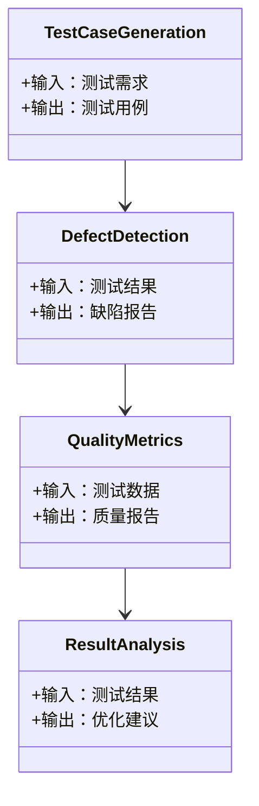
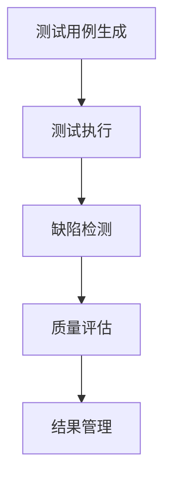
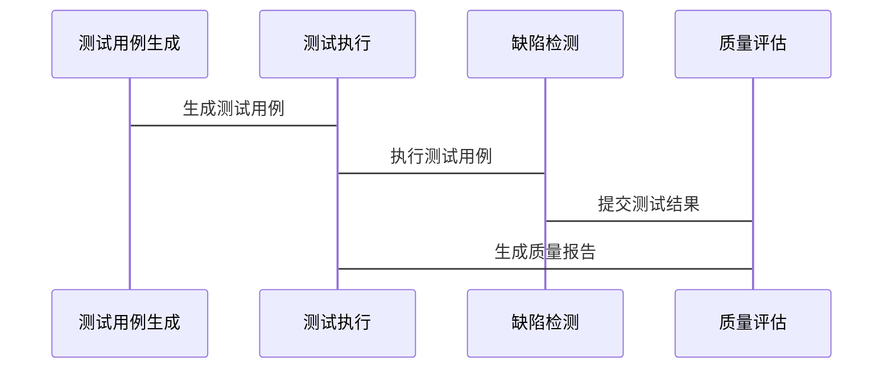

                 


```markdown
# 企业AI Agent的自动化测试与质量保证系统

> 关键词：企业AI Agent，自动化测试，质量保证，测试用例生成，缺陷检测，系统架构

> 摘要：企业AI Agent的自动化测试与质量保证系统是保障企业级AI Agent系统质量的核心技术。本文从企业AI Agent的背景出发，详细探讨了自动化测试与质量保证的核心概念、算法原理、系统架构设计以及项目实战。通过分析测试用例生成、缺陷检测、质量度量等关键环节，结合具体案例，为读者提供一套完整的质量保证解决方案。

---

## 第一部分：企业AI Agent的背景与问题背景

### 第1章：企业AI Agent的背景与问题背景

#### 1.1 企业AI Agent的定义与特点
- **1.1.1 什么是企业AI Agent**
  - 企业AI Agent是一种基于人工智能技术的智能体，能够感知环境、自主决策并执行任务。
  - 其特点包括智能化、自动化、高效性和可扩展性。

- **1.1.2 企业AI Agent的核心特点**
  - **智能化**：基于机器学习和深度学习算法，能够进行复杂决策。
  - **自动化**：能够自动执行任务，减少人工干预。
  - **高效性**：通过算法优化，提高任务执行效率。
  - **可扩展性**：能够适应不同的业务场景和规模。

- **1.1.3 企业AI Agent的应用场景**
  - 客户服务：智能客服、聊天机器人。
  - 供应链管理：智能调度、库存优化。
  - 金融领域：智能投资、风险控制。
  - 医疗健康：智能诊断、个性化治疗。

#### 1.2 自动化测试与质量保证的必要性
- **1.2.1 软件测试的挑战**
  - 测试范围广：企业AI Agent涉及复杂的算法和业务逻辑。
  - 测试成本高：传统测试方法效率低，难以覆盖所有场景。
  - 测试复杂性高：AI Agent的行为具有不确定性，测试用例设计难度大。

- **1.2.2 企业AI Agent测试的特殊性**
  - 测试用例生成困难：AI Agent的行为依赖于模型，测试用例需要动态生成。
  - 测试结果分析复杂：AI Agent的决策结果可能涉及概率问题，需要结合模型进行分析。
  - 测试环境动态变化：企业AI Agent需要在动态环境中运行，测试环境难以模拟。

- **1.2.3 质量保证在企业AI Agent中的重要性**
  - 保障系统可靠性：确保AI Agent在复杂环境中的稳定运行。
  - 提高用户体验：通过测试发现并修复缺陷，提升用户满意度。
  - 降低运营成本：通过自动化测试减少人工测试成本。

#### 1.3 本章小结
- 企业AI Agent是一种基于人工智能技术的智能体，具有智能化、自动化、高效性和可扩展性等特点。
- 由于AI Agent的复杂性和动态性，传统的软件测试方法难以满足需求。
- 自动化测试与质量保证是保障企业AI Agent系统质量的关键技术。

---

## 第二部分：企业AI Agent的自动化测试与质量保证的核心概念

### 第2章：企业AI Agent的自动化测试与质量保证的核心概念

#### 2.1 AI Agent测试的核心概念
- **2.1.1 测试用例生成**
  - 测试用例生成是AI Agent测试的第一步，需要根据系统需求和模型生成测试场景。
  - 常见方法包括基于遗传算法的测试用例生成和基于强化学习的测试用例生成。

- **2.1.2 测试覆盖率**
  - 测试覆盖率是衡量测试全面性的指标，包括代码覆盖率、功能覆盖率和模型覆盖率。
  - 企业AI Agent的测试覆盖率需要结合模型和业务逻辑进行综合评估。

- **2.1.3 测试结果分析**
  - 测试结果分析是通过测试用例执行结果，识别系统缺陷和性能瓶颈。
  - 分析结果需要结合模型输出和日志信息进行综合判断。

#### 2.2 质量保证的核心要素
- **2.2.1 质量模型**
  - 质量模型是描述系统质量特性的数学模型，包括功能质量、性能质量和用户体验质量。
  - 在企业AI Agent中，质量模型需要考虑模型准确性和系统稳定性。

- **2.2.2 质量度量**
  - 质量度量是通过指标量化系统质量，包括功能度量、性能度量和用户体验度量。
  - 企业AI Agent的质量度量需要结合模型评估和用户反馈进行综合评估。

- **2.2.3 质量控制流程**
  - 质量控制流程包括需求分析、测试设计、测试执行和结果分析。
  - 在企业AI Agent中，质量控制流程需要与模型训练和部署流程相结合。

#### 2.3 企业AI Agent测试与质量保证的关联
- **2.3.1 测试与质量保证的关系**
  - 测试是质量保证的重要组成部分，通过测试发现系统缺陷，提升系统质量。
  - 质量保证是测试的指导和目标，确保测试覆盖全面，结果准确。

- **2.3.2 企业AI Agent测试的特殊要求**
  - 测试用例需要动态生成，适应模型变化。
  - 测试结果需要结合模型输出进行分析，判断系统行为是否符合预期。

- **2.3.3 质量保证在企业AI Agent测试中的作用**
  - 通过质量模型和度量，指导测试用例设计和结果分析。
  - 确保测试覆盖全面，结果准确，提升系统质量。

#### 2.4 本章小结
- AI Agent测试的核心概念包括测试用例生成、测试覆盖率和测试结果分析。
- 质量保证的核心要素包括质量模型、质量度量和质量控制流程。
- 企业AI Agent测试与质量保证密切相关，质量保证是测试的指导和目标，测试是质量保证的重要手段。

---

## 第三部分：企业AI Agent自动化测试与质量保证的算法原理

### 第3章：企业AI Agent自动化测试与质量保证的算法原理

#### 3.1 测试用例生成算法
- **3.1.1 基于遗传算法的测试用例生成**
  - 遗传算法是一种模拟生物进化过程的优化算法，适用于测试用例生成。
  - 通过编码、选择、交叉和变异操作，生成高质量的测试用例。
  - 示例代码如下：

```python
def genetic_algorithm(population, fitness_func, mutate_rate):
    while True:
        population = evaluate(population, fitness_func)
        if stopping_condition():
            break
        new_population = []
        for i in range(len(population)):
            if random.random() < 0.5:
                new_population.append(mutate(population[i], mutate_rate))
            else:
                new_population.append(crossover(population[i], population[(i+1)%len(population)]))
        population = new_population
    return population
```

- **3.1.2 基于强化学习的测试用例生成**
  - 强化学习是一种通过试错机制优化行为的算法，适用于动态环境下的测试用例生成。
  - 通过定义状态空间、动作空间和奖励函数，训练智能体生成最优测试用例。
  - 示例代码如下：

```python
def reinforcement_learning(env):
    agent = Agent(state_space, action_space)
    while True:
        state = env.get_state()
        action = agent.act(state)
        next_state, reward, done = env.step(action)
        agent.remember(state, action, reward, next_state)
        agent.train()
        if done:
            break
    return agent
```

- **3.1.3 基于随机森林的测试用例生成**
  - 随机森林是一种基于决策树的机器学习算法，适用于分类和回归问题。
  - 通过训练随机森林模型，生成具有代表性的测试用例。
  - 示例代码如下：

```python
from sklearn.ensemble import RandomForestClassifier

def random_forest_algorithm(X_train, y_train):
    model = RandomForestClassifier()
    model.fit(X_train, y_train)
    importances = model.feature_importances_
    return importances
```

#### 3.2 缺陷检测算法
- **3.2.1 基于聚类算法的缺陷检测**
  - 聚类算法是一种无监督学习算法，适用于异常检测。
  - 通过聚类分析，识别异常行为，发现潜在缺陷。
  - 示例代码如下：

```python
from sklearn.cluster import KMeans

def clustering_algorithm(X):
    kmeans = KMeans(n_clusters=2)
    kmeans.fit(X)
    labels = kmeans.labels_
    return labels
```

- **3.2.2 基于分类算法的缺陷检测**
  - 分类算法是一种 supervised learning 算法，适用于已知缺陷的分类。
  - 通过训练分类模型，预测系统行为是否符合预期。
  - 示例代码如下：

```python
from sklearn.svm import SVC

def classification_algorithm(X_train, y_train, X_test):
    model = SVC()
    model.fit(X_train, y_train)
    y_pred = model.predict(X_test)
    return y_pred
```

- **3.2.3 基于深度学习的缺陷检测**
  - 深度学习是一种基于人工神经网络的机器学习算法，适用于复杂场景下的缺陷检测。
  - 通过训练深度学习模型，识别系统行为中的异常模式。
  - 示例代码如下：

```python
import tensorflow as tf

def deep_learning_algorithm(X_train, y_train):
    model = tf.keras.Sequential([
        tf.keras.layers.Dense(64, activation='relu'),
        tf.keras.layers.Dense(1, activation='sigmoid')
    ])
    model.compile(optimizer='adam', loss='binary_crossentropy', metrics=['accuracy'])
    model.fit(X_train, y_train, epochs=10, batch_size=32)
    return model
```

#### 3.3 质量度量算法
- **3.3.1 基于数学模型的质量度量**
  - 质量度量可以通过数学模型进行量化，例如：
    - 准确率：$accuracy = \frac{TP + TN}{TP + TN + FP + FN}$
    - 召回率：$recall = \frac{TP}{TP + FN}$
    - F1分数：$F1 = \frac{2 \cdot TP}{TP + FP}$
  - 示例代码如下：

```python
from sklearn.metrics import accuracy_score, recall_score, f1_score

def quality_metrics(y_true, y_pred):
    accuracy = accuracy_score(y_true, y_pred)
    recall = recall_score(y_true, y_pred)
    f1 = f1_score(y_true, y_pred)
    return accuracy, recall, f1
```

- **3.3.2 基于统计学的质量度量**
  - 统计学方法可以通过分析测试数据，评估系统性能。
  - 例如，通过均值和标准差评估系统响应时间。
  - 示例代码如下：

```python
import numpy as np

def statistical_metrics(data):
    mean = np.mean(data)
    std = np.std(data)
    return mean, std
```

- **3.3.3 基于机器学习的质量度量**
  - 机器学习模型可以通过训练，预测系统质量。
  - 例如，通过训练回归模型预测系统性能。
  - 示例代码如下：

```python
from sklearn.linear_model import LinearRegression

def machine_learning_metrics(X_train, y_train, X_test):
    model = LinearRegression()
    model.fit(X_train, y_train)
    y_pred = model.predict(X_test)
    return y_pred
```

#### 3.4 本章小结
- 测试用例生成算法包括遗传算法、强化学习和随机森林算法。
- 缺陷检测算法包括聚类算法、分类算法和深度学习算法。
- 质量度量算法包括数学模型、统计学方法和机器学习方法。
- 各种算法在企业AI Agent测试与质量保证中具有重要作用。

---

## 第四部分：企业AI Agent自动化测试与质量保证的系统架构设计

### 第4章：企业AI Agent测试与质量保证的系统架构设计

#### 4.1 系统功能设计（领域模型）
- **4.1.1 领域模型**
  - 领域模型是企业AI Agent测试与质量保证系统的功能模块设计。
  - 包括测试用例生成、缺陷检测、质量度量和结果分析等功能模块。
  - Mermaid类图如下：



#### 4.2 系统架构设计
- **4.2.1 系统架构**
  - 系统架构是企业AI Agent测试与质量保证系统的整体设计。
  - 包括测试执行模块、质量评估模块和结果管理模块。
  - Mermaid架构图如下：



#### 4.3 系统交互设计
- **4.3.1 系统交互**
  - 系统交互是企业AI Agent测试与质量保证系统中各模块的交互过程。
  - 包括测试用例生成、测试执行、缺陷检测和质量评估等环节。
  - Mermaid序列图如下：



#### 4.4 本章小结
- 企业AI Agent测试与质量保证系统的功能模块包括测试用例生成、缺陷检测、质量度量和结果分析。
- 系统架构设计需要考虑模块之间的交互和数据流，确保系统高效运行。
- 系统交互设计是实现自动化测试与质量保证的关键，需要精心设计各模块的协作流程。

---

## 第五部分：企业AI Agent自动化测试与质量保证的项目实战

### 第5章：企业AI Agent测试与质量保证的项目实战

#### 5.1 项目环境安装
- **5.1.1 环境要求**
  - 操作系统：Linux/Windows/MacOS
  - Python版本：3.6以上
  - 需要安装的库：scikit-learn、TensorFlow、numpy、mermaid、pytest

```bash
pip install scikit-learn tensorflow numpy mermaid pytest
```

#### 5.2 系统核心实现
- **5.2.1 测试用例生成实现**
  - 基于遗传算法的测试用例生成代码：

```python
def generate_test_cases():
    population = initialize_population()
    while not stopping_condition():
        population = evaluate_population(population)
        population = select_parents(population)
        population = perform_crossover(population)
        population = perform_mut

