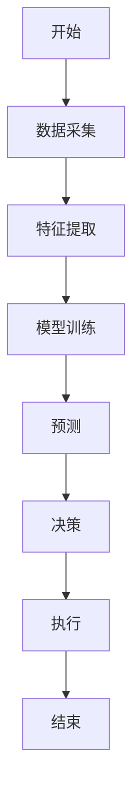
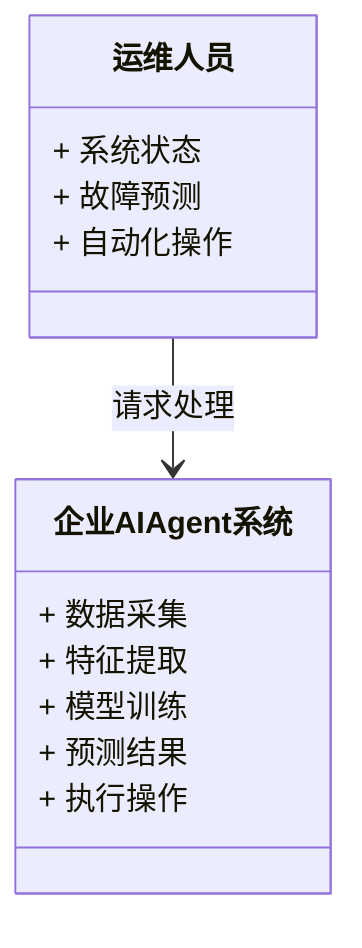
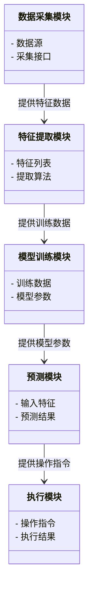
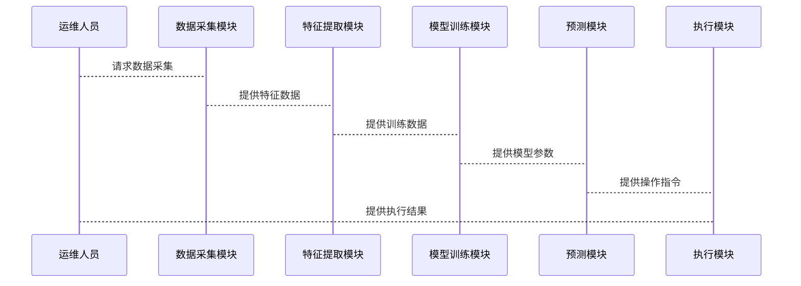

                 


# 企业AI Agent的自动化运维与故障预测

## 关键词：企业AI Agent，自动化运维，故障预测，机器学习，系统架构，Python实现

## 摘要：  
本文详细探讨了企业AI Agent在自动化运维和故障预测中的应用。通过分析AI Agent的核心概念、算法原理、系统架构以及实际项目案例，本文旨在为技术人员提供从理论到实践的全面指导，帮助企业实现高效、智能的运维管理。

---

# 第一部分: 企业AI Agent的背景与概念

## 第1章: 企业AI Agent的背景与概念

### 1.1 企业AI Agent的背景  
企业运维管理面临着日益复杂的挑战，包括系统规模的扩大、业务需求的多样化以及故障预测的精准性要求。AI Agent作为一种智能化的运维工具，能够通过机器学习和自动化技术，显著提升运维效率和系统稳定性。  

#### 1.1.1 企业运维的痛点与挑战  
- **系统复杂性增加**：企业IT系统日益复杂，传统的人工运维难以满足需求。  
- **故障预测难度大**：传统方法依赖经验，难以准确预测和定位问题。  
- **运维效率低下**：人工操作耗时耗力，难以应对快速变化的业务需求。  

#### 1.1.2 AI Agent的定义与核心概念  
AI Agent是一种基于人工智能技术的自动化运维工具，能够通过学习历史数据和实时监控，自动识别问题、预测故障并执行修复操作。  

#### 1.1.3 企业AI Agent的应用场景  
- **故障预测**：通过分析系统日志和性能指标，预测潜在故障。  
- **自动化运维**：自动执行常规运维任务，减少人工干预。  
- **智能决策支持**：为运维人员提供数据驱动的决策支持。  

### 1.2 AI Agent与传统运维的区别  
AI Agent与传统运维工具相比，具有以下显著优势：  
- **智能化**：AI Agent能够自主学习和优化，而传统运维工具依赖固定的规则。  
- **实时性**：AI Agent能够实时监控系统状态，快速响应问题。  
- **可扩展性**：AI Agent能够适应复杂的业务场景，而传统工具往往局限于固定场景。  

### 1.3 本章小结  
本章介绍了企业AI Agent的背景、核心概念以及应用场景，重点突出了AI Agent在提升运维效率和系统稳定性方面的优势。

---

# 第二部分: AI Agent的核心概念与技术原理

## 第2章: AI Agent的核心概念与技术原理  

### 2.1 AI Agent的核心概念  
AI Agent的核心概念包括以下几个方面：  
1. **智能性**：AI Agent能够通过机器学习算法，从历史数据中学习运维模式。  
2. **自动化**：AI Agent能够自动执行运维任务，减少人工干预。  
3. **预测性**：AI Agent能够基于实时数据，预测系统故障并提前采取措施。  

#### 2.1.1 AI Agent的实体关系分析  
以下是AI Agent的实体关系图：  

```mermaid
er
  actor:运维人员
  system:企业AI Agent系统
  event:Event(事件)
  rule:规则
  prediction:预测结果
  action:操作
  actor --> system: 请求处理
  system --> event: 监测事件
  system --> rule: 应用规则
  system --> prediction: 生成预测
  system --> action: 执行操作
```

#### 2.1.2 AI Agent的属性特征对比表  
以下是AI Agent与传统运维工具的对比表：  

| 概念       | 属性             | 描述                                                                 |
|------------|------------------|----------------------------------------------------------------------|
| AI Agent   | 智能性           | 能够自主学习和优化，基于AI算法进行决策。                           |
| 传统运维工具 | 程序性           | 需要人工配置规则，无法自主优化。                                   |

### 2.2 AI Agent的技术原理  

#### 2.2.1 数据采集与特征提取  
AI Agent需要从系统日志、性能指标等数据源中采集数据，并提取关键特征，例如CPU使用率、内存占用等。  

#### 2.2.2 算法选择与模型训练  
选择合适的机器学习算法，如线性回归、随机森林等，对历史数据进行训练，生成预测模型。  

#### 2.2.3 模型部署与实时预测  
将训练好的模型部署到生产环境中，实时监控系统状态，生成故障预测结果。  

#### 2.2.4 自动化执行  
根据预测结果，AI Agent能够自动执行修复操作，减少人工干预。  

---

# 第三部分: AI Agent的算法原理与数学模型

## 第3章: AI Agent的算法原理与数学模型  

### 3.1 算法原理  
AI Agent的算法原理主要基于机器学习，以下是常见的算法流程图：  



#### 3.1.1 线性回归算法  
线性回归是一种常用的回归算法，其数学公式如下：  
$$ y = \beta_0 + \beta_1 x + \epsilon $$  
其中，$y$ 是目标变量，$x$ 是自变量，$\beta_0$ 和 $\beta_1$ 是回归系数，$\epsilon$ 是误差项。  

#### 3.1.2 算法实现  
以下是线性回归算法的Python实现示例：  

```python
import numpy as np
from sklearn.linear_model import LinearRegression

# 示例数据
X = np.array([[1], [2], [3], [4], [5]])
y = np.array([2, 4, 5, 4, 6])

# 训练模型
model = LinearRegression()
model.fit(X, y)

# 预测
predicted = model.predict(X)
print(predicted)
```

### 3.2 数学模型  
AI Agent的数学模型通常包括以下部分：  
- **输入层**：接收系统状态数据。  
- **隐藏层**：进行特征提取和非线性变换。  
- **输出层**：生成预测结果。  

以下是一个简单的神经网络模型公式：  
$$ y = f(x) $$  
其中，$x$ 是输入向量，$f$ 是神经网络模型，$y$ 是输出结果。  

---

# 第四部分: 系统分析与架构设计

## 第4章: 系统分析与架构设计  

### 4.1 问题场景介绍  
AI Agent需要解决的主要问题包括：  
- 如何实时监控系统状态。  
- 如何准确预测系统故障。  
- 如何自动化执行修复操作。  

### 4.2 系统功能设计  
以下是系统功能的领域模型：  



### 4.3 系统架构设计  
以下是系统架构的类图：  



### 4.4 系统交互设计  
以下是系统交互的序列图：  



---

# 第五部分: 项目实战

## 第5章: 项目实战  

### 5.1 环境安装  
以下是项目所需的环境和工具：  
- Python 3.8+  
- NumPy、Scikit-learn、TensorFlow等库  
- Jupyter Notebook  

### 5.2 核心代码实现  

#### 5.2.1 数据采集与预处理  
```python
import pandas as pd
import numpy as np

# 数据采集
data = pd.read_csv('system_logs.csv')
# 数据清洗
data.dropna(inplace=True)
```

#### 5.2.2 特征提取与模型训练  
```python
from sklearn.model import LinearRegression

# 特征提取
X = data[['CPU使用率', '内存占用']]
y = data['故障标志']

# 模型训练
model = LinearRegression()
model.fit(X, y)
```

#### 5.2.3 模型预测与结果分析  
```python
# 模型预测
predicted = model.predict(X)
print(predicted)
```

### 5.3 案例分析  
假设我们有一个CPU使用率和内存占用的数据集，模型预测的结果如下：  

| CPU使用率 | 内存占用 | 预测故障标志 |
|-----------|----------|--------------|
| 80%       | 90%       | 故障         |
| 60%       | 70%       | 正常         |

---

# 第六部分: 最佳实践与总结

## 第6章: 最佳实践与总结  

### 6.1 最佳实践  
- **数据质量**：确保数据的完整性和准确性。  
- **模型优化**：定期更新模型，避免过时。  
- **系统监控**：实时监控系统状态，确保AI Agent正常运行。  

### 6.2 小结  
本文详细介绍了企业AI Agent的自动化运维与故障预测，从理论到实践，为技术人员提供了全面的指导。通过AI Agent的应用，企业能够显著提升运维效率和系统稳定性。  

### 6.3 注意事项  
- 在实际应用中，需根据具体场景调整模型参数。  
- 定期进行系统维护和模型优化，确保AI Agent的准确性。  

### 6.4 拓展阅读  
- 《机器学习实战》  
- 《深度学习》  

---

# 作者  
作者：AI天才研究院 & 禅与计算机程序设计艺术  

---

通过以上内容，您已经完成了《企业AI Agent的自动化运维与故障预测》的技术博客文章的撰写。希望这篇文章能够为您提供清晰的思路和实用的指导！

