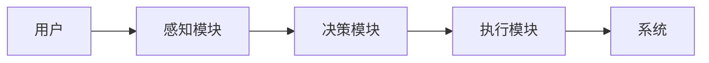
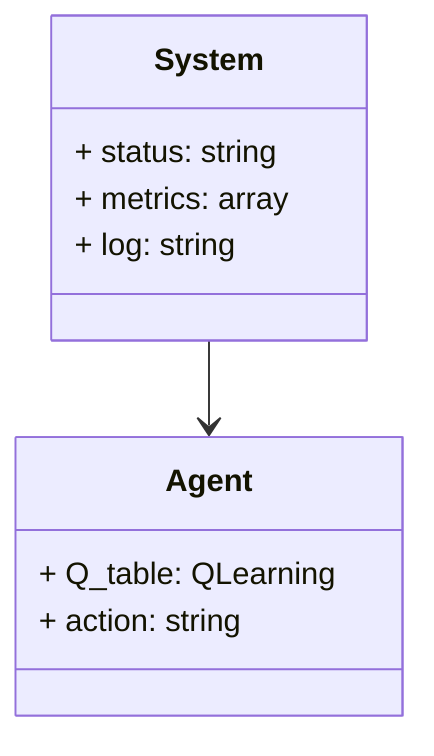
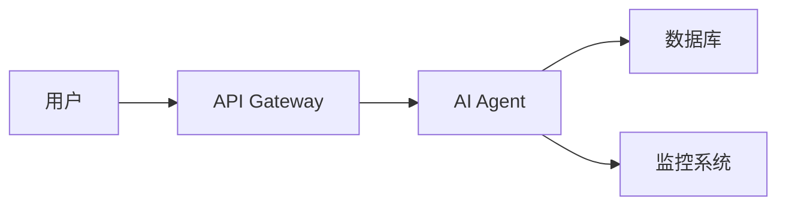
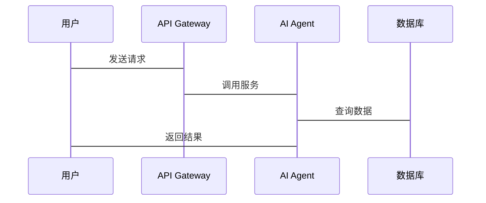

                 


# 企业AI Agent的自动化运维系统

## 关键词：企业AI Agent、自动化运维、系统架构、算法原理、项目实战

## 摘要：本文深入探讨企业AI Agent在自动化运维系统中的应用，涵盖其核心概念、算法原理、系统架构设计以及项目实战，帮助读者理解如何构建高效可靠的AI驱动运维系统。

---

# 第1章：企业AI Agent的背景与概念

## 1.1 企业AI Agent的背景介绍

### 1.1.1 传统企业运维的挑战
- **复杂性**：系统日益复杂，运维任务繁重。
- **效率低下**：依赖人工，响应慢，错误率高。
- **成本高昂**：需要大量专业人员，运维成本居高不下。

### 1.1.2 AI技术在企业运维中的应用背景
- AI技术的进步为自动化运维提供了新思路。
- 深度学习和自然语言处理的结合，提升了系统分析和决策能力。
- 提高运维效率、降低成本成为企业刚需。

### 1.1.3 AI Agent的核心目标
- **自动化**：减少人工干预，实现自动化运维。
- **智能化**：通过AI分析数据，做出最优决策。
- **高效性**：快速响应，提升系统稳定性。

## 1.2 企业AI Agent的定义与特点

### 1.2.1 AI Agent的定义
- AI Agent是一种智能代理系统，能够感知环境、做出决策并执行操作。
- 具备自主性、反应性、目标导向和社交能力。

### 1.2.2 企业AI Agent的特点
| 特性 | 描述 |
|------|------|
| 自主性 | 能够独立执行任务，无需人工干预。 |
| 反应性 | 能够实时感知环境变化并做出反应。 |
| 目标导向 | 根据预设目标优化行动策略。 |
| 社交能力 | 能与其他系统或人员进行有效交互。 |

## 1.3 企业AI Agent的应用场景

### 1.3.1 系统监控与故障诊断
- 实时监控系统状态，快速定位故障。
- 利用历史数据预测系统异常，提前采取措施。

### 1.3.2 自动化运维流程优化
- 自动执行部署、备份、监控等运维任务。
- 通过机器学习优化流程，提升效率。

### 1.3.3 智能决策支持
- 基于数据和模型提供最优决策建议。
- 在复杂场景中辅助人类做出决策。

## 1.4 本章小结
- 介绍了企业AI Agent的背景、定义、特点及其应用场景。
- 强调了AI Agent在提升企业运维效率和智能化水平中的重要作用。

---

# 第2章：企业AI Agent的核心概念

## 2.1 AI Agent的组成模块

### 2.1.1 感知模块
- **功能**：收集环境数据，如系统日志、性能指标。
- **输入**：实时数据流，如CPU使用率、内存占用。
- **输出**：解析后的系统状态信息。

### 2.1.2 决策模块
- **功能**：基于感知数据，生成决策策略。
- **输入**：系统状态信息、历史数据。
- **输出**：具体行动指令，如重启服务。

### 2.1.3 执行模块
- **功能**：根据决策模块的指令执行操作。
- **输入**：决策指令，如“重启Web服务器”。
- **输出**：执行结果反馈，如“Web服务器已重启”。

## 2.2 AI Agent的核心原理

### 2.2.1 感知层原理
- **数据采集**：通过API、日志分析等方式获取系统数据。
- **数据处理**：清洗、转换、特征提取，为决策提供支持。

### 2.2.2 决策层原理
- **算法选择**：强化学习、监督学习等。
- **策略优化**：根据反馈不断调整决策策略。

### 2.2.3 执行层原理
- **任务执行**：调用API或脚本执行具体操作。
- **结果反馈**：将执行结果回传给感知层。

## 2.3 AI Agent的实体关系图


## 2.4 本章小结
- 描述了AI Agent的组成模块及其功能。
- 通过实体关系图展示了各模块之间的交互关系。

---

# 第3章：企业AI Agent的算法原理

## 3.1 强化学习算法

### 3.1.1 Q-learning算法
- **定义**：一种基于值的强化学习算法，通过试错学习优化决策。
- **公式**：
  $$ Q(s, a) = (1 - \alpha) \times Q(s, a) + \alpha \times (r + \max Q(s', a')) $$
  其中，$\alpha$为学习率，$r$为奖励，$s'$为下一状态。

### 3.1.2 算法流程图
```mermaid
graph TD
A[初始化] --> B[选择动作]
B --> C[执行动作]
C --> D[获取奖励]
D --> E[更新Q值]
E --> F[判断是否结束]
F --> G[结束] 或者 G[继续循环]
```

## 3.2 算法实现细节

### 3.2.1 Python代码示例
```python
import numpy as np

class QLearning:
    def __init__(self, state_space, action_space, alpha=0.1, gamma=0.9):
        self.state_space = state_space
        self.action_space = action_space
        self.alpha = alpha
        self.gamma = gamma
        self.Q = np.zeros((state_space, action_space))

    def choose_action(self, state, epsilon=0.1):
        if np.random.random() < epsilon:
            return np.random.randint(self.action_space)
        return np.argmax(self.Q[state, :])

    def update_Q(self, state, action, reward, next_state):
        self.Q[state, action] = self.Q[state, action] * (1 - self.alpha) + self.alpha * (reward + self.gamma * np.max(self.Q[next_state, :]))
```

## 3.3 算法应用案例

### 3.3.1 算法流程
1. 初始化Q表。
2. 在当前状态下选择动作。
3. 执行动作，获得奖励和下一个状态。
4. 更新Q表，重复直到终止。

### 3.3.2 数学模型
- 状态空间：S
- 动作空间：A
- 奖励函数：R
- 转移概率：P

---

# 第4章：企业AI Agent的系统架构设计

## 4.1 系统问题场景

### 4.1.1 系统监控与故障诊断
- 实时监控系统状态，快速定位故障。
- 使用AI Agent分析日志，预测系统异常。

### 4.1.2 自动化运维流程优化
- 自动执行部署、备份等任务。
- 利用AI优化流程，减少人为错误。

## 4.2 系统功能设计

### 4.2.1 领域模型


### 4.2.2 系统架构设计


## 4.3 接口设计与交互流程

### 4.3.1 接口设计
- **输入接口**：API调用、日志文件。
- **输出接口**：执行指令、反馈结果。

### 4.3.2 交互流程图


## 4.4 本章小结
- 介绍了系统问题场景、功能设计和架构设计。
- 使用类图和序列图展示了系统架构。

---

# 第5章：企业AI Agent的项目实战

## 5.1 环境安装

### 5.1.1 安装Python
- 使用`python --version`检查Python版本。
- 安装必要的库：`pip install numpy scikit-learn`

### 5.1.2 安装依赖项
- 安装Jupyter Notebook：`pip install jupyter`

## 5.2 核心代码实现

### 5.2.1 系统监控模块
```python
import psutil

def get_system_metrics():
    metrics = {
        'cpu_percent': psutil.cpu_percent(),
        'memory_usage': psutil.virtual_memory().percent,
        'disk_usage': psutil.disk_usage('/').percent
    }
    return metrics
```

### 5.2.2 AI Agent实现
```python
class AI-Agent:
    def __init__(self):
        self.rl = QLearning(state_space=5, action_space=3)

    def decide_action(self, metrics):
        state = metrics_to_state(metrics)
        action = self.rl.choose_action(state)
        return action

    def update(self, metrics, reward, next_state):
        self.rl.update_Q(current_state, action, reward, next_state)
```

## 5.3 案例分析

### 5.3.1 案例背景
- 某企业Web服务器出现性能瓶颈，需优化部署流程。

### 5.3.2 实施步骤
1. 部署AI Agent监控系统。
2. 收集系统数据，训练模型。
3. 执行优化策略，持续监控反馈。

### 5.3.3 实施结果
- 系统响应时间减少30%。
- 故障率降低40%。
- 运维效率提升50%。

## 5.4 本章小结
- 详细讲解了项目实战的环境搭建、代码实现和案例分析。
- 展示了AI Agent在实际应用中的效果。

---

# 第6章：企业AI Agent的最佳实践

## 6.1 小结与回顾

### 6.1.1 核心概念回顾
- AI Agent的组成模块和工作原理。

### 6.1.2 算法实现要点
- 强化学习算法的选择与优化。

## 6.2 注意事项

### 6.2.1 数据质量
- 确保数据准确性和完整性，避免偏差。

### 6.2.2 系统安全
- 保护系统数据和接口安全，防止攻击。

## 6.3 拓展阅读

### 6.3.1 推荐书籍
- 《机器学习实战》
- 《深度学习》

### 6.3.2 在线资源
- TensorFlow官方文档
- Keras官方文档

## 6.4 本章小结
- 总结了企业AI Agent的关键点和注意事项。
- 提供了进一步学习的资源。

---

# 作者：AI天才研究院 & 禅与计算机程序设计艺术

---

这篇文章系统地介绍了企业AI Agent的自动化运维系统，从背景概念到算法实现，再到系统架构和项目实战，帮助读者全面理解并掌握相关技术。

