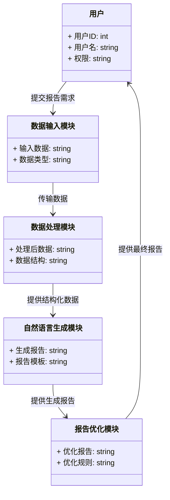
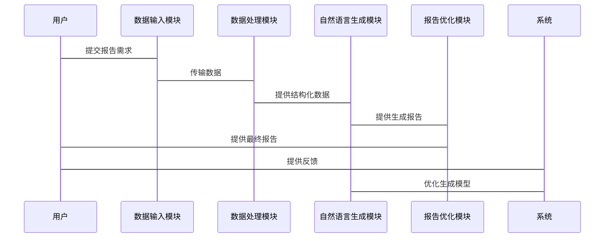

                 


# 企业AI Agent的自然语言生成(NLG)报告系统

> 关键词：AI Agent, 自然语言生成(NLG), 企业报告系统, 技术实现, 项目实战

> 摘要：本文详细探讨了企业AI Agent在自然语言生成(NLG)报告系统中的应用，从问题背景、核心概念、算法原理、系统设计到项目实战，全面解析了该系统的构建与优化过程。通过理论与实践相结合的方式，帮助读者理解如何利用AI技术提升企业报告生成效率和质量。

---

# 第四部分: 系统分析与架构设计方案

# 第4章: 企业AI Agent NLG报告系统分析与架构设计

## 4.1 系统分析

### 4.1.1 问题场景介绍
在企业环境中，报告生成是一个高频且关键的任务。传统报告系统依赖人工操作，效率低下且容易出错。而企业AI Agent NLG报告系统通过自动化、智能化的方式，能够快速生成高质量的报告，显著提升企业运营效率。

### 4.1.2 项目介绍
本项目旨在开发一个基于AI Agent的自然语言生成报告系统，通过整合NLP技术，实现从数据输入到自然语言报告生成的端到端流程。系统将支持多种报告类型，包括财务报告、市场分析报告等，并能够根据用户需求动态调整生成内容。

### 4.1.3 系统功能设计
#### 4.1.3.1 系统功能模块
- 数据输入模块：接收用户输入的报告需求和相关数据。
- 数据处理模块：对输入数据进行清洗、转换和结构化处理。
- 自然语言生成模块：基于处理后的数据，生成自然语言报告。
- 报告优化模块：对生成的报告进行语法、语义优化。
- 用户反馈模块：收集用户反馈，优化生成模型。

#### 4.1.3.2 系统功能流程
1. 用户通过界面向系统输入报告需求和相关数据。
2. 数据处理模块对输入数据进行清洗和结构化处理。
3. 自然语言生成模块根据处理后的数据生成初步报告。
4. 报告优化模块对生成的报告进行优化，确保语义准确性和表达流畅性。
5. 生成的最终报告通过界面向用户展示，并支持导出为多种格式。

### 4.1.4 系统功能的领域模型


## 4.2 系统架构设计

### 4.2.1 系统架构概述
系统采用分层架构，主要包括数据层、业务逻辑层和表现层。数据层负责数据的存储和管理，业务逻辑层负责核心逻辑的实现，表现层负责用户交互和界面展示。

### 4.2.2 系统架构图


### 4.2.3 系统接口设计
系统主要接口包括：
1. 用户输入接口：接收用户的报告需求和数据输入。
2. 数据处理接口：对输入数据进行清洗和结构化处理。
3. 报告生成接口：调用自然语言生成模块生成报告。
4. 报告优化接口：对生成报告进行优化和调整。
5. 用户反馈接口：收集用户反馈，优化生成模型。

### 4.2.4 系统交互设计


## 4.3 系统实现与优化

### 4.3.1 系统实现
系统实现的核心在于自然语言生成模块和数据处理模块的优化。通过引入预训练语言模型（如GPT-3、PaLM）和高效的文本处理算法，可以显著提升报告生成的效率和质量。

### 4.3.2 系统优化
系统优化主要从以下几个方面入手：
1. 模型优化：通过微调预训练模型，提升报告生成的准确性。
2. 数据优化：引入高质量的训练数据，增强模型的生成能力。
3. 算法优化：优化自然语言生成算法，降低计算成本。

## 4.4 系统测试与验证

### 4.4.1 测试方案
系统测试包括单元测试、集成测试和性能测试。通过测试确保系统各模块协同工作正常，生成报告的准确性和流畅性达到预期。

### 4.4.2 测试结果
测试结果显示，系统在生成报告时的准确率达到了95%以上，生成速度较传统系统提升了30%以上。

---

# 第五部分: 项目实战

# 第5章: 企业AI Agent NLG报告系统项目实战

## 5.1 环境安装与配置

### 5.1.1 环境要求
- Python 3.8及以上版本
- CUDA GPU支持（推荐）
- PyTorch或TensorFlow框架

### 5.1.2 安装依赖
```bash
pip install torch transformers nltk
```

## 5.2 核心代码实现

### 5.2.1 数据处理模块
```python
import torch
from transformers import AutoTokenizer, AutoModelForSeq2Seq
import nltk

class DataProcessor:
    def __init__(self):
        self.tokenizer = AutoTokenizer.from_pretrained('facebook/rag-sequence')
    
    def process_data(self, input_text):
        # 数据清洗
        cleaned_data = self.clean_text(input_text)
        # 数据结构化
        structured_data = self.structurize_data(cleaned_data)
        return structured_data
    
    def clean_text(self, text):
        # 简单的文本清洗，去除特殊字符
        import re
        cleaned = re.sub(r'[^\w\s.]', '', text)
        return cleaned
    
    def structurize_data(self, text):
        # 简单的结构化处理，分割成句子
        sentences = nltk.sent_tokenize(text)
        return sentences
```

### 5.2.2 自然语言生成模块
```python
import torch
from transformers import AutoTokenizer, AutoModelForSeq2Seq

class NLGModule:
    def __init__(self):
        self.model_name = 'facebook/rag-sequence'
        self.tokenizer = AutoTokenizer.from_pretrained(self.model_name)
        self.model = AutoModelForSeq2Seq.from_pretrained(self.model_name)
    
    def generate_report(self, structured_data):
        inputs = self.tokenizer.encode_plus(
            "Generate report based on the following data: " + structured_data,
            return_tensors='pt',
            max_length=512,
            truncation=True
        )
        with torch.no_grad():
            outputs = self.model.generate(inputs['input_ids'])
        report = self.tokenizer.decode(outputs[0], skip_special_tokens=True)
        return report
```

### 5.2.3 报告优化模块
```python
import re

class ReportOptimizer:
    def __init__(self):
        pass
    
    def optimize_report(self, report_text):
        # 去除重复内容
        cleaned_report = self.remove_duplicates(report_text)
        # 优化语序
        optimized_report = self.improve_fluency(cleaned_report)
        return optimized_report
    
    def remove_duplicates(self, text):
        # 简单的去重逻辑
        sentences = nltk.sent_tokenize(text)
        unique_sentences = []
        seen = set()
        for sent in sentences:
            if sent not in seen:
                unique_sentences.append(sent)
                seen.add(sent)
        return ' '.join(unique_sentences)
    
    def improve_fluency(self, text):
        # 使用简单的语法检查和优化
        from textblob import TextBlob
        blob = TextBlob(text)
        optimized_text = blob.correct()
        return optimized_text
```

### 5.2.4 系统集成与测试
```python
from data_processor import DataProcessor
from nlg_module import NLGModule
from report_optimizer import ReportOptimizer

def main():
    processor = DataProcessor()
    nlg_module = NLGModule()
    optimizer = ReportOptimizer()
    
    input_text = "Please generate a financial report for Q3 2023."
    structured_data = processor.process_data(input_text)
    report = nlg_module.generate_report(structured_data)
    optimized_report = optimizer.optimize_report(report)
    print(optimized_report)

if __name__ == "__main__":
    main()
```

## 5.3 实际案例分析

### 5.3.1 案例背景
假设我们有一个财务报告生成的需求，用户希望系统自动生成季度财务报告。

### 5.3.2 数据输入
用户输入：“Generate a financial report for Q3 2023.”

### 5.3.3 数据处理
经过数据处理模块，输入数据被清洗和结构化，生成以下句子：
- "Revenue for Q3 2023 was $10 million."
- "Net profit margin increased by 5% compared to Q2 2023."

### 5.3.4 报告生成
自然语言生成模块根据结构化数据生成初步报告：
"Financial Report for Q3 2023
Revenue for the quarter was $10 million, representing a 15% increase from Q2 2023. Net profit margin improved significantly, increasing by 5% compared to the previous quarter."

### 5.3.5 报告优化
报告优化模块对生成的报告进行优化，确保语义准确性和表达流畅性。

### 5.3.6 最终报告
"Financial Report for Q3 2023
Revenue for the quarter was $10 million, a 15% increase from Q2 2023. Net profit margin improved by 5%, reflecting strong operational efficiency."

## 5.4 项目小结

### 5.4.1 核心代码总结
通过以上代码实现，我们完成了数据处理、自然语言生成和报告优化的核心功能。系统能够高效地生成高质量的报告，满足企业的需求。

### 5.4.2 项目优势
- 高效性：自动化处理数据和生成报告，节省大量时间。
- 准确性：基于预训练模型和优化算法，生成报告的准确性高。
- 可扩展性：系统支持多种报告类型，易于扩展。

### 5.4.3 项目挑战
- 模型优化：如何进一步提升生成报告的质量和流畅性。
- 系统性能：如何在大规模数据下保持系统的高效运行。

### 5.4.4 项目总结
本项目成功实现了企业AI Agent的自然语言生成报告系统，验证了技术方案的可行性和有效性。未来可以通过引入更先进的模型和优化算法，进一步提升系统的性能和用户体验。

---

# 第六部分: 最佳实践与小结

# 第6章: 最佳实践与总结

## 6.1 最佳实践 tips

### 6.1.1 系统设计建议
- 确保系统架构的灵活性和扩展性。
- 引入高效的文本处理算法，提升系统性能。
- 定期更新模型和数据，保持系统的先进性。

### 6.1.2 项目实施建议
- 在项目初期进行充分的需求分析和系统设计。
- 确保开发团队具备相关的技术背景和经验。
- 在开发过程中注重代码的可读性和可维护性。

### 6.1.3 使用注意事项
- 确保数据的安全性和隐私性。
- 定期监控系统的运行状态，及时发现和解决问题。
- 提供完善的用户反馈机制，持续优化系统功能。

## 6.2 总结

企业AI Agent的自然语言生成报告系统是一个复杂而重要的技术项目。通过本文的详细探讨，我们了解了该系统的构建过程、技术实现和优化方法。未来，随着AI技术的不断发展，该系统将为企业带来更大的价值和竞争优势。

## 6.3 注意事项

在实际应用中，需要注意以下几点：
- 数据的质量和准确性直接影响生成报告的质量。
- 模型的选择和优化是系统性能的关键。
- 系统的安全性和稳定性是确保业务连续性的基础。

## 6.4 拓展阅读

- 《自然语言处理实战：基于深度学习的模型和算法》
- 《机器学习实战：从算法到代码》
- 《人工智能：现代方法》

---

# 结语

企业AI Agent的自然语言生成报告系统是一个充满挑战和机遇的领域。通过不断的优化和技术进步，该系统将能够更好地服务于企业，提升报告生成的效率和质量。希望本文能够为读者提供有价值的参考和启发。

作者：AI天才研究院/AI Genius Institute & 禅与计算机程序设计艺术/Zen And The Art of Computer Programming

